接下来我们一起来看看，多客户端获取及释放zk分布式锁的整个流程及背后的原理。

首先大家看看下面的图，如果现在有两个客户端一起要争抢zk上的一把分布式锁，会是个什么场景？

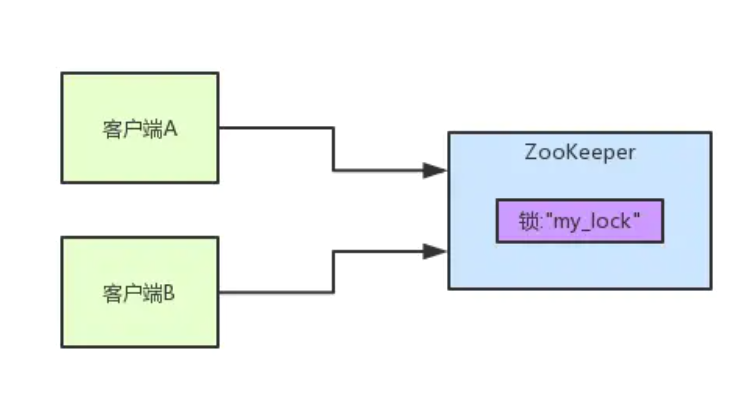

如果大家对zk还不太了解的话，建议先自行百度一下，简单了解点基本概念，比如zk有哪些节点类型等等。

参见上图。zk里有一把锁，这个锁就是zk上的一个节点。然后呢，两个客户端都要来获取这个锁，具体是怎么来获取呢？

咱们就假设客户端A抢先一步，对zk发起了加分布式锁的请求，这个加锁请求是用到了zk中的一个特殊的概念，叫做 **“临时顺序节点”**。

简单来说，就是直接在`"my_lock"`这个锁节点下，创建一个顺序节点，这个顺序节点有zk内部自行维护的一个节点序号。

## 客户端A发起一个加锁请求

比如说，第一个客户端来搞一个顺序节点，zk内部会给起个名字叫做：`xxx-000001`。然后第二个客户端来搞一个顺序节点，zk可能会起个名字叫做：`xxx-000002`。大家注意一下，最后一个数字都是依次递增的，从1开始逐次递增。zk会维护这个顺序。

所以这个时候，假如说客户端A先发起请求，就会搞出来一个顺序节点，大家看下面的图，`Curator`框架大概会弄成如下的样子：

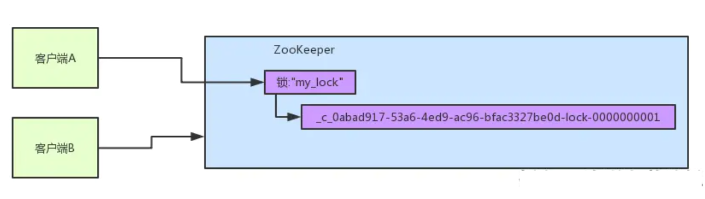

大家看，客户端A发起一个加锁请求，先会在你要加锁的`node`下搞一个临时顺序节点，这一大坨长长的名字都是`Curator`框架自己生成出来的。

然后，那个最后一个数字是**"1"**。大家注意一下，因为客户端A是第一个发起请求的，所以给他搞出来的顺序节点的序号是**"1"**。

接着客户端A创建完一个顺序节点。还没完，他会查一下`"my_lock"`这个锁节点下的所有子节点，并且这些子节点是按照序号排序的，这个时候他大概会拿到这么一个集合：

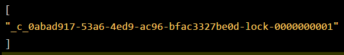

接着客户端A会走一个关键性的判断，就是说：唉！兄弟，这个集合里，我创建的那个顺序节点，是不是排在第一个啊？

如果是的话，那我就可以加锁了啊！因为明明我就是第一个来创建顺序节点的人，所以我就是第一个尝试加分布式锁的人啊！

bingo！加锁成功！大家看下面的图，再来直观的感受一下整个过程。

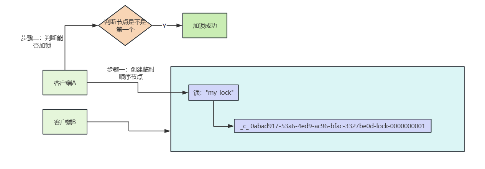

## 客户端B过来排队

接着假如说，客户端A都加完锁了，客户端B过来想要加锁了，这个时候他会干一样的事儿：先是在`"my_lock"`这个锁节点下创建一个临时顺序节点，此时名字会变成类似于

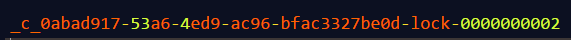

大家看看下面的图：

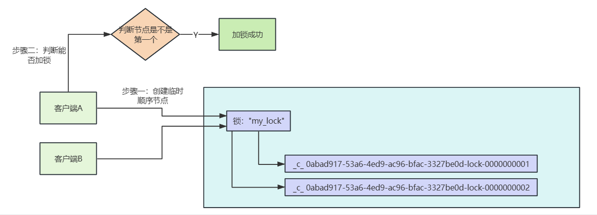

客户端B因为是第二个来创建顺序节点的，所以zk内部会维护序号为 **"2"**。

接着客户端B会走加锁判断逻辑，查询`"my_lock"`锁节点下的所有子节点，按序号顺序排列，此时他看到的类似于：

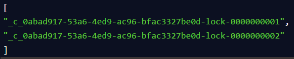

同时检查自己创建的顺序节点，是不是集合中的第一个？

明显不是啊，此时第一个是客户端A创建的那个顺序节点，序号为 **"01"** 的那个。所以加锁失败！

## 客户端B开启监听客户端A

加锁失败了以后，客户端B就会通过ZK的API对他的顺序节点的上一个顺序节点加一个监听器。zk天然就可以实现对某个节点的监听。

如果大家还不知道zk的基本用法，可以百度查阅，非常的简单。客户端B的顺序节点是：`_c_ 0abad917-53a6-4ed9-ac96-bfac-3327be0d-lock-0000000002`

他的上一个顺序节点，`_c_ 0abad917-53a6-4ed9-ac96-bfac-3327be0d-lock-0000000001` 即客户端A创建的那个顺序节点！

所以，客户端B会对：`_c_ 0abad917-53a6-4ed9-ac96-bfac-3327be0d-lock-0000000001`

这个节点加一个监听器，监听这个节点是否被删除等变化！大家看下面的图。

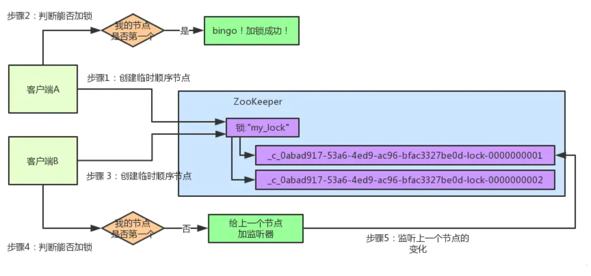

接着，客户端A加锁之后，可能处理了一些代码逻辑，然后就会释放锁。那么，释放锁是个什么过程呢？

其实很简单，就是把自己在zk里创建的那个顺序节点，也就是：`_c_ 0abad917-53a6-4ed9-ac96-bfac-3327be0d-lock-0000000001`这个节点给删除。

删除了那个节点之后，zk会负责通知监听这个节点的监听器，也就是客户端B之前加的那个监听器，说：兄弟，你监听的那个节点被删除了，有人释放了锁。

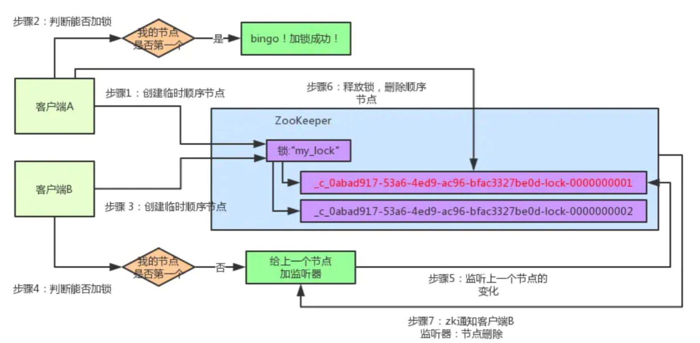

此时客户端B的监听器感知到了上一个顺序节点被删除，也就是排在他之前的某个客户端释放了锁。

## 客户端B抢锁成功

此时，就会通知客户端B重新尝试去获取锁，也就是获取`"my_lock"`节点下的子节点集合，此时为：

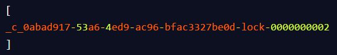

集合里此时只有客户端B创建的唯一的一个顺序节点了！

然后呢，客户端B判断自己居然是集合中的第一个顺序节点，bingo！可以加锁了！直接完成加锁，运行后续的业务代码即可，运行完了之后再次释放锁。

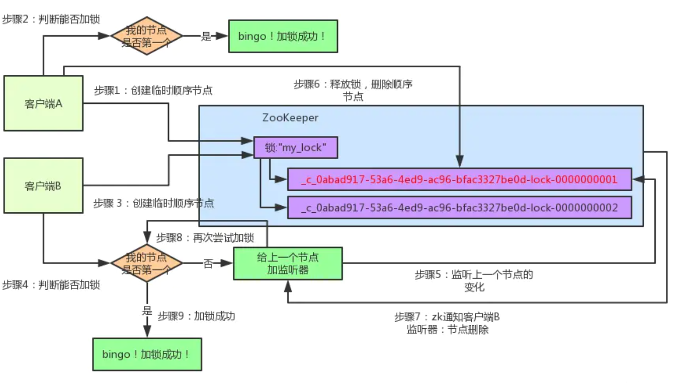
