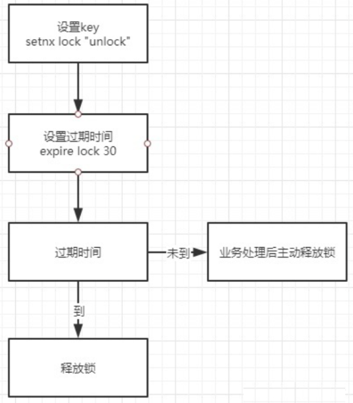

## Redis几种架构

Redis发展到现在，几种常见的部署架构有：

* **单机模式**
* **主从模式**
* **哨兵模式**
* **集群模式**

从分布式锁的角度来说， 无论是`单机模式`、`主从模式`、`哨兵模式`、`集群模式`，其原理都是类同的。 只是主从模式、哨兵模式、集群模式的更加的高可用或者更加高并发。

> 所以，接下来先基于单机模式，基于Jedis手工造轮子实现自己的分布式锁。

## 首先看两个命令

Redis分布式锁机制，主要借助`setnx`和`expire`两个命令完成。

* **setnx命令:**

    `SETNX` 是`SET If Not Exists`的简写。将 `key` 的值设为 `value`，当且仅当 `key` 不存在; 若给定的 `key` 已经存在，则 `SETNX` 不做任何动作。
    
    下面为客户端使用示例：
    
    ```shell
    127.0.0.1:6379> set lock "unlock"
    OK
    127.0.0.1:6379> setnx lock "unlock"
    (integer) 0
    127.0.0.1:6379> setnx lock "lock"
    (integer) 0
    127.0.0.1:6379>
    ```

* **expire命令:**

    `expire`命令为 `key` 设置生存时间，当 `key` 过期时(生存时间为 0 )，它会被自动删除. 其格式为：`EXPIRE key seconds`
    
    下面为客户端使用示例：
    
    ```shell
    127.0.0.1:6379> expire lock 10
    (integer) 1
    127.0.0.1:6379> ttl lock
    8
    ```

## 基于Jedis API的分布式锁的总体流程

通过Redis的`setnx`、`expire`命令可以实现简单的锁机制：

* key不存在时创建，并设置`value`和过期时间，返回值为1；成功获取到锁；
* 如key存在时直接返回0，抢锁失败；
* 持有锁的线程释放锁时，手动删除key；或者过期时间到，key自动删除，锁释放。

线程调用`setnx`方法成功返回1认为加锁成功，其他线程要等到当前线程业务操作完成释放锁后，才能再次调用`setnx`加锁成功。



### 以上简单redis分布式锁的问题

如果出现了这么一个问题：**如果`setnx`是成功的，但是`expire`设置失败，一旦出现了释放锁失败，或者没有手工释放，那么这个锁永远被占用，其他线程永远也抢不到锁。**

所以,需要保障`setnx`和`expire`两个操作的原子性，要么全部执行，要么全部不执行，二者不能分开。

解决的办法有两种：

* 使用set的命令时，同时设置过期时间，不再单独使用 `expire` 命令
* 使用lua脚本，将加锁的命令放在lua脚本中原子性的执行

### 简单加锁：使用set的命令时，同时设置过期时间

使用set的命令时，同时设置过期时间的示例如下：

```shell
127.0.0.1:6379> set unlock "234" EX 100 NX
(nil)
127.0.0.1:6379> 
127.0.0.1:6379> set test "111" EX 100 NX
OK
```

这样就完美的解决了分布式锁的原子性； set 命令的完整格式：

```shell
set key value [EX seconds] [PX milliseconds] [NX|XX]

EX seconds：设置失效时长，单位秒
PX milliseconds：设置失效时长，单位毫秒
NX：key不存在时设置value，成功返回OK，失败返回(nil)
XX：key存在时设置value，成功返回OK，失败返回(nil)
```

### 加锁的简单代码实现

使用set命令实现加锁操作，先展示加锁的简单代码实习，再带大家慢慢解释为什么这样实现。

```java
package com.crazymaker.springcloud.standard.lock;

@Slf4j
@Data
@AllArgsConstructor
public class JedisCommandLock {

    private  RedisTemplate redisTemplate;

    private static final String LOCK_SUCCESS = "OK";
    private static final String SET_IF_NOT_EXIST = "NX";
    private static final String SET_WITH_EXPIRE_TIME = "PX";

    /**
     * 尝试获取分布式锁
     * @param jedis Redis客户端
     * @param lockKey 锁
     * @param requestId 请求标识
     * @param expireTime 超期时间
     * @return 是否获取成功
     */
    public static   boolean tryGetDistributedLock(Jedis jedis, String lockKey, String requestId, int expireTime) {

        String result = jedis.set(lockKey, requestId, SET_IF_NOT_EXIST, SET_WITH_EXPIRE_TIME, expireTime);

        if (LOCK_SUCCESS.equals(result)) {
            return true;
        }
        return false;
    }
}
```

可以看到，我们加锁用到了Jedis的set Api：

```shell
jedis.set(String key, String value, String nxxx, String expx, int time)
```

这个`set()`方法一共有五个形参：

1. 第一个为`key`，我们使用key来当锁，因为key是唯一的。

2. 第二个为`value`，我们传的是`requestId`，很多童鞋可能不明白，有key作为锁不就够了吗，为什么还要用到`value`？原因就是我们在上面讲到可靠性时，分布式锁要满足第四个条件解铃还须系铃人，通过给`value`赋值为`requestId`，
我们就知道这把锁是哪个请求加的了，在解锁的时候就可以有依据。

    * `requestId`可以使用`UUID.randomUUID().toString()`方法生成。

3. 第三个为`nxxx`，这个参数我们填的是`NX`，意思是`SET IF NOT EXIST`，即当key不存在时，我们进行set操作；若key已经存在，则不做任何操作；

4. 第四个为`expx`，这个参数我们传的是`PX`，意思是我们要给这个key加一个过期的设置，具体时间由第五个参数决定。

5. 第五个为`time`，与第四个参数相呼应，代表key的过期时间。

总的来说，执行上面的`set()`方法就只会导致两种结果：

* 当前没有锁（key不存在），那么就进行加锁操作，并对锁设置个有效期，同时value表示加锁的客户端。
* 已有锁存在，不做任何操作。

心细的童鞋就会发现了，我们的加锁代码满足前面描述的四个条件中的三个。

* 首先，`set()`加入了`NX`参数，可以保证如果已有key存在，则函数不会调用成功，也就是只有一个客户端能持有锁，满足互斥性。

* 其次，由于我们对锁设置了过期时间，即使锁的持有者后续发生崩溃而没有解锁，锁也会因为到了过期时间而自动解锁（即key被删除），不会被永远占用（而发生死锁）。

* 最后，因为我们将value赋值为`requestId`，代表加锁的客户端请求标识，那么在客户端在解锁的时候就可以进行校验是否是同一个客户端。

* 由于我们只考虑Redis单机部署的场景，所以容错性我们暂不考虑。

### 基于Jedis的API实现简单解锁代码

解锁的简单代码实现:

```java
package com.crazymaker.springcloud.standard.lock;

@Slf4j
@Data
@AllArgsConstructor
public class JedisCommandLock {

    private static final Long RELEASE_SUCCESS = 1L;

    /**
     * 释放分布式锁
     * @param jedis Redis客户端
     * @param lockKey 锁
     * @param requestId 请求标识
     * @return 是否释放成功
     */
    public static boolean releaseDistributedLock(Jedis jedis, String lockKey, String requestId) {

        String script = "if redis.call('get', KEYS[1]) == ARGV[1] then return redis.call('del', KEYS[1]) else return 0 end";
        Object result = jedis.eval(script, Collections.singletonList(lockKey), Collections.singletonList(requestId));

        if (RELEASE_SUCCESS.equals(result)) {
            return true;
        }
        return false;
    }
}
```

**那么这段Lua代码的功能是什么呢？**

其实很简单，首先获取锁对应的value值，检查是否与`requestId`相等，如果相等则删除锁（解锁）。

* 第一行代码，我们写了一个简单的Lua脚本代码。

* 第二行代码，我们将Lua代码传到`jedis.eval()`方法里，并使参数`KEYS[1]`赋值为`lockKey`，`ARGV[1]`赋值为`requestId`。`eval()`方法是将Lua代码交给Redis服务端执行。

**那么为什么要使用Lua语言来实现呢？**

因为要确保上述操作是原子性的。那么为什么执行`eval()`方法可以确保原子性，源于Redis的特性.

简单来说，就是在`eval`命令执行Lua代码的时候，Lua代码将被当成一个命令去执行，并且直到`eval`命令执行完成，Redis才会执行其他命令

**错误示例1**

最常见的解锁代码就是直接使用 `jedis.del()` 方法删除锁，这种不先判断锁的拥有者而直接解锁的方式，会导致任何客户端都可以随时进行解锁，即使这把锁不是它的：

```java
public static void wrongReleaseLock1(Jedis jedis, String lockKey) {
    jedis.del(lockKey);
}
```

**错误示例2**

这种解锁代码乍一看也是没问题，甚至我之前也差点这样实现，与正确姿势差不多，唯一区别的是分成两条命令去执行，代码如下：

```java
public static void wrongReleaseLock2(Jedis jedis, String lockKey, String requestId) {
        
    // 判断加锁与解锁是不是同一个客户端
    if (requestId.equals(jedis.get(lockKey))) {
        // 若在此时，这把锁突然不是这个客户端的，则会误解锁
        jedis.del(lockKey);
    }

}
```