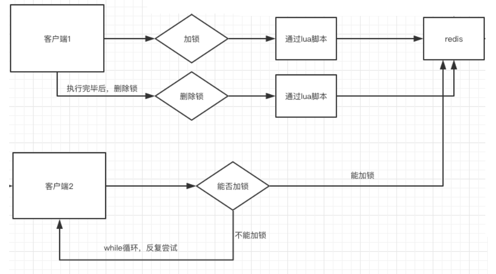
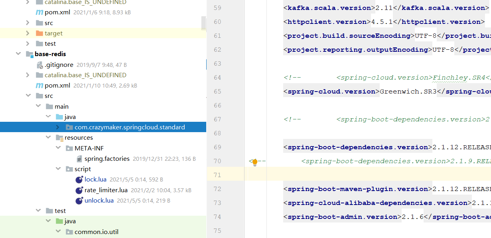

## lua脚本的好处

前面提到，在redis中执行lua脚本，有如下的好处：

**那么为什么要使用Lua语言来实现呢？**

因为要确保上述操作是原子性的。那么为什么执行`eval()`方法可以确保原子性，源于Redis的特性.

简单来说，就是在`eval`命令执行Lua代码的时候，Lua代码将被当成一个命令去执行，并且直到`eval`命令执行完成，Redis才会执行其他命

所以：

大部分的开源框架（如 `redission`）中的分布式锁组件，都是用纯lua脚本实现的。

题外话： **lua脚本是高并发、高性能的必备脚本语言**


## 基于纯Lua脚本的分布式锁的执行流程

加锁和删除锁的操作，使用纯lua进行封装，保障其执行时候的原子性。

基于纯Lua脚本实现分布式锁的执行流程，大致如下：



## 加锁的Lua脚本： lock.lua

```shell
--- -1 failed
--- 1 success
---
local key = KEYS[1]
local requestId = KEYS[2]
local ttl = tonumber(KEYS[3])
local result = redis.call('setnx', key, requestId)
if result == 1 then
    --PEXPIRE:以毫秒的形式指定过期时间
    redis.call('pexpire', key, ttl)
else
    result = -1;
    -- 如果value相同，则认为是同一个线程的请求，则认为重入锁
    local value = redis.call('get', key)
    if (value == requestId) then
        result = 1;
        redis.call('pexpire', key, ttl)
    end
end
--  如果获取锁成功，则返回 1
return result
```

## 解锁的Lua脚本： unlock.lua

```shell
--- -1 failed
--- 1 success

-- unlock key
local key = KEYS[1]
local requestId = KEYS[2]
local value = redis.call('get', key)
if value == requestId then
    redis.call('del', key);
    return 1;
end
return -1
```

## 两个文件，放在资源文件夹下备用




## 在Java中调用lua脚本，完成加锁操作

```java
package com.crazymaker.springcloud.standard.lock;
import com.crazymaker.springcloud.common.exception.BusinessException;
import com.crazymaker.springcloud.common.util.IOUtil;
import com.crazymaker.springcloud.standard.context.SpringContextUtil;
import com.crazymaker.springcloud.standard.lua.ScriptHolder;
import lombok.extern.slf4j.Slf4j;
import org.apache.commons.lang3.StringUtils;
import org.springframework.data.redis.core.RedisCallback;
import org.springframework.data.redis.core.RedisTemplate;
import org.springframework.data.redis.core.script.DefaultRedisScript;
import org.springframework.data.redis.core.script.RedisScript;
import java.util.ArrayList;
import java.util.List;

@Slf4j
public class InnerLock {

    private RedisTemplate redisTemplate;
    public static final Long LOCKED = Long.valueOf(1);
    public static final Long UNLOCKED = Long.valueOf(1);
    public static final int EXPIRE = 2000;

    String key;
    String requestId;  // lockValue 锁的value ,代表线程的uuid

    /**
     * 默认为2000ms
     */
    long expire = 2000L;
    private volatile boolean isLocked = false;
    private RedisScript lockScript;
    private RedisScript unLockScript;

    public InnerLock(String lockKey, String requestId) {
        this.key = lockKey;
        this.requestId = requestId;
        lockScript = ScriptHolder.getLockScript();
        unLockScript = ScriptHolder.getUnlockScript();
    }

    /**
     * 抢夺锁
     */
    public void lock() {
        if (null == key) {
            return;
        }
        try {
            List<String> redisKeys = new ArrayList<>();
            redisKeys.add(key);
            redisKeys.add(requestId);
            redisKeys.add(String.valueOf(expire));

            Long res = (Long) getRedisTemplate().execute(lockScript, redisKeys);
            isLocked = false;
        } catch (Exception e) {
            e.printStackTrace();
            throw BusinessException.builder().errMsg("抢锁失败").build();
        }
    }

    /**
     * 有返回值的抢夺锁
     *
     * @param millisToWait
     */
    public boolean lock(Long millisToWait) {
        if (null == key) {
            return false;
        }
        try {
            List<String> redisKeys = new ArrayList<>();
            redisKeys.add(key);
            redisKeys.add(requestId);
            redisKeys.add(String.valueOf(millisToWait));
            Long res = (Long) getRedisTemplate().execute(lockScript, redisKeys);

            return res != null && res.equals(LOCKED);
        } catch (Exception e) {
            e.printStackTrace();
            throw BusinessException.builder().errMsg("抢锁失败").build();
        }
    }

    //释放锁
    public void unlock() {
        if (key == null || requestId == null) {
            return;
        }
        try {
            List<String> redisKeys = new ArrayList<>();
            redisKeys.add(key);
            redisKeys.add(requestId);
            Long res = (Long) getRedisTemplate().execute(unLockScript, redisKeys);
//            boolean unlocked = res != null && res.equals(UNLOCKED);
        } catch (Exception e) {
            e.printStackTrace();
            throw BusinessException.builder().errMsg("释放锁失败").build();

        }
    }

    private RedisTemplate getRedisTemplate() {
        if(null==redisTemplate)
        {
            redisTemplate= (RedisTemplate) SpringContextUtil.getBean("stringRedisTemplate");
        }
        return redisTemplate;
    }
}
```

## 在Java中调用lua脚本，完成加锁操作

下一步，实现Lock接口, 完成`JedisLock`的分布式锁。

其加锁操作，通过调用 `lock.lua` 脚本完成，代码如下：

```java
package com.crazymaker.springcloud.standard.lock;

import com.crazymaker.springcloud.common.exception.BusinessException;
import com.crazymaker.springcloud.common.util.ThreadUtil;
import lombok.AllArgsConstructor;
import lombok.Data;
import lombok.extern.slf4j.Slf4j;
import org.springframework.data.redis.core.RedisTemplate;
import org.springframework.data.redis.core.script.RedisScript;
import java.util.ArrayList;
import java.util.List;
import java.util.concurrent.TimeUnit;
import java.util.concurrent.locks.Condition;
import java.util.concurrent.locks.Lock;

@Slf4j
@Data
@AllArgsConstructor
public class JedisLock implements Lock {

    private RedisTemplate redisTemplate;

    RedisScript<Long> lockScript = null;
    RedisScript<Long> unLockScript = null;

    public static final int DEFAULT_TIMEOUT = 2000;
    public static final Long LOCKED = Long.valueOf(1);
    public static final Long UNLOCKED = Long.valueOf(1);
    public static final Long WAIT_GAT = Long.valueOf(200);
    public static final int EXPIRE = 2000;
    
    String key;
    String lockValue;  // lockValue 锁的value ,代表线程的uuid

    /**
     * 默认为2000ms
     */
    long expire = 2000L;

    public JedisLock(String lockKey, String lockValue) {
        this.key = lockKey;
        this.lockValue = lockValue;
    }

    private volatile boolean isLocked = false;

    private Thread thread;

    /**
     * 获取一个分布式锁 , 超时则返回失败
     *
     * @return 获锁成功 - true | 获锁失败 - false
     */
    @Override
    public boolean tryLock(long time, TimeUnit unit) throws InterruptedException {

        //本地可重入
        if (isLocked && thread == Thread.currentThread()) {
            return true;
        }
        expire = unit != null ? unit.toMillis(time) : DEFAULT_TIMEOUT;
        long startMillis = System.currentTimeMillis();
        Long millisToWait = expire;

        boolean localLocked = false;

        int turn = 1;
        while (!localLocked) {

            localLocked = this.lockInner(expire);
            if (!localLocked) {
                millisToWait = millisToWait - (System.currentTimeMillis() - startMillis);
                startMillis = System.currentTimeMillis();
                if (millisToWait > 0L) {
                    /**
                     * 还没有超时
                     */
                    ThreadUtil.sleepMilliSeconds(WAIT_GAT);
                    log.info("睡眠一下，重新开始，turn:{},剩余时间：{}", turn++, millisToWait);
                } else {
                    log.info("抢锁超时");
                    return false;
                }
            } else {
                isLocked = true;
                localLocked = true;
            }
        }
        return isLocked;
    }
    
    /**
     * 有返回值的抢夺锁
     *
     * @param millisToWait
     */
    public boolean lockInner(Long millisToWait) {
        if (null == key) {
            return false;
        }
        try {
            List<String> redisKeys = new ArrayList<>();
            redisKeys.add(key);
            redisKeys.add(lockValue);
            redisKeys.add(String.valueOf(millisToWait));
            Long res = (Long) redisTemplate.execute(lockScript, redisKeys);

            return res != null && res.equals(LOCKED);
        } catch (Exception e) {
            e.printStackTrace();
            throw BusinessException.builder().errMsg("抢锁失败").build();
        }

    }
}
```

## 在Java中调用lua脚本，完成解锁操作

其解锁操作，通过调用 `unlock.lua` 脚本完成，代码如下：

```java
package com.crazymaker.springcloud.standard.lock;
import com.crazymaker.springcloud.common.exception.BusinessException;
import com.crazymaker.springcloud.common.util.ThreadUtil;
import lombok.AllArgsConstructor;
import lombok.Data;
import lombok.extern.slf4j.Slf4j;
import org.springframework.data.redis.core.RedisTemplate;
import org.springframework.data.redis.core.script.RedisScript;
import java.util.ArrayList;
import java.util.List;
import java.util.concurrent.TimeUnit;
import java.util.concurrent.locks.Condition;
import java.util.concurrent.locks.Lock;

@Slf4j
@Data
@AllArgsConstructor
public class JedisLock implements Lock {

    private RedisTemplate redisTemplate;
    RedisScript<Long> lockScript = null;
    RedisScript<Long> unLockScript = null;

    //释放锁
    @Override
    public void unlock() {
        if (key == null || requestId == null) {
            return;
        }
        try {
            List<String> redisKeys = new ArrayList<>();
            redisKeys.add(key);
            redisKeys.add(requestId);
            Long res = (Long) redisTemplate.execute(unLockScript, redisKeys);
        } catch (Exception e) {
            e.printStackTrace();
            throw BusinessException.builder().errMsg("释放锁失败").build();
        }
    }
}
```

## 编写RedisLockService用于管理JedisLock

```java
package com.crazymaker.springcloud.standard.lock;
import com.crazymaker.springcloud.common.util.IOUtil;
import lombok.Data;
import lombok.extern.slf4j.Slf4j;
import org.apache.commons.lang3.StringUtils;
import org.springframework.data.redis.core.RedisTemplate;
import org.springframework.data.redis.core.script.DefaultRedisScript;
import org.springframework.data.redis.core.script.RedisScript;
import java.util.ArrayList;
import java.util.List;
import java.util.concurrent.TimeUnit;
import java.util.concurrent.locks.Lock;

@Slf4j
@Data
public class RedisLockService {

    private RedisTemplate redisTemplate;

    static String lockLua = "script/lock.lua";
    static String unLockLua = "script/unlock.lua";
    static RedisScript<Long> lockScript = null;
    static RedisScript<Long> unLockScript = null;
    
    {
        String script = IOUtil.loadJarFile(RedisLockService.class.getClassLoader(),lockLua);
//        String script = FileUtil.readString(lockLua, Charset.forName("UTF-8" ));
        if(StringUtils.isEmpty(script))
        {
            log.error("lua load failed:"+lockLua);
        }
        lockScript = new DefaultRedisScript<>(script, Long.class);
//        script = FileUtil.readString(unLockLua, Charset.forName("UTF-8" ));
        script =  IOUtil.loadJarFile(RedisLockService.class.getClassLoader(),unLockLua);
        if(StringUtils.isEmpty(script))
        {
            log.error("lua load failed:"+unLockLua);
        }
        unLockScript = new DefaultRedisScript<>(script, Long.class);
    }

    public RedisLockService(RedisTemplate redisTemplate)
    {
        this.redisTemplate = redisTemplate;
    }
    
    public Lock getLock(String lockKey, String lockValue) {
        JedisLock lock=new JedisLock(lockKey,lockValue);
        lock.setRedisTemplate(redisTemplate);
        lock.setLockScript(lockScript);
        lock.setUnLockScript(unLockScript);
        return lock;
    }
}
```

## 测试用例

接下来，终于可以上测试用例了

```java
package com.crazymaker.springcloud.lock;

@Slf4j
@RunWith(SpringRunner.class)
@SpringBootTest(classes = {DemoCloudApplication.class})
// 指定启动类
public class RedisLockTest {

    @Resource
    RedisLockService redisLockService;

    private ExecutorService pool = Executors.newFixedThreadPool(10);

    @Test
    public void testLock() {
        int threads = 10;
        final int[] count = {0};
        CountDownLatch countDownLatch = new CountDownLatch(threads);
        long start = System.currentTimeMillis();
        for (int i = 0; i < threads; i++) {
            pool.submit(() ->
            {
                String lockValue = UUID.randomUUID().toString();

                try {
                    Lock lock = redisLockService.getLock("test:lock:1", lockValue);
                    boolean locked = lock.tryLock(10, TimeUnit.SECONDS);

                    if (locked) {
                        for (int j = 0; j < 1000; j++) {
                            count[0]++;
                        }

                        log.info("count = " + count[0]);
                        lock.unlock();
                    } else {
                        System.out.println("抢锁失败");
                    }
                } catch (Exception e) {
                    e.printStackTrace();
                }
                countDownLatch.countDown();
            });
        }
        try {
            countDownLatch.await();
        } catch (InterruptedException e) {
            e.printStackTrace();
        }
        System.out.println("10个线程每个累加1000为： = " + count[0]);
        //输出统计结果
        float time = System.currentTimeMillis() - start;

        System.out.println("运行的时长为(ms)：" + time);
        System.out.println("每一次执行的时长为(ms)：" + time / count[0]);
    }
}
```

执行用例，结果如下：

```shell
2021-05-04 23:02:11.900  INFO 22120 --- [pool-1-thread-7] c.c.springcloud.lock.RedisLockTest       LN:50 count = 6000
2021-05-04 23:02:11.901  INFO 22120 --- [pool-1-thread-1] c.c.springcloud.standard.lock.JedisLock  LN:81 睡眠一下，重新开始，turn:3,剩余时间：9585
2021-05-04 23:02:11.902  INFO 22120 --- [pool-1-thread-1] c.c.springcloud.lock.RedisLockTest       LN:50 count = 7000
2021-05-04 23:02:12.100  INFO 22120 --- [pool-1-thread-4] c.c.springcloud.standard.lock.JedisLock  LN:81 睡眠一下，重新开始，turn:3,剩余时间：9586
2021-05-04 23:02:12.101  INFO 22120 --- [pool-1-thread-5] c.c.springcloud.standard.lock.JedisLock  LN:81 睡眠一下，重新开始，turn:3,剩余时间：9585
2021-05-04 23:02:12.101  INFO 22120 --- [pool-1-thread-8] c.c.springcloud.standard.lock.JedisLock  LN:81 睡眠一下，重新开始，turn:3,剩余时间：9585
2021-05-04 23:02:12.101  INFO 22120 --- [pool-1-thread-4] c.c.springcloud.lock.RedisLockTest       LN:50 count = 8000
2021-05-04 23:02:12.102  INFO 22120 --- [pool-1-thread-8] c.c.springcloud.lock.RedisLockTest       LN:50 count = 9000
2021-05-04 23:02:12.304  INFO 22120 --- [pool-1-thread-5] c.c.springcloud.standard.lock.JedisLock  LN:81 睡眠一下，重新开始，turn:4,剩余时间：9383
2021-05-04 23:02:12.307  INFO 22120 --- [pool-1-thread-5] c.c.springcloud.lock.RedisLockTest       LN:50 count = 10000
10个线程每个累加1000为： = 10000
运行的时长为(ms)：827.0
每一次执行的时长为(ms)：0.0827
```

