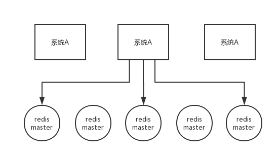
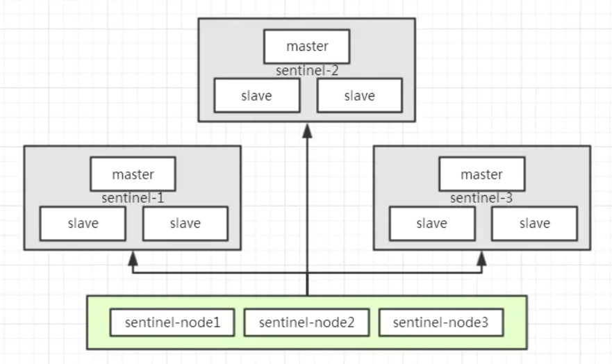

关于Redis分布式锁的高可用问题，大致如下：

在`master- slave`的集群架构中，就是如果你对某个`redis master`实例，写入了`DISLOCK`这种锁key的value，此时会异步复制给对应的`master slave`实例。

但是，这个过程中一旦发生`redis master`宕机，主备切换，`redis slave`变为了`redis master`。而此时的主从复制没有彻底完成..... 接着就会导致，客户端2来尝试加锁的时候，
在新的`redis master`上完成了加锁，而客户端1也以为自己成功加了锁。此时就会导致多个客户端对一个分布式锁完成了加锁。

> 这时系统在业务语义上一定会出现问题，导致脏数据的产生。

所以这个是是`redis master-slave`架构的主从异步复制导致的redis分布式锁的最大缺陷：

> 在`redis master`实例宕机的时候，可能导致多个客户端同时完成加锁。

## 高可用的RedLock（红锁）原理

`RedLock`算法思想：

**不能只在一个redis实例上创建锁，应该是在多个redis实例上创建锁，`n / 2 + 1`，必须在大多数redis节点上都成功创建锁，才能算这个整体的RedLock加锁成功，避免说仅仅在一个redis实例上加锁而带来的问题。**

这个场景是假设有一个 `redis cluster`，有 5 个 `redis master` 实例。然后执行如下步骤获取一把红锁：

1. 获取当前时间戳，单位是毫秒；
2. 跟上面类似，轮流尝试在每个 `master` 节点上创建锁，过期时间较短，一般就几十毫秒；
3. 尝试在大多数节点上建立一个锁，比如 5 个节点就要求是 3 个节点 n / 2 + 1；
4. 客户端计算建立好锁的时间，如果建立锁的时间小于超时时间，就算建立成功了；
5. 要是锁建立失败了，那么就依次之前建立过的锁删除；
6. 只要别人建立了一把分布式锁，你就得不断轮询去尝试获取锁。



RedLock是基于redis实现的分布式锁，它能够保证以下特性：

* 互斥性：在任何时候，只能有一个客户端能够持有锁；避免死锁：

* 当客户端拿到锁后，即使发生了网络分区或者客户端宕机，也不会发生死锁；（利用key的存活时间）

* 容错性：只要多数节点的redis实例正常运行，就能够对外提供服务，加锁或者释放锁；

以sentinel模式架构为例，如下图所示，有`sentinel-1`，`sentinel-2`，`sentinel-3`总计3个sentinel模式集群，如果要获取分布式锁，那么需要向这3个sentinel集群通过EVAL命令执行LUA脚本，
需要3/2+1=2，即至少2个sentinel集群响应成功，才算成功的以RedLock算法获取到分布式锁：



## 高可用的红锁会导致性能降低

提前说明，使用redis分布式锁，是追求高性能， 在cap理论中，追求的是**ap**而不是cp。

所以，如果追求高可用，建议使用zookeeper分布式锁。

redis分布式锁可能导致的数据不一致性，建议使用业务补偿的方式去弥补。所以，不太建议使用红锁，但是从学习的层面来说，大家还是一定要掌握的。

## 实现原理

Redisson中有一个`MultiLock`的概念，可以将多个锁合并为一个大锁，对一个大锁进行统一的申请加锁以及释放锁

而Redisson中实现RedLock就是基于 `MultiLock` 去做的，接下来就具体看看对应的实现吧

## RedLock使用案例

先看下官方的代码使用：
(https://github.com/redisson/redisson/wiki/8.-distributed-locks-and-synchronizers#84-redlock)

```java
RLock lock1 = redisson1.getLock("lock1");
RLock lock2 = redisson2.getLock("lock2");
RLock lock3 = redisson3.getLock("lock3");

RLock redLock = anyRedisson.getRedLock(lock1, lock2, lock3);

// traditional lock method
redLock.lock();

// or acquire lock and automatically unlock it after 10 seconds
redLock.lock(10, TimeUnit.SECONDS);

// or wait for lock aquisition up to 100 seconds 
// and automatically unlock it after 10 seconds
boolean res = redLock.tryLock(100, 10, TimeUnit.SECONDS);
if (res) {
   try {
     ...
   } finally {
       redLock.unlock();
   }
}
```

这里是分别对3个redis实例加锁，然后获取一个最后的加锁结果。

## RedissonRedLock实现原理

上面示例中使用`redLock.lock()`或者`tryLock()`最终都是执行`RedissonRedLock`中方法。

`RedissonRedLock` 继承自 `RedissonMultiLock`， 实现了其中的一些方法：

```java
public class RedissonRedLock extends RedissonMultiLock {
    public RedissonRedLock(RLock... locks) {
        super(locks);
    }

    /**
     * 锁可以失败的次数，锁的数量-锁成功客户端最小的数量
     */
    @Override
    protected int failedLocksLimit() {
        return locks.size() - minLocksAmount(locks);
    }
    
    /**
     * 锁的数量 / 2 + 1，例如有3个客户端加锁，那么最少需要2个客户端加锁成功
     */
    protected int minLocksAmount(final List<RLock> locks) {
        return locks.size()/2 + 1;
    }

    /** 
     * 计算多个客户端一起加锁的超时时间，每个客户端的等待时间
     * remainTime默认为4.5s
     */
    @Override
    protected long calcLockWaitTime(long remainTime) {
        return Math.max(remainTime / locks.size(), 1);
    }
    
    @Override
    public void unlock() {
        unlockInner(locks);
    }
}
```

看到`locks.size()/2 + 1` ，例如我们有3个客户端实例，那么最少2个实例加锁成功才算分布式锁加锁成功。

接着我们看下`lock()`的具体实现

## RedissonMultiLock实现原理

```java

public class RedissonMultiLock implements Lock {

    final List<RLock> locks = new ArrayList<RLock>();

    public RedissonMultiLock(RLock... locks) {
        if (locks.length == 0) {
            throw new IllegalArgumentException("Lock objects are not defined");
        }
        this.locks.addAll(Arrays.asList(locks));
    }

    public boolean tryLock(long waitTime, long leaseTime, TimeUnit unit) throws InterruptedException {
        long newLeaseTime = -1;
        if (leaseTime != -1) {
            // 如果等待时间设置了，那么将等待时间 * 2
            newLeaseTime = unit.toMillis(waitTime)*2;
        }
        
        // time为当前时间戳
        long time = System.currentTimeMillis();
        long remainTime = -1;
        if (waitTime != -1) {
            remainTime = unit.toMillis(waitTime);
        }
        // 计算锁的等待时间，RedLock中：如果remainTime=-1，那么lockWaitTime为1
        long lockWaitTime = calcLockWaitTime(remainTime);
        
        // RedLock中failedLocksLimit即为n/2 + 1
        int failedLocksLimit = failedLocksLimit();
        List<RLock> acquiredLocks = new ArrayList<RLock>(locks.size());
        // 循环每个redis客户端，去获取锁
        for (ListIterator<RLock> iterator = locks.listIterator(); iterator.hasNext();) {
            RLock lock = iterator.next();
            boolean lockAcquired;
            try {
                // 调用tryLock方法去获取锁，如果获取锁成功，则lockAcquired=true
                if (waitTime == -1 && leaseTime == -1) {
                    lockAcquired = lock.tryLock();
                } else {
                    long awaitTime = Math.min(lockWaitTime, remainTime);
                    lockAcquired = lock.tryLock(awaitTime, newLeaseTime, TimeUnit.MILLISECONDS);
                }
            } catch (Exception e) {
                lockAcquired = false;
            }
            
            // 如果获取锁成功，将锁加入到list集合中
            if (lockAcquired) {
                acquiredLocks.add(lock);
            } else {
                // 如果获取锁失败，判断失败次数是否等于失败的限制次数
                // 比如，3个redis客户端，最多只能失败1次
                // 这里locks.size = 3, 3-x=1，说明只要成功了2次就可以直接break掉循环
                if (locks.size() - acquiredLocks.size() == failedLocksLimit()) {
                    break;
                }

                // 如果最大失败次数等于0
                if (failedLocksLimit == 0) {
                    // 释放所有的锁，RedLock加锁失败
                    unlockInner(acquiredLocks);
                    if (waitTime == -1 && leaseTime == -1) {
                        return false;
                    }
                    failedLocksLimit = failedLocksLimit();
                    acquiredLocks.clear();
                    // 重置迭代器 重试再次获取锁
                    while (iterator.hasPrevious()) {
                        iterator.previous();
                    }
                } else {
                    // 失败的限制次数减一
                    // 比如3个redis实例，最大的限制次数是1，如果遍历第一个redis实例，失败了，那么failedLocksLimit会减成0
                    // 如果failedLocksLimit就会走上面的if逻辑，释放所有的锁，然后返回false
                    failedLocksLimit--;
                }
            }
            
            if (remainTime != -1) {
                remainTime -= (System.currentTimeMillis() - time);
                time = System.currentTimeMillis();
                if (remainTime <= 0) {
                    unlockInner(acquiredLocks);
                    return false;
                }
            }
        }

        if (leaseTime != -1) {
            List<RFuture<Boolean>> futures = new ArrayList<RFuture<Boolean>>(acquiredLocks.size());
            for (RLock rLock : acquiredLocks) {
                RFuture<Boolean> future = rLock.expireAsync(unit.toMillis(leaseTime), TimeUnit.MILLISECONDS);
                futures.add(future);
            }
            
            for (RFuture<Boolean> rFuture : futures) {
                rFuture.syncUninterruptibly();
            }
        }
        
        return true;
    }
}
```

核心代码都已经加了注释，实现原理其实很简单，基于RedLock思想，遍历所有的Redis客户端，然后依次加锁，最后统计成功的次数来判断是否加锁成功。