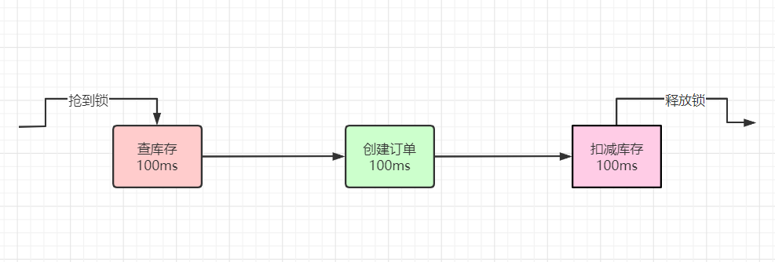
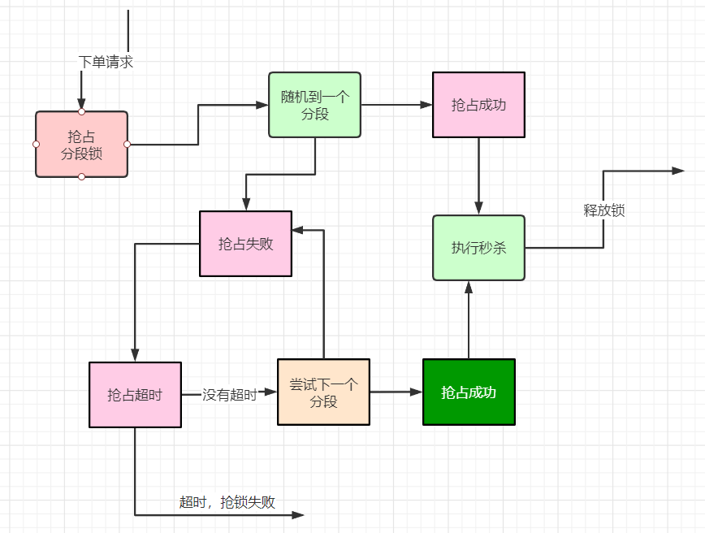

## 普通Redis分布式锁的性能瓶颈问题

分布式锁一旦加了之后，对同一个商品的下单请求，会导致所有下单操作，都必须对同一个商品key加分布式锁。

假设某个场景，一个商品1分钟6000订单，每秒的 600个下单操作， 假设加锁之后，释放锁之前，查库存 -> 创建订单 -> 扣减库存，每个IO操作100ms，大概300毫秒。

具体如下图：



可以再进行一下优化，将 创建订单 + 扣减库存 并发执行，将两个100ms 减少为一个100ms，这既是空间换时间的思想，大概200毫秒。


将 创建订单 + 扣减库存 批量执行，减少一次IO，也是大概200毫秒。

这个优化方案，有个重要的前提，就是 订单表和库存表在相同的库中，但是，这个前提条件，在数据量大+高并发的场景下，够呛。

```java
package com.crazymaker.springcloud;

import com.crazymaker.springcloud.common.util.ThreadUtil;
import org.junit.Test;

import java.util.concurrent.CompletableFuture;
import java.util.concurrent.CountDownLatch;
import java.util.concurrent.ExecutorService;

public class CoCurrentDemo {


    /**
     * 使用CompletableFuture 和  CountDownLatch  进行并发回调
     */

    @Test
    public void testMutiCallBack() {
        CountDownLatch countDownLatch = new CountDownLatch(10);
        //批量异步
        ExecutorService executor = ThreadUtil.getIoIntenseTargetThreadPool();
        long start = System.currentTimeMillis();
        for (int i = 0; i < 10; i++) {
            CompletableFuture<Long> future = CompletableFuture.supplyAsync(() -> {
                long tid = ThreadUtil.getCurThreadId();
                 try {
                    System.out.println("线程" + tid + "开始了,模拟一下远程调用");
                    Thread.sleep(100);
                } catch (InterruptedException e) {
                    e.printStackTrace();
                }
                return tid;
            }, executor);

            future.thenAccept((tid) -> {
                System.out.println("线程" + tid + "结束了");
                countDownLatch.countDown();
            });
        }
        try {
            countDownLatch.await();
            //输出统计结果
            float time = System.currentTimeMillis() - start;

            System.out.println("所有任务已经执行完毕");
            System.out.println("运行的时长为(ms)：" + time);

        } catch (InterruptedException e) {
            e.printStackTrace();
        }
    }
}
```

那么，一秒内，只能完成多少个商品的秒杀订单的下单操作呢？

**1000毫秒 / 200 =5 个订单**

如何达到每秒600个下单呢？ 还是要从基础知识里边寻找答案？

## 分段加锁的思想来源

JUC的 `LongAdder` 和 `ConcurrentHashMap` 的源码和底层原理，他们提升性能的办法是：**空间换时间， 分段加锁**

尤其是 `LongAdder` 的实现思想，可以用于Redis分布式锁作为性能提升的手段，将Redis分布式锁优化为Redis分段锁。

## 使用Redis分段锁提升秒杀的并发性能

回到前面的场景：

假设一个商品1分钟6000订单，每秒的 600个下单操作，假设加锁之后，释放锁之前，查库存 -> 创建订单 -> 扣减库存，经过优化，每个IO操作100ms，大概200毫秒，一秒钟5个订单。

如何提高性能呢？ 空间换时间

为了达到每秒600个订单，可以将锁分成 600 /5 =120 个段，反过来， 每个段1秒可以操作5次， 120个段，合起来，及时每秒操作600次。

进行抢夺锁的，如果申请到一个具体的段呢？

每一次使用随机算法，随机到一个分段， 如果不行，就轮询下一个分段，具体的流程，大致如下：



缺点： 这个是一个理论的时间预估，没有扣除 尝试下一个分段的 时间, 另外，实际上的性能， 会比理论上差，从咱们实操案例的测试结果，也可以证明这点。

## 手写一个Redis分段锁

```java
import com.crazymaker.springcloud.common.util.RandomUtil;
import com.crazymaker.springcloud.common.util.ThreadUtil;
import lombok.AllArgsConstructor;
import lombok.Data;
import lombok.extern.slf4j.Slf4j;

import java.util.concurrent.TimeUnit;
import java.util.concurrent.locks.Condition;
import java.util.concurrent.locks.Lock;

@Slf4j
@Data
@AllArgsConstructor
public class JedisMultiSegmentLock implements Lock {

    public static final int NO_SEG = -1;
    //拿到锁的线程
    private Thread thread;

    //拿到锁的状态
    private volatile boolean isLocked = false;

    //段数
    private final int segAmount;

    public static final int DEFAULT_TIMEOUT = 2000;
    public static final Long WAIT_GAT = Long.valueOf(100);

    //内部的锁
    InnerLock[] innerLocks = null;

    //被锁住的分段
    int segmentIndexLocked = NO_SEG;
    /**
     * 默认为2000ms
     */
    long expire = 2000L;
    int segmentIndex = 0;

    public JedisMultiSegmentLock(String lockKey, String requestId, int segAmount) {
        this.segAmount = segAmount;
        innerLocks = new InnerLock[segAmount];
        for (int i = 0; i < this.segAmount; i++) {
            //每一个分段，加上一个编号
            String innerLockKey = lockKey + ":" + i;
            innerLocks[i] = new InnerLock(innerLockKey, requestId);
        }
        segmentIndex = RandomUtil.randInModLower(this.segAmount);
    }
    
    /**
     * 获取一个分布式锁 , 超时则返回失败
     *
     * @return 获锁成功 - true | 获锁失败 - false
     */
    @Override
    public boolean tryLock(long time, TimeUnit unit) throws InterruptedException {

        //本地可重入
        if (isLocked && thread == Thread.currentThread()) {
            return true;
        }
        expire = unit != null ? unit.toMillis(time) : DEFAULT_TIMEOUT;
        long startMillis = System.currentTimeMillis();
        Long millisToWait = expire;

        boolean localLocked = false;

        int turn = 1;

        InnerLock innerLock = innerLocks[segmentIndex];

        while (!localLocked) {

            localLocked = innerLock.lock(expire);
            if (!localLocked) {
                millisToWait = millisToWait - (System.currentTimeMillis() - startMillis);
                startMillis = System.currentTimeMillis();
                if (millisToWait > 0L) {
                    /**
                     * 还没有超时
                     */
                    ThreadUtil.sleepMilliSeconds(WAIT_GAT);
                    log.info("睡眠一下，重新开始，turn:{},剩余时间：{}", turn++, millisToWait);

                    segmentIndex++;
                    if (segmentIndex >= this.segAmount) {
                        segmentIndex = 0;
                    }
                    innerLock = innerLocks[segmentIndex];
                } else {
                    log.info("抢锁超时");
                    return false;
                }
            } else {
                segmentIndexLocked = segmentIndex;
                isLocked = true;
                localLocked = true;
                thread = Thread.currentThread();
            }
        }
        return isLocked;
    }
    
    /**
     * 抢夺锁
     */
    @Override
    public void lock() {
        throw new IllegalStateException(
                "方法 'lock' 尚未实现!");
    }
    
    //释放锁
    @Override
    public void unlock() {
        if (segmentIndexLocked == NO_SEG) {
            return;
        }
        this.innerLocks[segmentIndexLocked].unlock();
        segmentIndexLocked = NO_SEG;
        thread = null;
        isLocked = false;
    }

    @Override
    public Condition newCondition() {
        throw new IllegalStateException(
                "方法 'newCondition' 尚未实现!");
    }

    @Override
    public void lockInterruptibly() throws InterruptedException {
        throw new IllegalStateException(
                "方法 'lockInterruptibly' 尚未实现!");
    }
    
    @Override
    public boolean tryLock() {
        throw new IllegalStateException(
                "方法 'tryLock' 尚未实现!");
    }
}
```