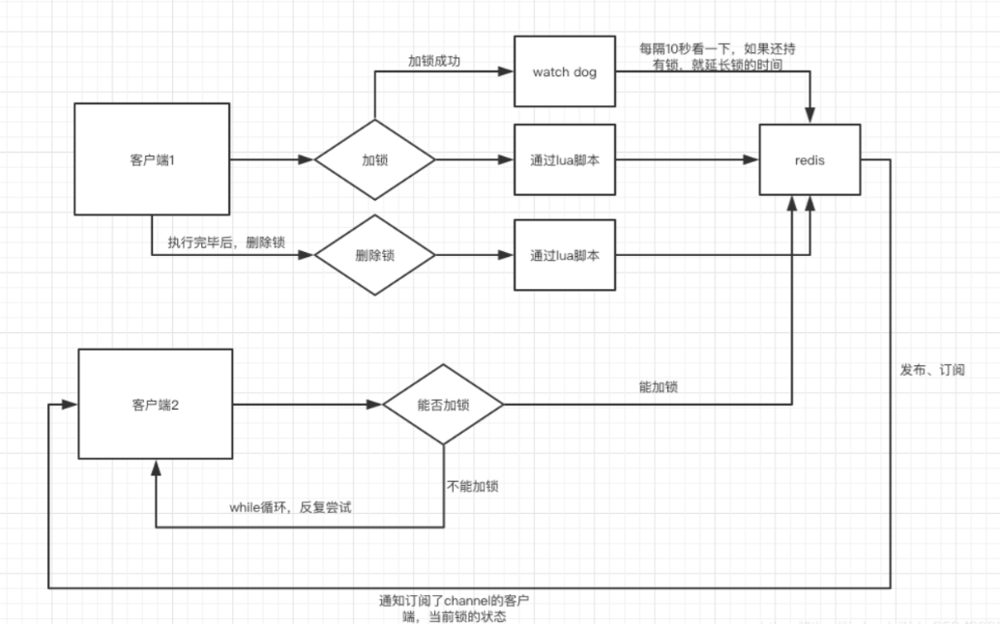

有效时间设置多长，假如我的业务操作比有效时间长，我的业务代码还没执行完，就自动给我解锁了，不就完蛋了吗。

这个问题就有点棘手了，在网上也有很多讨论：

* 第一种解决方法就是靠程序员自己去把握，预估一下业务代码需要执行的时间，然后设置有效期时间比执行时间长一些，保证不会因为自动解锁影响到客户端业务代码的执行。

    但是这并不是万全之策，比如网络抖动这种情况是无法预测的，也有可能导致业务代码执行的时间变长，所以并不安全。

* 第二种方法，使用看门狗`watchDog`机制实现锁的续期。

    第二种方法比较靠谱一点，而且无业务入侵。

在Redisson框架实现分布式锁的思路，就使用`watchDog`机制实现锁的续期。

当加锁成功后，同时开启守护线程，默认有效期是30秒，每隔10秒就会给锁续期到30秒，只要持有锁的客户端没有宕机，就能保证一直持有锁，直到业务代码执行完毕由客户端自己解锁，如果宕机了自然就在有效期失效后自动解锁。

这里，和前面解决`JVM STW`的锁过期问题有点类似，只不过，`watchDog`自动续期，也没有完全解决`JVM STW`的锁过期问题。

## redisson watchdog使用和原理

实际上，redisson加锁的基本流程图如下：



这里专注于介绍`watchdog`。

首先`watchdog`的具体思路是 **加锁时，默认加锁 30秒，每10秒钟检查一次，如果存在就重新设置 过期时间为30秒。** 然后设置默认加锁时间的参数是 `lockWatchdogTimeout`（监控锁的看门狗超时，单位：毫秒）

官方文档描述如下:

>`lockWatchdogTimeout`（监控锁的看门狗超时，单位：毫秒）
> 
>默认值：`30000`
>
>监控锁的看门狗超时时间单位为毫秒。该参数只适用于分布式锁的加锁请求中未明确使用`leaseTimeout`参数的情况。
> 如果该看门狗未使用`lockWatchdogTimeout`去重新调整一个分布式锁的`lockWatchdogTimeout`超时，那么这个锁将变为失效状态。
> 这个参数可以用来避免由Redisson客户端节点宕机或其他原因造成死锁的情况。

需要注意的是

1. `watchDog` 只有在未显示指定加锁时间时才会生效。（这点很重要）

2. `lockWatchdogTimeout`设定的时间不要太小 ，比如我之前设置的是100毫秒，由于网络直接导致加锁完后，`watchdog`去延期时，这个key在redis中已经被删除了。

## tryAcquireAsync原理

在调用`lock`方法时，会最终调用到`tryAcquireAsync`。详细解释如下：

```java
private <T> RFuture<Long> tryAcquireAsync(long waitTime, long leaseTime, TimeUnit unit, long threadId) {
//如果指定了加锁时间，会直接去加锁
    if (leaseTime != -1) {
        return tryLockInnerAsync(waitTime, leaseTime, unit, threadId, RedisCommands.EVAL_LONG);
    }
//没有指定加锁时间 会先进行加锁，并且默认时间就是 LockWatchdogTimeout的时间
//这个是异步操作 返回RFuture 类似netty中的future
    RFuture<Long> ttlRemainingFuture = tryLockInnerAsync(waitTime,
                                            commandExecutor.getConnectionManager().getCfg().getLockWatchdogTimeout(),
                                            TimeUnit.MILLISECONDS, threadId, RedisCommands.EVAL_LONG);
   //这里也是类似netty Future 的addListener，在future内容执行完成后执行
    ttlRemainingFuture.onComplete((ttlRemaining, e) -> {
        if (e != null) {
            return;
        }

        // lock acquired
        if (ttlRemaining == null) {
        //这里是定时执行 当前锁自动延期的动作
            scheduleExpirationRenewal(threadId);
        }
    });
    return ttlRemainingFuture;
}
```

`scheduleExpirationRenewal`中会调用 `renewExpiration`。

## renewExpiration执行延期动作

这里我们可以看到是 启用了一个`timeout`定时，去执行延期动作

```java
private void renewExpiration() {
    
    Timeout task = commandExecutor.getConnectionManager().newTimeout(new TimerTask() {
        @Override
        public void run(Timeout timeout) throws Exception {
            ExpirationEntry ent = EXPIRATION_RENEWAL_MAP.get(getEntryName());
            if (ent == null) {
                return;
            }
            Long threadId = ent.getFirstThreadId();
            if (threadId == null) {
                return;
            }
            
            RFuture<Boolean> future = renewExpirationAsync(threadId);
            future.onComplete((res, e) -> {
                if (e != null) {
                    log.error("Can't update lock " + getName() + " expiration", e);
                    return;
                }
                
                if (res) {
                    //如果 没有报错，就再次定时延期
                 // reschedule itself
                 
                    renewExpiration();
                }
            });
        }
        // 这里我们可以看到定时任务 是 lockWatchdogTimeout 的1/3时间去执行 renewExpirationAsync
    }, internalLockLeaseTime / 3, TimeUnit.MILLISECONDS);
    
    ee.setTimeout(task);
}
```

最终 `scheduleExpirationRenewal` 会调用到 `renewExpirationAsync`

## renewExpirationAsync

执行下面这段lua脚本。他主要判断就是这个锁是否在redis中存在，如果存在就进行 `pexpire` 延期。

```java
protected RFuture<Boolean> renewExpirationAsync(long threadId) {
    return evalWriteAsync(getName(), LongCodec.INSTANCE, RedisCommands.EVAL_BOOLEAN,
            "if (redis.call('hexists', KEYS[1], ARGV[2]) == 1) then " +
                    "redis.call('pexpire', KEYS[1], ARGV[1]); " +
                    "return 1; " +
                    "end; " +
                    "return 0;",
            Collections.singletonList(getName()),
            internalLockLeaseTime, getLockName(threadId));
}
```

## watchdog总结

1. 要使 `watchdog` 机制生效 ，`lock`时不要设置过期时间

2. `watchdog`的延时时间 可以由`lockWatchdogTimeout`指定默认延时时间，但是不要设置太小。如100

3. `watchdog`会每`lockWatchdogTimeout/3`时间，去延时。

4. `watchdog`通过类似netty的`Future`功能来实现异步延时
 
5. `watchdog`最终还是通过lua脚本来进行延时