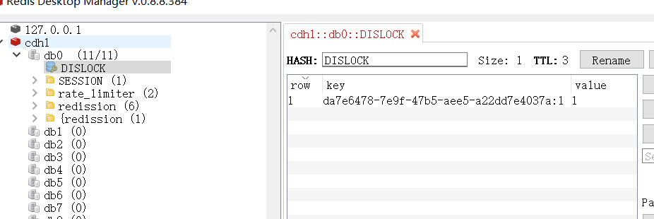
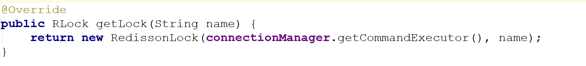
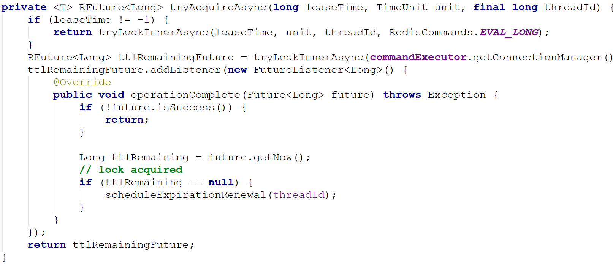
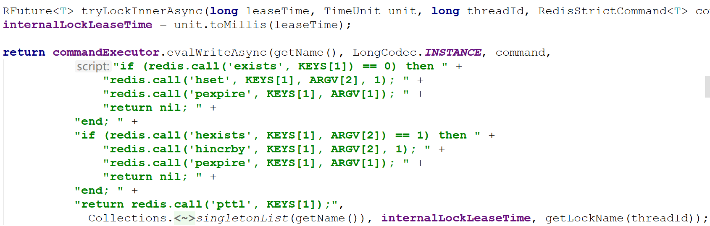
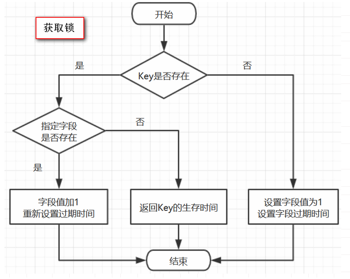
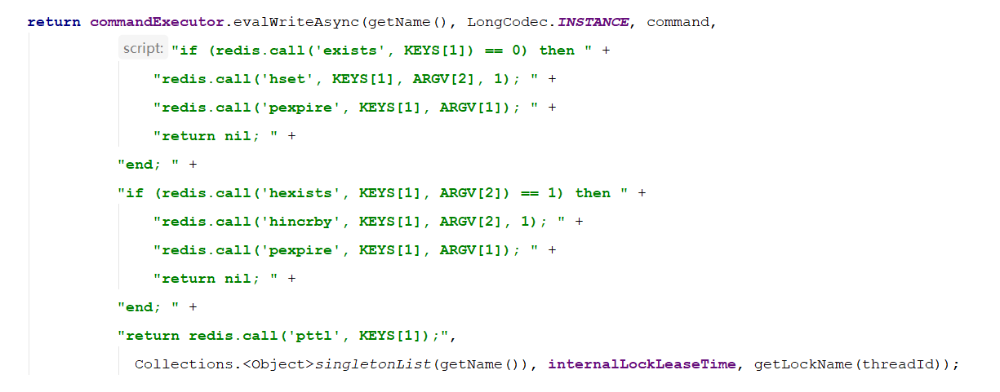
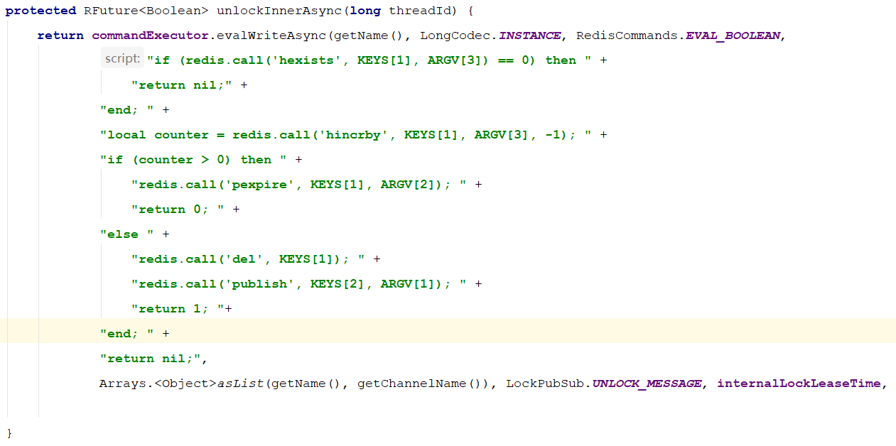
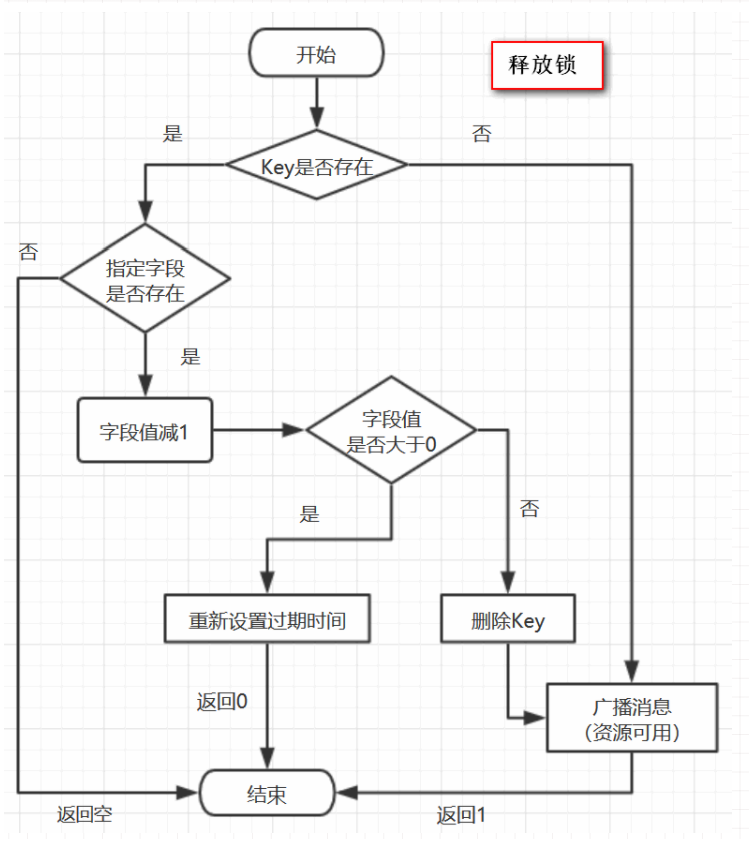
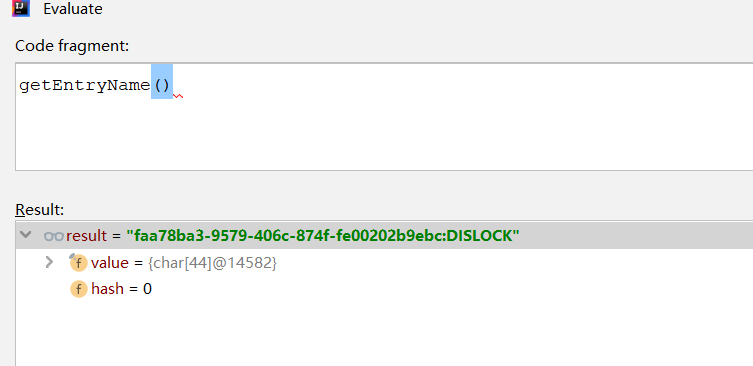
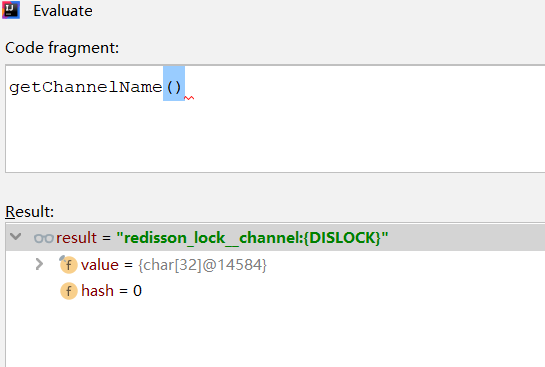

Redis发展到现在，几种常见的部署架构有：

* **单机模式**；
* **哨兵模式**；
* **集群模式**；

先介绍，基于单机模式的简单Redisson锁的使用。

## 简单Redisson锁的使用

单机模式下，简单Redisson锁的使用如下：

```java
// 构造redisson实现分布式锁必要的Config
Config config = new Config();
config.useSingleServer().setAddress("redis://172.29.1.180:5379").setPassword("a123456").setDatabase(0);
// 构造RedissonClient
RedissonClient redissonClient = Redisson.create(config);
// 设置锁定资源名称
RLock disLock = redissonClient.getLock("DISLOCK");
//尝试获取分布式锁
boolean isLock= disLock.tryLock(500, 15000, TimeUnit.MILLISECONDS);
if (isLock) {
   try {
        //TODO if get lock success, do something;
        Thread.sleep(15000);
   } catch (Exception e) {
   } finally {
    // 无论如何, 最后都要解锁
    disLock.unlock();
   }
}
```

通过代码可知，经过Redisson的封装，实现Redis分布式锁非常方便，和显式锁的使用方法是一样的。`RLock`接口继承了 `Lock` 接口。

我们再看一下Redis中的value是啥，和前文分析一样，hash结构, redis 的key就是资源名称。

hash结构的key就是`UUID+threadId`，hash结构的value就是重入值，在分布式锁时，这个值为1（Redisson还可以实现重入锁，那么这个值就取决于重入次数了）：

```shell
172.29.1.180:5379> hgetall DISLOCK
1) "01a6d806-d282-4715-9bec-f51b9aa98110:1"
2) "1"
```

使用客户端工具看到的效果如下：



## getLock()方法



可以看到，调用getLock()方法后实际返回一个`RedissonLock`对象

## tryLock方法

下面来看下`tryLock`方法，源码如下：

```java
@Override
public boolean tryLock(long waitTime, long leaseTime, TimeUnit unit) throws InterruptedException {
    long time = unit.toMillis(waitTime);
    long current = System.currentTimeMillis();
    long threadId = Thread.currentThread().getId();
    Long ttl = tryAcquire(leaseTime, unit, threadId);
    // lock acquired
    if (ttl == null) {
        return true;
    }
    
    time -= System.currentTimeMillis() - current;
    if (time <= 0) {
        acquireFailed(threadId);
        return false;
    }
    
    current = System.currentTimeMillis();
    RFuture<RedissonLockEntry> subscribeFuture = subscribe(threadId);
    if (!subscribeFuture.await(time, TimeUnit.MILLISECONDS)) {
        if (!subscribeFuture.cancel(false)) {
            subscribeFuture.onComplete((res, e) -> {
                if (e == null) {
                    unsubscribe(subscribeFuture, threadId);
                }
            });
        }
        acquireFailed(threadId);
        return false;
    }

    try {
        time -= System.currentTimeMillis() - current;
        if (time <= 0) {
            acquireFailed(threadId);
            return false;
        }
    
        while (true) {
            long currentTime = System.currentTimeMillis();
            ttl = tryAcquire(leaseTime, unit, threadId);
            // lock acquired
            if (ttl == null) {
                return true;
            }

            time -= System.currentTimeMillis() - currentTime;
            if (time <= 0) {
                acquireFailed(threadId);
                return false;
            }

            // waiting for message
            currentTime = System.currentTimeMillis();
            if (ttl >= 0 && ttl < time) {
                getEntry(threadId).getLatch().tryAcquire(ttl, TimeUnit.MILLISECONDS);
            } else {
                getEntry(threadId).getLatch().tryAcquire(time, TimeUnit.MILLISECONDS);
            }

            time -= System.currentTimeMillis() - currentTime;
            if (time <= 0) {
                acquireFailed(threadId);
                return false;
            }
        }
    } finally {
        unsubscribe(subscribeFuture, threadId);
    }
//        return get(tryLockAsync(waitTime, leaseTime, unit));
}
```

以上代码使用了异步回调模式，`RFuture` 继承了 `java.util.concurrent.Future`, `CompletionStage`两大接口，异步回调模式的基础知识

## tryAcquire()方法

在RedissonLock对象的`lock()`方法主要调用`tryAcquire()`方法


## tryLockInnerAsync



由于`leaseTime == -1`，于是走`tryLockInnerAsync()`方法，这个方法才是关键



首先，看一下`evalWriteAsync`方法的定义

```java
<T, R> RFuture<R> evalWriteAsync(String key, Codec codec, RedisCommand<T> evalCommandType, String script, List<Object> keys, Object ... params);
```

这和前面的jedis调用lua脚本类似，最后两个参数分别是keys和params。

单独将调用的那一段摘出来看，实际调用是这样的：

```java
commandExecutor.evalWriteAsync(getName(), LongCodec.INSTANCE, command,
                  "if (redis.call('exists', KEYS[1]) == 0) then " +
                      "redis.call('hset', KEYS[1], ARGV[2], 1); " +
                      "redis.call('pexpire', KEYS[1], ARGV[1]); " +
                      "return nil; " +
                  "end; " +
                  "if (redis.call('hexists', KEYS[1], ARGV[2]) == 1) then " +
                      "redis.call('hincrby', KEYS[1], ARGV[2], 1); " +
                      "redis.call('pexpire', KEYS[1], ARGV[1]); " +
                      "return nil; " +
                  "end; " +
                  "return redis.call('pttl', KEYS[1]);",
                    Collections.<Object>singletonList(getName()), internalLockLeaseTime, getLockName(threadId));
```

结合上面的参数声明，我们可以知道，这里`KEYS[1]`就是`getName()`，`ARGV[2]`是`getLockName(threadId)`

假设：

* 前面获取锁时传的name是`“DISLOCK”`，
* 假设调用的线程ID是1，
* 假设成员变量UUID类型的id是`01a6d806-d282-4715-9bec-f51b9aa98110`

那么`KEYS[1]=DISLOCK`，`ARGV[2]=01a6d806-d282-4715-9bec-f51b9aa98110:1`

因此，这段脚本的意思是

1. 判断有没有一个叫`“DISLOCK”`的key

2. 如果没有，则在其下设置一个字段为`“01a6d806-d282-4715-9bec-f51b9aa98110:1”`，值为`“1”`的键值对 ，并设置它的过期时间

3. 如果存在，则进一步判断`“01a6d806-d282-4715-9bec-f51b9aa98110:1”`是否存在，若存在，则其值加1，并重新设置过期时间

4. 返回`“DISLOCK”`的生存时间（毫秒）

## 原理：加锁机制

这里用的数据结构是hash，hash的结构是： key 字段1 值1 字段2 值2 。。。

用在锁这个场景下，key就表示锁的名称，也可以理解为临界资源，字段就表示当前获得锁的线程

所有竞争这把锁的线程都要判断在这个key下有没有自己线程的字段，如果没有则不能获得锁，如果有，则相当于重入，字段值加1（次数）



## Lua脚本的详解

为何要使用lua语言？

因为一大堆复杂的业务逻辑，可以通过封装在lua脚本中发送给redis，保证这段复杂业务逻辑执行的**原子性**



回顾一下`evalWriteAsync`方法的定义

```java
<T, R> RFuture<R> evalWriteAsync(String key, Codec codec, RedisCommand<T> evalCommandType, String script, List<Object> keys, Object ... params);
```

注意，其最后两个参数分别是keys和params。

## 关于lua脚本的参数解释

* `KEYS[1]`代表的是你加锁的那个key，比如说：

    ```java
    RLock lock = redisson.getLock("DISLOCK");
    ```
    
    这里你自己设置了加锁的那个锁key就是`“DISLOCK”`。

* `ARGV[1]`代表的就是锁key的默认生存时间

    调用的时候，传递的参数为 `internalLockLeaseTime` ，该值默认30秒。

* `ARGV[2]`代表的是加锁的客户端的ID，类似于下面这样：

    `01a6d806-d282-4715-9bec-f51b9aa98110:1`

lua脚本的第一段if判断语句，就是用`“exists DISLOCK”`命令判断一下，如果你要加锁的那个锁key不存在的话，你就进行加锁。

如何加锁呢？很简单，用下面的redis命令：

```shell
hset DISLOCK 01a6d806-d282-4715-9bec-f51b9aa98110:1 1
```

通过这个命令设置一个hash数据结构，这行命令执行后，会出现一个类似下面的数据结构：

```shell
DISLOCK:
    {
        8743c9c0-0795-4907-87fd-6c719a6b4586:1 1
    }
```

接着会执行`“pexpire DISLOCK 30000”`命令，设置`DISLOCK`这个锁key的生存时间是30秒(默认)

## 锁互斥机制

那么在这个时候，如果客户端2来尝试加锁，执行了同样的一段lua脚本，会咋样呢？

1. 第一个if判断会执行`“exists DISLOCK”`，发现`DISLOCK`这个锁key已经存在了。

2. 接着第二个if判断，判断一下，`DISLOCK`锁key的hash数据结构中，是否包含客户端2的ID，但是明显不是的，因为那里包含的是客户端1的ID。所以，客户端2会获取到`pttl DISLOCK`返回的一个数字，
这个数字代表了`DISLOCK`这个锁key的剩余生存时间。比如还剩15000毫秒的生存时间。

3. 此时客户端2会进入一个while循环，不停的尝试加锁。

## 可重入加锁机制

如果客户端1都已经持有了这把锁了，结果可重入的加锁会怎么样呢？

```java
RLock lock = redisson.getLock("DISLOCK")
lock.lock();
//业务代码
lock.lock();
//业务代码
lock.unlock();
lock.unlock();
```

分析上面那段lua脚本。

1. 第一个if判断肯定不成立，`“exists DISLOCK”`会显示锁key已经存在了。

2. 第二个if判断会成立，因为`DISLOCK`的hash数据结构中包含的那个ID，就是客户端1的那个ID，也就是`“8743c9c0-0795-4907-87fd-6c719a6b4586:1”`

3. 此时就会执行可重入加锁的逻辑，他会用：

    ```shell
    incrby DISLOCK 8743c9c0-0795-4907-87fd-6c719a6b4586:1 1
    ```

    通过这个命令，对客户端1的加锁次数，累加1。

此时`DISLOCK`数据结构变为下面这样：

```shell
DISLOCK:
    {
        8743c9c0-0795-4907-87fd-6c719a6b4586:1 2
    }
```

## 释放锁机制

如果执行`lock.unlock()`，就可以释放分布式锁，此时的业务逻辑也是非常简单的。

其实说白了，就是每次都对`DISLOCK`数据结构中的那个加锁次数减1。如果发现加锁次数是0了，说明这个客户端已经不再持有锁了，此时就会用：`“del DISLOCK”`命令，从redis里删除这个key。

然后呢，另外的客户端2就可以尝试完成加锁了。

## unlock源码

```java
@Override
public void unlock() {
    try {
        get(unlockAsync(Thread.currentThread().getId()));
    } catch (RedisException e) {
        if (e.getCause() instanceof IllegalMonitorStateException) {
            throw (IllegalMonitorStateException) e.getCause();
        } else {
            throw e;
        }
    }
    
//        Future<Void> future = unlockAsync();
//        future.awaitUninterruptibly();
//        if (future.isSuccess()) {
//            return;
//        }
//        if (future.cause() instanceof IllegalMonitorStateException) {
//            throw (IllegalMonitorStateException)future.cause();
//        }
//        throw commandExecutor.convertException(future);
}
```

再深入一下，实际调用的是`unlockInnerAsync`方法

## unlockInnerAsync方法



## 原理：Redisson解锁机制

上图没有截取完整，完整的源码如下：

```java
protected RFuture<Boolean> unlockInnerAsync(long threadId) {
    return commandExecutor.evalWriteAsync(getName(), LongCodec.INSTANCE, RedisCommands.EVAL_BOOLEAN,
            "if (redis.call('hexists', KEYS[1], ARGV[3]) == 0) then " +
                "return nil;" +
            "end; " +
            "local counter = redis.call('hincrby', KEYS[1], ARGV[3], -1); " +
            "if (counter > 0) then " +
                "redis.call('pexpire', KEYS[1], ARGV[2]); " +
                "return 0; " +
            "else " +
                "redis.call('del', KEYS[1]); " +
                "redis.call('publish', KEYS[2], ARGV[1]); " +
                "return 1; "+
            "end; " +
            "return nil;",
            Arrays.<Object>asList(getName(), getChannelName()), LockPubSub.UNLOCK_MESSAGE, internalLockLeaseTime, getLockName(threadId));
}
```

我们还是假设`name=DISLOCK`，假设线程ID是1

同理，我们可以知道

* `KEYS[1]`是`getName()`，即`KEYS[1]=DISLOCK`

* `KEYS[2]`是`getChannelName()`，即`KEYS[2]=redisson_lock__channel:{DISLOCK}`

* `ARGV[1]`是`LockPubSub.unlockMessage`，即`ARGV[1]=0`

* `ARGV[2]`是生存时间

* `ARGV[3]`是`getLockName(threadId)`，即`ARGV[3]=8743c9c0-0795-4907-87fd-6c719a6b4586:1`

因此，上面脚本的意思是：

1. 判断是否存在一个叫`“DISLOCK”`的key

2. 如果不存在，返回nil

3. 如果存在，使用`Redis Hincrby`命令用于为哈希表中的字段值加上指定增量值 -1 ，代表减去1

4. 若`counter > 0`，返回空，若字段存在，则字段值减1

5. 若减完以后，`counter > 0` 值仍大于0，则返回0

6. 减完后，若字段值小于或等于0，则用 `publish` 命令广播一条消息，广播内容是0，并返回1；

可以猜测，广播0表示资源可用，即通知那些等待获取锁的线程现在可以获得锁了



## 通过redis Channel解锁订阅

以上是正常情况下获取到锁的情况，那么当无法立即获取到锁的时候怎么办呢？

再回到前面获取锁的位置:

```java
@Override
public void lockInterruptibly(long leaseTime, TimeUnit unit) throws InterruptedException {
    long threadId = Thread.currentThread().getId();
    Long ttl = tryAcquire(leaseTime, unit, threadId);
    // lock acquired
    if (ttl == null) {
        return;
    }

    //    订阅
    RFuture<RedissonLockEntry> future = subscribe(threadId);
    commandExecutor.syncSubscription(future);

    try {
        while (true) {
            ttl = tryAcquire(leaseTime, unit, threadId);
            // lock acquired
            if (ttl == null) {
                break;
            }

            // waiting for message
            if (ttl >= 0) {
                getEntry(threadId).getLatch().tryAcquire(ttl, TimeUnit.MILLISECONDS);
            } else {
                getEntry(threadId).getLatch().acquire();
            }
        }
    } finally {
        unsubscribe(future, threadId);
    }
//        get(lockAsync(leaseTime, unit));
}

protected static final LockPubSub PUBSUB = new LockPubSub();

protected RFuture<RedissonLockEntry> subscribe(long threadId) {
    return PUBSUB.subscribe(getEntryName(), getChannelName(), commandExecutor.getConnectionManager().getSubscribeService());
}

protected void unsubscribe(RFuture<RedissonLockEntry> future, long threadId) {
    PUBSUB.unsubscribe(future.getNow(), getEntryName(), getChannelName(), commandExecutor.getConnectionManager().getSubscribeService());
}
```

这里会订阅`Channel`，当资源可用时可以及时知道，并抢占，防止无效的轮询而浪费资源

这里的`channel`为：`redisson_lock__channel`





当资源可用用的时候，循环去尝试获取锁，由于多个线程同时去竞争资源，所以这里用了信号量，对于同一个资源只允许一个线程获得锁，其它的线程阻塞。这点，有点儿类似Zookeeper分布式锁

## watch dog自动延期机制

客户端1加锁的锁key默认生存时间才30秒，如果超过了30秒，客户端1还想一直持有这把锁，怎么办呢？

简单！只要客户端1一旦加锁成功，就会启动一个`watch dog看门狗`，他是一个后台线程，会每隔10秒检查一下，如果客户端1还持有锁key，那么就会不断的延长锁key的生存时间。