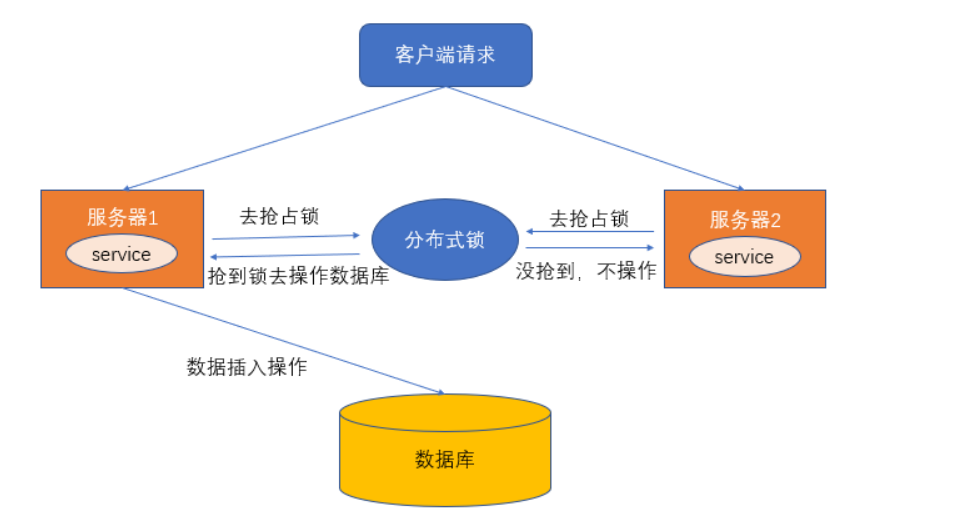

在单体的应用开发场景中，在多线程的环境下，涉及并发同步的时候，为了保证一个代码块在同一时间只能由一个线程访问，我们一般可以使用`synchronized`语法和`ReetrantLock`去保证，这实际上是本地锁的方式。

也就是说，在同一个JVM内部，大家往往采用`synchronized`或者`Lock`的方式来解决多线程间的安全问题。但在分布式集群工作的开发场景中，在JVM之间，那么就需要一种更加高级的锁机制，
来处理种跨JVM进程之间的线程安全问题.

> 解决方案是：使用分布式锁

总之，对于分布式场景，我们可以使用分布式锁，它是控制分布式系统之间**互斥访问共享资源**的一种方式。

比如说在一个分布式系统中，多台机器上部署了多个服务，当客户端一个用户发起一个数据插入请求时，如果没有分布式锁机制保证，那么那多台机器上的多个服务可能进行并发插入操作，导致数据重复插入，对于某些不允许有多余数据的业务来说，这就会造成问题。而分布式锁机制就是为了解决类似这类问题，保证多个服务之间互斥的访问共享资源，如果一个服务抢占了分布式锁，其他服务没获取到锁，就不进行后续操作。

大致意思如下图所示（不一定准确）：



## 何为分布式锁？

### 何为分布式锁？

* 当在分布式模型下，数据只有一份（或有限制），此时需要利用锁的技术控制某一时刻修改数据的进程数。
* 用一个状态值表示锁，对锁的占用和释放通过状态值来标识。

### 分布式锁的条件

* **互斥性**。在任意时刻，只有一个客户端能持有锁。
* **不会发生死锁**。即使有一个客户端在持有锁的期间崩溃而没有主动解锁，也能保证后续其他客户端能加锁。
* **具有容错性**。只要大部分的 Redis 节点正常运行，客户端就可以加锁和解锁。
* **解铃还须系铃人**。加锁和解锁必须是同一个客户端，客户端自己不能把别人加的锁给解了。

### 分布式锁的实现

分布式锁的实现由很多种，文件锁、数据库、redis等等，比较多；分布式锁常见的多种实现方式：

1. 数据库悲观锁;
2. 数据库乐观锁;
3. 基于`Redis`的分布式锁;
4. 基于`ZooKeeper`的分布式锁;

在实践中，还是redis做分布式锁性能会高一些

## 数据库悲观锁

所谓悲观锁，**悲观锁是对数据的被修改持悲观态度（认为数据在被修改的时候一定会存在并发问题），因此在整个数据处理过程中将数据锁定。**

悲观锁的实现，往往依靠数据库提供的锁机制（也只有数据库层提供的锁机制才能真正保证数据访问的排他性，否则，即使在应用层中实现了加锁机制，也无法保证外部系统不会修改数据）。

数据库的**行锁**、**表锁**、**排他锁**等都是悲观锁，这里以行锁为例，进行介绍。以我们常用的MySQL为例，我们通过使用`select...for update`语句, 执行该语句后，会在表上加持行锁，
一直到事务提交，解除行锁。

**使用场景举例:**

> 在秒杀案例中，生成订单和扣减库存的操作，可以通过商品记录的行锁，进行保护。们通过使用select...for update语句，在查询商品表库存时将该条记录加锁，待下单减库存完成后，再释放锁。

**示例的SQL如下：**

```sql
//0.开始事务
begin; 
	
//1.查询出商品信息

select stockCount from seckill_good where id=1 for update;

//2.根据商品信息生成订单

insert into seckill_order (id,good_id) values (null,1);

//3.修改商品stockCount减一

update seckill_good set stockCount=stockCount-1 where id=1;

//4.提交事务

commit;
```

以上，在对`id = 1`的记录修改前，先通过`for update`的方式进行加锁，然后再进行修改。这就是比较典型的悲观锁策略。

如果以上修改库存的代码发生并发，同一时间只有一个线程可以开启事务并获得id=1的锁，其它的事务必须等本次事务提交之后才能执行。这样我们可以保证当前的数据不会被其它事务修改。

我们使用select_for_update，另外一定要写在事务中.

注意：要使用悲观锁，我们必须关闭mysql数据库中自动提交的属性，命令set autocommit=0;即可关闭，因为MySQL默认使用autocommit模式，也就是说，当你执行一个更新操作后，MySQL会立刻将结果进行提交。

悲观锁的实现，往往依靠数据库提供的锁机制。在数据库中，悲观锁的流程如下：

在对记录进行修改前，先尝试为该记录加上排他锁（exclusive locking）。
如果加锁失败，说明该记录正在被修改，那么当前查询可能要等待或者抛出异常。具体响应方式由开发者根据实际需要决定。
如果成功加锁，那么就可以对记录做修改，事务完成后就会解锁了。
其间如果有其他事务对该记录做加锁的操作，都要等待当前事务解锁或直接抛出异常。