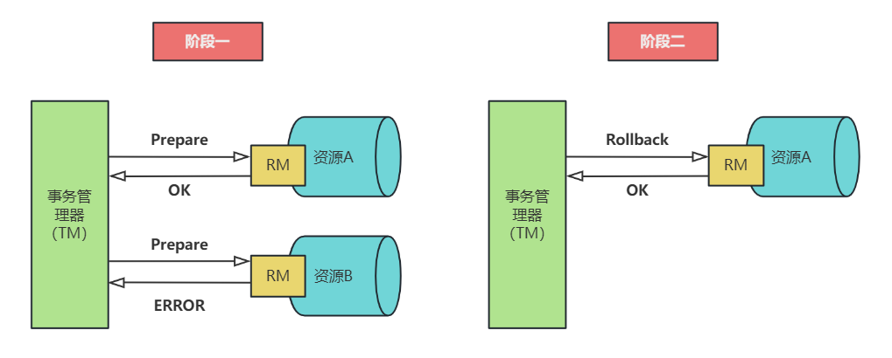

## 一、2PC协议概述

两阶段提交协议（`two phase commit protocol，2PC`）可以保证数据的强一致性，许多分布式关系型数据管理系统采用此协议来完成分布式事务。它是协调所有分布式原子事务参与者，
并决定提交或取消（回滚）的分布式算法。同时也是解决一致性问题的一致性算法。该算法能够解决很多的临时性系统故障（包括进程、网络节点、通信等故障），被广泛地使用。但是，
它并不能够通过配置来解决所有的故障，在某些情况下它还需要人为的参与才能解决问题。**参与者为了能够从故障中恢复，它们都使用日志来记录协议的状态，虽然使用日志降低了性能但是节点能够从故障中恢复。**

### 两个角色

在两阶段提交协议中，分布式系统一般包含两类机器（或节点）：

* 协调者 `coordinator`，通常一个系统中只有一个；
* 事务参与者 `participants`，`cohorts` 或 `workers`，一般包含多个；

### 最终结果

当 `2PC` 的最后一步完成之后，协调器执行协议，参与者根据本地事务能够成功完成回复同意提交事务或者回滚事务。

## 二、执行过程

两阶段提交协议由两个阶段组成。在正常的执行下，这两个阶段的执行过程如下所述：

* **（1）阶段1：请求阶段（prepare 阶段，或称表决阶段）**

在请求阶段，协调者将通知事务参与者准备提交或取消事务，然后进入表决过程。在表决过程中，参与者将告知协调者自己的决策：同意（事务参与者本地作业执行成功）或取消（本地作业执行故障）。

* **（2）阶段2：提交阶段（commit 阶段）**

在该阶段，协调者将基于第一个阶段的投票结果进行决策：提交或取消。当且仅当所有的参与者同意提交事务协调者才通知所有的参与者提交事务，否则协调者将通知所有的参与者取消事务。参与者在接收到协调者发来的消息后将执行响应的操作。

>如果在 prepare 阶段的反馈结果为 yes，而 commit 的过程中出现宕机等异常，则在节点服务重启后，可根据 XA recover 再次进行 commit 补偿，以保证数据的一致性。
> 
>**注意**： 两阶段提交协议与两阶段锁协议不同，两阶段锁协议为一致性控制协议。

### 图解执行过程

先执行请求提交，然后协调者根据参与者反馈的结果决定是提交还是回滚。下面这个图展示的是反馈结果是提交的过程。

失败情况：

