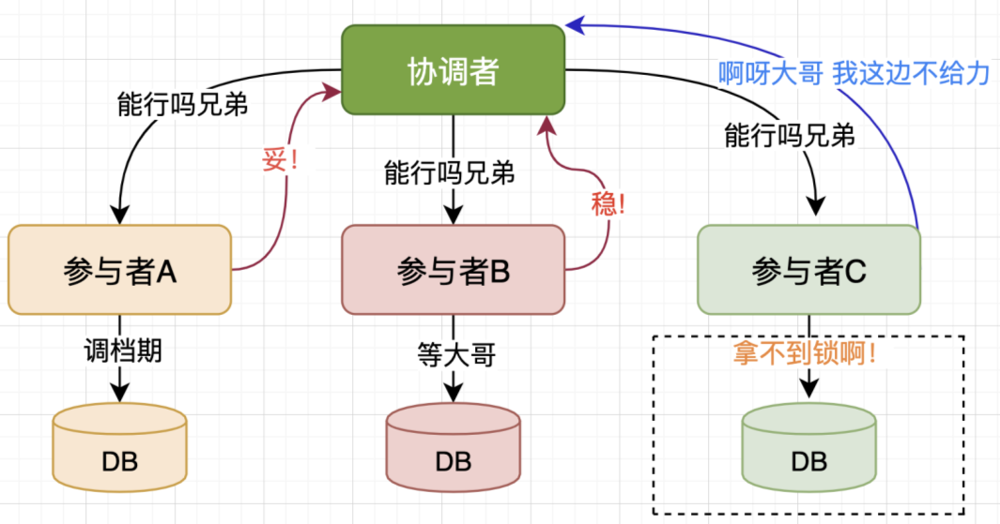
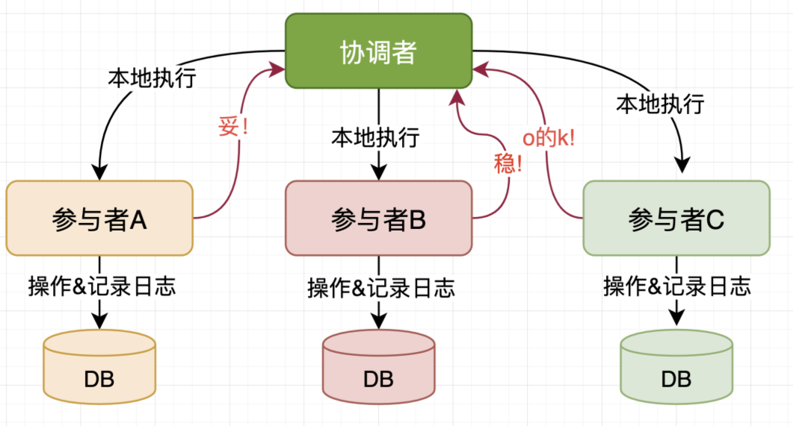
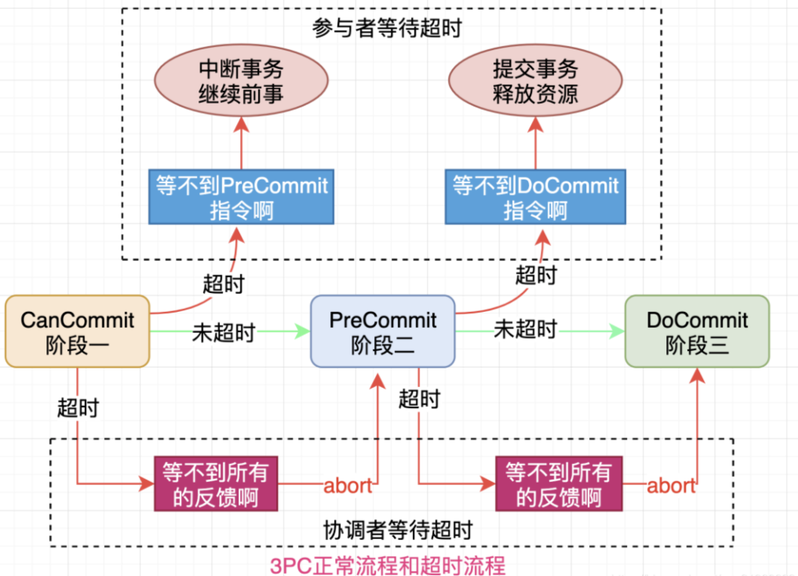
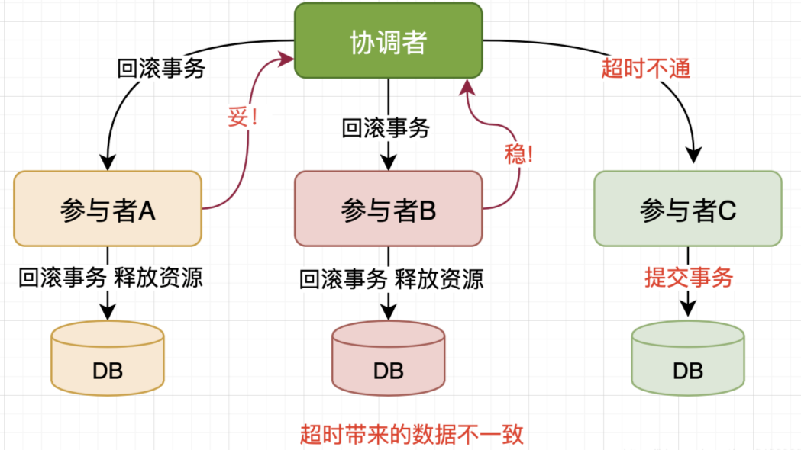

## 一、3PC的出现

之前文章中提到了 `2PC` 协议存在的`协调者单点`、`参与者阻塞超时`、`网络分区`、`容错性`等问题，这些在某些程度上是做优化和调整的，并不是致命问题。

我们对 `2PC` 协议的异常情况做了拆解，但是那是个`m*n`的组合问题，我们尽量去分析主要矛盾，于是发现在协调者和唯一接收指令的参与者都出现不可恢复宕机时，即使后面选举了新的协调者，仍然可能出现数据的不一致性。

`3PC` 的出现可能是多种因素促成的。但是基本上可以确定 `3PC` 将对 `2PC` 存在的问题进行修正和优化，但是这样并不意味着 `3PC` 不会引入新的问题。

本文将从 `3PC` 的协议过程来阐述这两大块内容:

## 二、三阶段提交的定义

三阶段提交（`Three-phase commit`），也叫三阶段提交协议（`Three-phase commit protocol`），是二阶段提交（`2PC`）的改进版本。

所谓的三个阶段分别是：询问，然后再锁资源，最后真正提交。

* 第一阶段：`CanCommit`
* 第二阶段：`PreCommit`
* 第三阶段：`DoCommit`

与两阶段提交不同的是，三阶段提交有两个改动点。

* 引入超时机制 - 同时在协调者和参与者中都引入超时机制。
* 在第一阶段和第二阶段中插入一个准备阶段，保证了在最后提交阶段之前各参与节点的状态是一致的。

## 三、CanCommit阶段

在`2PC`准备阶段中，协调者向参与者发送指令后，参与者如果具备执行条件，则获取锁并执行动作，只不过未真正提交，可以认为参与者就差临门一脚了，还得等协调者信号。

如果是 `commit` 信号那还好，如果是 `rollback` 信号，那么对于一些本地执行了动作的参与者来说白白浪费了，所以从这个角度来说，`2PC` 有点激进了，但是这么做也是有原因的，在复杂的网络环境中多一轮交互意味着性能的损耗。

`3PC`来说更加合理，先由协调者向参与者发送询问信号，兄弟们有档期吗？？然后开始收集反馈，相比来说更加轻量。

这个阶段参与者并不真实获取锁占用资源，只是对自身执行事务状态的检查，查看是否具备执行事务的条件，进而回复询问。

根据参与者对询问的反馈，在 `CanCommit` 阶段可能出现的两情况：

### 1、所有参与者均Ready的场景

### 2、存在参与者不OK的场景

## 四、PreCommit阶段

第二个阶段的具体动作取决于第一个阶段的结果，因此可以分为两种情况：

### 1、CanCommit阶段一致通过

在第一阶段所有参与者都 `Ready`，那么协调者就会向参与者发送本地执行的相关指令，这部分和 `2PC` 的第一阶段非常相似，参与者收到指令后进行本地事务执行，并记录日志，并且对处理结果反馈到协调者，来做决策。过程中参与者可能成功或者失败，出现了两种情况：

* **PreCommit执行成功**

* **PreCommit执行并非全部成功**

### 2、CanCommit阶段存在分歧

在第一阶段如果存在参与者不 `Ready` 的情况，那么协调者就会发送信号给所有参与者，告知本次事务取消了，该干啥干啥吧，对参与者来说损失并不大，因为本质上参与者并没有做什么事情。

## 五、DoCommit阶段

这是 `3PC` 的第三个阶段和`2PC`的第二个阶段类似，同样的 `DoCommit` 执行具体动作取决于第二阶段 `PreCommit` 的结果，因此仍然分为两种情况：

### 1、PreCommit阶段一致通过

在 `PreCommit` 之后参与者全部完成本地事务执行但是没有提交，并且都给协调者 `ACK` 回复，这时协调者认为万事俱备只欠东风了，在 `DoCommit` 阶段协调者向参与者发送提交指令，参与者收到之后开始执行本地提交，并反馈结果，最终完成这次事务，Cool!

### 2、PreCommit阶段存在分歧

协调者在第二个阶段 `PreCommit` 收到参与者的反馈后，发现存在部分参与者无法执行事务的情况，这时就决定告诉其他参与者本地回滚，释放资源，取消本次事务。

## 六、3PC中的超时策略

我们前面提到 `3PC` 要解决 `2PC` 的参与者阻塞超时问题，在`2PC`中参与者比较痴情，协调者不给信号会长时间阻塞，不释放资源，这样别人也没法处理其他事情，确实不太好，看来 `2PC` 还是太依赖协调者了。

`3PC` 认为网络超时是普遍发生的情况，如果参与者在一种大概率确定的状态下执行一些动作也是被允许的，将在外军令有所不受。

`3PC` 的超时处理可能发生在 `PreCommit` 和 `DoCommit` 阶段，来看个图：

### 1、参与者等待 PreCommit 超时

协调者和参与者之间可能存在较大的网络延时，或者协调者出现故障，或者出现网络分区等情况，参与者并不会傻等，在超过设定时间之后，参与者就继续做之前的事情了，因为好像被大哥鸽了，只能该干啥干啥，这也是正确的决策。

### 2、参与者等待 DoCommit 超时

在 `CanCommit` 和 `PreCommit` 之后，参与者认为大家都对齐了都是棒棒的，如果参与者在设定时间内并没有收到协调者的 `DoCommit` 指令，那么就本地执行提交完成这次事务，因为参与者揣测大哥的意思大概率也是让我们提交，干等着也不是办法，回滚可能和大家不一样，抉择之下参与者选择提交事务。

### 3、协调者等待反馈超时

`3PC`协调者的等待超时处理和`2PC`基本上是一样的，无论在哪个阶段超时都认为不具备条件，进行 `abort` 或者 `rollback` 操作，这个非常好理解。

**可以看到3PC协议中参与者不再过度依赖协调者的指令信号，而是有了自己的相对独立性，可以根据当前所处的状态来进行自我决策。避免了2PC中的阻塞等待带来的资源浪费情况，确实是个不错的优化，但是我们并不能完全保证这种优化就都是完全正确的呀！换句话说3PC解决了2PC的bug，但是不代表3PC没有引入新的bug。**

## 七、3PC协议的一些分析

前面我们说到`3PC`协议的一个重要作用就是要对`2PC`协议的改进和优化，从上面的过程分析可知确实做了一些优化，但是仍然不可避免出现了新的问题。

### 1、3PC的数据不一致问题

`2PC`协议在某些场景下数据不一致问题，那么`3PC`有没有这种问题呢？

**答案是有，根源是新加的参与者超时机制**。比如`参与者A`因为自身网络问题，在设定时间内未收到协调者的信号，这时`参与者A`基于之前的状态执行了`Commit`操作，提交了事务，这种情况确实会发生，根据真实的协调者信号是`commit`还是`rollback`会出现不同的结果。

如果协调者发送的是`Commit`指令，就和`参与者A`独自决策结果一致，没啥问题。如果协调者在`DoCommit`阶段发送的是`rollback`指令，那么超时的`参与者A`由于执行了本地事务提交，从而和其他收到指令执行`rollback`的参与者的数据不一致。

### 2、决策状态的对齐

**我们知道2PC协议的决策结果初始阶段只有决策者知道**，只有在它发送了决策解决才有参与者知道，这样就存在决策结果丢失的情况。

假如协调者挂掉，新协调者可以咨询所有的参与者来确定决策状态，根据所有参与者的情况来确定，但是万一真理掌握在少数人手中呢？

**极端情况**

假如有`10`个参与者，`9`个都是正常的，`1`个状态未知(先叫做`A`吧)，`10`个参与者都向协调者发送了反馈，如果`A`反馈的是`Not Ready`信号，其他`9`个都是`Ready`信号。

协调者汇总结果决策出不具备执行条件，开始向所有参与者发送`rollback`，恰好第一个收到信号的是`A`机器，协调者挂了，`A`收到信号后也挂了。

新的协调者询问了其余`9`个都是`OK`，新的协调者就认为具备条件了从而发送`Commit`信号，这样就出现了不一致。

**脑洞大开**

这个过程和清宫剧中皇帝立储很像嘛，皇帝把结果挂在朝堂的牌匾之上，假定诏书消失了且皇帝挂了，那么结果就不得而知了，智囊团在没有私心的前提下就需要考察所有的侯选人的情况来确定，这样就可能出现不一致。

**决策透明化**

在`3PC`中仍然存在只有1台机器收到指令然后挂掉的情况，但是如果出现在前置阶段，对整个结果是没有影响的，因为会被取消并且参与者并没有本地执行。

现在看`3PC`的思想是把做重大动作时的决策结果透明化统一化，产生的影响也就非常小了，因此`PreCommit`阶段的状态是明确的。

我们需要把决策结果透明化，让所有参与者都知道决策结果，`3PC`的`PreCommit`阶段对齐了结果，只要有1台还活着，整个事务的状态就是确定的，毕竟所有参与者全挂的情况概率非常低。

## 八、小结

`3PC`协议是对`2PC`协议的优化和改进，通过将`2PC`的准备阶段一分为二：`CanCommit`和`PreCommit`，整个过程中下一阶段的流转要取决于上一个阶段的结果，流转简图：

经过`CanCommit`和`PreCommit`阶段后，参与者之间对齐并保留了决策结果，避免`2PC`协议极端情况决策结果的错误缺失，是个比较好的做法。

`2PC`协议只有协调者有超时机制，`3PC`协议对参与者也引入了超时机制，在不同的阶段进行不同的超时处理，但是由于网络波动和网络分区存在让参与者的超时处理带来新的不确定性，甚至可能出现数据不一致。

`3PC`协议增加一轮询问阶段所以整个交互过程比`2PC`更长了，性能相比`2PC`是会有一些下降的，但是`3PC`协议对于网络分区等情况也并没有处理地很好。

总体来说，`3PC`相比`2PC`做了很多改进有一定的效果，但是仍然存在数据不一致问题，还需继续努力。