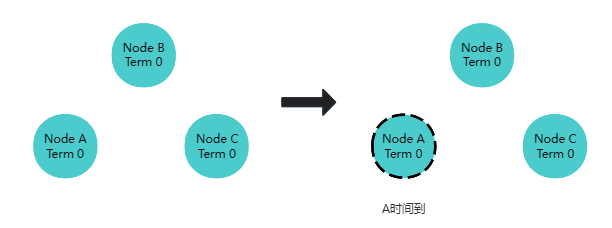
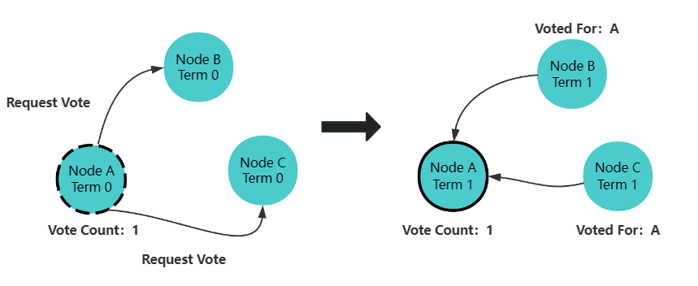

## Raft协议是什么

`Raft`协议是一种分布式一致性算法（共识算法），共识就是多个节点对某一个事件达成一致的算法，即使出现部分节点故障，网络延时等情况，也不影响各节点，进而提高系统的整体可用性。`Raft`是使用较为广泛的分布式协议，我们熟悉的`etcd`注册中心就采用了这个算法；

`Raft`算法将分布式一致性分解为多个子问题，包括`Leader选举（Leader election）`、`日志复制（Log replication）`、`安全性（Safety）`、`日志压缩（Log compaction）`等。

`Raft`将系统中的角色分为:

* **领导者**（`Leader`）: 接受客户端请求，并向`Follower`同步请求日志，当日志同步到大多数节点上后高速`Follower`提交日志。
* **跟从者**（`Follower`）: 接受并持久化`Leader`同步的日志，在`Leader`告知日志可以提交后，提交日志。当`Leader`出现故障时，主动推荐自己为候选人。
* **候选者**（`Candidate`）: `Leader`选举过程中的临时角色。向其他节点发送请求投票信息，如果获得大多数选票，则晋升为`Leader`。

`Raft`要求系统在任意时刻最多只有一个`Leader`，正常工作期间只有`Leader`和`Follower`，`Raft`算法将时间划分为任意不同长度的任期(`Term`),每一任期的开始都是一次选举，一个或多个候选人会试图称为`Leader`，在成功选举`Leader`后，`Leader`会在整个任期内管理整个集群，
如果`Leader`选举失败，该任期就会因为没有`Leader`而结束，开始下一任期，并立刻开始下一次选举。

## Leader选举过程

### 单个candidate

`Raft`协议种存在两个超时设置用来控制选举过程，第一个超时设置是`选举超时（election timeout）`，选举超时用来设置一个节点从`Follower`变成一个`candidate`所需要等待的时间，这个等待时间控制在`150ms`到`300ms`之间，这个等待时间是随机的，
随机是为了尽量避免产生多个`candidate`，给选主过程制造麻烦。`candidate`产生如下图所示:

当3个节点都设置`election timeout`时，节点`a`跑得比其他其他节点快些成为第一个`candidate`，并开始发起第一轮选举。节点首先给自己先投一票，然后向其他节点发送`Request Vote`消息。

如果其他节点收到消息后发现并没有进行过此次投票，则他就会为`candidate`进行一次投票并重置`election timeout`，一旦`candidate`获得了大多数选票（大多数保证每一轮选举只有一个`candidate`会获胜），则他就会变成`leader`，如下图所示：

节点a成为`leader`后，会间隔指定时间发送`Append Entries`消息给他的`Follower`，间隔时间是由心跳超时控制的（`heartbeat timeout`，即第二种超时类型），`follower`收到消息后会重置等待时间，这样就能阻止`Follower`成为`candidate`。心跳检测过程如下:

这个过程会一直持续下去直到一个`Follower`停止接收`heatbeats`，并且成为`candidate`为止。

以上就是一个常规选主过程。

### 多个candidate

上文我们提到在`Follower`转变成`candidate`过程中会随机分配一个`election timeout`给每个节点，这样做可以尽量避免产生多个`candidate`，但并不能`100%`保证不出现2个`candidate`的情况。当出现了2个节点成为`candidate`，此时需要如何确保选主顺畅呢？

假设节点`a`、`b`、`c`同时成为`candidate`，并且各自发起了新一轮的选举，选举过程如下:

