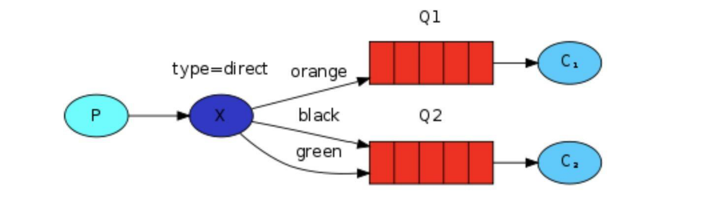
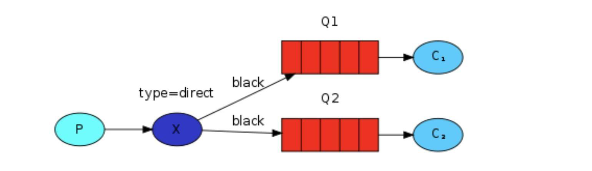
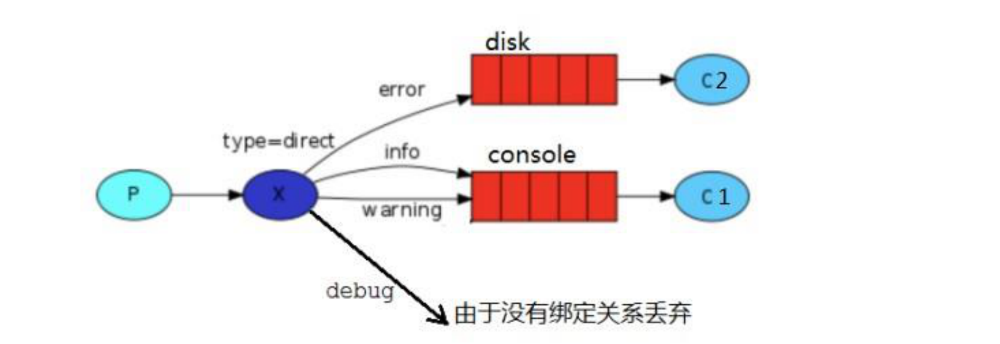
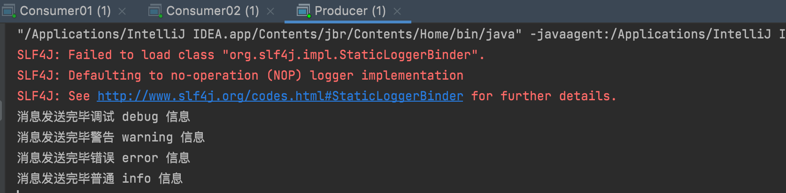
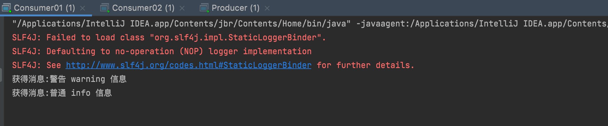
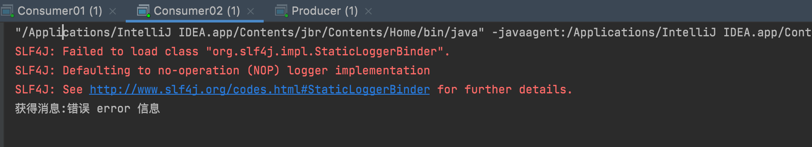

:::tip
上述 `Fanout` 这种交换类型并不能给我们带来很大的灵活性，它只能进行无意识的广播，在这里我们将使用 `direct` 类型来替换，`direct` 类型的工作方式是：消息只去到它绑定的 `routingKey` 队列中去。



举个简单的例子，在上面这张图中，我们可以看到交换机X为`direct`模式，绑定了两个队列，队列Q1绑定键为 `orange`，队列Q2绑定键有两个：一个绑定键为 `black`，另一个绑定键为 `green`。

在这种绑定情况下，生产者发布消息到 `exchange` 上，绑定键为 `orange` 的消息会被发布到队列Q1。绑定键为 `black`、`green` 和的消息会被发布到队列 Q2，其他消息类型的消息将被丢弃。

**`Fanout` 模式本质就是 `Direct` 模式的一种特殊情况**，如下图所示：如果 `direct` 类型的交换机绑定的多个队列的 `routing-key` 都相同，也就类似 `fanout` 模式，就跟广播差不多。


:::

接下来我们通过一个实战来演示一下 `Direct` 模式的效果，示意图如下所示：



## 生产者Producer

```java
package mode2_WorkQueues.exchange.direct;

import com.rabbitmq.client.BuiltinExchangeType;
import com.rabbitmq.client.Channel;

import java.util.HashMap;
import java.util.Map;

// 生产者
public class Producer {
    private static final String EXCHANGE_NAME = "direct_logs";

    public static void main(String[] args) throws Exception {
        // 创建channel
        Channel channel = utils.RabbitMqUtils.getChannel();
        // 声明交换机
        channel.exchangeDeclare(EXCHANGE_NAME, BuiltinExchangeType.DIRECT);
        // 发送消息
        Map<String, String> messageMap = new HashMap<>();
        messageMap.put("info", "普通 info 信息");
        messageMap.put("warning", "警告 warning 信息");
        messageMap.put("error", "错误 error 信息");
        messageMap.put("debug", "调试 debug 信息");
        for (Map.Entry<String, String> mes : messageMap.entrySet()) {
            String routingKey = mes.getKey();
            String message = mes.getValue();
            channel.basicPublish(EXCHANGE_NAME, routingKey, null, message.getBytes());
            System.out.println("消息发送完毕" + message);
        }
    }
}
```

## 消费者Consumer01

```java
package mode2_WorkQueues.exchange.direct;

import com.rabbitmq.client.BuiltinExchangeType;
import com.rabbitmq.client.CancelCallback;
import com.rabbitmq.client.Channel;
import com.rabbitmq.client.DeliverCallback;

// 消费者1
public class Consumer01 {
    private static final String QUEUE_NAME = "console";
    private static final String EXCHANGE_NAME = "direct_logs";

    public static void main(String[] args) throws Exception {
        // 创建channel
        Channel channel = utils.RabbitMqUtils.getChannel();
        // 声明交换机
        channel.exchangeDeclare(EXCHANGE_NAME, BuiltinExchangeType.DIRECT);
        // 声明临时队列
        channel.queueDeclare(QUEUE_NAME, false, false, false, null);
        // 绑定队列与交换机
        channel.queueBind(QUEUE_NAME, EXCHANGE_NAME, "info");
        channel.queueBind(QUEUE_NAME, EXCHANGE_NAME, "warning");
        // 消费消息
        DeliverCallback deliverCallback = (consumerTag, message) -> {
            System.out.println("获得消息:" + new String(message.getBody()));
        };
        CancelCallback cancelCallback = (consumerTag) -> {
            System.out.println("消息消费被中断");
        };
        channel.basicConsume(QUEUE_NAME, true, deliverCallback, cancelCallback);
    }
}
```

## 消费者Consumer02

```java
package mode2_WorkQueues.exchange.direct;

import com.rabbitmq.client.BuiltinExchangeType;
import com.rabbitmq.client.CancelCallback;
import com.rabbitmq.client.Channel;
import com.rabbitmq.client.DeliverCallback;

// 消费者2
public class Consumer02 {
    private static final String QUEUE_NAME = "disk";
    private static final String EXCHANGE_NAME = "direct_logs";

    public static void main(String[] args) throws Exception {
        // 创建channel
        Channel channel = utils.RabbitMqUtils.getChannel();
        // 声明交换机
        channel.exchangeDeclare(EXCHANGE_NAME, BuiltinExchangeType.DIRECT);
        // 声明临时队列
        channel.queueDeclare(QUEUE_NAME, false, false, false, null);
        // 绑定队列与交换机
        channel.queueBind(QUEUE_NAME, EXCHANGE_NAME, "error");
        // 消费消息
        DeliverCallback deliverCallback = (consumerTag, message) -> {
            System.out.println("获得消息:" + new String(message.getBody()));
        };
        CancelCallback cancelCallback = (consumerTag) -> {
            System.out.println("消息消费被中断");
        };
        channel.basicConsume(QUEUE_NAME, true, deliverCallback, cancelCallback);
    }
}
```

## 测试

然后分别启动`consumer01`、`consumer02`、`producer`进行测试：



可以看到消费者根据指定的key收到了指定的消息：




