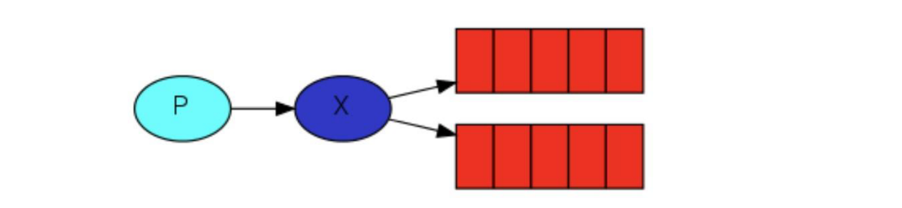
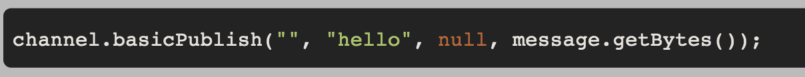
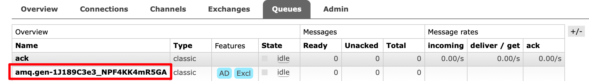

:::tip
前面的两节中，我们通过演示了 `Hello World`、`Work Queues` 两种 `RabbitMQ` 的工作模式。接下来我们来看看剩下的三种模式：`Publish/Subscribe`、`Routing`、`Topics`，
这三种模式可以统一归为 **`Exchange` 模式**，它们只是创建时交换机的类型不一样，分别是 `fanout`、`direct`、`topic`。

这节我们就来深入了解一下交换机 `Exchange` 以及它的几种工作模式。
:::

## 1、Exchanges简介

`RabbitMQ` 消息传递模型的核心思想是：**生产者生产的消息从不会直接发送到队列**。实际上，通常生产者甚至都不知道这些消息传递传递到了哪些队列中。

相反，**生产者只能将消息发送到交换机(`exchange`)**，交换机工作的内容非常简单，一方面它接收来自生产者的消息，另一方面将它们推入队列。交换机必须确切知道如何处理收到的消息。
是应该把这些消息放到特定队列还是说把他们到许多队列中还是说应该丢弃它们。这就的由交换机的类型来决定。



`Exchanges` 的类型总共有四种：**直接(`direct`)**、**主题(`topic`)**、**标题(`headers`)**、**扇出(`fanout`)**

**📦 无名exchange**

在本文的前面部分我们对 `exchange` 一无所知，但仍然能够将消息发送到队列。这是因为我们使用的是默认交换机，我们通过空字符串(“”)进行标识。



**📄 临时队列**

上文所有例子中我们都使用的是具有特定名称的队列，队列的名称我们来说至关重要，用于指定消费者去消费哪个队列的消息。每当我们连接到 `RabbitMQ` 时都需要一个全新的空队列，
但很多时候我们可能不想指定队列名字，只想实验测试一下，此时我们可以创建一个具有随机名称的队列，一旦我们断开了消费者的连接，该队列将被自动删除。这就是临时队列。

```java
// 创建一个临时队列
String queueName = channel.queueDeclare().getQueue();
```

创建出来之后长成这样：



**🐼 绑定**

我们提到，生产者发消息都是发给交换机，由交换机对消息进行路由到队列，那么交换机这么知道将消息发给哪个队列呢？这就是 `routing-key` 要做的事，它是 `exchange` 和 `queue` 之间的桥梁，
告诉我们 `exchange` 和那个队列进行了绑定关系。比如说下面这张图告诉我们的就是 X 与 Q1 和 Q2 进行了绑定。


