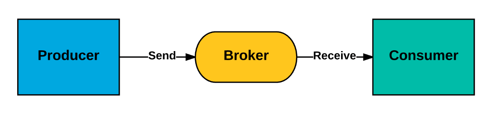
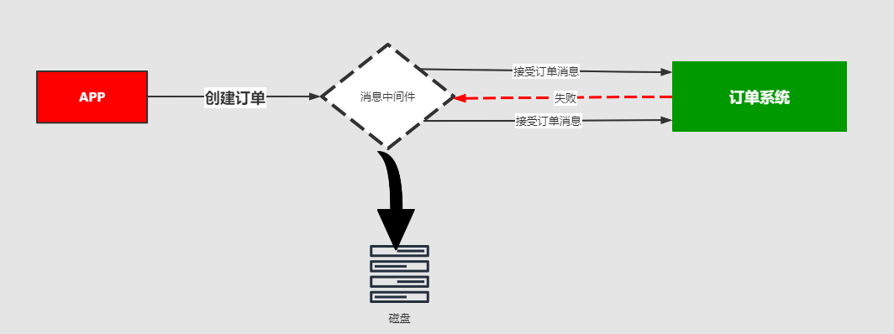

MQ消息队列有如下几个角色：

* **Producer**：消息生产者。负责产生和发送消息到 `Broker`
* **Broker**：消息处理中心。负责消息存储、确认、重试等，一般其中会包含多个 `queue`
* **Consumer**：消息消费者。负责从 `Broker` 中获取消息，并进行相应处理

生产者产生消息后，MQ进行存储，消费者如何获得消息呢？

一般的获取方式无外乎外推（`push`）或者（`pull`）两种方式，典型的git就有推拉机制，我们发送的http请求就是一种典型的拉取数据库数据返回的过程。而消息队列MQ是一种推送过程，
而这些推机制会适用到很多的业务场景，也有很多对应的推机制策略

## 场景分析一

比如我在APP上下了一个订单，我们的系统和服务很多，我们如何得知这个消息被那个系统或者那些服务或者系统进行消费，此时就需要一个消费策略，或称为消费的方法论。

## 场景分析二

在发送消息的过程中可能会出现异常，或者网络的抖动，故障等等因为造成消息的无法消费，比如用户在下订单，消费MQ接受，订单系统出现故障，导致用户支付失败，
那么这个时候就需要消息中间件就必须支持消息重试机制策略。也就是支持：出现问题和故障的情况下，消息不丢失还可以进行重发

## 📄消息分发策略的机制和对比

| 	    | ActiveMQ | 	RabbitMQ | 	Kafka	 | RocketMQ |
|------|:--------:|:---------:|:-------:|:--------:|
| 发布订阅 |   	支持	   |    支持     |   	支持   |   	支持    |
| 轮询分发 |  	  支持	  |    支持	    |   支持    |    	/    |
| 公平分发 | 	    /	  |    支持	    |   支持    |    	/    |
| 重发	  |    支持    |    	支持    |   	/	   |    支持    |
| 消息拉取 |   	/	    |    支持	    |   支持    |   	支持    |