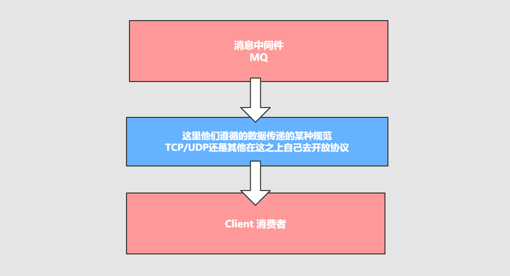

## 什么是协议

**协议**：是在`TCP/IP`协议基础之上构建的种约定成的规范和机制，目的是让客户端进行沟通和通讯。并且这种协议下规范必须具有`持久性`，`高可用`，`高可靠`的性能。

为什么不直接采用TCP/IP协议去传递消息？因为TCP/IP协议太过于简单，并不能承载消息的内容和载体，因此在此之上增加一些内容，给消息的传递分发高可用提供基础。



我们知道消息中间件负责数据的`传递`，`存储`，和`分发消费`三个部分，数据的存储和分发的过程中肯定要遵循某种约定成俗的规范，是采用底层的TCP/IP，UDP协议还是在这基础上自己构建等，
而这些约定成俗的规范就称之为：**协议**。

:::tip
所谓协议是指：

1. 计算机底层操作系统和应用程序通讯时共同遵守的组约定，只有遵循共同的约定和规范，系统和底层操作系统之间才能相互交流。
2. 和一般的网络应用程序的不同，它主要负责数据的接受和传递，所以性能比较的高。
3. 协议对数据格式和计算机之间交换数据都必须严格遵守规范。
:::

## 网络协议的三要素

* **语法**：语法是用户数据与控制信息的结构与格式，以及数据出现的顺序。
* **语义**：语义是解控制信息每个部分的意义。它规定了需要发出何种控制信息以及完成的动作与做出什么样的响应。
* **时序**：时序是对事件发生顺序的详细说明。

```shell
# 类比http请求协议
1. 语法：htp规定了请求报文和响应报文的格式
2. 语义：客户端主动发起请求称之为请求。（这是一种定义，同时你发起的是post/get请求）
3. 时序：一个请求对应个响应。（定先有请求在有响应，这个是时序）
```

而消息中间件采用的并不是http协议，而常见的消息中间件协议有：`OpenWire`、`AMQP`、`MQTT`、`Kafka`、`OpenMessage`协议

:::tip 面试题
为什么消息中间件不直接使用http协议呢？

因为http请求报文头和响应报文头是比较复杂的，包含了`cookie`、`数据的加密解密`、`状态码`、`晌应码`等附加的功能，但是对于个消息而言，我们并不需要这么复杂，也没有这个必要性，
它其实就是负责数据传递，存储，分发就够，要追求的是高性能。尽量简洁，快速。

大部分情况下http大部分都是短链接，在实际的交互过程中，一个请求到响应很有可能会中断，中断以后就不会就行持久化，就会造成请求的丢失。这样就不利于消息中间件的业务场景，
因为消息中间件可能是一个长期的获取消息的过程，出现问题和故障要对数据或消息就行持久化等，目的是为了保证消息和数据的高可靠和稳健的运行。
:::

## 常用消息中间件协议

### 1. AMQP协议（Advanced Message Queuing Protocol—高级消息队列协议）

它由摩根大通集团联合其他公司共同设计。是一个提供统一消息服务的应用层标准高级消息队列协议，是应用层协议的一个开放标准，为面向消息的中间件设计。基于此协议的客户端与消息中间件可传递消息，
并不受客户端/中间件不同产品，不同的开发语言等条件的限制。

**特性**：分布式事务支、消息的持久化支持、高性能和高可靠的消息处理优势

AMQP典型的实现者是`RabbitMQ`、`ACTIVEMQ`等，其中`RabbitMQ`由`Erlang`开发


### 2. MQTT协议（Message Queueing Telemetry Transport—消息队列遥测传输协议）

它是一种基于发布/订阅（`publish/subscribe`）模式的"轻量级"通讯协议，该协议构建于TCP/IP协议上，由IBM在1999年发布。

**特点**：轻量、结构简单、传输快、不支持事务、没有持久化设计

**应用场景**：适用于计算能力有限、低带宽、网络不稳定的场景

**支持者**：`RabbitMQ`、`ACTIVEMQ`（默认情况下关闭，需要打开）


### 3. OpenMessage协议

是近几年由阿里、雅虎和滴滴出行、 `Stremalio`等公司共同参与创立的分布式消息中间件、流处理等领域的应用开发标准。

**特点**：结构简单、解析速度快、支持事务和持久化设计

### 4. Kafka协议

基于TCP/IP的二进制协议。消息内部是通过长度来分割，由些基本数据类型组成。

**特点**：结构简单、解析速度快、无事务支持、有持久化设计