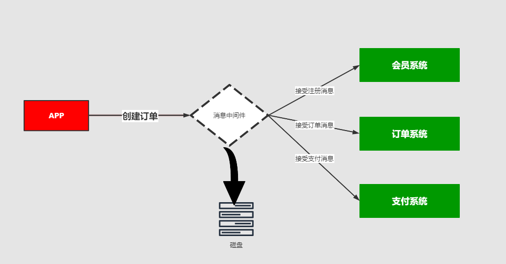

持久化简单来说就是将数据存入磁盘，而不是存在内存中随服务器重启断开而消失，使数据能够永久保存。

常见的持久化方式和对比：

| 	    | ActiveMQ | 	RabbitMQ	 | Kafka	 | RocketMQ |
|------|----------|------------|--------|----------|
| 文件存储 | 	支持      | 	支持	       | 支持     | 	支持      |
| 数据库	 | 支持	      | /	         | /	     | /        |