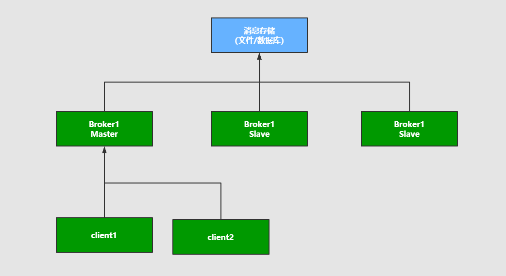
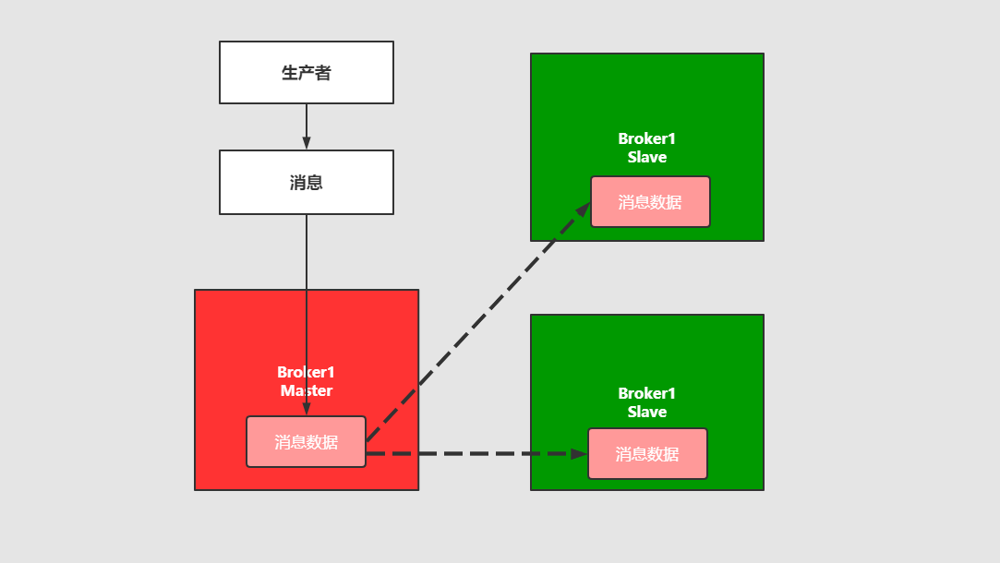
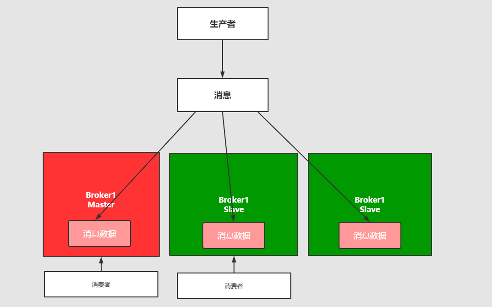
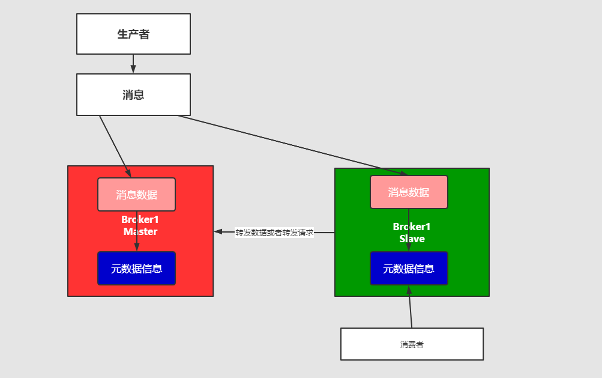
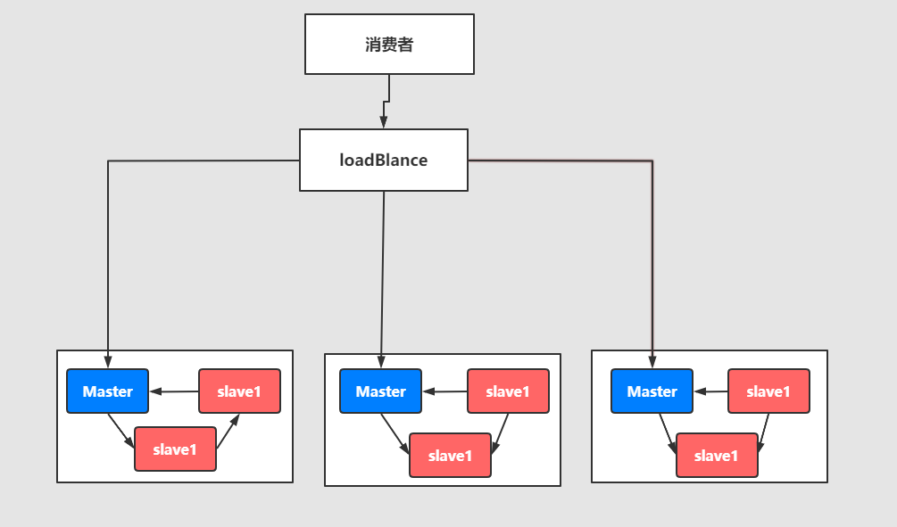

所谓高可用：是指产品在规定的条件和规定的时刻或时间内处于可执行规定功能状态的能力。

当业务量增加时，请求也过大，一台消息中间件服务器的会触及硬件（CPU、内存、磁盘）的极限，一台消息服务器你已经无法满足业务的需求，所以消息中间件必须支持集群部署，来达到高可用的目的。

## 1️⃣ Master-slave主从共享数据的部署方式

将多个消息服务器`Broker`连接共享一块消息存储空间，其中`Master`节点负责消息的写入。客户端会将消息写入到`Master`节点，一旦`Master`挂掉，`slave`节点继续服务，从而形成高可用。

## 2️⃣ Master-slave主从同步部署方式

该模式写入消息同样在`Master`节点上，但是主结点会同步数据到`slave`节点形成副本，和`zookeeper`或者`redis`主从机制很类似。这样可以达到负载均衡的效果，如果消费者有多个，
就可以到不同的节点进行消费，但是消息的拷贝和同步会占用很大的贷款和网络资源。在`rabbitMQ`中会有使用

## 3️⃣ 多主集群同步部署模式

和上述方式区别不大，但是该方式任意节点都可以进行写入。

## 4️⃣ 多主集群转发部署模式

如果插入的数据是`Broker1`，元数据信息会存储数据的相关描述和记录存放的位置（队列），它会对描述信息，也就是元数据进行同步；

如果消费者在`Broker2`中进行消费，发现自己没有对应的消息，就会在自己的元数据信息中去查询，如果查询到了直接返回。如果没有查询到就会将该消息的信息携带在请求中转发到其他节点去询问，
直到找到所需的信息为止。

**场景**：比如买火车票或者黄牛买演唱会门票，比如第一个黄牛没有顾客说要买的演唱会门票，但是他会去联系其他的黄牛询问，如果有就返回

## 5️⃣ Master-slave与Breoker-cluster组合的方案

实现多主多从的热备机制来完成消息的高可用以及数据的热备机制，在生产规模达到定的阶段的时候，这种使用的频率比较高。

:::tip
这些集群模式最终目的都是为保证：消息服务器不会挂掉，出现了故障依然可以抱着消息服务继续使用。反正终归三句话：

* 要么消息共享
* 要么消息同步
* 要么元数据兴享
:::