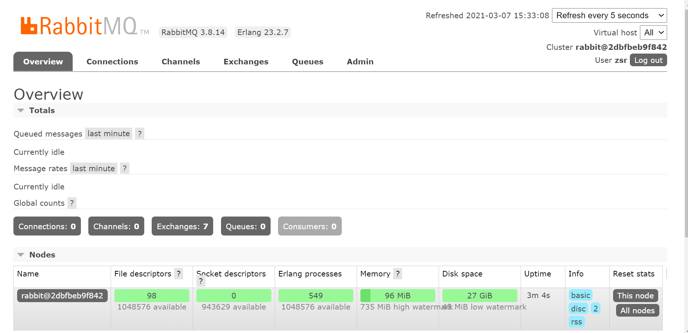

## 1、安装Docker

```shell
# 1.yum包更新到最新
yum update

# 2.安装需要的软件包(yum-utils提供yum-config-manager的功能,，并且device mapper存储驱动程序需要device-mapper-persistent-data和lvm2)
yum install -y yum-utils device-mapper-persistent-data lvm2

# 3.设置yum源为阿里云
yum-config-manager --add-repo http://mirrors.aliyun.com/docker-ce/linux/centos/docker-ce.repo

# 4.安装docker
yum install docker-ce -y

# 5.安装后查看docker版本
docker -v

# 6.阿里云镜像加速
sudo mkdir -p /etc/docker
sudo tee /etc/docker/daemon.json <<-'EOF'
{
  "registry-mirrors": ["https://73z5h6yb.mirror.aliyuncs.com"]
}
EOF
sudo systemctl daemon-reload
sudo systemctl restart docker
```

## 2、docker常用命令

```shell
# 启动docker
systemctl start docker

# 停止docker
systemctl stop docker

# 重启docker
systemctl restart docker

# 查看docker状态
systemctl status docker

# 开机启动
systemctl enable docker
systemctl unenable docker 

# 查看docker概要信息
docker info 

# 查看docker帮助文档
docker --help
```

## 3、安装启动RabbitMQ

```shell
# 安装启动rabbitmq容器
docker run -d --name myRabbitMQ -e RABBITMQ_DEFAULT_USER=zsr -e RABBITMQ_DEFAULT_PASS=123456 -p 15672:15672 -p 5672:5672 rabbitmq:3.8.14-management
```

然后打开浏览器访问服务器公网`ip:15672`，输入我们创建的账号密码登录，登录成功代表`docker`安装并启动成功

