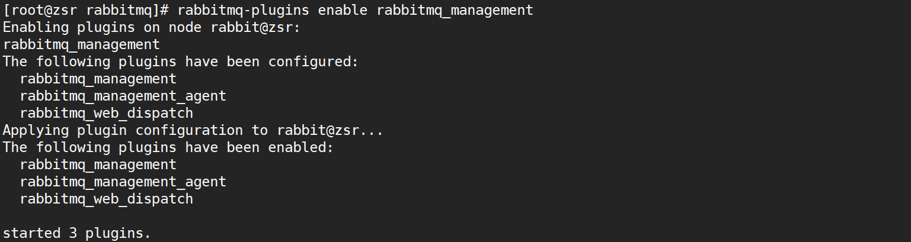
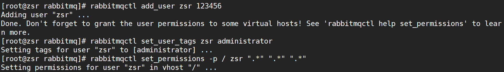

## 1、安装启动RabbitMQWeb管理界面

* 默认情况下，`rabbitmq`没有安装web端的客户端软件，需要安装才可以生效

```shell
# 打开RabbitMQWeb管理界面插件
rabbitmq-plugins enable rabbitmq_management
```



* 然后我们打开浏览器，访问服务器公网`ip:15672`（注意打开阿里云安全组以及防火墙的`15672`端口），就可以看到管理界面


`rabbitmq`有一个默认的账号密码`guest`，但该情况仅限于本机`localhost`进行访问，所以需要添加一个远程登录的用户

## 2、添加远程用户

```shell
# 添加用户
rabbitmqctl add_user 用户名 密码

# 设置用户角色,分配操作权限
rabbitmqctl set_user_tags 用户名 角色

# 为用户添加资源权限(授予访问虚拟机根节点的所有权限)
rabbitmqctl set_permissions -p / 用户名 ".*" ".*" ".*"
```

角色有四种：

* **administrator**：可以登录控制台、查看所有信息、并对`rabbitmq`进行管理
* **monToring**：监控者；登录控制台，查看所有信息
* **policymaker**：策略制定者；登录控制台指定策略
* **managment**：普通管理员；登录控制

这里创建用户`zsr`，密码`123456`，设置`adminstator`角色，赋予所有权限



创建完成后，访问服务器公网`ip:15672`进行登录，然后便可进入到后台


其他指令：

```shell
# 修改密码
rabbitmqctl change_ password 用户名 新密码

# 删除用户
rabbitmqctl delete_user 用户名

# 查看用户清单
rabbitmqctl list_users
```