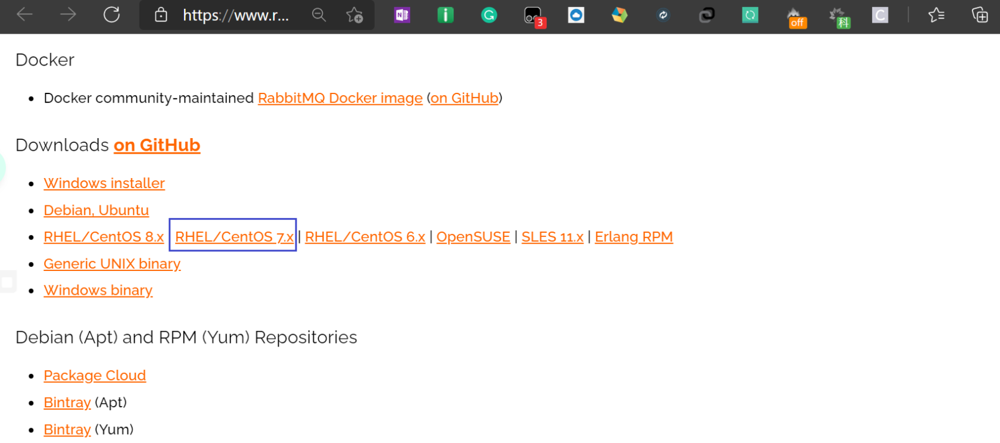
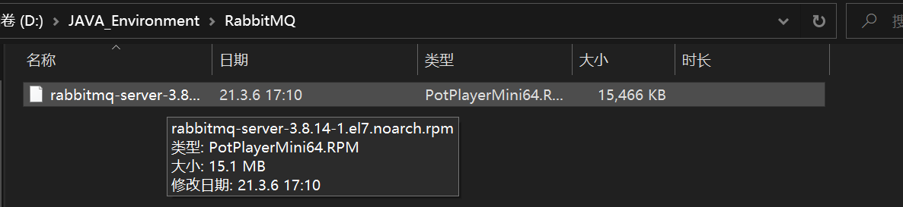
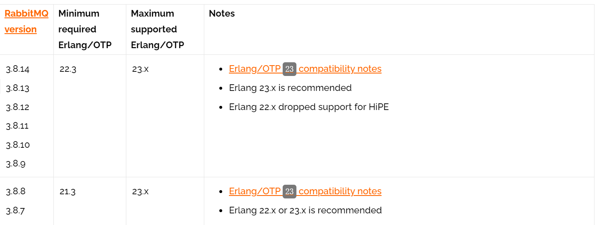
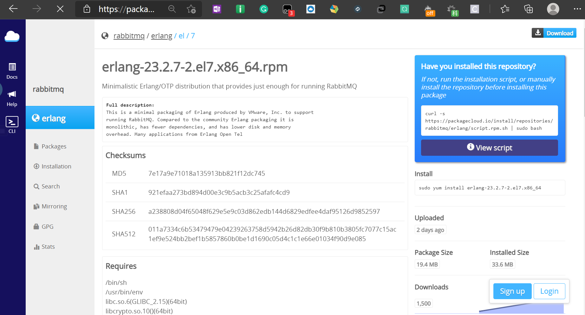
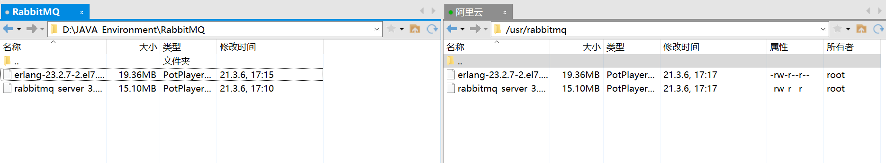
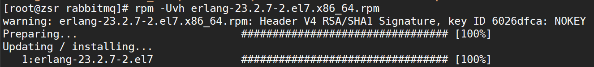
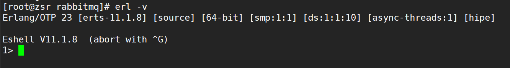

**环境准备**：阿里云`centos7.6` 服务器

```shell
# 查看系统版本
[root@zsr ~]# lsb_release -a
LSB Version:	:core-4.1-amd64:core-4.1-noarch
Distributor ID:	CentOS
Description:	CentOS Linux release 7.6.1810 (Core) 
Release:	7.6.1810
Codename:	Core
```

## 1、下载RabbitMQ

* **下载地址**：https://www.rabbitmq.com/download.html



* 选择对应的系统版本点击下载，下载后会得到`.rpm`文件



## 2、下载Erlang

> RabbitMQ是采用 Erlang语言开发的，所以系统环境必须提供 Erlang环境，需要是安装 Erlang

`Erlang`和`RabbitMQ`版本对照：https://www.rabbitmq.com/which-erlang.html



这里安装最新版本3.8.14的`RabbitMQ`，对应的`Erlang`版本推荐23.x，我们下载`erlang-23.2.7-2.el7.x86_64.rpm`

* **下载地址**：https://packagecloud.io/rabbitmq/erlang/packages/el/7/erlang-23.2.7-2.el7.x86_64.rpm



其中的`el7`表示`Red Hat 7.x`，即`CentOS 7.x`

* 点击右上角下载即可得到`.rpm`文件


## 3、安装Erlang

* 首先将下载好的文件上传到服务器，创建一个文件夹用来存放文件

```shell
[root@zsr ~]# mkdir -p /usr/rabbitmq
```

* 再利用`xftp`工具将上述下载的两个`.rpm`文件上传到服务器的刚创建的文件夹中



* 然后切换到`/usr/rabbitmq`目录，解压安装`erlang`

```shell
# 解压
rpm -Uvh erlang-23.2.7-2.el7.x86_64.rpm

# 安装
yum install -y erlang
```



* 安装完成后输入如下指令查看版本号

```shell
erl -v
```



## 4、安装RabbitMQ

* 在`RabiitMQ`安装过程中需要依赖`socat`插件，首先安装该插件

```shell
yum install -y socat
```

* 然后解压安装`RabbitMQ`的安装包

```shell
# 解压
rpm -Uvh rabbitmq-server-3.8.14-1.el7.noarch.rpm

# 安装
yum install -y rabbitmq-server
```

## 5、启动RabbitMQ服务

```shell
# 启动rabbitmq
systemctl start rabbitmq-server

# 查看rabbitmq状态
systemctl status rabbitmq-server
```

显示`active`则表示服务安装并启动成功


其他命令：

```shell
# 设置rabbitmq服务开机自启动
systemctl enable rabbitmq-server

# 关闭rabbitmq服务
systemctl stop rabbitmq-server

# 重启rabbitmq服务
systemctl restart rabbitmq-server
```

