:::tip 官网：RabbitMQ Tutorials — RabbitMQ

RabbitMQ提供6种模式，分别是 `Hello World`、`Work Queues`、`Publish/Subscribe`、`Routing`、`Topics`、`RPC`。本文详细讲述了前5种，并给出代码实现和思路。
其中 `Publish/Subscribe`、`Routing`、`Topics` 三种模式可以统一归为 `Exchange` 模式，只是创建时交换机的类型不一样，分别是 `fanout`、`direct`、`topic` 三种交换机类型。

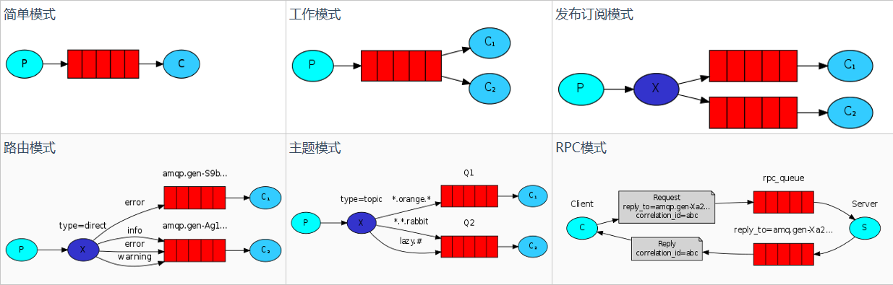

**注意**：简单模式和工作模式虽然途中没有画出交换机，但是都会有一个默认的交换机，类型为`direct`

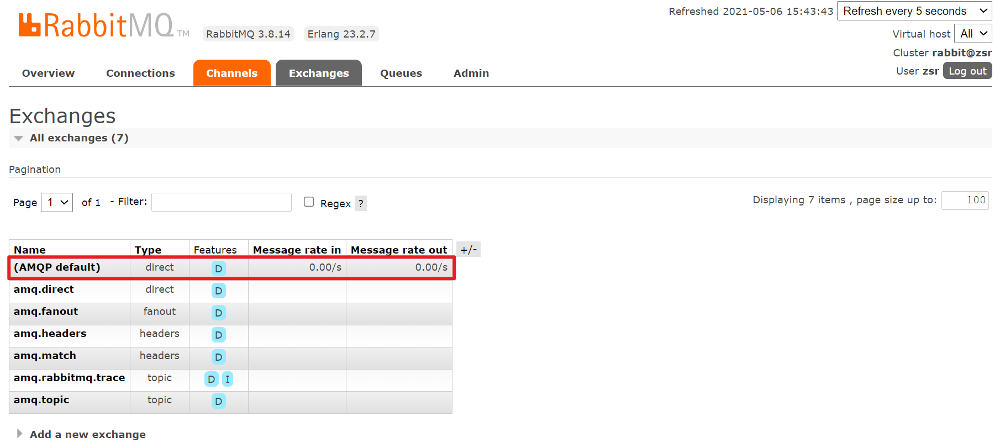
:::

## 简单模式

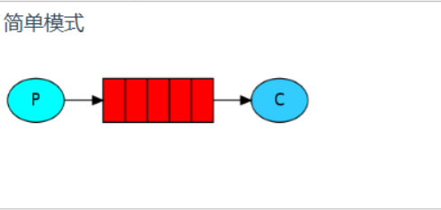

一个生产者，一个消费者，一个队列，采用默认交换机。可以理解为生产者P发送消息到队列Q，一个消费者C接收。

## 工作模式

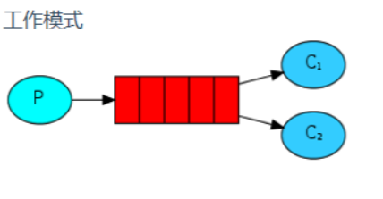

一个生产者，多个消费者，一个队列，采用默认交换机。可以理解为生产者P发送消息到队列Q，可以由多个消费者C1、C2进行接收。

## 发布/订阅模式（fanout）

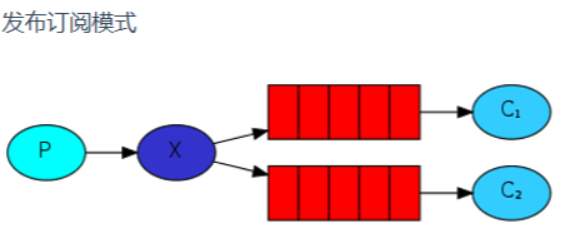

**功能**：一个生产者、一个 `fanout` 类型的交换机、多个队列、多个消费者。一个生产者发送的消息会被多个消费者获取。其中 `fanout` 类型就是发布订阅模式，只有订阅该生产者的消费者会收到消息。

接下来通过web界面的方式模拟发布订阅模式:

* 首先新建一个`fanout`类型的交换机

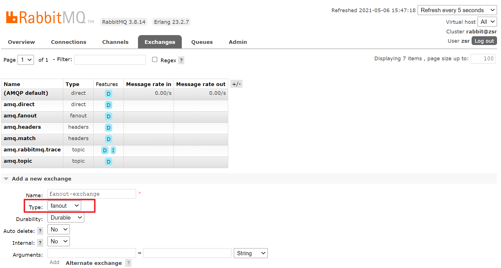

* 然后声明两个队列`queue1`、`queue2`

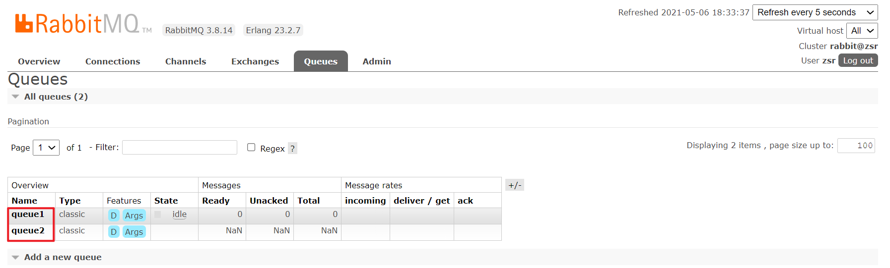

* 然后将队列与交换机进行绑定

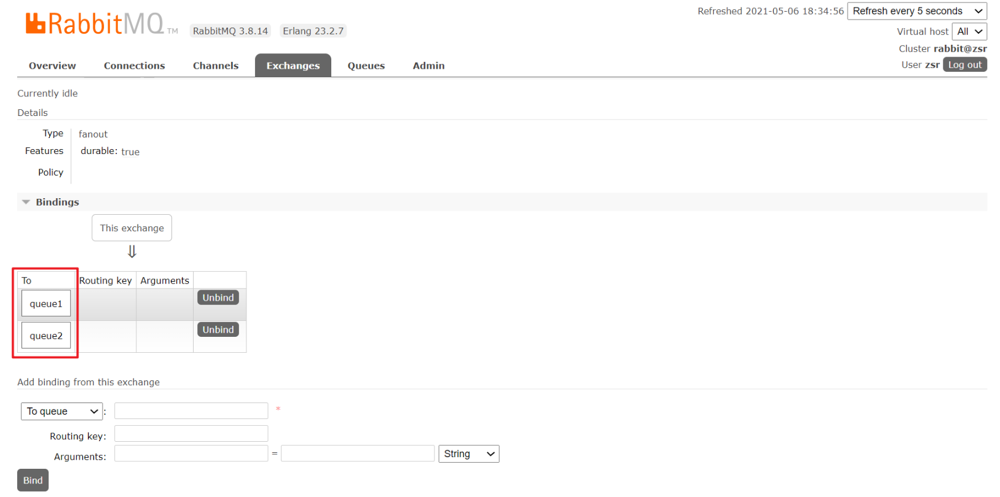

* 发送一个hello消息

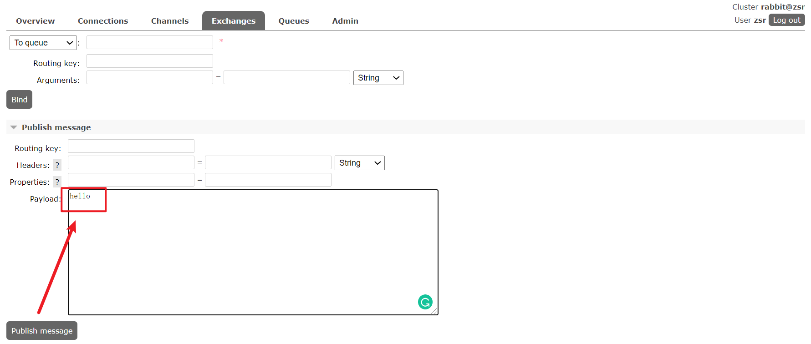

* 然后在两个队列中都可以看到收到的消息

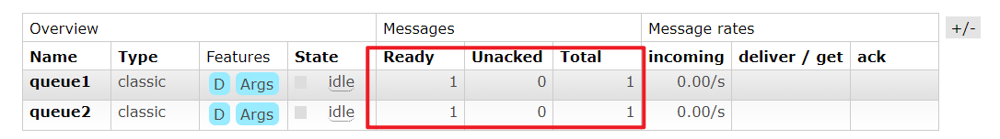

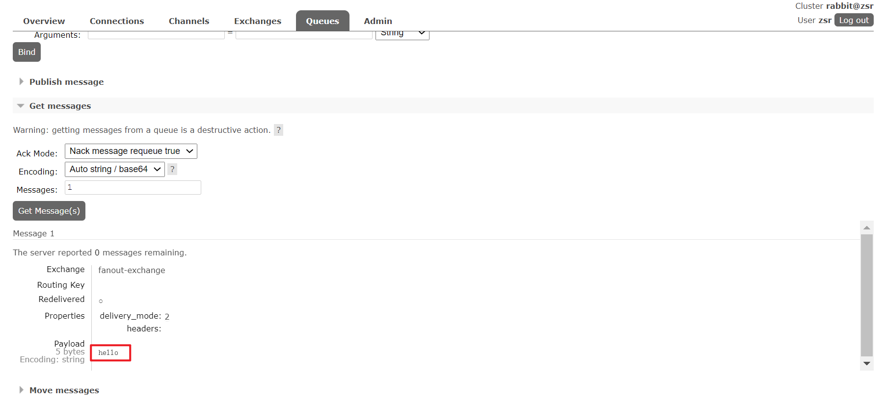

## 路由模式（direct）

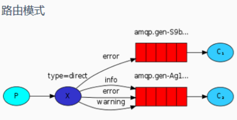

**功能**：一个生产者，一个 `direct` 类型的交换机，多个队列，交换机与队列之间通过 `routing-key` 进行关联绑定，多个消费者。生产者发送消息到交换机并且要指定`routing-key`，
然后消息根据这交换机与队列之间的 `routing-key` 绑定规则进行路由被指定消费者消费。

接下来通过web界面的方式模拟发布订阅模式:

* 首先新建一个`direct`类型的交换机

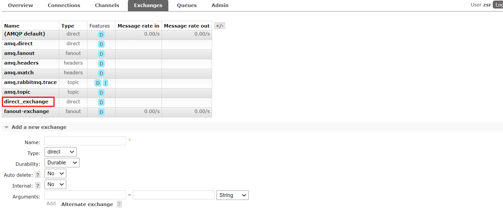

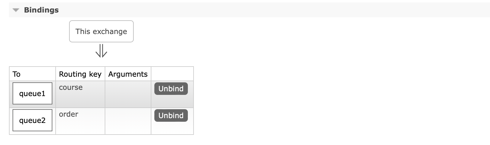

* 然后我们往交换机中发送一条消息，指定一个 `routing-key`

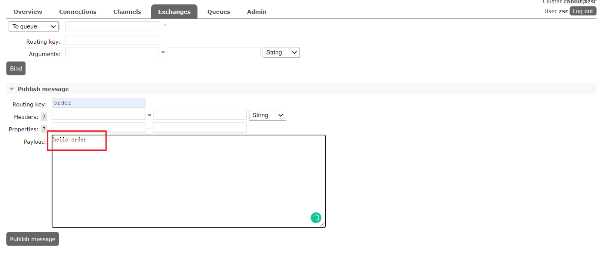

* 可以看到只有对应 `routing-key` 的 `queue2` 收到了消息

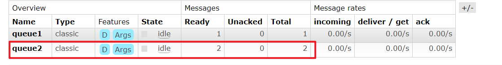

## 主题模式（topic)

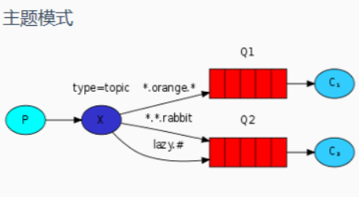

**说明**：一个生产者，一个 `topic` 类型的交换机，多个队列，交换机与队列之间通过 `routing-key` 进行关联绑定，多个消费者。生产者发送消息到交换机并且要指定 `routing-key`，
然后消息根据这交换机与队列之间的 `routing-key` 绑定规则进行路由被指定消费者消费。与路由模式不同是 `routing-key` 有指定的队则，可以更加的通用，满足更过的场景。

routing-key 的规则如下：

* `#`：匹配一个或者多个词，例如`lazy.#` 可以匹配 `lazy.xxx` 或者 `lazy.xxx.xxx`
* `*`：只能匹配一个词，例如 `lazy.*` 只能匹配 `lazy.xxx`

接下来通过web界面的方式模拟发布订阅模式:

* 首先新建一个`topic`类型的交换机

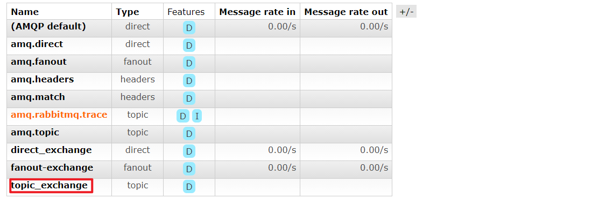

* 然后绑定队列，设置路由key

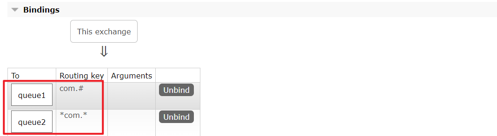

* 然后我们向交换机中投递一条消息，指定一个路由key

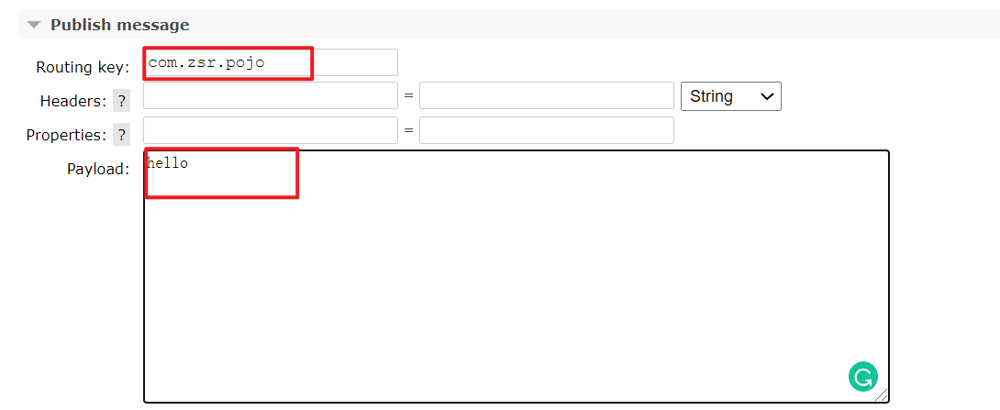

* 可以看到只有满足路由key条件的queue1收到了消息

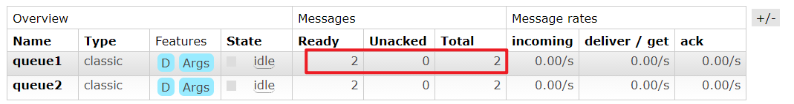

## 参数（RPC）模式

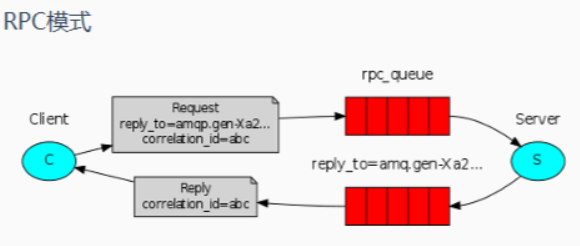

**作用**：可以携带参数，根据参数进行过滤

下来通过web界面的方式模拟发布订阅模式：

* 首先新建一个`headers`类型的交换机

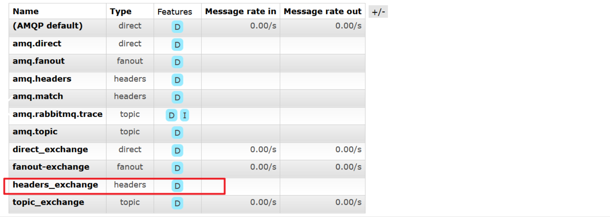

* 然后绑定队列，设置相关参数

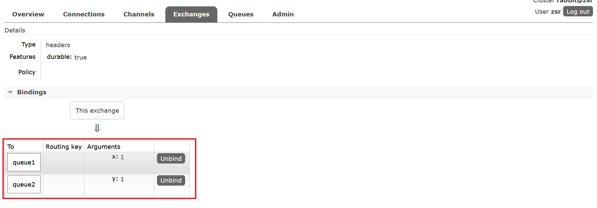

* 然后我们向交换机中投递一条消息，指定参数

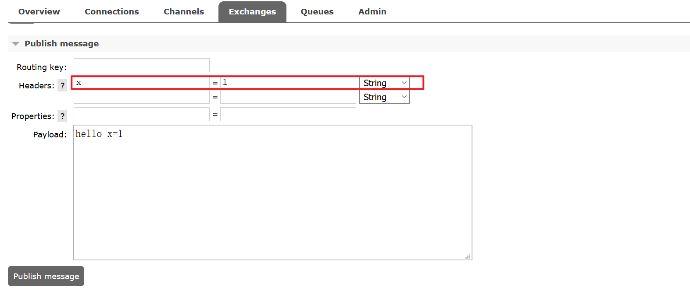

* 可以看到只有满足参数x条件的`queue1`收到了消息

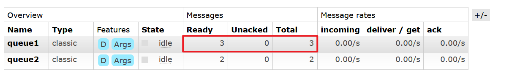