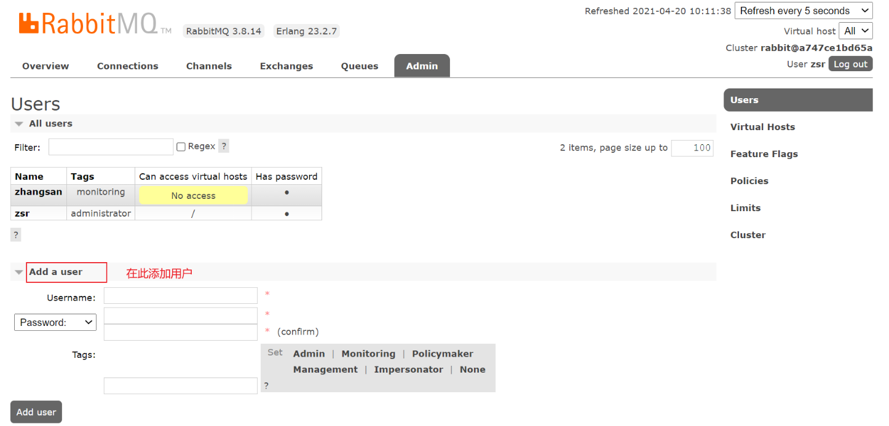

1. **none**：不能访问 `management plugin`

2. **management**：查看自己相关节点信息
   * 列出自己可以通过AMQP登入的虚拟机
   * 查看自己的虚拟机节点`virtual hosts`的`queues`，`exchanges`和`bindings`信息
   * 查看和关闭自己的`channels`和`connections`
   * 查看有关自己的虚拟机节点`virtual hosts`的统计信息。包括其他用户在这个节点`virtual hosts`中的活动信息

3. **Policymaker**
   * 包含`management`所有权跟
   * 查看和创建和删除自己的`virtual hosts`所属的`policies`和`parameters`信息
   
4. **Monitoring**
   * 包含`management`所有权限
   * 罗列出所有的`virtual hosts`，包括不能登录的`virtual hosts`
   * 查看其他用户的`connections`和`channels`信息
   * 查看节点级别的数据如`clustering`和`memory`使用情况
   * 查看所有的`virtual hosts`的全局统计信息。

5. **Administrator**
   * 最高权限
   * 可以创建和删除 `virtual hosts`
   * 可以查看，创建和删除`users`
   * 查看创建`permissions`
   * 关闭所有用户的`connections`