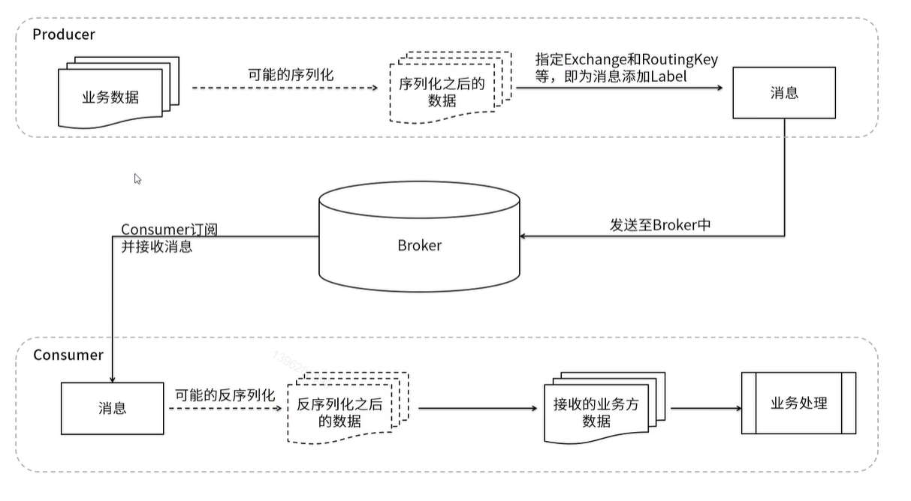

* **生产者**：产生数据发送消息的程序是生产者。

* **交换机**：交换机是 `RabbitMQ` 非常重要的一个部件，一方面它接收来自生产者的消息，另一方面它将消息推送到队列中。交换机必须确切知道如何处理它接收到的消息，
是将这些消息推送到特定队列还是推送到多个队列，亦或者是把消息丢弃，这个是由交换机类型决定的。

* **队列**：队列是 `RabbitMQ` 内部使用的一种数据结构，尽管消息流经 `RabbitMQ` 和应用程序，但它们只能存储在队列中。队列仅受主机的内存和磁盘限制的约束，本质上是一个大的消息缓冲区。
许多生产者可以将消息发送到一个队列，许多消费者可以尝试从一个队列接收数据。

* **消费者**：消费与接收具有相似的含义。消费者大多时候是一个等待接收消息的程序。请注意生产者，消费者和消息中间件很多时候并不在同一机器上。同一个应用程序既可以是生产者又是可以是消费者。

