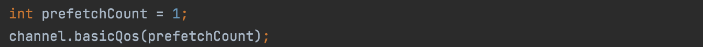
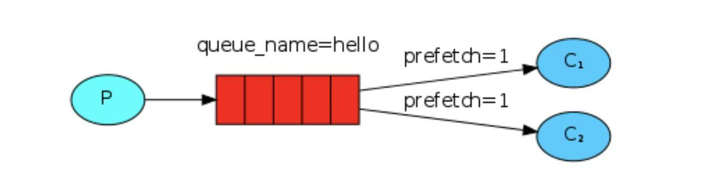
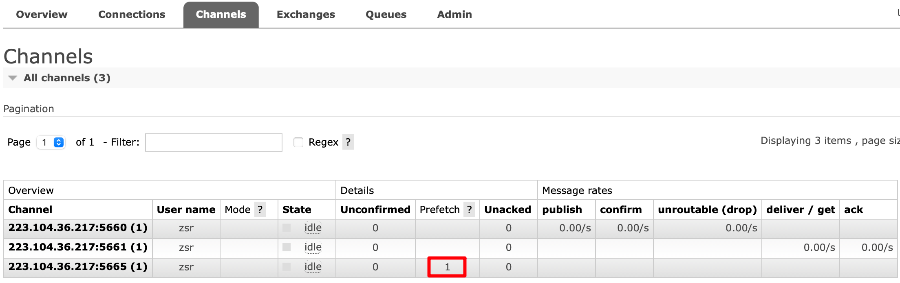

前面我们了解到 RabbitMQ 默认分发消息采用的轮训分发模式，但是在某种场景下这种策略并不是很好，比方说有两个消费者在处理任务，其中 `consumer01` 处理任务的速度非常快，
而 `consumer02` 处理速度却很慢，此时如果我们还是采用轮训分发的化就会使处理速度快的 `consumer01` 很大一部分时间处于空闲状态，而 `consumer02` 一直在干活，这种分配方式在这种情况下其实就不太好，
但是 RabbitMQ 并不知道这种情况它依然很公平的进行分发。

为了避免这种情况，我们可以设置参数 `channel.basicQos(1)`，意思就是每个消费者只能处理完当前消息才能接受新的消息。

设置之后示意图如下所示：

可以理解如果当前消息我没有处理完的话或者还没有应答的话，新的消息就先别分配给我，我目前只能处理一个消息，然后 RabbitMQ 就会把该任务分配给没有那么忙的那个空闲消费者，
当然如果所有的消费者都没有完成手上任务，队列还在不停的添加新任务，队列有可能就会遇到队列被撑满的情况，这个时候就只能添加新的消费者 或者改变其他存储任务的策略。

