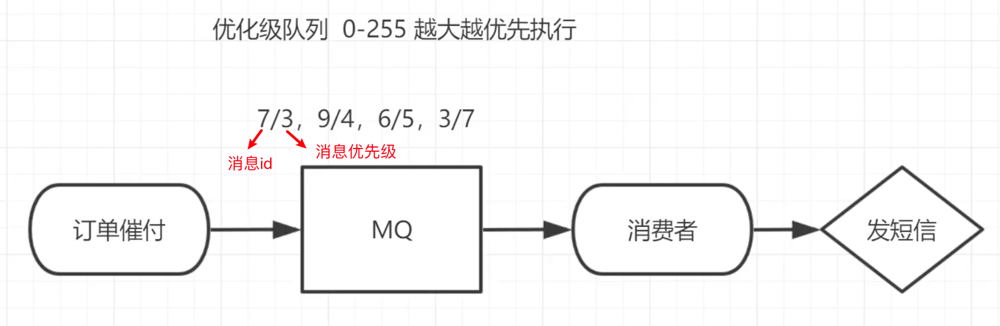
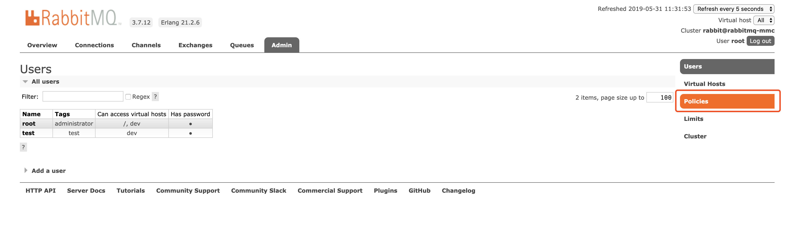
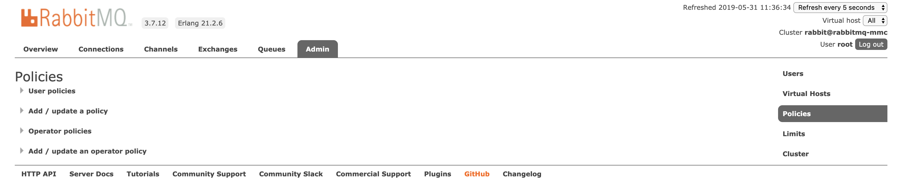
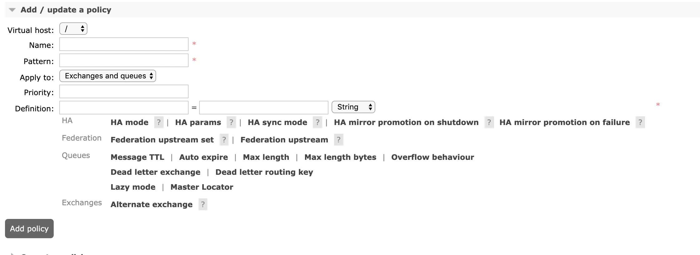

## 使用场景

电商系统中常常会遇到订单催付的场景，比如用户在淘宝下单后，往往会及时将订单信息推送给用户，如果用户在设定的时间内未付款那么就会给用户推送一条短信提醒，这个功能看似很简单，但是当订单量十分大的情况下，商家往往要进行优先级排序，大客户先推送，
小客户后推送的。曾经我们的后端系统的解决办法是使用 `redis` 的 `List` 做一个简简单单的消息队列来实现定时轮询推送，但这并不能实现一个优先级的场景，所以订单量大了之后我们应该采用 RabbitMQ 进行改造和优化，给以给要发送的消息设置优先级，满足不同场景的需要。



**❓ 如果在 RabbitMQ 中实现优先级队列呢？**

## 在web界面创建队列时添加


## 在web界面policies中设置

### Policise 的作用

通常来说，我们会在创建一个`Queue`时指定了队列的各项属性和参数，例如`message-ttl`、`x-dead-letter-exchange`、`x-dead-letter-route-key`、`x-max-length`等，一旦RabbitMQ创建`Queue`成功，则不允许再修改`Queue`的任何属性或参数，除非删除重建。

我们在实际使用中，随着业务的变化，经常会出现需要调整`message-ttl`、`x-max-length`等参数来改变`Queue`行为的场景，那这个时候怎么办呢，总不能暂停上下游的生产者和消费者来等`Queue`的删除重建吧？这个时候就需要使用到RabbitMQ的`Policy`机制了。

### Policies 的使用

#### 创建Policy

`Policies`是RabbitMQ的`Server`端机制，不能通过`Client`来创建，RabbitMQ支持以下几种方式来创建`Policy`：

* **rabbitmqctl**
* **Http API**
* **Management Plugin Web UI**

这里选择最直观的 Web UI方式来讲，Web UI创建`Policy`的界面在 Admin Tab页中的`Policies`右侧导航栏，如图： 



点击进入后，可以看到4块内容，`User Policies`、`Add / update a policy`、`Operator Policies`、`Add / update an operator policy `



打开`Add / update an operator policy`



从界面上可以非常直观的看到一个`Policy`需要的元素：

* **Virtual host**
* **Name**: 这个`Policy`的名称
* **Pattern**: `Policy`根据正则表达式去匹配`Queues/Exchanges`名称
* **Apply to**: 这个`Policy`对`Queue`还是对`Exchange`生效，或者两者都适用
* **Priority**: 优先级。
* **Definition**: 添加的args，KV键值对。

`Definition` 可添加的args参考以下文档：

* [Queue Properties](https://www.rabbitmq.com/queues.html#properties)
* [Dead Letter Exchanges](https://www.rabbitmq.com/dlx.html)
* [Parameters and Policies](https://www.rabbitmq.com/parameters.html#policies)

#### Operator Policy

简单说明一下 `Operator Policy` 和 `User Policy` 的区别：

* `Operator Policy` 是给服务提供商或公司基础设施部门用来设置某些需要强制执行的通用规则
* `User Policy` 是给业务应用用来设置的规则

`Operator Policy` 和 `User Policy` 会合并后作用于队列，并且为防止 `Operator Policy` 对队列某些关键属性例如死信队列交换器`Dead Letter Exchange`的覆盖导致业务应用产生非预期的结果，`Operator Policy` 只支持 `expire`、`message-ttl`、
`max-length`、`max-length-bytes` 4个参数。

#### Policies 之间的优先级

在设置`Policy`时需要注意，因为`Policy`是根据`parttern`匹配队列的，因此可能会出现多个`Policy`都匹配到某一个队列的情况，此时会依据以下规则进行排序选出实际生效的`Policy`：

* 首先根据`priority`排序，值越大的优先级越高；
* 相同`priority`则根据创建时间排序，越晚创建的优先级越高。

## 代码中实现

```java
// 1.队列声明的代码中添加优先级参数
Map<String, Object> params = new HashMap();
params.put("x-max-priority", 10);	// 官方允许是0～255之间,此处设置为10,即允许优先级范围从0～10（不要设置过大以免浪费cpu和内存）
channel.queueDeclare("hello", true, false, false, params);

// 2.消息中代码添加优先级（要在队列优先级设置的范围内）
AMQP.BasicProperties properties = new AMQP.BasicProperties().builder().priority(5).build();
channel.basicPublish("",QUEUE_NAME,properties,message.getBytes());
```

注意：队列需要设置为优先级队列的同时消息也必须设置消息的优先级才能生效，而且消费者需要等待消息全部发送到队列中才去消费因为这样才有机会对消息进行排序。