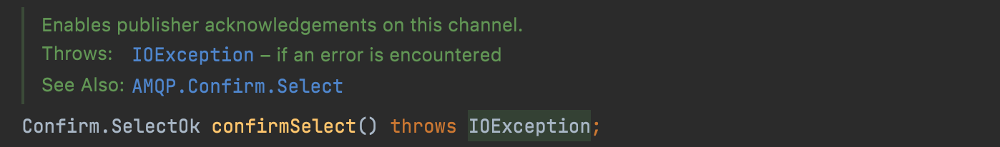
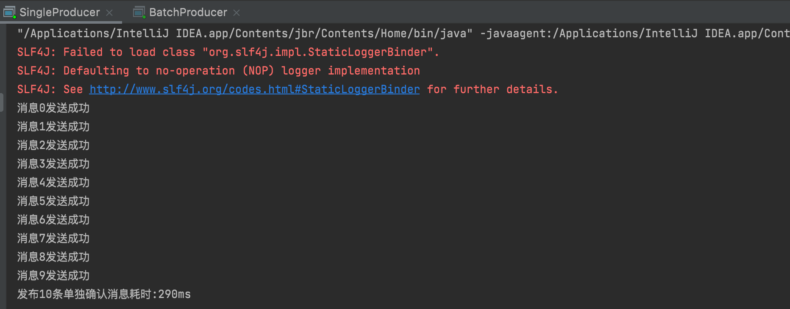
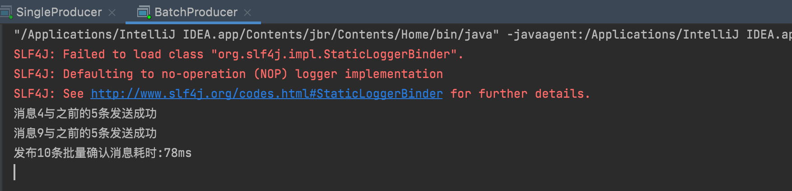
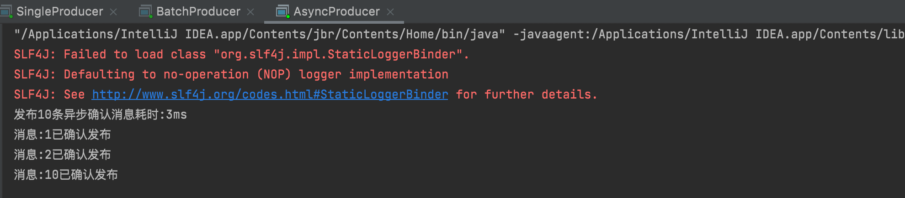

生产者将信道设置成 `confirm` 模式，一旦信道进入 `confirm` 模式，所有在该信道上面发布的消息都将会被指派一个唯一的 ID(从 1 开始)，一旦消息被投递到所有匹配的队列之后，
`broker` 就会发送一个确认给生产者(包含消息的唯一ID)，这就使得生产者知道消息已经正确到达目的队列了，如果消息和队列是可持久化的，那么确认消息会在将消息写入磁盘之后发出，
`broker` 回传给生产者的确认消息中 `delivery-tag` 域包含了确认消息的序列号，此外 `broker` 也可以设置 `basic.ack` 的 `multiple` 域，表示到这个序列号之前的所有消息都已经得到了处理。

`confirm` 模式最大的好处在于他是异步的，一旦发布一条消息，生产者应用程序就可以在等信道返回确认的同时继续发送下一条消息，当消息最终得到确认之后，生产者应用便可以通过回调方法来处理该确认消息，
如果 RabbitMQ 因为自身内部错误导致消息丢失，就会发送一条 `nack` 消息，生产者应用程序同样可以在回调方法中处理该 `nack` 消息。

发布确认默认是没有开启的，如果要开启需要调用方法 `confirmSelect`，每当你要想使用发布确认，都需要在 `channel` 上调用该方法



```java
// 开启发布确认
channel.confirmSelect();
```

发布确认机制有三种策略：**单个确认发布**、**批量确认发布**、**异步确认发布**。其中前两者是同步确认的方式，也就是发布一个/一批消息之后只有被确认发布，后续的消息才能继续发布，
后者是异步确认的方式，我们只管发布消息即可，消息是否被确认可以通过回调函数来接收到。

## 单个确认发布

这是一种简单的确认方式，它是一种**同步确认发布的方式**，也就是发布一个消息之后只有它被确认发布，后续的消息才能继续发布，`waitForConfirmsOrDie(long)`这个方法只有在消息被确认的时候才返回，
如果在指定时间范围内这个消息没有被确认那么它将抛出异常。

这种确认方式有一个最大的缺点就是：**发布速度特别的慢**，因为如果没有确认发布的消息就会阻塞所有后续消息的发布，这种方式最多提供每秒不超过数百条发布消息的吞吐量。
当然对于某些应用程序来说这可能已经足够了。

```java
package mode2_WorkQueues.confirm;

import com.rabbitmq.client.Channel;

// 测试单个确认发布
public class SingleProducer {
    public static String QUEUE_NAME = "confirm";
    public static int MESSAGE_COUNT = 10;

    public static void main(String[] args) throws Exception {
        // 创建channel
        Channel channel = utils.RabbitMqUtils.getChannel();
        // 开启发布确认
        channel.confirmSelect();
        // 开始时间
        long begin = System.currentTimeMillis();
        // 批量发送10条消息
        channel.queueDeclare(QUEUE_NAME, false, false, false, null);
        for (int i = 0; i < MESSAGE_COUNT; i++) {
            String message = i + "";
            channel.basicPublish("", QUEUE_NAME, null, message.getBytes());
            // 单个消息发送完毕马上确认
            boolean flag = channel.waitForConfirms();
            // 服务端返回false或超时时间内未返回，生产者可以消息重发
            if (flag) System.out.println("消息" + i + "发送成功");
        }
        // 结束时间
        long end = System.currentTimeMillis();
        System.out.println("发布" + MESSAGE_COUNT + "条单独确认消息耗时:" + (end - begin) + "ms");
    }
}
```



## 批量确认发布

上面那种方式非常慢，与单个等待确认消息相比，先发布一批消息然后一起确认可以极大地提高吞吐量，当然这种方式的缺点就是：当发生故障导致发布出现问题时，不知道是哪个消息出现问题了，
我们必须将整个批处理保存在内存中，以记录重要的信息而后重新发布消息。当然**这种方案仍然是同步的，也一样阻塞消息的发布**。

```java
package mode2_WorkQueues.confirm;

import com.rabbitmq.client.Channel;

// 测试单个确认发布
public class BatchProducer {
    public static String QUEUE_NAME = "confirm";
    public static int MESSAGE_COUNT = 10;

    public static void main(String[] args) throws Exception {
        // 创建channel
        Channel channel = utils.RabbitMqUtils.getChannel();
        // 开启发布确认
        channel.confirmSelect();
        // 确定批量大小
        int batchSize = 5;
        // 未确认消息个数
        int noConfirmMesNum = 0;
        // 开始时间
        long begin = System.currentTimeMillis();
        // 发送消息
        channel.queueDeclare(QUEUE_NAME, false, false, false, null);
        for (int i = 0; i < MESSAGE_COUNT; i++) {
            String message = i + "";
            channel.basicPublish("", QUEUE_NAME, null, message.getBytes());
            noConfirmMesNum++;
            // 每5个一批发布确认
            if (noConfirmMesNum == batchSize) {
                boolean flag = channel.waitForConfirms();
                if (flag) System.out.println("消息" + i + "与之前的" + batchSize + "条发送成功");
                noConfirmMesNum = 0;
            }
        }
        // 为了确保还有剩余没有确认消息 再次确认
        if (noConfirmMesNum > 0)
            channel.waitForConfirms();
        // 结束时间
        long end = System.currentTimeMillis();
        System.out.println("发布" + MESSAGE_COUNT + "条批量确认消息耗时:" + (end - begin) + "ms");
    }
}
```



## 异步确认发布

异步确认虽然编程逻辑比上两个要复杂，但是性价比最高，无论是可靠性还是效率都没得说，他是利用回调函数来达到消息可靠性传递的，这个中间件也是通过函数回调来保证是否投递成功，
下面就让我们来详细讲解异步确认是怎么实现的。


代码中，我们把未确认的消息放到一个基于内存的能被发布线程访问的队列，比如说用 `ConcurrentLinkedQueue` 这个队列在 `confirm`、`callbacks` 与发布线程之间进行消息的传递。

```java
package mode2_WorkQueues.confirm;

import com.rabbitmq.client.Channel;
import com.rabbitmq.client.ConfirmCallback;

import java.util.concurrent.ConcurrentNavigableMap;
import java.util.concurrent.ConcurrentSkipListMap;

public class AsyncProducer {
    public static String QUEUE_NAME = "confirm";
    public static int MESSAGE_COUNT = 10;

    public static void main(String[] args) throws Exception {
        // 创建channel
        Channel channel = utils.RabbitMqUtils.getChannel();
        // 开启发布确认
        channel.confirmSelect();
        // 开始时间
        long begin = System.currentTimeMillis();
        // 准备一个线程安全有序的哈希表，用于存放消息的序号以及内容
        ConcurrentSkipListMap<Long, String> concurrentSkipListMap = new ConcurrentSkipListMap<>();
        // 消息确认成功回调函数(第一个参数表示消息标志,第二个参数表示是否为批量确认)
        ConfirmCallback ackCallback = (long deliveryTag, boolean multiple) -> {
            // 删除掉已经确认的消息，剩下就是未确认的消息
            if (multiple) { // 如果是批量 则批量删除
                ConcurrentNavigableMap<Long, String> confirmed = concurrentSkipListMap.headMap(deliveryTag);
                confirmed.clear();
            } else concurrentSkipListMap.remove(deliveryTag);   // 如果不是批量发送 则删除当前消息
            System.out.println("消息:" + deliveryTag + "已确认发布");
        };
        // 消息确认失败回调函数(第一个参数表示消息标志,第二个参数表示是否为批量确认)
        ConfirmCallback nackCallback = (long deliveryTag, boolean multiple) -> {
            String message = concurrentSkipListMap.get(deliveryTag);
            System.out.println("未确认的消息为:" + message);
        };
        // 首先准备异步消息监听器,监听哪些消息成功了,哪些消息失败了
        channel.addConfirmListener(ackCallback, nackCallback);  // 异步通知
        // 发送消息
        for (int i = 0; i < MESSAGE_COUNT; i++) {
            String message = "消息" + i;
            channel.basicPublish("", QUEUE_NAME, null, message.getBytes());
            // 在此记录下所有要发送的消息
            concurrentSkipListMap.put(channel.getNextPublishSeqNo(), message);
        }
        // 结束时间
        long end = System.currentTimeMillis();
        System.out.println("发布" + MESSAGE_COUNT + "条异步确认消息耗时:" + (end - begin) + "ms");
    }
}
```



## 对比

* **单独发布消息**：同步等待确认，简单，但吞吐量非常有限。
* **批量发布消息**：批量同步等待确认，简单，合理的吞吐量，一旦出现问题但很难推断出是那条消息出现了问题。
* **异步处理**：最佳性能和资源使用，在出现错误的情况下可以很好地控制，但是实现起来稍微难些