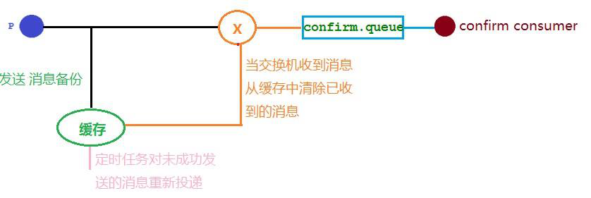
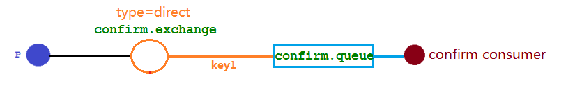
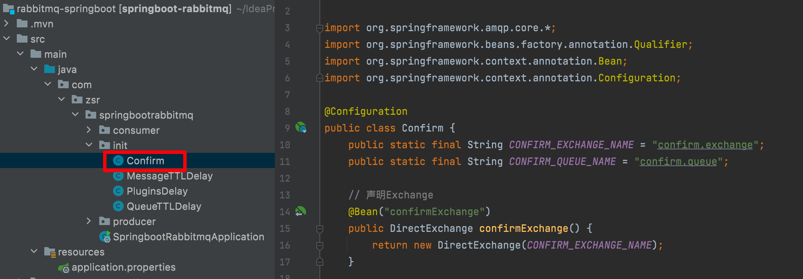
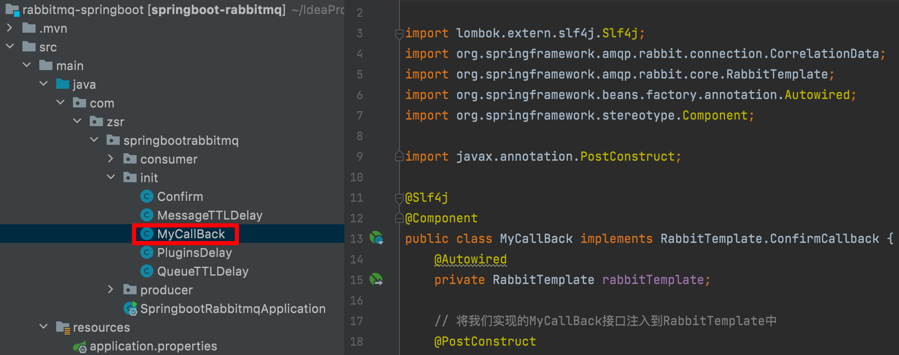
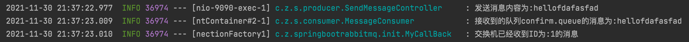
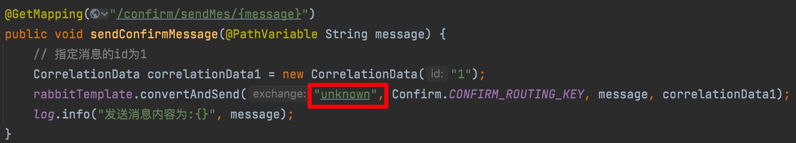
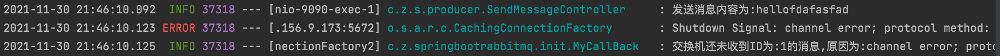
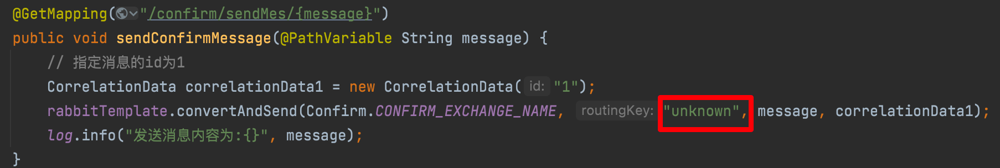
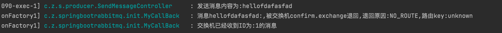
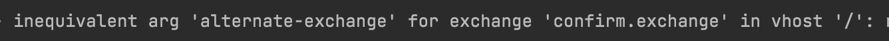

在生产环境中由于一些不明原因，导致 rabbitmq 重启，在 RabbitMQ 重启期间生产者消息投递失败，导致消息丢失，需要手动处理和恢复。于是，我们开始思考，如何才能进行 RabbitMQ 的消息可靠投递呢？ 特别是在这样比较极端的情况，RabbitMQ 集群不可用的时候，
无法投递的消息该如何处理呢？

解决方案就是缓存，比如当生产者发送消息到交换机时，但交换机不存在，我们应该将消息放入缓存中；或者交换机存在，队列不存在了，当交换机发送不到队列中也应该将消息放入缓存。然后在缓存中配置一个定时任务，对没有发送成功的消息重新进行投递。这样就避免了消息丢失的情况。



## 回调接口——消息确认

接下来我们通过代码实现以上机制，架构图如下所示：我们要解决问题就是如果图中的交换机或者队列出现问题，应该将消息进行缓存处理，防止消息丢失，具体的实现就是通过生产者的回调接口`ConfirmCallback`来实现。



> 以下实验环境基于上节springboot整合rabbitmq实现延迟队列的环境上

### 修改配置文件

在配置文件当中需要添加配置表示开启发布消息成功到交换器后会触发回调方法

```properties
spring.rabbitmq.publisher-confirm-type=correlate
```

* **NONE**：禁用发布确认模式，是默认值
* **CORRELATED**：发布消息成功到交换器后会触发回调方法
* **SIMPLE**：经测试有两种效果，其一效果和 `CORRELATED` 值一样会触发回调方法；其二在发布消息成功后使用 `rabbitTemplate` 调用

`waitForConfirms` 或 `waitForConfirmsOrDie` 方法等待 `broker` 节点返回发送结果，根据返回结果来判定下一步的逻辑，要注意的点是 `waitForConfirmsOrDie` 方法如果返回 `false` 则会关闭 `channel`，则接下来无法发送消息到 `broker`

### 编写初始化类

在`init`包中新建`Confirm.java`，新建上图中的交换机与队列：



```java
package com.zsr.springbootrabbitmq.init;

import org.springframework.amqp.core.*;
import org.springframework.beans.factory.annotation.Qualifier;
import org.springframework.context.annotation.Bean;
import org.springframework.context.annotation.Configuration;

@Configuration
public class Confirm {
    public static final String CONFIRM_EXCHANGE_NAME = "confirm.exchange";
    public static final String CONFIRM_QUEUE_NAME = "confirm.queue";
    public static final String CONFIRM_ROUTING_KEY = "key1";

    // 声明Exchange
    @Bean("confirmExchange")
    public DirectExchange confirmExchange() {
        return new DirectExchange(CONFIRM_EXCHANGE_NAME);
    }

    // 声明确认队列
    @Bean("confirmQueue")
    public Queue confirmQueue() {
        return QueueBuilder.durable(CONFIRM_QUEUE_NAME).build();
    }

    // 声明确认队列与交换机的绑定关系
    @Bean
    public Binding queueBinding(@Qualifier("confirmQueue") Queue queue,
                                @Qualifier("confirmExchange") DirectExchange exchange) {
        return BindingBuilder.bind(queue).to(exchange).with("key1");
    }
}
```

### 实现回调接口

在 `init` 包中新建 `MyCallBack.java`，实现 `RabbitTemplate.ConfirmCallBack` 接口



```java
package com.zsr.springbootrabbitmq.init;

import lombok.extern.slf4j.Slf4j;
import org.springframework.amqp.rabbit.connection.CorrelationData;
import org.springframework.amqp.rabbit.core.RabbitTemplate;
import org.springframework.beans.factory.annotation.Autowired;
import org.springframework.stereotype.Component;

import javax.annotation.PostConstruct;

@Slf4j
@Component
public class MyCallBack implements RabbitTemplate.ConfirmCallback {
    @Autowired
    private RabbitTemplate rabbitTemplate;

    // 将我们实现的MyCallBack接口注入到RabbitTemplate中
    @PostConstruct
    public void init() {
        rabbitTemplate.setConfirmCallback(this);
    }

    /**
     * 交换机确认回调方法
     *
     * @param correlationData 保存回调消息的ID以及相关信息
     * @param ack             表示交换机是否收到消息(true表示收到)
     * @param cause           表示消息接收失败的原因(收到消息为null)
     */
    @Override
    public void confirm(CorrelationData correlationData, boolean ack, String cause) {
        String id = correlationData != null ? correlationData.getId() : "";
        if (ack) {
            log.info("交换机已经收到ID为:{}的消息", id);
        } else {
            log.info("交换机还未收到ID为:{}的消息,原因为:{}", id, cause);
        }
    }
}
```

### 编写消息生产者

在 `SendMessageController.java` 中新增以下代码：

```java
@GetMapping("/confirm/sendMes/{message}")
public void sendConfirmMessage(@PathVariable String message) {
  // 指定消息的id为1
  CorrelationData correlationData1 = new CorrelationData("1");
  rabbitTemplate.convertAndSend(Confirm.CONFIRM_EXCHANGE_NAME, Confirm.CONFIRM_ROUTING_KEY, message, correlationData1);
  log.info("发送消息内容为:{}", message);
}
```

### 编写消息消费者

在 `MessageConsumer.java` 中添加以下代码：

```java
@RabbitListener(queues = Confirm.CONFIRM_QUEUE_NAME)
public void receiveConfirmMessage(Message message) {
  String msg = new String(message.getBody());
  log.info("接收到的队列confirm.queue的消息为:{}", msg);
}
```

### 运行测试

运行springboot主启动类，请求 http://localhost:9090/confirm/sendMes/hellofdafasfad



根据结果可以看到消息成功发送到交换机，并触发了我们实现的回调函数。

这是没有出现问题的情况，如果我们交换机出现问题，收不到消息的样子是什么样子呢？

我们修改一下生产者的代码，将交换机的名字改成一个未知的名字：



然后再测试，同样请求以上的url，查看结果：



```shell
2021-11-30 21:46:10.092  INFO 37318 --- [nio-9090-exec-1] c.z.s.producer.SendMessageController     : 发送消息内容为:hellofdafasfad
2021-11-30 21:46:10.123 ERROR 37318 --- [.156.9.173:5672] o.s.a.r.c.CachingConnectionFactory       : Shutdown Signal: channel error; protocol method: #method<channel.close>(reply-code=404, reply-text=NOT_FOUND - no exchange 'unknown' in vhost '/', class-id=60, method-id=40)
2021-11-30 21:46:10.125  INFO 37318 --- [nectionFactory2] c.z.springbootrabbitmq.init.MyCallBack   : 交换机还未收到ID为:1的消息,原因为:channel error; protocol method: #method<channel.close>(reply-code=404, reply-text=NOT_FOUND - no exchange 'unknown' in vhost '/', class-id=60, method-id=40)
```

可以看到报错了，并显示了错误的原因是找不到名字为 `unknown` 的交换机。

那如果交换机成功收到了消息，队列出错没有收到呢？我们再来修改一下生产者代码，将交换机与队列之间绑定的路由key修改成一个未知的名称：



然后再测试，同样请求以上的url，查看结果：


可以看到发送的消息都成功被交换机接收，也收到了交换机的确认回调，但消费者并没有接收到消息，因为该消息的 `RoutingKey` 与队列的 `BindingKey` 不一致，也没有其它队列能接收这个消息，所以该消息被直接丢弃了。这显然不是我们希望的，
我们应该知道没有路由成功的消息将其保存起来以便再次发送，怎么实现呢？这就引入接下来的消息回退。

## 回调接口——消息回退

通过以上分析，我们知道在仅开启了生产者确认机制的情况下，交换机接收到消息后，会直接给消息生产者发送确认消息，如果发现该消息不可路由，那么消息会被直接丢弃，但此时生产者是不知道消息被丢弃这个事件的。那么如何让无法被路由的消息能够让生产者感知并做出处理呢？

我们可以通过设置 `mandatory` 参数可以在当消息传递过程中不可达目的地时将消息返回给生产者。

### 修改配置文件

在配置文件当中需要添加配置表示开启消息路由失败后会触发消息回退回调方法

```properties
spring.rabbitmq.publisher-returns=true
```

### 修改回调接口

修改 `MyCallBack.java`，新增实现 `RabbitTemplate.ReturnsCallback` 接口

```java
package com.zsr.springbootrabbitmq.init;

import lombok.extern.slf4j.Slf4j;
import org.springframework.amqp.core.ReturnedMessage;
import org.springframework.amqp.rabbit.connection.CorrelationData;
import org.springframework.amqp.rabbit.core.RabbitTemplate;
import org.springframework.beans.factory.annotation.Autowired;
import org.springframework.stereotype.Component;

import javax.annotation.PostConstruct;

@Slf4j
@Component
public class MyCallBack implements RabbitTemplate.ConfirmCallback, RabbitTemplate.ReturnsCallback {
    @Autowired
    private RabbitTemplate rabbitTemplate;

    // 将我们实现的MyCallBack接口注入到RabbitTemplate中
    @PostConstruct
    public void init() {
        // 设置确认消息交给谁处理
        rabbitTemplate.setConfirmCallback(this);
        // 设置回退消息交给谁处理
        rabbitTemplate.setReturnsCallback(this);
    }

    /**
     * 交换机确认回调方法
     *
     * @param correlationData 保存回调消息的ID以及相关信息
     * @param ack             表示交换机是否收到消息(true表示收到)
     * @param cause           表示消息接收失败的原因(收到消息为null)
     */
    @Override
    public void confirm(CorrelationData correlationData, boolean ack, String cause) {
        String id = correlationData != null ? correlationData.getId() : "";
        if (ack) {
            log.info("交换机已经收到ID为:{}的消息", id);
        } else {
            log.info("交换机还未收到ID为:{}的消息,原因为:{}", id, cause);
        }
    }

    /**
     * 路由出现问题的消息回退方法
     *
     * @param returned 返回消息及其元数据
     */
    @Override
    public void returnedMessage(ReturnedMessage returned) {
        log.info("消息{}:,被交换机{}退回,退回原因:{},路由key:{}",
                new String(returned.getMessage().getBody()),
                returned.getExchange(),
                returned.getReplyText(),
                returned.getRoutingKey());
    }
}
```

然后我们在进行测试，发送消息指定错误的 `routing-key`，结果如下：



可以看到，消息回退的回调函数成功被触发，回退消息的错误原因是路由key出错

## 备份交换机

前面我们提到交换机如果出现了问题接受不到消息，我们就让交换机进行消息确认，让生产者重新发消息。如果队列出问题收不到消息，我们就进行消息回退，也是让生产者重新发消息。此外，还有一种解决方法就是给交换机添加一个备份交换机，有了备份交换机之后可以不用讲消息回退给生产者，
而是将无法投递的消息交给备份交换机，让备份交换机通过自己的路由以及自己的队列发送给消费者，这样也能达到一个消息不丢失的目的。并且这种方式还能建立一个报警队列，用独立的消费者进行监测和报警。

如下图所示：


接下来我们用代码来实现一下：

### 修改初始化类

我们修改 `Confirm.java`，声明图中的备用交换机、备用队列、警告队列以及其之间的绑定关系。

```java
package com.zsr.springbootrabbitmq.init;

import org.springframework.amqp.core.*;
import org.springframework.beans.factory.annotation.Qualifier;
import org.springframework.context.annotation.Bean;
import org.springframework.context.annotation.Configuration;

@Configuration
public class Confirm {
    public static final String CONFIRM_EXCHANGE_NAME = "confirm.exchange";
    public static final String CONFIRM_QUEUE_NAME = "confirm.queue";
    public static final String CONFIRM_ROUTING_KEY = "key1";
    public static final String BACKUP_EXCHANGE_NAME = "backup.exchange";
    public static final String BACKUP_QUEUE_NAME = "backup.queue";
    public static final String WARNING_QUEUE_NAME = "warning.queue";

    // 声明确认交换机,并绑定备份交换机
    @Bean("confirmExchange")
    public DirectExchange confirmExchange() {
        ExchangeBuilder exchangeBuilder = ExchangeBuilder.directExchange(CONFIRM_EXCHANGE_NAME).
                durable(true).withArgument("alternate-exchange", BACKUP_EXCHANGE_NAME);
        return exchangeBuilder.build();
    }

    // 声明备份交换机
    @Bean("backupExchange")
    public FanoutExchange backupExchange() {
        return new FanoutExchange(BACKUP_EXCHANGE_NAME);
    }

    // 声明备份队列
    @Bean("backQueue")
    public Queue backQueue() {
        return QueueBuilder.durable(BACKUP_QUEUE_NAME).build();
    }

    // 声明确认队列
    @Bean("confirmQueue")
    public Queue confirmQueue() {
        return QueueBuilder.durable(CONFIRM_QUEUE_NAME).build();
    }

    // 声明警告队列
    @Bean("warningQueue")
    public Queue warningQueue() {
        return QueueBuilder.durable(WARNING_QUEUE_NAME).build();
    }

    // 声明确认队列绑定关系
    @Bean
    public Binding queueBinding(@Qualifier("confirmQueue") Queue queue,
                                @Qualifier("confirmExchange") DirectExchange exchange) {
        return BindingBuilder.bind(queue).to(exchange).with("key1");
    }

    // 声明备份队列绑定关系
    @Bean
    public Binding backupBinding(@Qualifier("backQueue") Queue queue,
                                 @Qualifier("backupExchange") FanoutExchange backupExchange) {
        return BindingBuilder.bind(queue).to(backupExchange);
    }

    // 声明报警队列绑定关系
    @Bean
    public Binding warningBinding(@Qualifier("warningQueue") Queue queue,
                                  @Qualifier("backupExchange") FanoutExchange
                                          backupExchange) {
        return BindingBuilder.bind(queue).to(backupExchange);
    }
}
```

### 编写报警消费者

在 `MessageConsumer.java` 中新增以下代码：

```java
@RabbitListener(queues = Confirm.WARNING_QUEUE_NAME)
public void receiveWarningMsg(Message message) {
    String msg = new String(message.getBody());
    log.error("报警发现不可路由消息：{}", msg);
}
```

### 运行测试

重新启动项目的时候需要把原来的 `confirm.exchange` 删除因为我们修改了其绑定属性，不然报以下错：



启动成功后发送消息指定错误的`routing-key`，请求 http://localhost:9090/confirm/sendMes/hellofdafasfad ，结果如下：


可以看到消息走了备份交换机，因此我们可以得出一个结论：当回调函数和备用交换机一起使用的时候，**备份交换机优先级高。**