## 概念

延时队列，队列内部是有序的，最重要的特性就体现在它的延时属性上，延时队列中的元素是希望在指定时间到了以后或之前取出和处理，简单来说，延时队列就是用来存放需要在指定时间被处理的元素的队列。

## 使用场景

* 订单在十分钟之内未支付则自动取消。
* 新创建的店铺，如果在十天内都没有上传过商品，则自动发送消息提醒。
* 用户注册成功后，如果三天内没有登陆则进行短信提醒。
* 用户发起退款，如果三天内没有得到处理则通知相关运营人员。
* 预定会议后，需要在预定的时间点前十分钟通知各个与会人员参加会议。

这些场景都有一个特点，需要在某个事件发生之后或者之前的指定时间点完成某一项任务，如：发生订单生成事件，在十分钟之后检查该订单支付状态，然后将未支付的订单进行关闭；

看起来似乎使用定时任务，一直轮询数据，每秒查一次，取出需要被处理的数据，然后处理不就完事了吗？如果数据量比较少，确实可以这样做，比如：对于“如果账单一周内未支付则进行自动结算”这样的需求，
如果对于时间不是严格限制，而是宽松意义上的一周，那么每天晚上跑个定时任务检查一下所有未支付的账单，确实也是一个可行的方案。 

但对于数据量比较大，并且时效性较强的场景，如：“订单十分钟内未支付则关闭“，短期内未支付的订单数据可能会有很多，活动期间甚至会达到百万甚至千万级别，
对这么庞大的数据量仍旧使用轮询的方式显然是不可取的，很可能在一秒内无法完成所有订单的检查，同时会给数据库带来很大压力，无法满足业务要求而且性能低下。


## RabbitMQ 中的 TTL

TTL 是什么呢？TTL 是 RabbitMQ 中一个消息或者队列的属性，表明一条消息或者该队列中的所有消息的最大存活时间，单位是毫秒。换句话说，如果一条消息设置了 TTL 属性或者进入了设置TTL 属性的队列，
那么这条消息如果在TTL 设置的时间内没有被消费，则会成为`"死信"`。如果同时配置了队列的TTL 和消息的TTL，那么较小的那个值将会被使用，有两种方式设置 TTL：

### 消息设置TTL

便是针对每条消息设置TTL

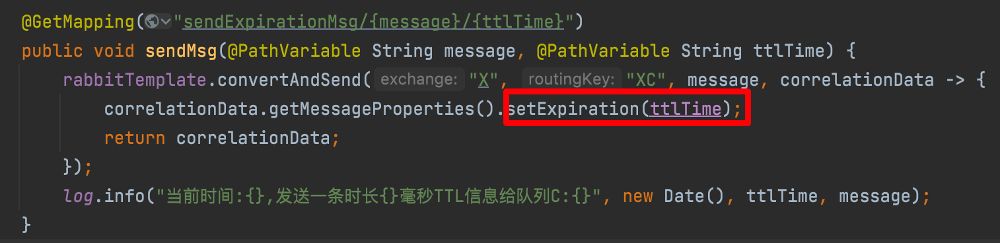

### 队列设置TTL

创建队列的时候设置队列的`“x-message-ttl”`属性

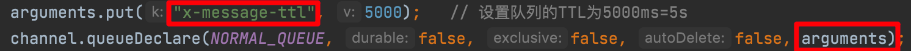

如果设置了队列的 TTL 属性，那么一旦消息过期，就会被队列丢弃(如果配置了死信队列被丢到死信队列中)。而如果仅设置消息的 TTL 属性，即使消息过期，也不一定会被马上丢弃，
因为消息是否过期是在即将投递到消费者之前判定的，如果当前队列有严重的消息积压情况，则已过期的消息也许还能存活较长时间；

还需要注意的一点是，如果不设置 TTL，表示消息永远不会过期，如果将 TTL 设置为 0，则表示除非此时可以直接投递该消息到消费者，否则该消息将会被丢弃。

前一小节我们介绍了死信队列，刚刚又介绍了 TTL，至此利用 RabbitMQ 实现延时队列的两大要素已经集齐，接下来只需要将它们进行融合，再加入一点点调味料，延时队列就可以新鲜出炉了。
想想看，延时队列，不就是想要消息延迟多久被处理吗，TTL 则刚好能让消息在延迟多久之后成为死信，另一方面，成为死信的消息都会被投递到死信队列里，这样只需要消费者一直消费死信队列里的消息就完事了，
因为里面的消息都是希望被立即处理的消息。

## SpringBoot整合RabbitMQ实现延迟队列

### 环境搭建

这里在根目录下新建一个`springboot`的`module`

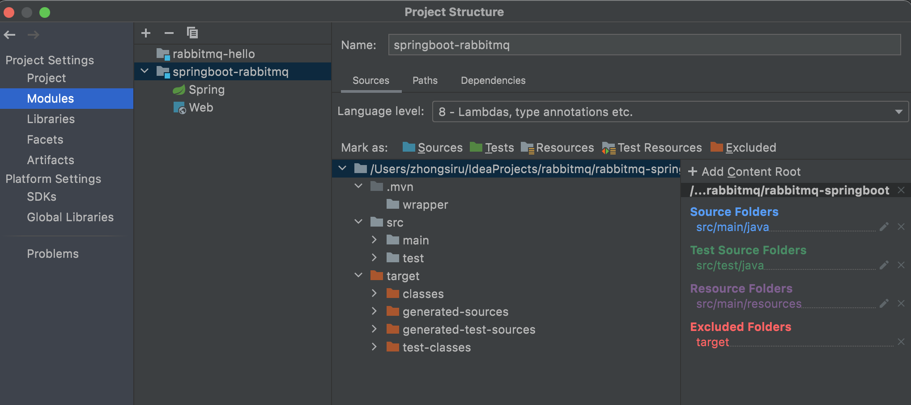

然后导入依赖：

```xml
<dependencies>
  <dependency>
    <groupId>org.springframework.boot</groupId>
    <artifactId>spring-boot-starter</artifactId>
  </dependency>
  <!--RabbitMQ 依赖-->
  <dependency>
    <groupId>org.springframework.boot</groupId>
    <artifactId>spring-boot-starter-amqp</artifactId>
  </dependency>
  <dependency>
    <groupId>org.springframework.boot</groupId>
    <artifactId>spring-boot-starter-web</artifactId>
  </dependency>
  <dependency>
    <groupId>org.springframework.boot</groupId>
    <artifactId>spring-boot-starter-test</artifactId>
    <scope>test</scope>
  </dependency>
  <dependency>
    <groupId>com.alibaba</groupId>
    <artifactId>fastjson</artifactId>
    <version>1.2.47</version>
  </dependency>
  <dependency>
    <groupId>org.projectlombok</groupId>
    <artifactId>lombok</artifactId>
  </dependency>
  <!--swagger-->
  <dependency>
    <groupId>io.springfox</groupId>
    <artifactId>springfox-swagger2</artifactId>
    <version>2.9.2</version>
  </dependency>
  <dependency>
    <groupId>io.springfox</groupId>
    <artifactId>springfox-swagger-ui</artifactId>
    <version>2.9.2</version>
  </dependency>
  <!--RabbitMQ 测试依赖-->
  <dependency>
    <groupId>org.springframework.amqp</groupId>
    <artifactId>spring-rabbit-test</artifactId>
    <scope>test</scope>
  </dependency>
</dependencies>
```

然后修改`src/main/resources/application.properties`，添加 RabbitMQ 的配置，注意其中的`host`、`username`、`password`更改为自己的配置信息：

```properties
spring.rabbitmq.host=82.156.9.173
spring.rabbitmq.port=5672
spring.rabbitmq.username=zb
spring.rabbitmq.password=123456
```

### 通过设置队列TTL+死信实现消息延迟

#### 编写初始化类

代码架构图如下所示，其中有两个`direct`类型的交换机X、Y，其中Y为死信交换机；还有三个队列`QA`、`QB`、`QD`，`QA`和`QB`为普通队列，其中`QA`中消息的ttl为10s，`QB`中消息的ttl为40s，
`QD`为死信队列。队列与交换机之间的`routing-key`如图中连线上标注所示：


我们接下来编写一个类用于初始化其中所有的交换机和队列，在`springboot`主启动类同级目录下新建`init`包，然后在其中新建`QueueTTLDelay.java`类

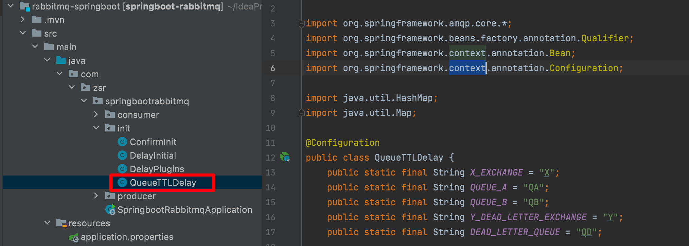

```java
package com.zsr.springbootrabbitmq.init;

import org.springframework.amqp.core.*;
import org.springframework.beans.factory.annotation.Qualifier;
import org.springframework.context.annotation.Bean;
import org.springframework.context.annotation.Configuration;

import java.util.HashMap;
import java.util.Map;

@Configuration
public class QueueTTLDelay {
    public static final String X_EXCHANGE = "X";
    public static final String QUEUE_A = "QA";
    public static final String QUEUE_B = "QB";
    public static final String Y_DEAD_LETTER_EXCHANGE = "Y";
    public static final String DEAD_LETTER_QUEUE = "QD";

    // 声明交换机X
    @Bean("xExchange")
    public DirectExchange xExchange() {
        return new DirectExchange(X_EXCHANGE);
    }

    // 声明死信交换机Y
    @Bean("yExchange")
    public DirectExchange yExchange() {
        return new DirectExchange(Y_DEAD_LETTER_EXCHANGE);
    }

    // 声明队列QA,设置队列的ttl为10s并绑定死信交换机
    @Bean("queueA")
    public Queue queueA() {
        Map<String, Object> arguments = new HashMap<>();
        // 声明当前队列绑定的死信交换机
        arguments.put("x-dead-letter-exchange", Y_DEAD_LETTER_EXCHANGE);
        // 声明当前队列的死信routing-key
        arguments.put("x-dead-letter-routing-key", "YD");
        // 声明队列的 TTL
        arguments.put("x-message-ttl", 10000);
        return QueueBuilder.durable(QUEUE_A).withArguments(arguments).build();
    }

    // 声明队列QB,设置队列的ttl为40s并绑定死信交换机
    @Bean("queueB")
    public Queue queueB() {
        Map<String, Object> arguments = new HashMap<>();
        // 声明当前队列绑定的死信交换机
        arguments.put("x-dead-letter-exchange", Y_DEAD_LETTER_EXCHANGE);
        // 声明当前队列的死信routing-key
        arguments.put("x-dead-letter-routing-key", "YD");
        // 声明队列的 TTL
        arguments.put("x-message-ttl", 40000);
        return QueueBuilder.durable(QUEUE_B).withArguments(arguments).build();
    }

    // 声明死信队列QD
    @Bean("queueD")
    public Queue queueD() {
        return new Queue(DEAD_LETTER_QUEUE);
    }

    // 死信队列QD绑定死信交换机Y
    @Bean
    public Binding deadLetterBindingQAD(@Qualifier("queueD") Queue queueD, @Qualifier("yExchange") DirectExchange yExchange) {
        return BindingBuilder.bind(queueD).to(yExchange).with("YD");
    }

    // 队列A绑定X交换机
    @Bean
    public Binding queueABindExchangeX(@Qualifier("queueA") Queue queueA, @Qualifier("xExchange") DirectExchange xExchange) {
        return BindingBuilder.bind(queueA).to(xExchange).with("XA");
    }

    // 队列B绑定X交换机
    @Bean
    public Binding queueBBindExchangeX(@Qualifier("queueB") Queue queueB, @Qualifier("xExchange") DirectExchange xExchange) {
        return BindingBuilder.bind(queueB).to(xExchange).with("XB");
    }
}
```

#### 编写消息生产者

在`springboot`主启动类同级目录下新建`producer`包，然后在其中新建`SendMessageController.java`类用于发送消息

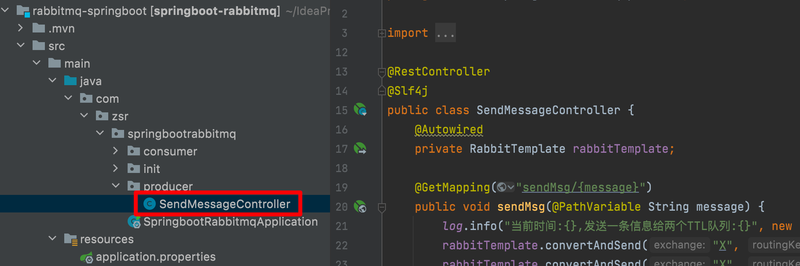

```java
package com.zsr.springbootrabbitmq.Producer;

import lombok.extern.slf4j.Slf4j;
import org.springframework.amqp.rabbit.core.RabbitTemplate;
import org.springframework.beans.factory.annotation.Autowired;
import org.springframework.web.bind.annotation.GetMapping;
import org.springframework.web.bind.annotation.PathVariable;
import org.springframework.web.bind.annotation.RestController;

import java.util.Date;

@RestController
@Slf4j
public class SendMessageController {
    @Autowired
    private RabbitTemplate rabbitTemplate;

    @GetMapping("sendMsg/{message}")
    public void sendMsg(@PathVariable String message) {
        log.info("当前时间:{},发送一条信息给两个TTL队列:{}", new Date(), message);
        rabbitTemplate.convertAndSend("X", "XA", "消息来自ttl=10s的队列" + message);
        rabbitTemplate.convertAndSend("X", "XB", "消息来自ttl=40s的队列" + message);
    }
}
```

#### 编写消息消费者

在`springboot`主启动类同级目录下新建`Consumer`包，然后在其中新建`MessageConsumer.java`类用于接收消息

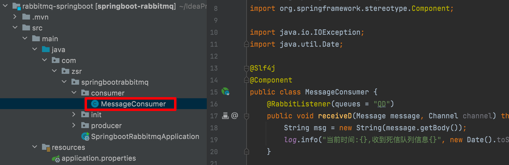

```java
package com.zsr.springbootrabbitmq.consumer;

import com.rabbitmq.client.Channel;
import lombok.extern.slf4j.Slf4j;
import org.springframework.amqp.core.Message;
import org.springframework.amqp.rabbit.annotation.RabbitListener;
import org.springframework.stereotype.Component;

import java.io.IOException;
import java.util.Date;

@Slf4j
@Component
public class MessageConsumer {
    @RabbitListener(queues = "QD")
    public void receiveD(Message message, Channel channel) throws IOException {
        String msg = new String(message.getBody());
        log.info("当前时间:{},收到死信队列信息{}", new Date().toString(), msg);
    }
}
```

#### 运行测试

启动`springboot`主启动类，然后访问 `http://localhost:8080/sendMsg/hello` 发送hello消息，观察控制台日志信息，可以看到10s和40s后消费者从死信队列中消费到了hello消息，
也就达到了延时队列的效果。

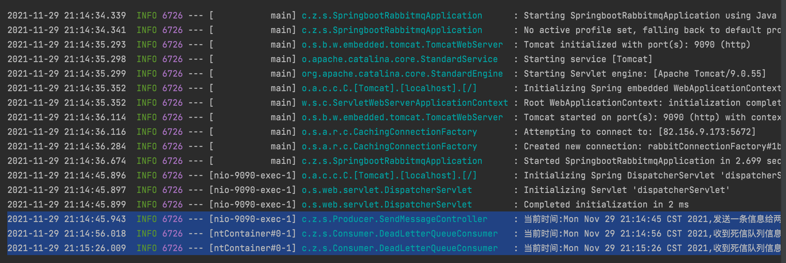

```shell
2021-11-29 21:14:45.943  INFO 6726 --- [nio-9090-exec-1] c.z.s.Producer.SendMessageController     : 当前时间:Mon Nov 29 21:14:45 CST 2021,发送一条信息给两个TTL队列:hello
2021-11-29 21:14:56.018  INFO 6726 --- [ntContainer#0-1] c.z.s.Consumer.DeadLetterQueueConsumer   : 当前时间:Mon Nov 29 21:14:56 CST 2021,收到死信队列信息消息来自ttl=10s的队列hello
2021-11-29 21:15:26.009  INFO 6726 --- [ntContainer#0-1] c.z.s.Consumer.DeadLetterQueueConsumer   : 当前时间:Mon Nov 29 21:15:26 CST 2021,收到死信队列信息消息来自ttl=40s的队列hello
```

### 通过设置消息TTL+死信实现消息延迟

以上延时队列的实现目前只有 10S 和 40S 两个时间选项，如果需要一个小时后处理，那么就需要增加TTL为一个小时的队列，如果是预定会议室然后提前通知这样的场景，岂不是要增加无数个队列才能满足需求？

因此我们需要做出一些优化，在这里新增了一个队列 QC，绑定关系如下，该队列不设置 TTL 时间，我们通过指定消息的 TTL 来实现消息的延迟

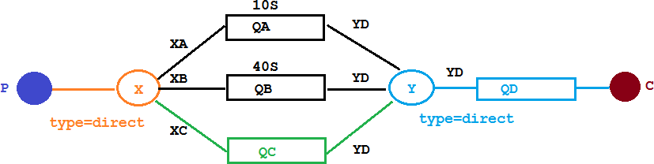

首先在`init`包下新建一个`MessageTTLDelay.java`用来初始化QC队列，与死信交换机Y进行绑定：

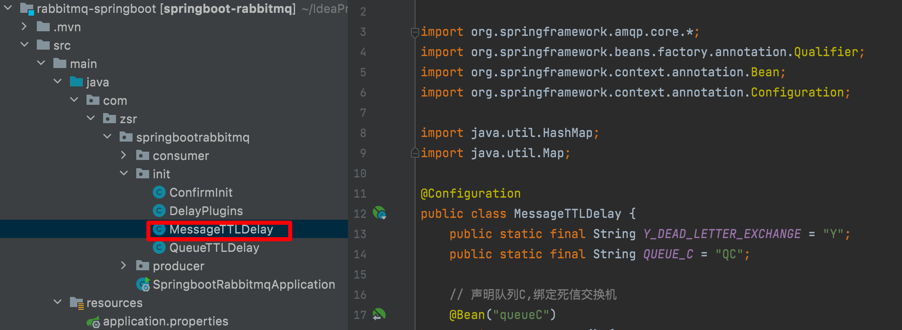

```java
package com.zsr.springbootrabbitmq.init;

import org.springframework.amqp.core.*;
import org.springframework.beans.factory.annotation.Qualifier;
import org.springframework.context.annotation.Bean;
import org.springframework.context.annotation.Configuration;

import java.util.HashMap;
import java.util.Map;

@Configuration
public class MessageTTLDelay {
    public static final String Y_DEAD_LETTER_EXCHANGE = "Y";
    public static final String QUEUE_C = "QC";

    // 声明队列C,绑定死信交换机
    @Bean("queueC")
    public Queue queueB() {
        Map<String, Object> args = new HashMap<>(3);
        // 声明当前队列绑定的死信交换机
        args.put("x-dead-letter-exchange", Y_DEAD_LETTER_EXCHANGE);
        // 声明当前队列的死信路由 key
        args.put("x-dead-letter-routing-key", "YD");
        // 没有声明TTL属性
        return QueueBuilder.durable(QUEUE_C).withArguments(args).build();
    }

    // 绑定队列B和X交换机
    @Bean
    public Binding queueCBindingX(@Qualifier("queueC") Queue queueC, @Qualifier("xExchange") DirectExchange xExchange) {
        return BindingBuilder.bind(queueC).to(xExchange).with("XC");
    }
}
```

然后在`SendMessageController.java`中新增一个方法用于发送指定延时时间的消息

```java
@GetMapping("sendExpirationMsg/{message}/{ttlTime}")
public void sendMsg(@PathVariable String message, @PathVariable String ttlTime) {
    rabbitTemplate.convertAndSend("X", "XC", message, correlationData -> {
        correlationData.getMessageProperties().setExpiration(ttlTime);
        return correlationData;
    });
    log.info("当前时间:{},发送一条时长{}毫秒TTL信息给队列C:{}", new Date(), ttlTime, message);
}
```

然后我们启动`springboot`主启动类进行测试，分别访问以下两个url:

* http://localhost:9090/sendExpirationMsg/你好1/10000（延迟10s）
* http://localhost:9090/sendExpirationMsg/你好2/20000（延迟20s）

观察控制台日志输出，可以看到10s和20s后在死信队列中分别收到消息1和消息2

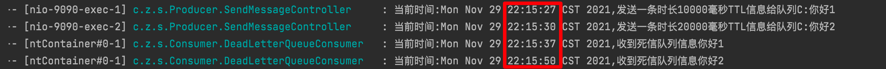

看起来似乎没什么问题，但是在最开始的时候，就介绍过如果使用在消息属性上设置 TTL 的方式，消息可能并不会按时“死亡“，因为 RabbitMQ 只会检查第一个消息是否过期，如果过期则丢到死信队列，
**如果第一个消息的延时时长很长，而第二个消息的延时时长很短，第二个消息并不会优先得到执行。**

我们来进行演示，如果我们请求以下两个url：

* http://localhost:9090/sendExpirationMsg/你好3/10000（延迟10s）
* http://localhost:9090/sendExpirationMsg/你好4/2000（延迟2s）

再查看结果，可以发现出现了问题，你好4明明只需要2s，但却等了20s，因为延迟队列是排队的，先来后到，只有先前的处理完，才会处理下一条消息


### 通过RabbitmQ插件实现延迟队列

上文中提到的问题，确实是一个问题，如果不能实现在消息粒度上的 TTL，并使其在设置的TTL 时间及时死亡，就无法设计成一个通用的延时队列。那如何解决呢，
我们可以通过 Rabbitmq 自带的延时队列插件解决这个问题。

#### 下载延迟队列插件

下载 `rabbitmq_delayed_message_exchange` 插件，然后解压放置到 RabbitMQ 的插件目录。

* 下载地址：https://www.rabbitmq.com/community-plugins.html


* 点击 `Releases` 然后选择想要下载的版本进行下载

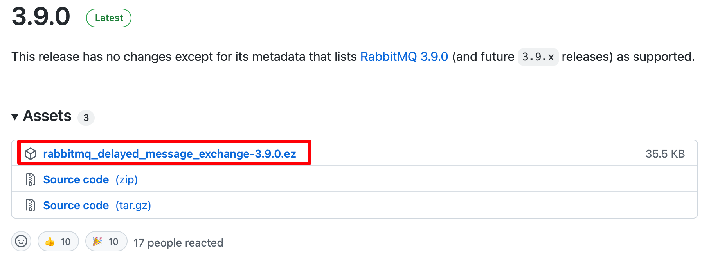

* 下载完成后上传到服务器中

```shell
scp rabbitmq_delayed_message_exchange-3.9.0.ez root@82.156.9.173:/
```

然后我们进入到服务器终端，将刚上传的文件移动到 RabbitMQ 的安装目录下的 `plgins` 目录下，再执行下面命令让该插件生效，最后重启 RabbitMQ

```shell
# 1.将插件移动到RabbitMQ的插件plugins目录
cp rabbitmq_delayed_message_exchange-3.9.0.ez /usr/lib/rabbitmq/lib/rabbitmq_server-3.8.14/plugins/

# 2.使rabbitmq_delayed_message_exchange插件生效
rabbitmq-plugins enable rabbitmq_delayed_message_exchange

# 3.重启rabbitMQ
systemctl restart rabbitmq-server
```

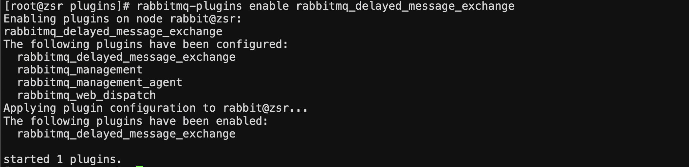

安装完成后，可以在web界面看到新建交换机时多了一种延迟交换机`x-delayed-message`：

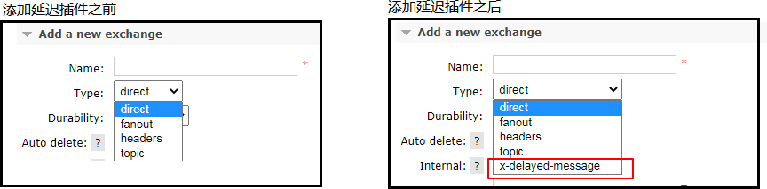

#### 编写初始化类

代码架构图如下所示，只需要一个延迟交换机路由到一个队列即可，也就是在交换机这里进行延迟，接下来我们编写一个类初始化其中的队列与交换机

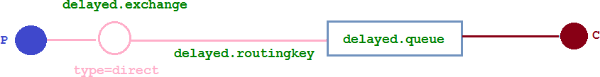

在`init`包下新建`PluginsDelay.java`

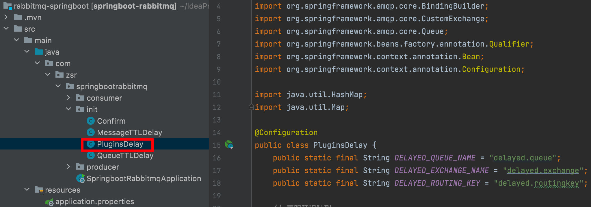

```java
package com.zsr.springbootrabbitmq.init;

import org.springframework.amqp.core.Binding;
import org.springframework.amqp.core.BindingBuilder;
import org.springframework.amqp.core.CustomExchange;
import org.springframework.amqp.core.Queue;
import org.springframework.beans.factory.annotation.Qualifier;
import org.springframework.context.annotation.Bean;
import org.springframework.context.annotation.Configuration;

import java.util.HashMap;
import java.util.Map;

@Configuration
public class PluginsDelay {
    public static final String DELAYED_QUEUE_NAME = "delayed.queue";
    public static final String DELAYED_EXCHANGE_NAME = "delayed.exchange";
    public static final String DELAYED_ROUTING_KEY = "delayed.routingkey";

    // 声明延迟队列
    @Bean
    public Queue delayedQueue() {
        return new Queue(DELAYED_QUEUE_NAME);
    }

    // 自定义交换机（这里定义的是一个延迟交换机）
    @Bean
    public CustomExchange delayedExchange() {
        Map<String, Object> args = new HashMap<>();
        args.put("x-delayed-type", "direct");   // 自定义交换机的类型
        return new CustomExchange(DELAYED_EXCHANGE_NAME, "x-delayed-message", true, false, args);
    }

    // 绑定延迟队列与延迟交换机
    @Bean
    public Binding bindingDelayedQueue(@Qualifier("delayedQueue") Queue queue,
                                       @Qualifier("delayedExchange") CustomExchange delayedExchange) {
        return BindingBuilder.bind(queue).to(delayedExchange).with(DELAYED_ROUTING_KEY).noargs();
    }
}
```

在我们自定义的交换机中，这是一种新的交换类型，该类型消息支持延迟投递机制 消息传递后并不会立即投递到目标队列中，而是存储在 `mnesia`(一个分布式数据系统)表中，当达到投递时间时，
才投递到目标队列中。

#### 编写消息生产者

在 `SendMessageController.java` 中新增以下代码

```java
@GetMapping("sendDelayMsg/{message}/{delayTime}")
public void sendMsg(@PathVariable String message, @PathVariable Integer delayTime) {
  rabbitTemplate.convertAndSend(PluginsDelay.DELAYED_EXCHANGE_NAME, PluginsDelay.DELAYED_ROUTING_KEY, message, correlationData -> {
    correlationData.getMessageProperties().setDelay(delayTime);
    return correlationData;
  });
  log.info("当前时间:{},发送一条延迟{}毫秒的信息给队列delayed.queue:{}", new Date(), delayTime, message);
}
```

#### 编写消息消费者

在 `MessageConsumer.java` 中添加以下代码：

```java
@RabbitListener(queues = PluginsDelay.DELAYED_QUEUE_NAME)
public void receiveDelayedQueue(Message message) {
  String msg = new String(message.getBody());
  log.info("当前时间：{},收到延时队列的消息：{}", new Date().toString(), msg);
}
```

#### 运行测试

启动`springboot`主启动类，先后发起以下两个请求：

* http://localhost:8080/sendDelayMsg/delay1/20000（延迟20s）
* http://localhost:8080/sendDelayMsg/delay2/2000（延迟2s）

根据结果可以看到，第二条消息先被消费掉了，并不是和先前一样，排队首先等消息1处理完毕再处理消息2

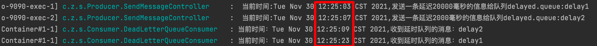

不同于我们通过死信实现消息延迟的情况：

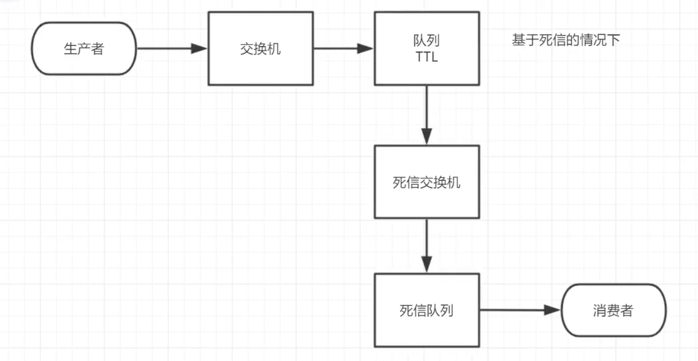

该插件等作用等价于在交换机处延迟，实现方式更为简单，只需要一个交换机，一个队列即可。

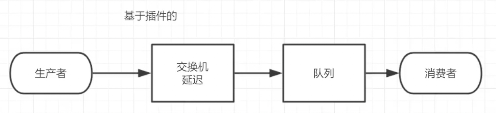

### 总结

RabbitMQ 实现延迟队列有两种方式，一种是通过死信来实现，其中又细分为设置队列的TTL和消息的TTL两种，原理就是消息在指定的时间过期后会通过死信交换机进入到死信队列，最后被消费者消费，
不过基于消息到TTL来实现会存在消息积压而导致没有在后面发送到消息没有在指定延迟时间被消费的情况，因为该情况本质上是遵循先来先到的原则，先发送的消息延迟时间到了后才继续处理后面的消息；
另一种是通过 RabbitMQ 的插件来实现，该插件的原理就是是消息在交换机处延迟，也就是生产者发送消息到延迟交换机等待指定时候才路由到队列中由消费者消费，该方式简单而且能避免上述问题，
只需要一个延迟交换机即可实现，不需要死信交换机和死信队列。

延时队列在需要延时处理的场景下非常有用，使用 RabbitMQ 来实现延时队列可以很好的利用 RabbitMQ 的特性，如：消息可靠发送、消息可靠投递、死信队列来保障消息至少被消费一次以及未被正确处理的消息不会被丢弃。
另外，通过 RabbitMQ 集群的特性，可以很好的解决单点故障问题，不会因为单个节点挂掉导致延时队列不可用或者消息丢失。当然，延时队列还有很多其它选择，
比如利用 `Java` 的 `DelayQueue`，利用 `Redis` 的 `zset`，利用 `Quartz` 或者利用 `kafka` 的时间轮，这些方式各有特点，看需要适用的场景