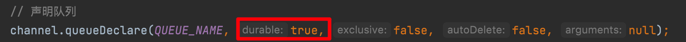
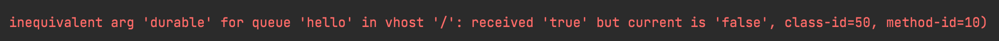
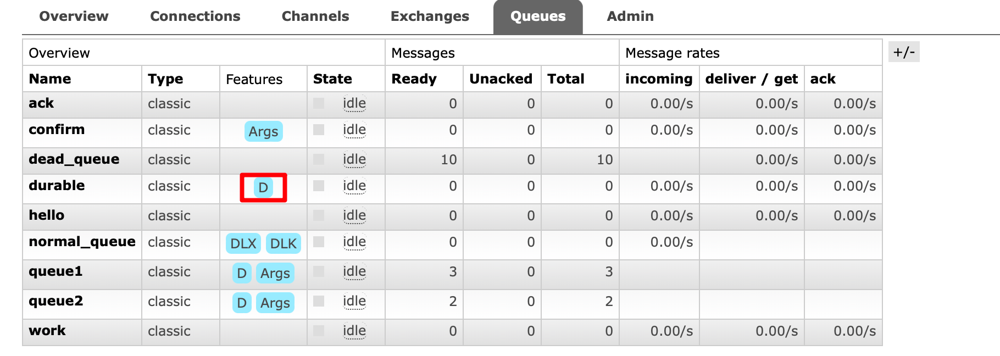

前面我们通过手动应答处理了消息丢失的情况，但是如何保障当 RabbitMQ 服务停掉以后消息生产者发送过来的消息不丢失。默认情况下 RabbitMQ 退出或由于某种原因崩溃时，它会清空队列和消息，
除非告知它不要这样做。确保消息不会丢失需要做两件事：我们需要将队列和消息都标记为持久化。

## 队列持久化

之前我们创建的队列都是非持久化的，`RabbitMQ` 如果重启，该队列就会被删除掉，如果要队列实现持久化就需要在声明队列的时候把 `durable` 参数设置为 `true`

需要注意的是如果之前声明的队列不是持久化的，需要把原先队列先删除，或者重新创建一个持久化的队列，不然就会错误：

以下为控制台中持久化与非持久化队列的 UI 显示区：

## 消息持久化

要想让消息实现持久化需要在消息生产者修改代码，添加 `MessageProperties.PERSISTENT_TEXT_PLAIN` 属性。

将消息标记为持久化并不能完全保证不会丢失消息。尽管它告诉 `RabbitMQ` 将消息保存到磁盘，但是这里依然存在当消息刚准备存储在磁盘的时候,但是还没有存储完，消息还在缓存的一个间隔点。
此时并没有真正写入磁盘。持久性保证并不强，但是对于我们的简单任务队列而言，这已经绰绰有余了。如果需要更强有力的持久化策略，参考后边课件发布确认章节