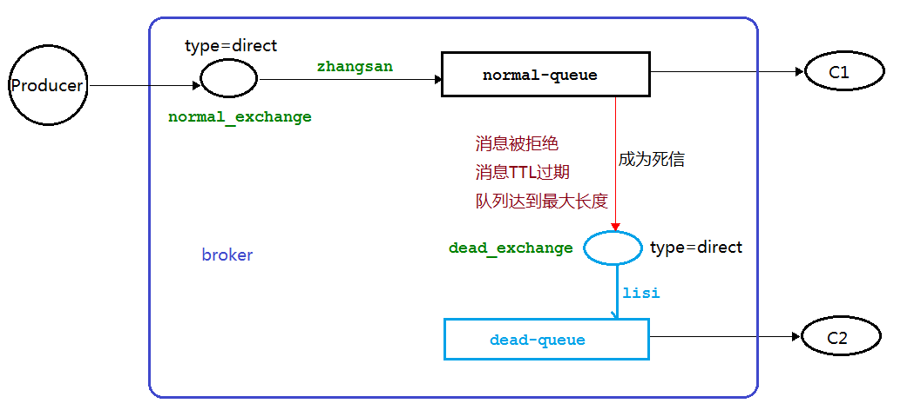
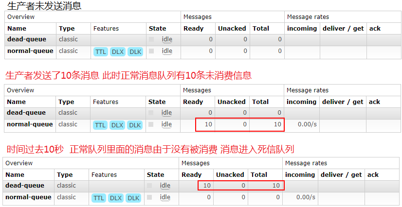
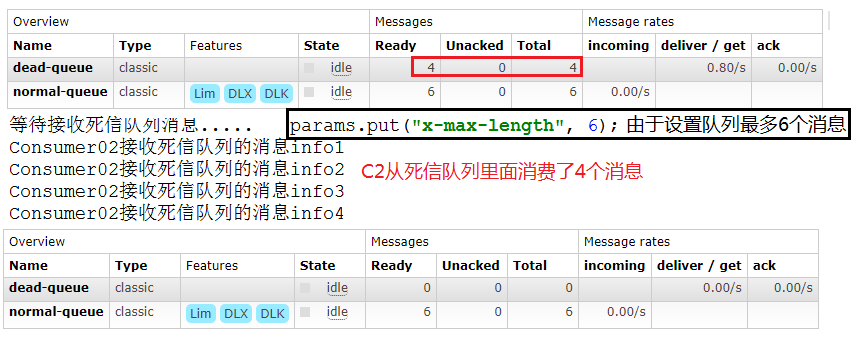
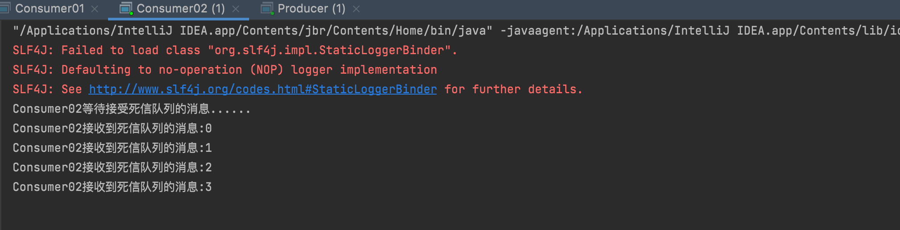
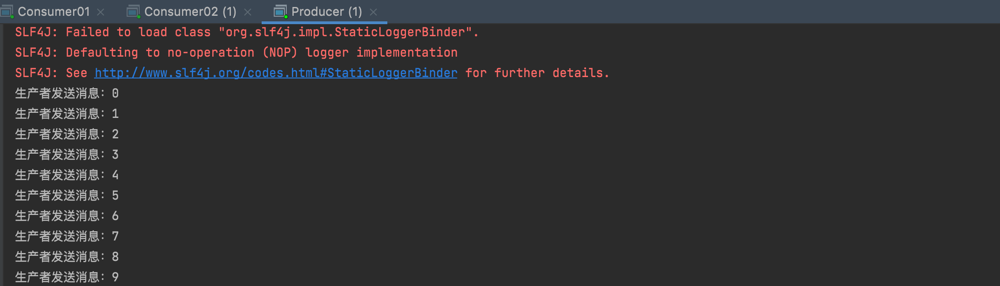
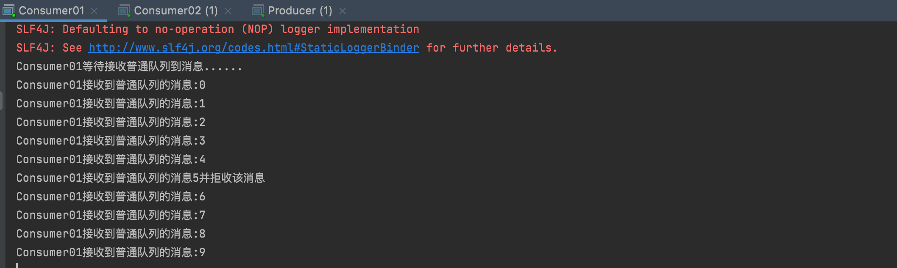
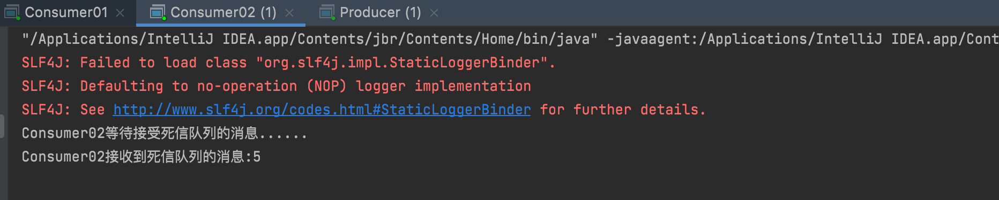

## 死信队列的概念

死信就是无法被消费的消息。一般来说，`producer` 将消息投递到 `broker` 或者直接到 `queue` 中，`consumer` 从 `queue` 取出消息进行消费，
但某些时候由于特定的原因导致 `queue` 中的某些消息无法被消费，这样的消息如果没有后续的处理，就变成了死信，有死信自然就有了死信队列。

### 应用场景

* 为了保证订单业务的消息数据不丢失，需要使用到 RabbitMQ 的死信队列机制，当消息消费发生异常时，将消息投入死信队列中。
* 还有比如说: 用户在商城下单成功并点击去支付后在指定时间未支付时自动失效

### 死信的原因

* 消息 TTL 过期
* 队列达到最大长度（队列满了无法再添加数据到 mq 中）
* 消息被拒绝(`basic.reject` 或 `basic.nack`)并且 `requeue=false`

我们接下来会通过代码模仿三种导致死信的效果：**消息被拒绝**、**消息TTL过期**、**队列达到最大长度**。架构图如下所示：



## 消息TTL 过期

### 生产者Producer

```java
package mode2_WorkQueues.dead;

import com.rabbitmq.client.AMQP;
import com.rabbitmq.client.BuiltinExchangeType;
import com.rabbitmq.client.Channel;

public class Producer {
    private static final String NORMAL_EXCHANGE = "normal_exchange";    // 普通交换机名称

    public static void main(String[] args) throws Exception {
        // 创建channel
        Channel channel = utils.RabbitMqUtils.getChannel();
        // 声明普通交换机
        channel.exchangeDeclare(NORMAL_EXCHANGE, BuiltinExchangeType.DIRECT);
        // 设置消息到TTL时间为10s=10000ms
        AMQP.BasicProperties properties = new AMQP.BasicProperties().builder().expiration("10000").build();
        // 发送10条消息
        for (int i = 0; i < 10; i++) {
            String message = i + "";
            channel.basicPublish(NORMAL_EXCHANGE, "zhangsan", properties, message.getBytes());
            System.out.println("生产者发送消息：" + message);
        }
    }
}
```

### 消费者Consumer01

```java
package mode2_WorkQueues.dead;

import com.rabbitmq.client.BuiltinExchangeType;
import com.rabbitmq.client.CancelCallback;
import com.rabbitmq.client.Channel;
import com.rabbitmq.client.DeliverCallback;
import utils.RabbitMqUtils;

import java.util.HashMap;
import java.util.Map;

public class Consumer01 {
    private static final String NORMAL_EXCHANGE = "normal_exchange";    // 普通交换机名称
    private static final String DEAD_EXCHANGE = "dead_exchange";    // 死信交换机名称
    private static final String NORMAL_QUEUE = "normal_queue";  // 普通队列名称
    private static final String DEAD_QUEUE = "dead_queue";  // 死信队列名称

    public static void main(String[] args) throws Exception {
        // 创建channel
        Channel channel = RabbitMqUtils.getChannel();
        // 声明普通和死信交换机(类型都为DIRECT)
        channel.exchangeDeclare(NORMAL_EXCHANGE, BuiltinExchangeType.DIRECT);
        channel.exchangeDeclare(DEAD_EXCHANGE, BuiltinExchangeType.DIRECT);
        // 声明普通和死信队列(普通队列需要传递参数设置死信交换机及其对应的路由key)
        Map<String, Object> arguments = new HashMap<>();
        arguments.put("x-dead-letter-exchange", DEAD_EXCHANGE); // 设置死信交互机
        arguments.put("x-dead-letter-routing-key", "lisi"); // 设置与死信交换机间的routing-key
        channel.queueDeclare(NORMAL_QUEUE, false, false, false, arguments);
        channel.queueDeclare(DEAD_QUEUE, false, false, false, null);
        // 绑定队列与交换机,设置其间的路由key
        channel.queueBind(NORMAL_QUEUE, NORMAL_EXCHANGE, "zhangsan");
        channel.queueBind(DEAD_QUEUE, DEAD_EXCHANGE, "lisi");
        // 消费消息
        System.out.println("Consumer01等待接收普通队列到消息......");
        DeliverCallback deliverCallback = (consumerTag, message) -> {
            System.out.println("Consumer01接收到普通队列的消息:" + new String(message.getBody()));
        };
        CancelCallback cancelCallback = (consumerTag) -> {
            System.out.println("消息消费被中断");
        };
        channel.basicConsume(NORMAL_QUEUE, deliverCallback, cancelCallback);
    }
}
```

### 消费者Consumer02

```java
package mode2_WorkQueues.dead;

import com.rabbitmq.client.BuiltinExchangeType;
import com.rabbitmq.client.CancelCallback;
import com.rabbitmq.client.Channel;
import com.rabbitmq.client.DeliverCallback;
import utils.RabbitMqUtils;

public class Consumer02 {
    private static final String DEAD_EXCHANGE = "dead_exchange";    // 死信交换机名称
    private static final String DEAD_QUEUE = "dead_queue";  // 死信队列名称

    public static void main(String[] args) throws Exception {
        // 创建channel
        Channel channel = RabbitMqUtils.getChannel();
        // 声明死信交换机(类型都为DIRECT)
        channel.exchangeDeclare(DEAD_EXCHANGE, BuiltinExchangeType.DIRECT);
        // 声明死信队列
        channel.queueDeclare(DEAD_QUEUE, false, false, false, null);
        // 绑定队列与交换机,设置其间的路由key
        channel.queueBind(DEAD_QUEUE, DEAD_EXCHANGE, "lisi");
        // 消费消息
        System.out.println("Consumer02等待接受死信队列的消息......");
        DeliverCallback deliverCallback = (consumerTag, message) -> {
            System.out.println("Consumer02接收到死信队列的消息:" + new String(message.getBody()));
        };
        CancelCallback cancelCallback = (consumerTag) -> {
            System.out.println("消息消费被中断");
        };
        channel.basicConsume(DEAD_QUEUE, deliverCallback, cancelCallback);
    }
}
```

### 测试

我们接下来进行测试，首先启动 `Consumer01` 创建交换机和队列，然后关闭它，模拟其接受不到消息。然后启动消费者发送10条消息，可以看到发送到10条消息首先在 `normal-queue` 队列中，
10s后消息过期，消息进去到 `dead-queue` 死信队列中。



最后我们启动 `Consumer02`，从死信队列中消费消息：


## 队列达到最大长度

### 生产者Producer

首先修改 `Producer` 代码，去掉消息的TTL过期属性：

```java
package mode2_WorkQueues.dead;

import com.rabbitmq.client.BuiltinExchangeType;
import com.rabbitmq.client.Channel;

public class Producer {
    private static final String NORMAL_EXCHANGE = "normal_exchange";    // 普通交换机名称

    public static void main(String[] args) throws Exception {
        // 创建channel
        Channel channel = utils.RabbitMqUtils.getChannel();
        // 声明普通交换机
        channel.exchangeDeclare(NORMAL_EXCHANGE, BuiltinExchangeType.DIRECT);
        // 发送10条消息
        for (int i = 0; i < 10; i++) {
            String message = i + "";
            channel.basicPublish(NORMAL_EXCHANGE, "zhangsan", properties, message.getBytes());
            System.out.println("生产者发送消息：" + message);
        }
    }
}
```
### 消费者Consumer01

然后修改 `Consumer01`，添加设置正常队列的长度限制为6：

**注意此时需要把原先的 dead-queue 和 normal-queue 队列删除，因为参数改变了**

```java
package mode2_WorkQueues.dead;

import com.rabbitmq.client.BuiltinExchangeType;
import com.rabbitmq.client.CancelCallback;
import com.rabbitmq.client.Channel;
import com.rabbitmq.client.DeliverCallback;
import utils.RabbitMqUtils;

import java.util.HashMap;
import java.util.Map;

public class Consumer01 {
    private static final String NORMAL_EXCHANGE = "normal_exchange";    // 普通交换机名称
    private static final String DEAD_EXCHANGE = "dead_exchange";    // 死信交换机名称
    private static final String NORMAL_QUEUE = "normal_queue";  // 普通队列名称
    private static final String DEAD_QUEUE = "dead_queue";  // 死信队列名称

    public static void main(String[] args) throws Exception {
        // 创建channel
        Channel channel = RabbitMqUtils.getChannel();
        // 声明普通和死信交换机(类型都为DIRECT)
        channel.exchangeDeclare(NORMAL_EXCHANGE, BuiltinExchangeType.DIRECT);
        channel.exchangeDeclare(DEAD_EXCHANGE, BuiltinExchangeType.DIRECT);
        // 声明普通和死信队列(普通队列需要传递参数设置死信交换机及其对应的路由key)
        Map<String, Object> arguments = new HashMap<>();
        arguments.put("x-dead-letter-exchange", DEAD_EXCHANGE); // 设置死信交互机
        arguments.put("x-dead-letter-routing-key", "lisi"); // 设置与死信交换机间的routing-key
        arguments.put("x-max-length", 6);   // 设置正常队列长度为6
        channel.queueDeclare(NORMAL_QUEUE, false, false, false, arguments);
        channel.queueDeclare(DEAD_QUEUE, false, false, false, null);
        // 绑定队列与交换机,设置其间的路由key
        channel.queueBind(NORMAL_QUEUE, NORMAL_EXCHANGE, "zhangsan");
        channel.queueBind(DEAD_QUEUE, DEAD_EXCHANGE, "lisi");
        // 消费消息
        System.out.println("Consumer01等待接收普通队列到消息......");
        DeliverCallback deliverCallback = (consumerTag, message) -> {
            System.out.println("Consumer01接收到普通队列的消息:" + new String(message.getBody()));
        };
        CancelCallback cancelCallback = (consumerTag) -> {
            System.out.println("消息消费被中断");
        };
        channel.basicConsume(NORMAL_QUEUE, deliverCallback, cancelCallback);
    }
}
```

### 消费者Consumer02

Consumer02 代码不变：

```java
package mode2_WorkQueues.dead;

import com.rabbitmq.client.BuiltinExchangeType;
import com.rabbitmq.client.CancelCallback;
import com.rabbitmq.client.Channel;
import com.rabbitmq.client.DeliverCallback;
import utils.RabbitMqUtils;

public class Consumer02 {
    private static final String DEAD_EXCHANGE = "dead_exchange";    // 死信交换机名称
    private static final String DEAD_QUEUE = "dead_queue";  // 死信队列名称

    public static void main(String[] args) throws Exception {
        // 创建channel
        Channel channel = RabbitMqUtils.getChannel();
        // 声明死信交换机(类型都为DIRECT)
        channel.exchangeDeclare(DEAD_EXCHANGE, BuiltinExchangeType.DIRECT);
        // 声明死信队列
        channel.queueDeclare(DEAD_QUEUE, false, false, false, null);
        // 绑定队列与交换机,设置其间的路由key
        channel.queueBind(DEAD_QUEUE, DEAD_EXCHANGE, "lisi");
        // 消费消息
        System.out.println("Consumer02等待接受死信队列的消息......");
        DeliverCallback deliverCallback = (consumerTag, message) -> {
            System.out.println("Consumer02接收到死信队列的消息:" + new String(message.getBody()));
        };
        CancelCallback cancelCallback = (consumerTag) -> {
            System.out.println("消息消费被中断");
        };
        channel.basicConsume(DEAD_QUEUE, deliverCallback, cancelCallback);
    }
}
```

### 测试

我们接下来进行测试，首先启动 `Consumer01` 创建更改后的队列，然后关闭它，模拟其接受不到消息。然后启动消费者发送10条消息，可以看到发送到6条消息首先在 `normal-queue` 队列中，4条消息在 `dead-queue` 死信队列中。



然后启动 `Consumer02` 可以消费到4条消息：



## 消息被拒

### 生产者Producer

Producer 代码不变：

```java
package mode2_WorkQueues.dead;

import com.rabbitmq.client.BuiltinExchangeType;
import com.rabbitmq.client.Channel;

public class Producer {
    private static final String NORMAL_EXCHANGE = "normal_exchange";    // 普通交换机名称

    public static void main(String[] args) throws Exception {
        // 创建channel
        Channel channel = utils.RabbitMqUtils.getChannel();
        // 声明普通交换机
        channel.exchangeDeclare(NORMAL_EXCHANGE, BuiltinExchangeType.DIRECT);
        // 发送10条消息
        for (int i = 0; i < 10; i++) {
            String message = i + "";
            channel.basicPublish(NORMAL_EXCHANGE, "zhangsan", null, message.getBytes());
            System.out.println("生产者发送消息：" + message);
        }
    }
}
```

### 消费者Consumer01

`Consumer01` 取出普通队列长度的限制，开启自动应答机制，并在发送消息的回调方法中拒收内容为`"5"`的消息，其他消息正常接收：

**注意此时需要把原先的 dead-queue 和 normal-queue 队列删除，因为参数改变**

```java
package mode2_WorkQueues.dead;

import com.rabbitmq.client.BuiltinExchangeType;
import com.rabbitmq.client.CancelCallback;
import com.rabbitmq.client.Channel;
import com.rabbitmq.client.DeliverCallback;
import utils.RabbitMqUtils;

import java.util.HashMap;
import java.util.Map;

public class Consumer01 {
    private static final String NORMAL_EXCHANGE = "normal_exchange";    // 普通交换机名称
    private static final String DEAD_EXCHANGE = "dead_exchange";    // 死信交换机名称
    private static final String NORMAL_QUEUE = "normal_queue";  // 普通队列名称
    private static final String DEAD_QUEUE = "dead_queue";  // 死信队列名称

    public static void main(String[] args) throws Exception {
        // 创建channel
        Channel channel = RabbitMqUtils.getChannel();
        // 声明普通和死信交换机(类型都为DIRECT)
        channel.exchangeDeclare(NORMAL_EXCHANGE, BuiltinExchangeType.DIRECT);
        channel.exchangeDeclare(DEAD_EXCHANGE, BuiltinExchangeType.DIRECT);
        // 声明普通和死信队列(普通队列需要传递参数设置死信交换机及其对应的路由key)
        Map<String, Object> arguments = new HashMap<>();
        arguments.put("x-dead-letter-exchange", DEAD_EXCHANGE); // 设置死信交互机
        arguments.put("x-dead-letter-routing-key", "lisi"); // 设置与死信交换机间的routing-key
        channel.queueDeclare(NORMAL_QUEUE, false, false, false, arguments);
        channel.queueDeclare(DEAD_QUEUE, false, false, false, null);
        // 绑定队列与交换机,设置其间的路由key
        channel.queueBind(NORMAL_QUEUE, NORMAL_EXCHANGE, "zhangsan");
        channel.queueBind(DEAD_QUEUE, DEAD_EXCHANGE, "lisi");
        // 消费消息
        System.out.println("Consumer01等待接收普通队列到消息......");
        DeliverCallback deliverCallback = (consumerTag, message) -> {
            String mes = new String(message.getBody(), "UTF-8");
            if (mes.equals("5")) {
                System.out.println("Consumer01接收到普通队列的消息" + mes + "并拒收该消息");
                // 第二个参数requeue设置为false,代表拒绝重新入队,也就是该队列如果配置了死信交换机将发送到死信队列中
                channel.basicReject(message.getEnvelope().getDeliveryTag(), false);
            } else {
                System.out.println("Consumer01接收到普通队列的消息:" + new String(message.getBody()));
                channel.basicAck(message.getEnvelope().getDeliveryTag(), false);
            }
        };
        CancelCallback cancelCallback = (consumerTag) -> {
            System.out.println("消息消费被中断");
        };
        // 开启手动应答
        boolean autoAck = false;
        channel.basicConsume(NORMAL_QUEUE, autoAck, deliverCallback, cancelCallback);
    }
}
```

### 消费者Consumer02

Consumer02 代码不变：

```java
package mode2_WorkQueues.dead;

import com.rabbitmq.client.BuiltinExchangeType;
import com.rabbitmq.client.CancelCallback;
import com.rabbitmq.client.Channel;
import com.rabbitmq.client.DeliverCallback;
import utils.RabbitMqUtils;

public class Consumer02 {
    private static final String DEAD_EXCHANGE = "dead_exchange";    // 死信交换机名称
    private static final String DEAD_QUEUE = "dead_queue";  // 死信队列名称

    public static void main(String[] args) throws Exception {
        // 创建channel
        Channel channel = RabbitMqUtils.getChannel();
        // 声明死信交换机(类型都为DIRECT)
        channel.exchangeDeclare(DEAD_EXCHANGE, BuiltinExchangeType.DIRECT);
        // 声明死信队列
        channel.queueDeclare(DEAD_QUEUE, false, false, false, null);
        // 绑定队列与交换机,设置其间的路由key
        channel.queueBind(DEAD_QUEUE, DEAD_EXCHANGE, "lisi");
        // 消费消息
        System.out.println("Consumer02等待接受死信队列的消息......");
        DeliverCallback deliverCallback = (consumerTag, message) -> {
            System.out.println("Consumer02接收到死信队列的消息:" + new String(message.getBody()));
        };
        CancelCallback cancelCallback = (consumerTag) -> {
            System.out.println("消息消费被中断");
        };
        channel.basicConsume(DEAD_QUEUE, deliverCallback, cancelCallback);
    }
}
```

### 测试

我们接下来进行测试，首先启动 `Consumer01`，然后启动 `Consumer02`，最后启动 `Producer`。







根据结果可以看到，`Consumer01` 拒绝了消息5，消息5进入死信队列被 `Consumer02` 消费。