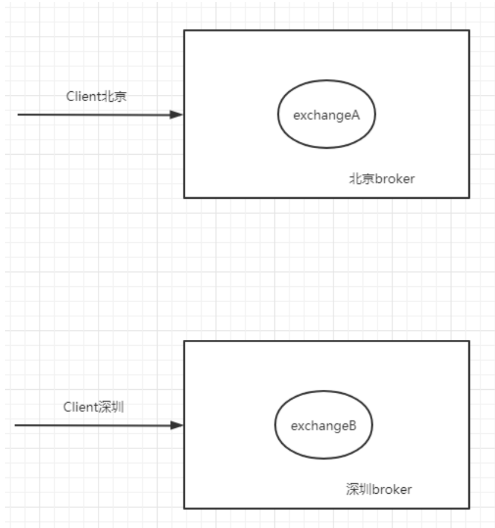
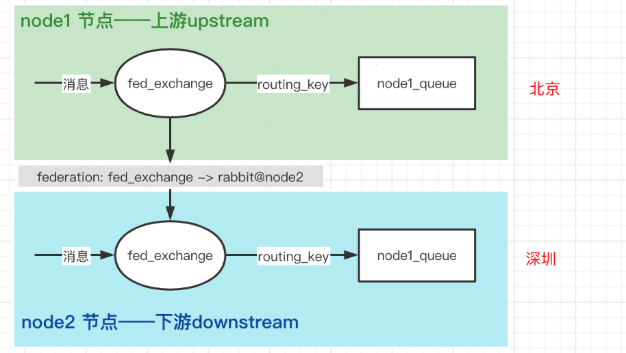
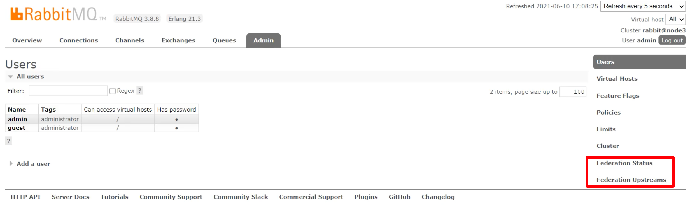
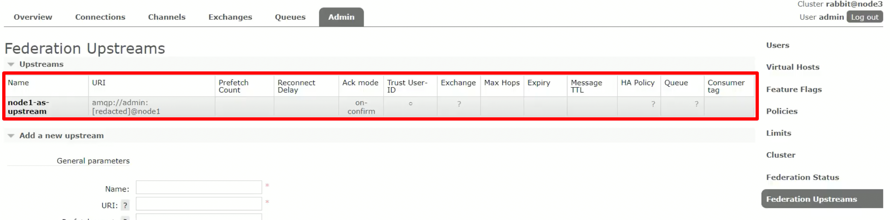
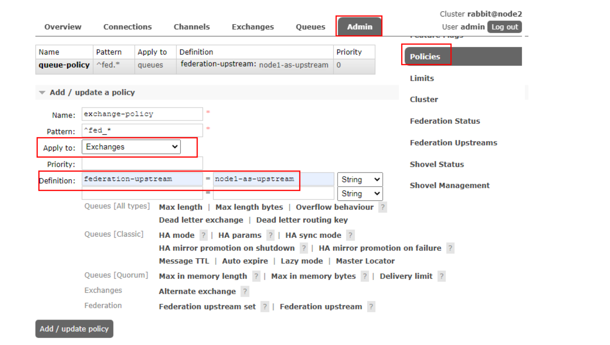
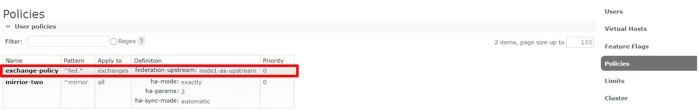
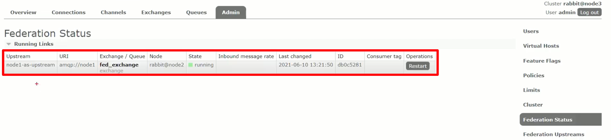

`Federation Queue`即 **联合/联邦交换机**。



假设一个 RabbitMQ 集群中的两台机器分布在异地，`一台` broker 位于北京，另一台 `broker` 深圳位于深圳，彼此之间相距甚远，两者之间的网络延迟是一个不得不面对的问题。其中在北京的业务(Client 北京) 需要连接(broker 北京)，
向其中的交换器 `exchangeA` 发送消息，此时的网络延迟很小，(Client 北京)可以迅速将消息发送至 `exchangeA` 中，就算在开启了 `publisherconfirm` 或者事务机制的情况下，也可以迅速收到确认信息。
但如果此时有个在深圳的业务(Client 深圳)需要向 `exchangeA` 发送消息， 由于(Client 深圳) (broker 北京)之间有很大的网络延迟，(Client 深圳) 将发送消息至 `exchangeA` 会经历一定的延迟，尤其是在开启了 `publisherconfirm` 机制或者事务机制的情况下，
(Client 深圳) 会等待很长的延迟时间来接收(broker 北京)的确认信息，进而必然造成这条发送线程的性能降低，甚至造成一定程度上的阻塞。

## 怎么解决这种异地数据访问延迟的问题

将深圳的业务(Client 深圳)部署到北京的机房即可解决这个问题，但是如果(Client 深圳)调用那些原本处在深圳的业务，那么又会引发新的时延问题，总不见得将所有业务全部部署在一个机房，这样容灾又何以实现？ 在 RabbitMQ 进群中，使用 Federation 插件就可以很好地解决这个问题。

接下来我们来看看联合交换机的原理，如下图所示：



这里有两个节点 `node1` 和 `node2`，可以理解为 `node1` 就在北京，`node2` 就在深圳，其中 `node1` 处于 `upstream` 上游，`node2` 处于 `downstream` 下游，为了解决数据异地访问的延迟问题，我们需要做出数据同步，
也就是上游的数据忘下游走。这里的数据同步以交换机为节点，也就是上游的 `node1` 节点的联邦交换机同步数据给下游的 `node2` 节点的联邦交换机，其中经历了一个配置`federation: fed_exchange -> rabbit@node2`，
也就是给 `node1` 节点的联邦交换机配置了 `node2` 节点的地址，也就让 `node1` 节点能到找到 `node2` 节点，两边使用的交换机名称相同，以此来同步数据。

注意：数据同步到前提是 `consumer` 在 `node2` 上也就是下游创建了联邦交换机，然后在上游上配置地址映射方可通过联邦交换机进行同步。

## RabbitMQ 集群中配置

首先在集群中的三台机器上分别执行以下命令即可开启 `Federation` 插件：

```shell
rabbitmq-plugins enable rabbitmq_federation
rabbitmq-plugins enable rabbitmq_federation_management
```

此时回到web界面，即可看到插件已经出现：



接下来在 `node2` 节点上创建一个名为 `fed_exchange` 的交换机：


然后在处于下游(`downstream`)的 `node2` 节点配置上游(`upstream`)的 `node1` 节点：


创建完成后如下所示：



最后设置一条 `policy` 规则，意思就是给所有以`fed`名称开头的交换机添加上游策略：



添加完如下图所示：



上述配置都完成后，就可以在 `Ferderation Status` 界面看到联合交换机已经配置成功了

