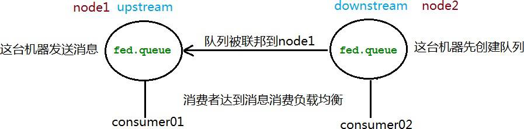
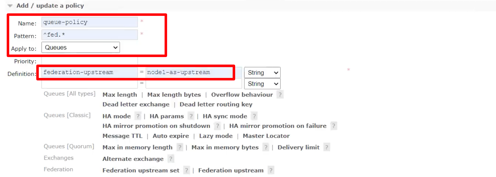
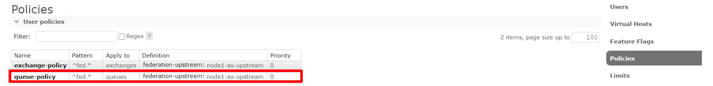

`Federation Queue`即 **联合/联邦队列**。

上节我们讲述了联邦交换机的实现，本质上就是解决不同地区间的数据同步问题，先前我们是按照交换机进行同步，也就是上游交换机通过链接地址链接到下游交换机然后进行数据传递。除了通过交换机进行同步外，我们还可以通过队列进行同步，于是引入了联邦队列`Federation Queue`的概念。

联邦队列可以在多个 `Broker` 节点(或者集群)之间为单个队列提供均衡负载的功能。一个联邦队列可以连接一个或者多个上游队列(`upstream queue`)，并从这些上游队列中获取消息以满足本地消费者消费消息需求。

原理图类似联邦交换机如下图所示：`node1` 的队列想要同步数据给 `node2` 的队列，就需要将处于下游的 `node2` 与上游的 `node1` 进行绑定。

## RabbitMQ 集群中配置

在 RabbitMQ 集群中的配置同联邦交换机也类似，首先需要在两个节点上创建名为`fed.queue`的两个队列，然后将在处于下游(`downstream`)的 `node2` 节点配置上游(`upstream`)的 `node1` 节点。该步骤前面已经完成，不需要再进行一遍。

接下来就是设置一条 `policy` 规则，将就是给所有以`fed`名称开头的队列添加上游策略：

添加完成后如下所示：

