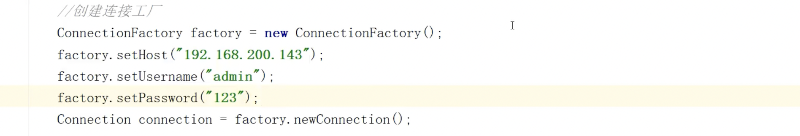
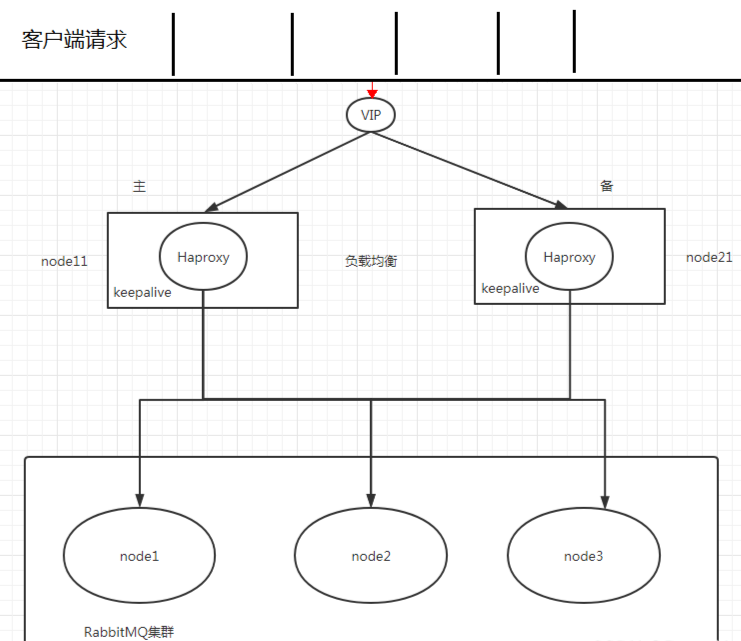

上小节中我们了解了镜像队列，实现了消息不再丢失，但是存在着一个问题，就是我们生产者和消费者只能连接集群中的一个节点。

比如当前就连接着`node1`节点，但如果此时`node1`节点出现问题宕机了连接不上了，此时生产者和消费者就需要连接集群中的其他机器，但是生产者完全不知道集群中其他机器的存在，因为代码中写死了连接的ip地址。

这样导致了它只能连接一个节点，而它又不能自动的变更ip连接其他的节点，于是产生了生产者/消费者连接集群而无法变更ip的问题，因此我们需要借助第三方的负载均衡软件来帮我解决这个问题，使用负载均衡后的架构图如下图所示：

生产者发消息先走VIP，VIP路由到集群中的主机，由主机进行转发到多台 MQ 节点进行处理；一旦主机宕机了，就会由其中的 `keepalive` 监测主机状况，如果发生宕机就将 ip 漂移到另外一个备机上，从现在开始VIP就路由到备机，
备机再进行转发到多台 MQ 节点进行处理，而且备机还是定时监测主机是否恢复，如果没有恢复就接管主机的所有工作。

以上是市面上最主流的高可用负载均衡方案，是为了解决生产者无法连接多台机器的问题。我们只需要安装 `Haproxy` 和 `keepalive` 这两个软件即可使用。