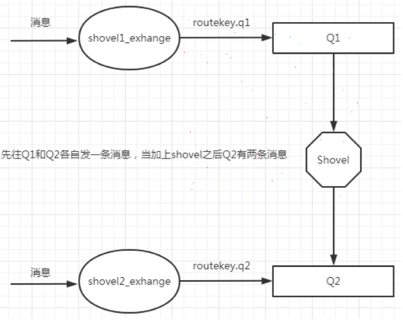
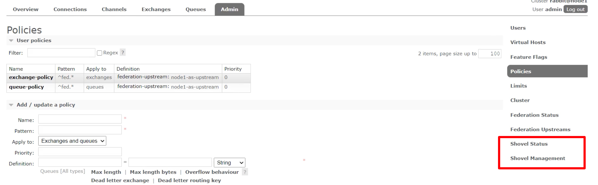

与 `Federation` 具备的数据转发功能类似，`Shovel` 能够可靠持续地从一个 `Broker` 中的队列（作为 `source` 源端）拉取数据并转发至另一个 `Broker` 中的交换机（作为 `destination` 目的段）。作为源端的队列和作为目的端的交换器可以同时位于同一个 `Broker`，
也可以位于不同的 `Broker` 上。`Shovel` 可以翻译为"铲子"，是一种比较形象的比喻，这个"铲子"可以将消息从一方"铲子"另一方。`Shovel` 行为就像优秀的客户端应用程序能够负责连接源和目的地、负责消息的读写及负责连接失败问题的处理。

原理图如下所示：当我们发送消息给 Q1 时，消息会通过 `Shovel` 同步给 Q2，也就是说如果我们往 Q1 和 Q2 种各发一条消息，Q1 只有1条消息，而 Q2 会收到2条消息，其中1条来自 Q1 的同步。



在 RabbitMQ 集群中使用 `Shovel` 的方法如下：

## 开启插件

```shell
# 在集群中需要开启该插件的节点机器上执行以下命令:
rabbitmq-plugins enable rabbitmq_shovel
rabbitmq-plugins enable rabbitmq_shovel_management
```

开启后在web界面可以看到该插件



## 添加 shovel 源和目的地


上图中的操作含义就是将 `node1` 节点中的 Q1 队列同步到 `node2` 节点的 Q2 队列。