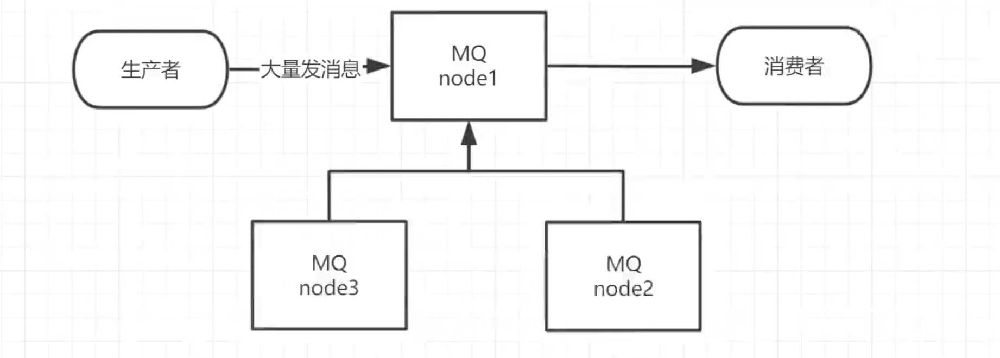
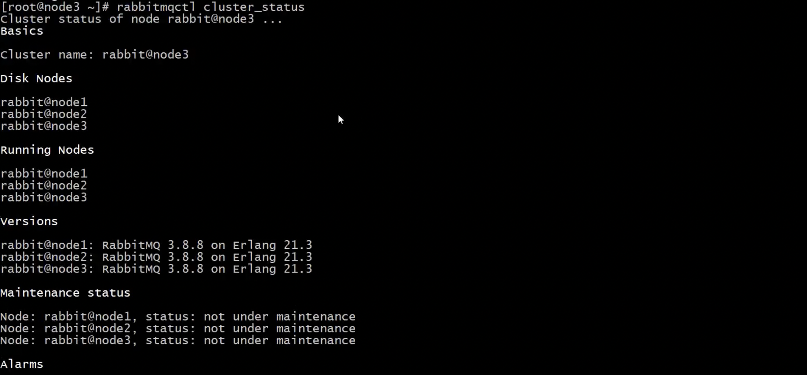
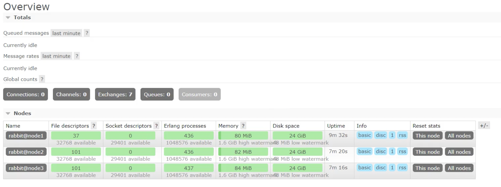

以上所有的章节都是基于单机版的 RabbitMQ 进行讲解的，但这并无法满足目前真实应用的要求。如果 RabbitMQ 服务器遇到内存崩溃、机器掉电或者主板故障等情况，该怎么办？

单台 RabbitMQ 服务器可以满足每秒 `1000` 条消息的吞吐量，那么如果应用需要 RabbitMQ 服务满足每秒 `10` 万条消息的吞吐量呢？购买昂贵的服务器来增强单机 RabbitMQ 务的性能显得捉襟见肘，搭建一个 RabbitMQ 集群才是解决实际问题的关键。

## 环境准备

准备三台`centos`机器并都具备RabbitMQ的环境，我们要搭建的集群如下图所示：



## 修改3台机器的主机名称

```shell
# 在三台机器上分别执行以下命令修改主机名称
vim /etc/hostname

# 修改完记得重启，才能看到生效
reboot
```

这里三台机器的名称分别为 `node1`、`node2`、`node3`，其中 `node1` 作为主节点，后续 `node2`、`node3` 节点我们将添加到 `node1` 节点组成集群。

## 配置各个节点的hosts文件，让各个节点都能互相识别对方

```shell
# 在三台机器上分别修改/etc/host文件，增加三台机器节点的域名ip映射
vim /etc/hosts
```


## 确保各个节点的 cookie 文件使用的是同一个值

RabbitMQ 集群要求底层`erlang`所使用`cookie`值相同，我们在节点1这台机器上使用远程复制命令将该机器上的`cookie`复制给节点2和节点3

```shell
scp /var/lib/rabbitmq/.erlang.cookie root@node2:/var/lib/rabbitmq/.erlang.cookie
scp /var/lib/rabbitmq/.erlang.cookie root@node3:/var/lib/rabbitmq/.erlang.cookie
```

## 启动 RabbitMQ 服务，顺带启动 Erlang 虚拟机和 RbbitMQ 应用服务

```shell
# 在三台节点上分别执行该命令
rabbitmq-server -detached
```

## 将节点2节点3添加到节点1中组成集群

在节点 2 执行：

```shell
rabbitmqctl stop_app	# 关闭RabbitMQ服务
rabbitmqctl reset	# 重置
rabbitmqctl join_cluster rabbit@node1	# 加入到node1几点
rabbitmqctl start_app	# 启动RabbitMQ服务
```


在节点 3 同样执行：

```shell
rabbitmqctl stop_app	# 关闭RabbitMQ服务
rabbitmqctl reset	# 重置
rabbitmqctl join_cluster rabbit@node2	# 加入到node2节点（等价于加入到node1节点）
rabbitmqctl start_app	# 启动RabbitMQ服务
```


注意命令区别：`rabbitmqctl stop`会将`Erlang`虚拟机关闭，`rabbitmqctl stop_app`只关闭RabbitMQ服务

## 查看集群状态

在三台机器任何一台执行以下命令均可查询到集群状态：

```shell
rabbitmqctl cluster_status
```



## 为集群创建账户

在任意一台机器执行以下命令即可：

```shell
# 创建账号
rabbitmqctl add_user admin 123

# 设置用户角色
rabbitmqctl set_user_tags admin administrator

# 设置用户权限
rabbitmqctl set_permissions -p "/" admin ".*" ".*" ".*"
```


此时，我们就可以通过该用户登录到web管理界面，我们通过任意一台机器的`ip:15672`进行登陆都可以



## 集群搭建完成后也可以进行脱离

在 `node2` 和 `node3` 两台机器分别执行以下命令即可接触集群关系：

```shell
rabbitmqctl stop_app
rabbitmqctl reset
rabbitmqctl start_app
rabbitmqctl cluster_status
```

然后在 `node1` 机器上执行以下命令忘记 `node2` 和 `node3` 机器：

```shell
rabbitmqctl forget_cluster_node rabbit@node2
rabbitmqctl forget_cluster_node rabbit@node3
```