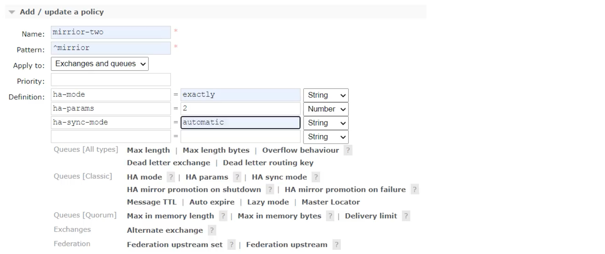
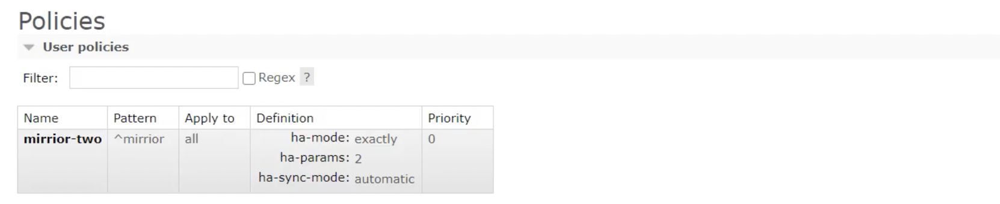
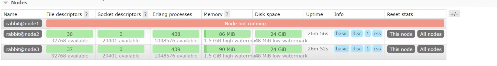
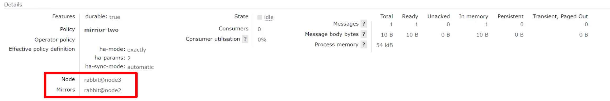

上一节我们搭建好了三节点的 RabbieMQ 的集群，但此时该集群是不可复用的，意思就是说在`node1`创建的队列，在`node2`和`node3`是没有的，因此一旦`node1`宕机了，这个队列也就消失了，不会因为有三台机器就有三个队列，因此这样会造成消息的丢失。

那将所有的消息以及对应的队列都设置为持久化处理能否很好的避免这个问题呢？答案是否定的，因为消息在发送之后和被写入磁盘井执行刷盘动作之间存在一个短暂却会产生问题的时间窗，因此该方式仍然无法避免由于缓存导致的问题。

因此引入了镜像队列，镜像的意思就是备份，我们给集群中的一个节点发送消息不应该只在这个节点上存在，而是在集群中的其他节点上也有备份，这样就可以避免其中一个节点宕机导致消息丢失。

引入镜像队列`Mirror Queue`的机制后，可以将队列镜像到集群中的其他 `Broker` 节点之上，如果集群中的一个节点失效了，队列能自动地切换到镜像中的另一个节点上以保证服务的可用性。

## 镜像队列实现

我们只需要在集群中任意一个节点上添加策略即可：

从界面上可以非常直观的看到一个 `Policy` 策略需要的元素：

* **Name**：策略名称，可以随便指定，最好语义化便于理解
* **Pattern**：指定正则表达式去匹配`Queues/Exchanges`名称，这里设置为`^mirror`表示所有以`mirror`开头的队列名都会绑定该策略，比如`hello_mirror`等等
* **Apply to**： 该策略对`Queue`还是对`Exchange`生效，或者两者都适用
* **Priority**：优先级
* **Definition**： 添加的args，KV键值对
  1. `ha-mode=exactly` 表示开启备份模式 
  2. `ha-params=2` 表示备份数量为2 
  3. `ha-sync-mode=automatic` 表示进行自动备份

设置完成后添加该策略，成功后如下图所示：

比如这里我们新增一个名称为`mirror_hello`的队列样式如下所示：有个`+1`的标识

此时我们在 `node1` 上执行以下命令停止 RabbitMQ 服务模拟宕机:

然后查看web界面可以看到 `node1` 宕机了

再次查看`mirror_hello`队列的详细信息，可以看到该队列已经转移到 `node3` 节点了，并且在 `node2` 上有备份

此时我们在该队列上发送消息并不会丢失，因为它在其他机器上做了备份。