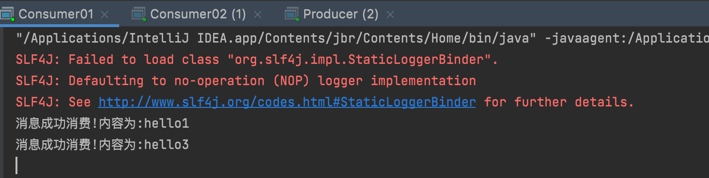
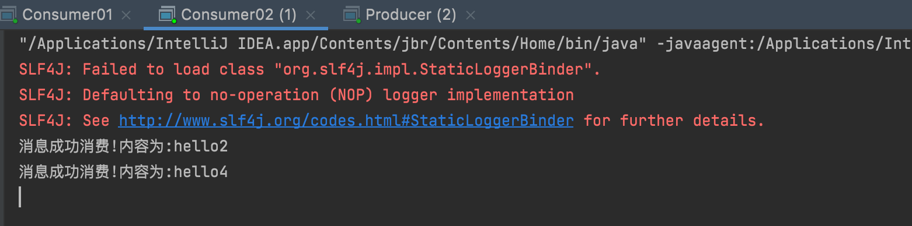

:::tip
`Work Queues` 是工作队列模式，也就是一个生产者、多个消费者、一个队列。


它的主要思想是避免排队等待，避免一个消息处理时间过久而无法处理下一个的问题。因此相比简单模式可以有多个消费者，原理就是我们把任务封装为消息并将其发送到队列中，
这多个消费者可以一起处理队列中的任务。
:::

`RabbitMQ` 中的工作模式默认采用**轮训**的方式，也就是如果有两个消费者的话，消息逐一分给每个消费者进行消费。接下来我们来用 Java 代码实现一下 `Work Queues` 工作模式，来测试其轮训消费的功能。

## 生产者Producer

```java
package mode2_WorkQueues.polling;

import com.rabbitmq.client.Channel;

import java.util.Scanner;

public class Producer {
    public static String QUEUE_NAME = "work";

    public static void main(String[] args) throws Exception {
        // 创建channel
        Channel channel = utils.RabbitMqUtils.getChannel();
        // 声明队列
        channel.queueDeclare(QUEUE_NAME, false, false, false, null);
        // 发送消息
        Scanner scanner = new Scanner(System.in);
        while (scanner.hasNext()) {
            String message = scanner.next();
            channel.basicPublish("", QUEUE_NAME, null, message.getBytes());
            System.out.println("消息发送完毕" + message);
        }
    }
}
```

## 消费者Consumer01

```java
package mode2_WorkQueues.polling;

import com.rabbitmq.client.CancelCallback;
import com.rabbitmq.client.Channel;
import com.rabbitmq.client.DeliverCallback;

// 消费者1
public class Consumer01 {
    public static String QUEUE_NAME = "work";

    public static void main(String[] args) throws Exception {
        // 创建channel
        Channel channel = utils.RabbitMqUtils.getChannel();
        // 消费消息
        DeliverCallback deliverCallback = (consumerTag, message) -> {
            System.out.println("消息成功消费!内容为:" + new String(message.getBody()));
        };
        CancelCallback cancelCallback = (consumerTag) -> {
            System.out.println("消息消费被中断");
        };
        channel.basicConsume(QUEUE_NAME, true, deliverCallback, cancelCallback);
    }
}
```

## 消费者Consumer02

```java
package mode2_WorkQueues.polling;

import com.rabbitmq.client.CancelCallback;
import com.rabbitmq.client.Channel;
import com.rabbitmq.client.DeliverCallback;

// 消费者2
public class Consumer02 {
    public static String QUEUE_NAME = "work";

    public static void main(String[] args) throws Exception {
        // 创建channel
        Channel channel = utils.RabbitMqUtils.getChannel();
        // 消费消息
        DeliverCallback deliverCallback = (consumerTag, message) -> {
            System.out.println("消息成功消费!内容为:" + new String(message.getBody()));
        };
        CancelCallback cancelCallback = (consumerTag) -> {
            System.out.println("消息消费被中断");
        };
        channel.basicConsume(QUEUE_NAME, true, deliverCallback, cancelCallback);
    }
}
```

## 测试

* 首先分别启动两个消费者，然后启动生产者，这里发送4条消息：


* 根据结果可以看到，`consumer01`收到了1和3，`consumer02`收到了2和4：





也就是多个消费者是轮询消费生产者发送的消息。