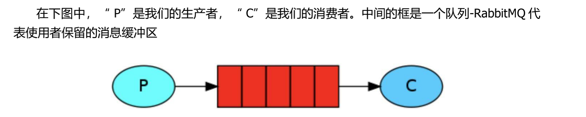
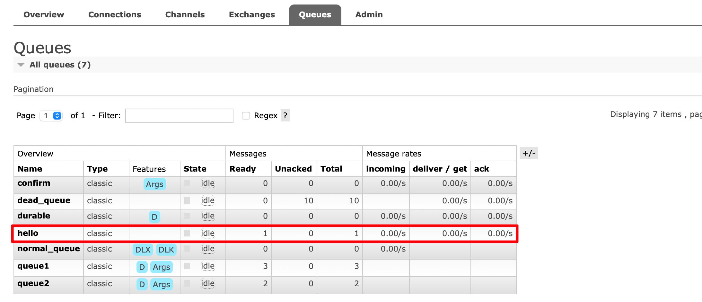
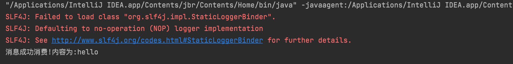
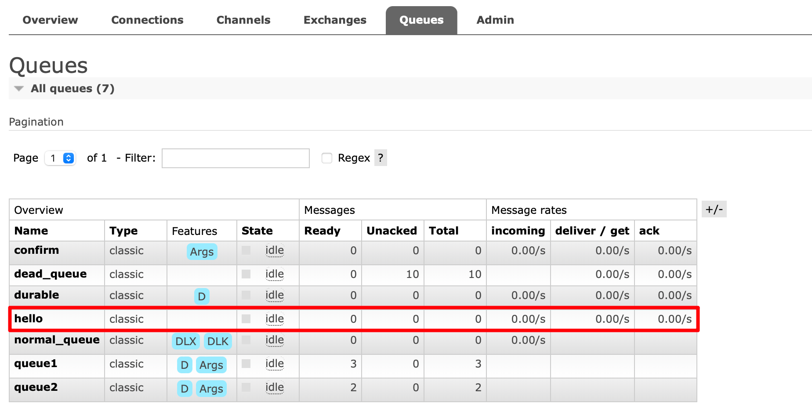

:::tip
`RabbitMQ` 中最简单的`Hello World`模式。也就是一个生产者、一个消费者、一个队列；生产者P发送消息到队列Q，一个消费者C接收消息。


:::

接下来我们来用 Java 代码实现一下 `Hello World`简单模式，首先创建一个空项目，然后添加一个 `maven` 模块

## 1、导入rabbitmq依赖

首先我们导入 `RabbitMQ` 的依赖，并且指定 `JDK` 的编译版本。

```xml
<!--指定 jdk 编译版本-->
<build>
  <plugins>
    <plugin>
      <groupId>org.apache.maven.plugins</groupId>
      <artifactId>maven-compiler-plugin</artifactId>
      <configuration>
        <source>8</source>
        <target>8</target>
      </configuration>
    </plugin>
  </plugins>
</build>
<dependencies>
  <!--rabbitmq 依赖客户端-->
  <dependency>
    <groupId>com.rabbitmq</groupId>
    <artifactId>amqp-client</artifactId>
    <version>5.8.0</version>
  </dependency>
  <!--操作文件流的一个依赖-->
  <dependency>
    <groupId>commons-io</groupId>
    <artifactId>commons-io</artifactId>
    <version>2.6</version>
  </dependency>
</dependencies>
```

## 2、编写消息生产者

**步骤**：

* 创建连接工厂 `ConnectionFactory`
* 通过连接工厂创建连接 `Connection`
* 通过连接获取通道 `Channel`
* 通过通道声明队列 `Queue`
* 发送消息到队列 `Queue` 中

:::code-group
```java [Producer.java]
package mode1_Simple;

import com.rabbitmq.client.Channel;
import com.rabbitmq.client.Connection;
import com.rabbitmq.client.ConnectionFactory;

public class Producer {
  	// 队列名称
    public static String QUEUE_NAME = "hello";

    public static void main(String[] args) throws Exception {
        // 创建一个连接工厂
        ConnectionFactory factory = new ConnectionFactory();
        factory.setHost("82.156.9.173");
        factory.setUsername("zsr");
        factory.setPassword("123456");
        // 创建一个connection
        Connection connection = factory.newConnection();
        // 创建一个channel
        Channel channel = connection.createChannel();
        /**
         * 创建一个队列
         * 1.队列名称
         * 2.队列里面的消息是否持久化(默认为false,代表消息存储在内存中)
         * 3.该队列是否只供一个消费者进行消费,是否进行共享(true表示可以多个消费者消费)
         * 4.表示最后一个消费者断开连接以后,该队列是否自动删除(true表示自动删除)
         * 5.其他参数
         */
        channel.queueDeclare(QUEUE_NAME, false, false, false, null);
        /**
         * 发送一个消息
         * 1.发送到那个交换机(空代表默认交换机)
         * 2.路由key
         * 3.其他的参数信息
         * 4.发送消息的消息体
         */
        String message = "hello";
        channel.basicPublish("", QUEUE_NAME, null, message.getBytes());
        System.out.println("消息发送完毕");
    }
}
```
:::

## 3、编写消息消费者

**步骤**：

* 创建连接工厂 `ConnectionFactory`
* 通过连接工厂创建连接 `Connection`
* 通过连接获取通道 `Channel`
* 通过通道接收消息

:::code-group
```java [Consumer.java]
package mode1_Simple;

import com.rabbitmq.client.*;

public class Consumer {
  	// 队列名称
    public static String QUEUE_NAME = "hello";

    public static void main(String[] args) throws Exception {
        // 创建一个连接工厂
        ConnectionFactory factory = new ConnectionFactory();
        factory.setHost("82.156.9.173");
        factory.setUsername("zsr");
        factory.setPassword("123456");
        // 创建一个connection
        Connection connection = factory.newConnection();
        // 创建一个channel
        Channel channel = connection.createChannel();
        /**
         * 消费者消费消息
         * 1.消费的队列名称
         * 2.消费成功之后是否要自动应答(true代表自动应答,false代表手动应答)
         * 3.消费者消费消息的回调(函数式接口)
         * 4.消费者取消消费的回调(函数式接口)
         */
        // 消费消息的回调
        DeliverCallback deliverCallback = (consumerTag, message) -> {
            System.out.println("成功消费消息,内容为:" + new String(message.getBody()));
        };
        // 取消消费的回调
        CancelCallback cancelCallback = (consumerTag) -> {
            System.out.println("消息消费被中断");
        };
        channel.basicConsume(QUEUE_NAME, true, deliverCallback, cancelCallback);
    }
}
```
:::

## 4、测试

* 首先启动生产者，可以看到创建了一个队列`hello`，并发送了一条消息，还未被消费



* 然后再启动消费者，可以看到控制台打印收到的消息，同时可以看到消息已经被消费





此外，这里的`hello`队列是一个非持久化队列，所以如果`rabbitmq`服务重启，该队列会消失

## 5、代码优化—抽取工具类

上述消息生产者和消费者获取创建`ConnectionFactory`，获取`Connection`和`Channel`的过程是一样的，我们可以封装成一个工具类`RabbitMqUtils`。

:::code-group
```java [RabbitMqUtils.java]
package utils;

import com.rabbitmq.client.Channel;
import com.rabbitmq.client.Connection;
import com.rabbitmq.client.ConnectionFactory;

public class RabbitMqUtils {
    // 获得RabbitMQ连接的channel
    public static Channel getChannel() throws Exception {
        // 创建一个连接工厂
        ConnectionFactory factory = new ConnectionFactory();
        factory.setHost("82.156.9.173");
        factory.setUsername("zsr");
        factory.setPassword("123456");
        // 创建一个connection
        Connection connection = factory.newConnection();
        // 创建一个channel
        Channel channel = connection.createChannel();
        return channel;
    }
}
```
:::

然后我们就可以优化一下消费者和生产者的代码：

**消费者：**

```java
package mode1_Simple;

import com.rabbitmq.client.*;

public class Consumer {
    public static String QUEUE_NAME = "hello";

    public static void main(String[] args) throws Exception {
        Channel channel = utils.RabbitMqUtils.getChannel();
        /**
         * 消费者消费消息
         * 1.消费的队列名称
         * 2.消费成功之后是否要自动应答(true代表自动应答,false代表手动应答)
         * 3.消费者消费消息的回调(函数式接口)
         * 4.消费者取消消费的回调(函数式接口)
         */
        // 消费消息的回调
        DeliverCallback deliverCallback = (consumerTag, message) -> {
            System.out.println("消息成功消费!内容为:" + new String(message.getBody()));
        };
        // 取消消费的回调
        CancelCallback cancelCallback = (consumerTag) -> {
            System.out.println("消息消费被中断");
        };
        channel.basicConsume(QUEUE_NAME, true, deliverCallback, cancelCallback);
    }
}
```

**生产者：**

```java
package mode1_Simple;

import com.rabbitmq.client.Channel;
import com.rabbitmq.client.Connection;
import com.rabbitmq.client.ConnectionFactory;

public class Producer {
    public static String QUEUE_NAME = "hello";

    public static void main(String[] args) throws Exception {
        Channel channel = utils.RabbitMqUtils.getChannel();
        /**
         * 创建一个队列
         * 1.队列名称
         * 2.队列里面的消息是否持久化(默认为false,代表消息存储在内存中)
         * 3.该队列是否只供一个消费者进行消费,是否进行共享(true表示可以多个消费者消费)
         * 4.表示最后一个消费者断开连接以后,该队列是否自动删除(true表示自动删除)
         * 5.其他参数
         */
        channel.queueDeclare(QUEUE_NAME, false, false, false, null);
        /**
         * 发送一个消息
         * 1.发送到那个交换机(空代表默认交换机)
         * 2.路由key
         * 3.其他的参数信息
         * 4.发送消息的消息体
         */
        String message = "hello";
        channel.basicPublish("", QUEUE_NAME, null, message.getBytes());
        System.out.println("消息发送完毕");
    }
}
```