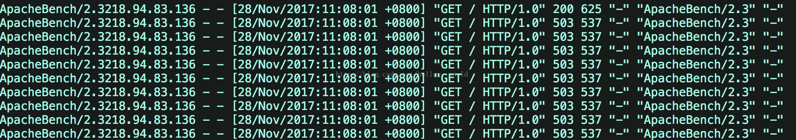
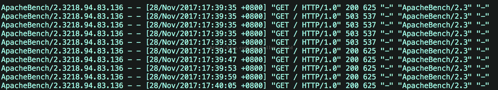
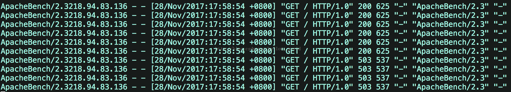

## Nginx限流的简单演示

每六秒才处理一次请求,如下

```shell
limit_req_zone  $arg_sku_id  zone=skuzone:10m      rate=6r/m;
limit_req_zone  $http_user_id  zone=userzone:10m      rate=6r/m;
limit_req_zone  $binary_remote_addr  zone=perip:10m      rate=6r/m;
limit_req_zone  $server_name        zone=perserver:1m   rate=6r/m;
```

## 这是从请求参数里边，提前参数做限流

这是从请求参数里边，提前参数，进行限流的次数统计key。

在http块里边定义限流的内存区域 `zone`。

```shell
limit_req_zone  $arg_sku_id  zone=skuzone:10m      rate=6r/m;
limit_req_zone  $http_user_id  zone=userzone:10m      rate=6r/m;
limit_req_zone  $binary_remote_addr  zone=perip:10m      rate=6r/m;
limit_req_zone  $server_name        zone=perserver:1m   rate=10r/s;
```

在`location`块中使用限流zone，参考如下：

```shell
#  ratelimit by sku id
location  = /ratelimit/sku {
  limit_req  zone=skuzone;
  echo "正常的响应";
}
```

### 测试

```shell
[root@cdh1 ~]# /vagrant/LuaDemoProject/sh/linux/openresty-restart.sh
shell dir is: /vagrant/LuaDemoProject/sh/linux
Shutting down openrestry/nginx:  pid is 13479 13485
Shutting down  succeeded!
OPENRESTRY_PATH:/usr/local/openresty
PROJECT_PATH:/vagrant/LuaDemoProject/src
nginx: [alert] lua_code_cache is off; this will hurt performance in /vagrant/LuaDemoProject/src/conf/nginx-seckill.conf:90
openrestry/nginx starting succeeded!
pid is 14197

[root@cdh1 ~]# curl  http://cdh1/ratelimit/sku?sku_id=1
正常的响应
root@cdh1 ~]#  curl  http://cdh1/ratelimit/sku?sku_id=1
正常的响应
[root@cdh1 ~]#  curl  http://cdh1/ratelimit/sku?sku_id=1
限流后的降级内容
[root@cdh1 ~]#  curl  http://cdh1/ratelimit/sku?sku_id=1
限流后的降级内容
[root@cdh1 ~]#  curl  http://cdh1/ratelimit/sku?sku_id=1
限流后的降级内容
[root@cdh1 ~]#  curl  http://cdh1/ratelimit/sku?sku_id=1
限流后的降级内容
[root@cdh1 ~]#  curl  http://cdh1/ratelimit/sku?sku_id=1
限流后的降级内容
[root@cdh1 ~]#  curl  http://cdh1/ratelimit/sku?sku_id=1
正常的响应
```

## 从Header头部提前参数

1. nginx是支持读取非nginx标准的用户自定义`header`的，但是需要在http或者server下开启`header`的下划线支持:

    **underscores_in_headers on;**

2. 比如我们自定义header为`X-Real-IP`,通过第二个nginx获取该`header`时需要这样:

    **$http_x_real_ip; (一律采用小写，而且前面多了个http_)**

```shell
underscores_in_headers on;

limit_req_zone  $http_user_id  zone=userzone:10m      rate=6r/m;
server {
listen       80 default;
server_name  nginx.server *.nginx.server;
default_type 'text/html';
charset utf-8;

#  ratelimit by user id
location  = /ratelimit/demo {
  limit_req  zone=userzone;
  echo "正常的响应";
}

location = /50x.html{
  echo "限流后的降级内容";
}

error_page 502 503 =200 /50x.html;

}
```

### 测试

```shell
[root@cdh1 ~]# curl -H "USER-ID:1" http://cdh1/ratelimit/demo
正常的响应
[root@cdh1 ~]# curl -H "USER-ID:1" http://cdh1/ratelimit/demo
限流后的降级内容
[root@cdh1 ~]# curl -H "USER-ID:1" http://cdh1/ratelimit/demo
限流后的降级内容
[root@cdh1 ~]# curl -H "USER-ID:1" http://cdh1/ratelimit/demo
限流后的降级内容
[root@cdh1 ~]# curl -H "USER-ID:1" http://cdh1/ratelimit/demo
限流后的降级内容
[root@cdh1 ~]# curl -H "USER-ID:1" http://cdh1/ratelimit/demo
限流后的降级内容
[root@cdh1 ~]# curl -H "USER-ID:1" http://cdh1/ratelimit/demo
限流后的降级内容
[root@cdh1 ~]# curl -H "USER_ID:2" http://cdh1/ratelimit/demo
正常的响应
[root@cdh1 ~]# curl -H "USER_ID:2" http://cdh1/ratelimit/demo
限流后的降级内容
[root@cdh1 ~]#
[root@cdh1 ~]# curl -H "USER_ID:2" http://cdh1/ratelimit/demo
限流后的降级内容
[root@cdh1 ~]# curl -H "USER-ID:3" http://cdh1/ratelimit/demo
正常的响应
[root@cdh1 ~]# curl -H "USER-ID:3" http://cdh1/ratelimit/demo
限流后的降级内容
```

## Nginx漏桶限流的三个细分类型，即burst、nodelay参数详解

每六秒才处理一次请求,如下

```shell
limit_req_zone  $arg_user_id  zone=limti_req_zone:10m      rate=10r/m;
```

### 不带缓冲队列的漏桶限流

```shell
limit_req zone=limti_req_zone;
```

* 严格依照在limti_req_zone中配置的rate来处理请求
* 超过rate处理能力范围的，直接drop
* 表现为对收到的请求无延时

假设1秒内提交10个请求，可以看到一共10个请求，9个请求都失败了,直接返回503，

接着再查看 `/var/log/nginx/access.log`，印证了只有一个请求成功了，其它就是都直接返回了503，即服务器拒绝了请求。



### 带缓冲队列的漏桶限流

```shell
limit_req zone=limti_req_zone burst=5;
```

* 依照在limti_req_zone中配置的rate来处理请求
* 同时设置了一个大小为5的缓冲队列，在缓冲队列中的请求会等待慢慢处理
* 超过了**burst缓冲队列长度和rate处理能力的请求被直接丢弃**
* 表现为对收到的请求有延时

假设1秒内提交10个请求，则可以发现在1s内，在服务器接收到10个并发请求后，先处理1个请求，同时将5个请求放入burst缓冲队列中，等待处理。而超过（burst+1）数量的请求就被直接抛弃了，
即直接抛弃了4个请求。burst缓存的5个请求每隔6s处理一次。

接着查看 `/var/log/nginx/access.log`日志



### 带瞬时处理能力的漏桶限流

```shell
limit_req zone=req_zone burst=5 nodelay;
```

**如果设置nodelay，会在瞬时提供处理(burst + rate)个请求的能力，请求数量超过（burst + rate）的时候就会直接返回503，峰值范围内的请求，不存在请求需要等待的情况。**

假设1秒内提交10个请求，则可以发现在1s内，服务器端处理了6个请求（峰值速度：burst＋10s内一个请求）。对于剩下的4个请求，直接返回503，在下一秒如果继续向服务端发送10个请求，服务端会直接拒绝这10个请求并返回503。

接着查看 `/var/log/nginx/access.log`日志



可以发现在1s内，服务器端处理了6个请求（峰值速度：burst＋原来的处理速度）。对于剩下的4个请求，直接返回503。

但是，总数额度和 速度*时间 保持一致， 就是额度用完了，需要等到一个有额度的时间段，才开始接收新的请求。如果一次处理了5个请求，相当于占了30s的额度，6*5=30。因为设定了6s处理1个请求，
所以直到30s 之后，才可以再处理一个请求，即如果此时向服务端发送10个请求，会返回9个503，一个200


