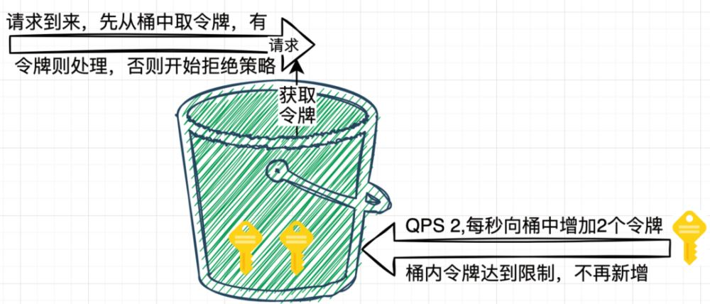
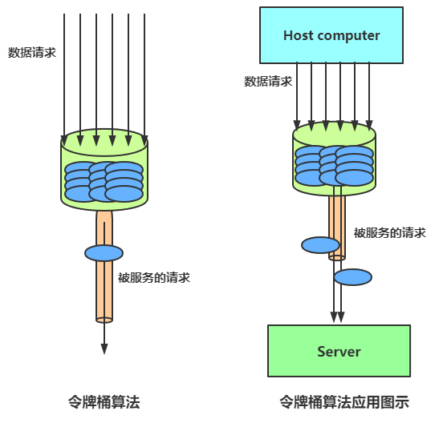
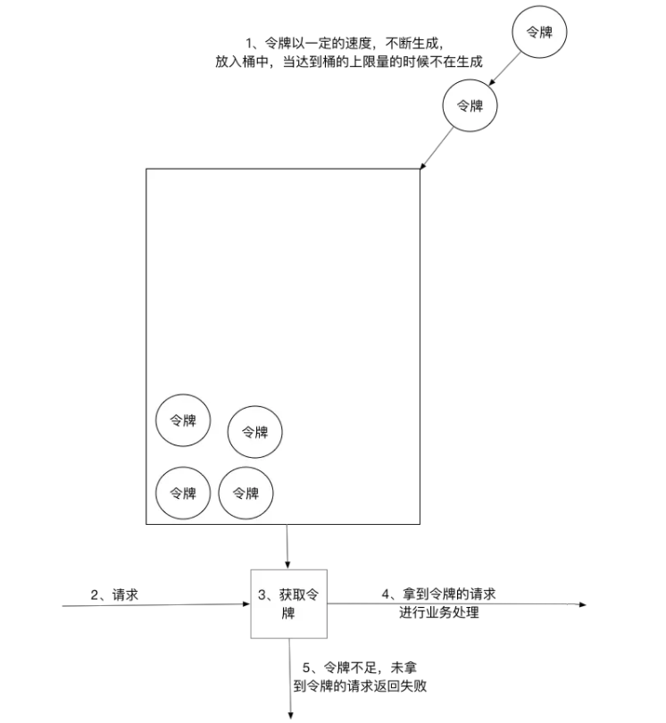
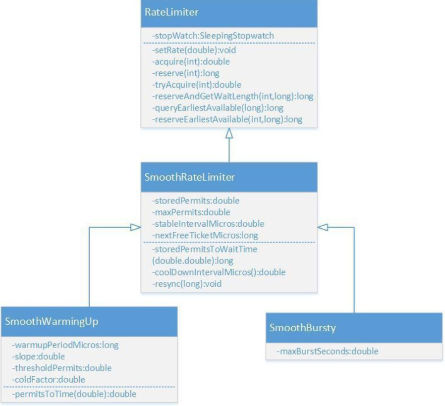

令牌桶算法以一个设定的速率产生令牌并放入令牌桶，每次用户请求都得申请令牌，如果令牌不足，则拒绝请求。



令牌桶算法中新请求到来时会从桶里拿走一个令牌，如果桶内没有令牌可拿，就拒绝服务。当然，令牌的数量也是有上限的。令牌的数量与时间和发放速率强相关，时间流逝的时间越长，会不断往桶里加入越多的令牌，
如果令牌发放的速度比申请速度快，令牌桶会放满令牌，直到令牌占满整个令牌桶。

令牌桶限流大致的规则如下：

1) 进水口按照某个速度，向桶中放入令牌。
2) 令牌的容量是固定的，但是放行的速度不是固定的，只要桶中还有剩余令牌，一旦请求过来就能申请成功，然后放行。
3) 如果令牌的发放速度，慢于请求到来速度，桶内就无牌可领，请求就会被拒绝。

总之，令牌的发送速率可以设置，从而可以对突发的出口流量进行有效的应对。

## 令牌桶算法

令牌桶与漏桶相似,不同的是令牌桶桶中放了一些令牌,服务请求到达后,**要获取令牌之后才会得到服务**。

举个例子,我们平时去食堂吃饭,都是在食堂内窗口前排队的,这就好比是漏桶算法,大量的人员聚集在食堂内窗口外,以一定的速度享受服务,如果涌进来的人太多,食堂装不下了,可能就有一部分人站到食堂外了,
这就没有享受到食堂的服务,称之为溢出,溢出可以继续请求,也就是继续排队,那么这样有什么问题呢?

如果这时候有特殊情况,比如有些赶时间的志愿者啦、或者高三要高考啦,这种情况就是突发情况,如果也用漏桶算法那也得慢慢排队,这也就没有解决我们的需求。

对于很多应用场景来说，除了要求能够限制数据的平均传输速率外，还要求允许某种程度的突发传输。这时候漏桶算法可能就不合适了，令牌桶算法更为适合。

如图所示，令牌桶算法的原理是系统会以一个恒定的速度往桶里放入令牌，而如果请求需要被处理，则需要先从桶里获取一个令牌，当桶里没有令牌可取时，则拒绝服务。




## 令牌桶算法实现

```java
package com.crazymaker.springcloud.ratelimit;

import lombok.extern.slf4j.Slf4j;
import org.junit.Test;

import java.util.concurrent.CountDownLatch;
import java.util.concurrent.ExecutorService;
import java.util.concurrent.Executors;
import java.util.concurrent.atomic.AtomicInteger;

// 令牌桶 限速
@Slf4j
public class TokenBucketLimiter {
    // 上一次令牌发放时间
    public long lastTime = System.currentTimeMillis();
    // 桶的容量
    public int capacity = 2;
    // 令牌生成速度 /s
    public int rate = 2;
    // 当前令牌数量
    public AtomicInteger tokens = new AtomicInteger(0);

    //返回值说明：
    // false 没有被限制到
    // true 被限流
    public synchronized boolean isLimited(long taskId, int applyCount) {
        long now = System.currentTimeMillis();
        //时间间隔,单位为 ms
        long gap = now - lastTime;

        //计算时间段内的令牌数
        int reverse_permits = (int) (gap * rate / 1000);
        int all_permits = tokens.get() + reverse_permits;
        // 当前令牌数
        tokens.set(Math.min(capacity, all_permits));
        log.info("tokens {} capacity {} gap {} ", tokens, capacity, gap);

        if (tokens.get() < applyCount) {
            // 若拿不到令牌,则拒绝
            // log.info("被限流了.." + taskId + ", applyCount: " + applyCount);
            return true;
        } else {
            // 还有令牌，领取令牌
            tokens.getAndAdd(-applyCount);
            lastTime = now;
            // log.info("剩余令牌.." + tokens);
            return false;
        }
    }

    //线程池，用于多线程模拟测试
    private ExecutorService pool = Executors.newFixedThreadPool(10);

    @Test
    public void testLimit() {

        // 被限制的次数
        AtomicInteger limited = new AtomicInteger(0);
        // 线程数
        final int threads = 2;
        // 每条线程的执行轮数
        final int turns = 20;
        
        // 同步器
        CountDownLatch countDownLatch = new CountDownLatch(threads);
        long start = System.currentTimeMillis();
        for (int i = 0; i < threads; i++) {
            pool.submit(() -> {
                try {
                    for (int j = 0; j < turns; j++) {

                        long taskId = Thread.currentThread().getId();
                        boolean intercepted = isLimited(taskId, 1);
                        if (intercepted) {
                            // 被限制的次数累积
                            limited.getAndIncrement();
                        }
                        Thread.sleep(200);
                    }
                } catch (Exception e) {
                    e.printStackTrace();
                }
                //等待所有线程结束
                countDownLatch.countDown();
            });
        }
        try {
            countDownLatch.await();
        } catch (InterruptedException e) {
            e.printStackTrace();
        }
        float time = (System.currentTimeMillis() - start) / 1000F;
        //输出统计结果

        log.info("限制的次数为：" + limited.get() + ",通过的次数为：" + (threads * turns - limited.get()));
        log.info("限制的比例为：" + (float) limited.get() / (float) (threads * turns));
        log.info("运行的时长为：" + time);
    }
}
```

## 令牌桶的好处

令牌桶的好处之一就是可以方便地应对 突发出口流量（后端能力的提升）。

比如，可以改变令牌的发放速度，算法能按照新的发送速率调大令牌的发放数量，使得出口突发流量能被处理。

## Guava RateLimiter

Guava是Java领域优秀的开源项目，它包含了Google在Java项目中使用一些核心库，包含集合(`Collections`)，缓存(`Caching`)，并发编程库(`Concurrency`)，常用注解(`Common annotations`)，
String操作，I/O操作方面的众多非常实用的函数。 Guava的RateLimiter提供了令牌桶算法实现：**平滑突发限流(`SmoothBursty`)** 和 **平滑预热限流(`SmoothWarmingUp`)** 实现。



`RateLimiter`的类图如上所示

### 代码实现

Google 的 Java 开发工具包 Guava 中的限流工具类 RateLimiter 就是令牌桶的一个实现，日常开发中我们也不会手动实现了，这里直接使用 RateLimiter 进行测试。

引入依赖：

```xml
<exclusion>
   <groupId>com.google.guava</groupId>
    <artifactId>guava</artifactId>
   <version>31.0.1-jre</version>
</exclusion>
```

`RateLimiter` 限流体验：

```java
// qps 2
RateLimiter rateLimiter = RateLimiter.create(2);
for (int i = 0; i < 10; i++) {
    String time = LocalDateTime.now().format(DateTimeFormatter.ISO_LOCAL_TIME);
    System.out.println(time + ":" + rateLimiter.tryAcquire());
    Thread.sleep(250);
}
```

代码中限制 QPS 为 2，也就是每隔 500ms 生成一个令牌，但是程序每隔 250ms 获取一次令牌，所以两次获取中只有一次会成功。

```text
17:19:06.797557:true
17:19:07.061419:false
17:19:07.316283:true
17:19:07.566746:false
17:19:07.817035:true
17:19:08.072483:false
17:19:08.326347:true
17:19:08.577661:false
17:19:08.830252:true
17:19:09.085327:false
```

### 思考

虽然演示了 Google Guava 工具包中的 `RateLimiter` 的实现，但是我们需要思考一个问题，就是令牌的添加方式，如果按照指定间隔添加令牌，那么需要开一个线程去定时添加，
如果有很多个接口很多个 `RateLimiter` 实例，**线程数会随之增加**，这显然不是一个好的办法。显然 Google 也考虑到了这个问题，在 `RateLimiter` 中，是**在每次令牌获取时才进行计算令牌是否足够的**。
它通过存储的下一个令牌生成的时间，和当前获取令牌的时间差，再结合阈值，去计算令牌是否足够，同时再记录下一个令牌的生成时间以便下一次调用。

下面是 Guava 中 `RateLimiter` 类的子类 `SmoothRateLimiter` 的 `resync()` 方法的代码分析，可以看到其中的令牌计算逻辑。

```java
void resync(long nowMicros) { // 当前微秒时间
    // 当前时间是否大于下一个令牌生成时间
    if (nowMicros > this.nextFreeTicketMicros) { 
       // 可生成的令牌数 newPermits = （当前时间 - 下一个令牌生成时间）/ 令牌生成时间间隔。
       // 如果 QPS 为2，这里的 coolDownIntervalMicros 就是 500000.0 微秒(500ms)
        double newPermits = (double)(nowMicros - this.nextFreeTicketMicros) / this.coolDownIntervalMicros();
    // 更新令牌库存 storedPermits。
       this.storedPermits = Math.min(this.maxPermits, this.storedPermits + newPermits);
    // 更新下一个令牌生成时间 nextFreeTicketMicros
       this.nextFreeTicketMicros = nowMicros;
    }
}
```