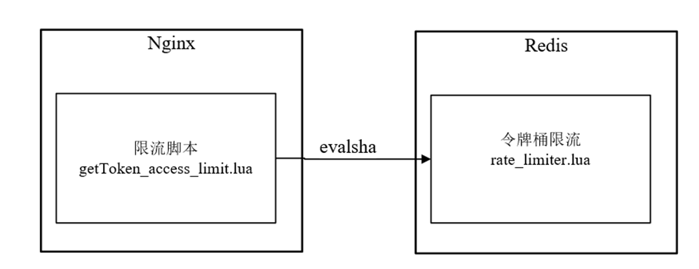

## why

但是Nginx的限流指令只能在同一块内存区域有效，而在生产场景中秒杀的外部网关往往是多节点部署，所以这就需要用到分布式限流组件。

高性能的分布式限流组件可以使用`Redis+Lua`来开发，京东的抢购就是使用`Redis+Lua`完成的限流。并且无论是Nginx外部网关还是Zuul内部网关，都可以使用`Redis+Lua`限流组件。

理论上，接入层的限流有多个维度：

1) 用户维度限流：在某一时间段内只允许用户提交一次请求，比如可以采取客户端IP或者用户ID作为限流的key。

2) 商品维度的限流：对于同一个抢购商品，在某个时间段内只允许一定数量的请求进入，可以采取秒杀商品ID作为限流的key。

### 什么时候用nginx限流

用户维度的限流，可以在nginx上进行，因为使用nginx限流内存来存储用户id，比用 redis 的key，来存储用户id，效率高。

### 什么时候用redis+lua分布式限流

商品维度的限流，可以在redis上进行，不需要大量的计算访问次数的key，另外，可以控制所有的接入层节点的访问秒杀请求的总量。

## redis+lua分布式限流组件

```shell
--- 此脚本的环境： redis 内部，不是运行在 nginx 内部

---方法：申请令牌
--- -1 failed
--- 1 success
--- @param key key 限流关键字
--- @param apply  申请的令牌数量
local function acquire(key, apply)
    local times = redis.call('TIME');
    -- times[1] 秒数   -- times[2] 微秒数
    local curr_mill_second = times[1] * 1000000 + times[2];
    curr_mill_second = curr_mill_second / 1000;

    local cacheInfo = redis.pcall("HMGET", key, "last_mill_second", "curr_permits", "max_permits", "rate")
    --- 局部变量：上次申请的时间
    local last_mill_second = cacheInfo[1];
    --- 局部变量：之前的令牌数
    local curr_permits = tonumber(cacheInfo[2]);
    --- 局部变量：桶的容量
    local max_permits = tonumber(cacheInfo[3]);
    --- 局部变量：令牌的发放速率
    local rate = cacheInfo[4];
    --- 局部变量：本次的令牌数
    local local_curr_permits = 0;

    if (type(last_mill_second) ~= 'boolean' and last_mill_second ~= nil) then
        -- 计算时间段内的令牌数
        local reverse_permits = math.floor(((curr_mill_second - last_mill_second) / 1000) * rate);
        -- 令牌总数
        local expect_curr_permits = reverse_permits + curr_permits;
        -- 可以申请的令牌总数
        local_curr_permits = math.min(expect_curr_permits, max_permits);
    else
        -- 第一次获取令牌
        redis.pcall("HSET", key, "last_mill_second", curr_mill_second)
        local_curr_permits = max_permits;
    end

    local result = -1;
    -- 有足够的令牌可以申请
    if (local_curr_permits - apply >= 0) then
        -- 保存剩余的令牌
        redis.pcall("HSET", key, "curr_permits", local_curr_permits - apply);
        -- 为下次的令牌获取，保存时间
        redis.pcall("HSET", key, "last_mill_second", curr_mill_second)
        -- 返回令牌获取成功
        result = 1;
    else
        -- 返回令牌获取失败
        result = -1;
    end
    return result
end
--eg
-- /usr/local/redis/bin/redis-cli  -a 123456  --eval   /vagrant/LuaDemoProject/src/luaScript/redis/rate_limiter.lua key , acquire 1  1

-- 获取 sha编码的命令
-- /usr/local/redis/bin/redis-cli  -a 123456  script load "$(cat  /vagrant/LuaDemoProject/src/luaScript/redis/rate_limiter.lua)"
-- /usr/local/redis/bin/redis-cli  -a 123456  script exists  "cf43613f172388c34a1130a760fc699a5ee6f2a9"

-- /usr/local/redis/bin/redis-cli -a 123456  evalsha   "cf43613f172388c34a1130a760fc699a5ee6f2a9" 1 "rate_limiter:seckill:1"  init 1  1
-- /usr/local/redis/bin/redis-cli -a 123456  evalsha   "cf43613f172388c34a1130a760fc699a5ee6f2a9" 1 "rate_limiter:seckill:1"  acquire 1

--local rateLimiterSha = "e4e49e4c7b23f0bf7a2bfee73e8a01629e33324b";

---方法：初始化限流 Key
--- 1 success
--- @param key key
--- @param max_permits  桶的容量
--- @param rate  令牌的发放速率
local function init(key, max_permits, rate)
    local rate_limit_info = redis.pcall("HMGET", key, "last_mill_second", "curr_permits", "max_permits", "rate")
    local org_max_permits = tonumber(rate_limit_info[3])
    local org_rate = rate_limit_info[4]

    if (org_max_permits == nil) or (rate ~= org_rate or max_permits ~= org_max_permits) then
        redis.pcall("HMSET", key, "max_permits", max_permits, "rate", rate, "curr_permits", max_permits)
    end
    return 1;
end
--eg
-- /usr/local/redis/bin/redis-cli -a 123456 --eval   /vagrant/LuaDemoProject/src/luaScript/redis/rate_limiter.lua key , init 1  1
-- /usr/local/redis/bin/redis-cli -a 123456 --eval   /vagrant/LuaDemoProject/src/luaScript/redis/rate_limiter.lua  "rate_limiter:seckill:1"  , init 1  1

---方法：删除限流 Key
local function delete(key)
    redis.pcall("DEL", key)
    return 1;
end
--eg
-- /usr/local/redis/bin/redis-cli  --eval   /vagrant/LuaDemoProject/src/luaScript/redis/rate_limiter.lua key , delete

local key = KEYS[1]
local method = ARGV[1]
if method == 'acquire' then
    return acquire(key, ARGV[2], ARGV[3])
elseif method == 'init' then
    return init(key, ARGV[2], ARGV[3])
elseif method == 'delete' then
    return delete(key)
else
    --ignore
end
```

在redis中，为了避免重复发送脚本数据浪费网络资源，可以使用`script load`命令进行脚本数据缓存，并且返回一个哈希码作为脚本的调用句柄，每次调用脚本只需要发送哈希码来调用即可。

## 商品维度的限流

当秒杀商品维度的限流，当商品的流量，远远大于涉及的流量时，开始随机丢弃请求。

Nginx的令牌桶限流脚本`getToken_access_limit.lua`执行在请求的access阶段，但是，该脚本并没有实现限流的核心逻辑，仅仅调用缓存在Redis内部的`rate_limiter.lua`脚本进行限流。

`getToken_access_limit.lua`脚本和`rate_limiter.lua`脚本的关系，具体如图所示。



什么时候在Redis中加载`rate_limiter.lua`脚本呢？

和秒杀脚本一样，该脚本是在Java程序启动商品秒杀时，完成其在Redis的加载和缓存的。

还有一点非常重要，Java程序会将脚本加载完成之后的sha1编码，去通过自定义的key（具体为`"lua:sha1:rate_limiter"`）缓存在Redis中，以方便Nginx的`getToken_access_limit.lua`脚本去获取，
并且在调用`evalsha`方法时使用。

注意：使用redis集群，因此每个节点都需要各自缓存一份脚本数据

```shell
/**
* 由于使用redis集群，因此每个节点都需要各自缓存一份脚本数据
* @param slotKey 用来定位对应的slot的slotKey
*/
public void storeScript(String slotKey){
if (StringUtils.isEmpty(unlockSha1) || !jedisCluster.scriptExists(unlockSha1, slotKey)){
   //redis支持脚本缓存，返回哈希码，后续可以继续用来调用脚本
    unlockSha1 = jedisCluster.scriptLoad(DISTRIBUTE_LOCK_SCRIPT_UNLOCK_VAL, slotKey);
   }
}
```


