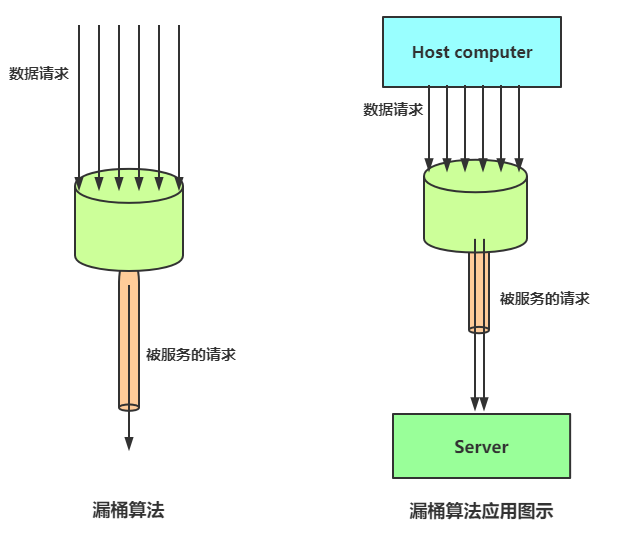
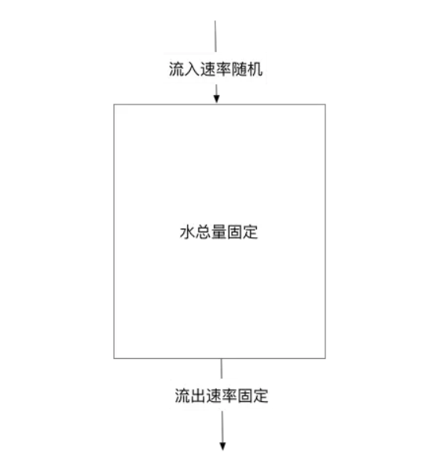

漏桶算法限流的基本原理为：水（对应请求）从进水口进入到漏桶里，漏桶以一定的速度出水（请求放行），当水流入速度过大，桶内的总水量大于桶容量会直接溢出，请求被拒绝。

大致的漏桶限流规则如下：

1) 进水口（对应客户端请求）以任意速率流入进入漏桶。
2) 漏桶的容量是固定的，出水（放行）速率也是固定的。
3) 漏桶容量是不变的，如果处理速度太慢，桶内水量会超出了桶的容量，则后面流入的水滴会溢出，表示请求拒绝。

## 漏桶算法原理

漏桶算法思路很简单：**水（请求）先进入到漏桶里，漏桶以一定的速度出水，当水流入速度过大会超过桶可接纳的容量时直接溢出。**

可以看出漏桶算法能强行限制数据的传输速率。



漏桶算法其实很简单，可以粗略的认为就是注水漏水过程，往桶中以任意速率流入水，以一定速率流出水，当水超过 **桶容量（capacity）** 则丢弃，因为桶容量是不变的，保证了整体的速率。



**削峰:** 有大量流量进入时,会发生溢出,从而限流保护服务可用。消费速度固定 因为计算性能固定

**缓冲:** 不至于直接请求到服务器, 缓冲压力

## 漏桶算法实现

```java
package com.crazymaker.springcloud.ratelimit;

import lombok.extern.slf4j.Slf4j;
import org.junit.Test;

import java.util.concurrent.CountDownLatch;
import java.util.concurrent.ExecutorService;
import java.util.concurrent.Executors;
import java.util.concurrent.atomic.AtomicInteger;

// 漏桶 限流
@Slf4j
public class LeakBucketLimiter {

    // 计算的起始时间
    private static long lastOutTime = System.currentTimeMillis();
    // 流出速率 每秒 2 次
    private static int leakRate = 2;
    // 桶的容量
    private static int capacity = 2;
    //剩余的水量
    private static AtomicInteger water = new AtomicInteger(0);

    //返回值说明：
    // false 没有被限制到
    // true 被限流
    public static synchronized boolean isLimit(long taskId, int turn) {
        // 如果是空桶，就当前时间作为漏出的时间
        if (water.get() == 0) {
            lastOutTime = System.currentTimeMillis();
            water.addAndGet(1);
            return false;
        }
        // 执行漏水
        int waterLeaked = ((int) ((System.currentTimeMillis() - lastOutTime) / 1000)) * leakRate;
        // 计算剩余水量
        int waterLeft = water.get() - waterLeaked;
        water.set(Math.max(0, waterLeft));
        // 重新更新leakTimeStamp
        lastOutTime = System.currentTimeMillis();
        // 尝试加水,并且水还未满 ，放行
        if ((water.get()) < capacity) {
            water.addAndGet(1);
            return false;
        } else {
            // 水满，拒绝加水， 限流
            return true;
        }
    }
    
    //线程池，用于多线程模拟测试
    private ExecutorService pool = Executors.newFixedThreadPool(10);

    @Test
    public void testLimit() {

        // 被限制的次数
        AtomicInteger limited = new AtomicInteger(0);
        // 线程数
        final int threads = 2;
        // 每条线程的执行轮数
        final int turns = 20;
        // 线程同步器
        CountDownLatch countDownLatch = new CountDownLatch(threads);
        long start = System.currentTimeMillis();
        for (int i = 0; i < threads; i++) {
            pool.submit(() ->
            {
                try {
                    for (int j = 0; j < turns; j++) {
                        long taskId = Thread.currentThread().getId();
                        boolean intercepted = isLimit(taskId, j);
                        if (intercepted) {
                            // 被限制的次数累积
                            limited.getAndIncrement();
                        }
                        Thread.sleep(200);
                    }
                } catch (Exception e) {
                    e.printStackTrace();
                }
                //等待所有线程结束
                countDownLatch.countDown();
            });
        }
        try {
            countDownLatch.await();
        } catch (InterruptedException e) {
            e.printStackTrace();
        }
        float time = (System.currentTimeMillis() - start) / 1000F;
        //输出统计结果

        log.info("限制的次数为：" + limited.get() + ",通过的次数为：" + (threads * turns - limited.get()));
        log.info("限制的比例为：" + (float) limited.get() / (float) (threads * turns));
        log.info("运行的时长为：" + time);
    }
}
```

## 漏桶的问题

漏桶的出水速度固定，也就是请求放行速度是固定的。

网上抄来抄去的说法：漏桶不能有效应对突发流量，但是能起到平滑突发流量（整流）的作用。

实际上的问题：漏桶出口的速度固定，不能灵活的应对后端能力提升。比如，通过动态扩容，后端流量从1000QPS提升到1WQPS，漏桶没有办法。