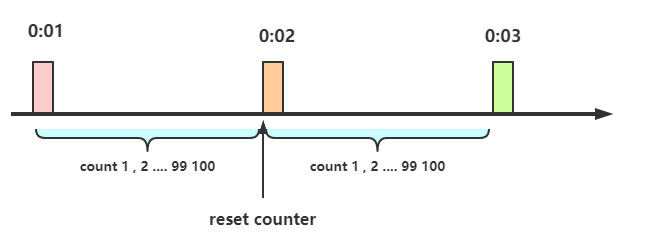
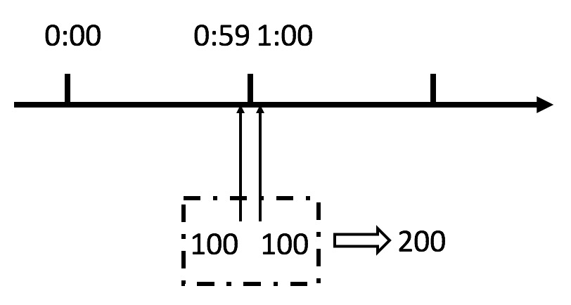

## 计数器限流定义

计数器算法又名固定窗口算法

在一段时间间隔内（时间窗/时间区间），处理请求的最大数量固定，超过部分不做处理。简单粗暴,比如指定线程池大小，指定数据库连接池大小、nginx连接数等,这都属于计数器算法。计数器算法是限流算法里最简单也是最容易实现的一种算法。

举个例子,比如我们规定对于A接口，我们1分钟的访问次数不能超过100个。

那么我们可以这么做：

* 在一开始的时候，我们可以设置一个计数器`counter`，每当一个请求过来的时候，`counter`就加1，如果`counter`的值大于100并且该请求与第一个请求的间隔时间还在1分钟之内，那么说明请求数过多,拒绝访问；

* 如果该请求与第一个请求的间隔时间大于1分钟，且`counter`的值还在限流范围内，那么就重置`counter`,就是这么简单粗暴。



## 计算器限流的实现

```java
package com.crazymaker.springcloud.ratelimit;

import lombok.extern.slf4j.Slf4j;
import org.junit.Test;
import java.util.concurrent.CountDownLatch;
import java.util.concurrent.ExecutorService;
import java.util.concurrent.Executors;
import java.util.concurrent.atomic.AtomicInteger;
import java.util.concurrent.atomic.AtomicLong;

// 计速器 限速
@Slf4j
public class CounterLimiter {

    // 起始时间
    private static long startTime = System.currentTimeMillis();
    // 时间区间的时间间隔 ms
    private static long interval = 1000;
    // 每秒限制数量
    private static long maxCount = 2;
    //累加器
    private static AtomicLong accumulator = new AtomicLong();

    // 计数判断, 是否超出限制
    private static long tryAcquire(long taskId, int turn) {
        long nowTime = System.currentTimeMillis();
        //在时间区间之内
        if (nowTime < startTime + interval) {
            long count = accumulator.incrementAndGet();

            if (count <= maxCount) {
                return count;
            } else {
                return -count;
            }
        } else {
            //在时间区间之外
            synchronized (CounterLimiter.class) {
                log.info("新时间区到了,taskId{}, turn {}..", taskId, turn);
                // 再一次判断，防止重复初始化
                if (nowTime > startTime + interval) {
                    accumulator.set(0);
                    startTime = nowTime;
                }
            }
            return 0;
        }
    }

    //线程池，用于多线程模拟测试
    private ExecutorService pool = Executors.newFixedThreadPool(10);

    @Test
    public void testLimit() {
        // 被限制的次数
        AtomicInteger limited = new AtomicInteger(0);
        // 线程数
        final int threads = 2;
        // 每条线程的执行轮数
        final int turns = 20;
        // 同步器
        CountDownLatch countDownLatch = new CountDownLatch(threads);
        long start = System.currentTimeMillis();
        for (int i = 0; i < threads; i++) {
            pool.submit(() ->
            {
                try {
                    for (int j = 0; j < turns; j++) {
                        long taskId = Thread.currentThread().getId();
                        long index = tryAcquire(taskId, j);
                        if (index <= 0) {
                            // 被限制的次数累积
                            limited.getAndIncrement();
                        }
                        Thread.sleep(200);
                    }
                } catch (Exception e) {
                    e.printStackTrace();
                }
                //等待所有线程结束
                countDownLatch.countDown();

            });
        }
        try {
            countDownLatch.await();
        } catch (InterruptedException e) {
            e.printStackTrace();
        }
        float time = (System.currentTimeMillis() - start) / 1000F;
        //输出统计结果

        log.info("限制的次数为：" + limited.get() + ",通过的次数为：" + (threads * turns - limited.get()));
        log.info("限制的比例为：" + (float) limited.get() / (float) (threads * turns));
        log.info("运行的时长为：" + time);
    }
}
```

## 计数器限流的严重问题

这个算法虽然简单，但是有一个十分致命的问题，那就是临界问题，我们看下图：



从上图中我们可以看到，假设有一个恶意用户，他在`0:59`时，瞬间发送了100个请求，并且`1:00`又瞬间发送了100个请求，那么其实这个用户在1秒里面，瞬间发送了200个请求。

我们刚才规定的是1分钟最多100个请求（规划的吞吐量），也就是每秒钟最多1.7个请求，用户通过在时间窗口的重置节点处突发请求， 可以瞬间超过我们的速率限制。

用户有可能通过算法的这个漏洞，瞬间压垮我们的应用。
