## 第一代架构：双机热备模式

2011 年 6 月 12 日，系统投入试运行，发售京津城际 列车车票；2011 年 9 月 30 日，发售全路动车组车票；

2011 年底，发售全路列车车票，互联网正式成为铁路新的售票渠道。

互联网售票系统设计了缓存服务、用户管理、车票查询、订单及电子客票处理 等多个相对独立的业务分区，以及三级网络安全域，分别是外网、内网和客票网，系统的体系架构如图所示：

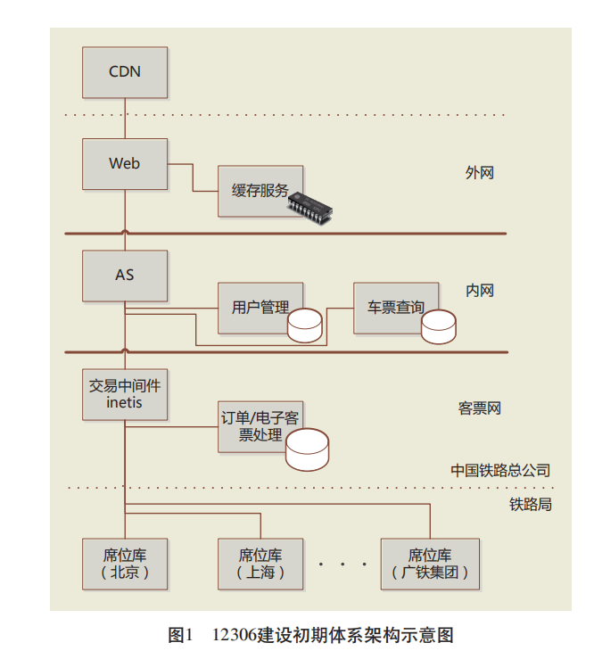

### 数据库的维度

用户管理、车票查询采用了传统的关系型数据库。

其中车票查询业务部署了多套负载均衡工作模式的数据库， 订单/电子客票处理业务采用了双机热备模式的数据库，上述数据库均运行在小型机平台上。

外网的车次、余票等缓存服务采用了基于内存计算的 NoSQL 数据 库，运行在 X86 平台上。

### 第一代架构的性能

上线前的压力测试，一笔流程包含用户登录、车票查询、下单及支付等业务操作，系统极限交易能力为`34张/s`，按按高峰期 10 h计算，售票量可达到`120万张/天`的设计能力。

### 第一代网络架构

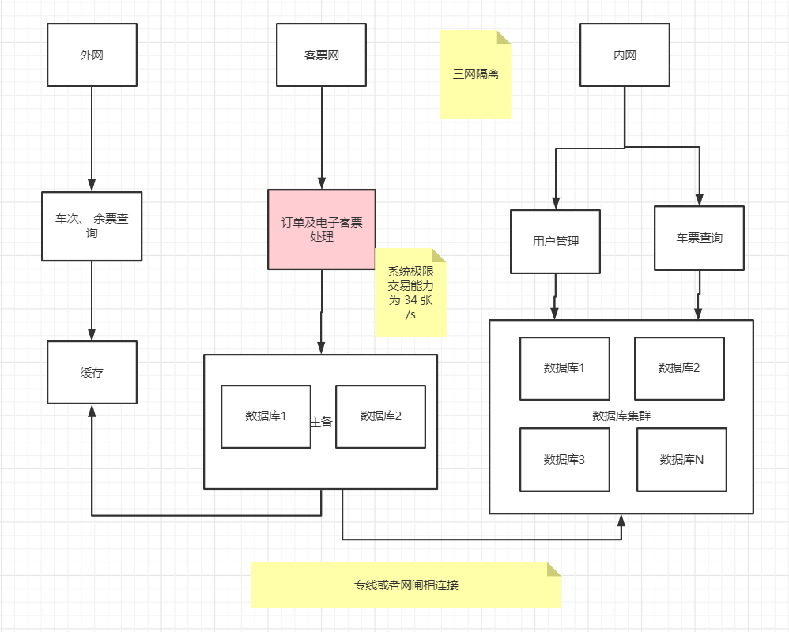

## 第二代架构：缓存提速+队列削峰+分库分表+读写分离

### 主要问题

2012 年春运期间，由于访问量超出设计预期， 12306 网站在高峰期出现了一系列问题：

* 页面打开缓慢
* 查询和下 单报错
* 后台系统过载
* 用户体验不佳

### 根因分析

#### （1）请求高峰（类似于秒杀）响应迟缓

放票时,高并发的下单集中在一起，形成请求高峰（类似于秒杀），请求导致订单 / 电子客票数据库负载过高，引起交易响应时间过长，造成 AS 以及 `inetis` 的交易线程池拥堵。

下单长时间不响应，同一次购买，用户会反复重试，从而加剧拥堵。由于响应时间过程，用户进而反复重试，一次操作变成多次，操作此时倍数增长，进一步 造成 `AS（Application Server）`的查询线程池拥堵,
导致响应时间进一步拉长

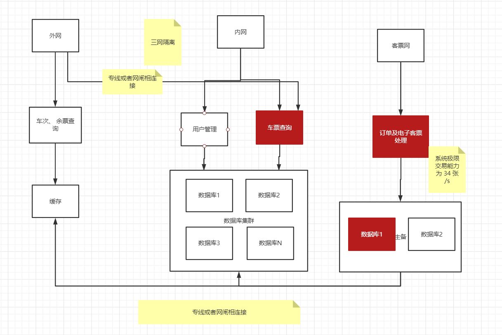

假如是`tomcat` ，设计了340条线程，1000人买票，数据库操作每秒34个订单，线程池就满了。

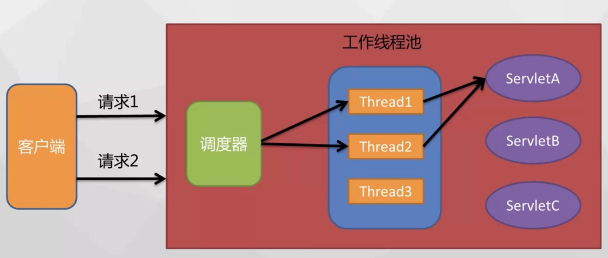

请求还需要在等待队列中排队。

```text
最大工作线程数，默认200。
server.tomcat.max-threads=200

最大连接数默认是10000
server.tomcat.max-connections=1000000

等待队列长度，默认100。
server.tomcat.accept-count=1000

最小工作空闲线程数，默认10。
server.tomcat.min-spare-threads=100
```

#### （2）请求高峰时 数据库负载过高

放票时(请求高峰时)下单请求、查询请求过多，导致订单 / 电子客票数据库负载过高，造成数据库连接数会被占满。

> 数据库的连接数是非常宝贵的系统资源，不可能无限增长，此时应用将无法再进行横向扩容，业务将无法继续发展。

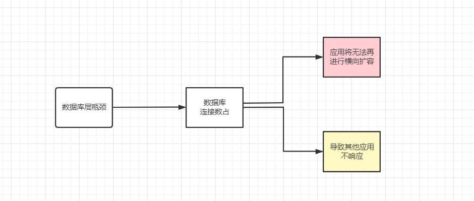

订单 / 电子客票数据库负载过高时，对线下车站的换票业务产生影响。

#### （3）级联雪崩

AS 线程池的拥堵进一步造成 Web 对外服务线程的拥堵，影响页面打开及业务逻辑处理，造 成页面打开速度缓慢和超时错误。

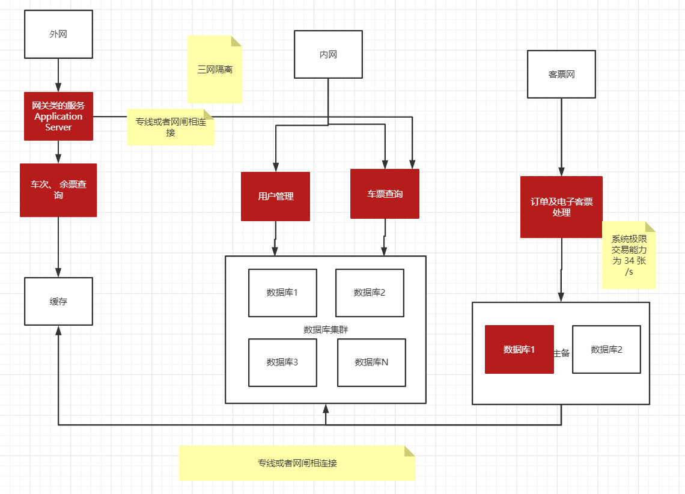

#### （4）连接过多，性能下降

响应时间拉长之后，导致内外网安全平台上在活动及新建连接过多，性能下降，也导致 Web 访问 AS 出错。

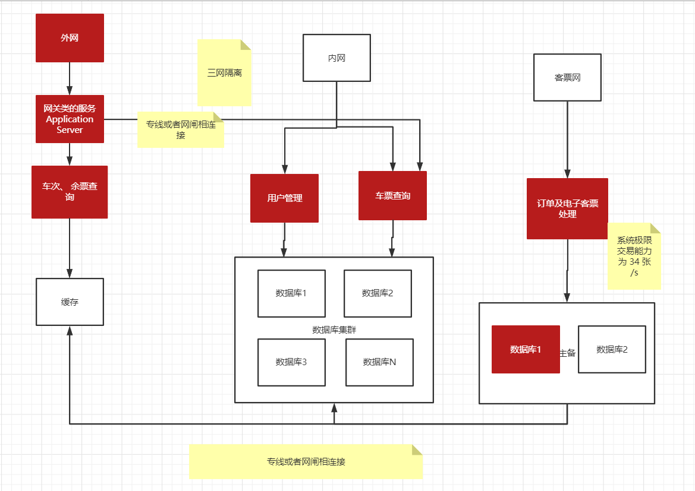

#### （5）部分用户不可用

为减轻网站压力，降低查询和下单的请求量，网站被迫降级运行，限制在线的登录用户数量，造成部分用户不能登录网站。

结合系统监控数据，梳理上述主要问题的原因和关联关系， 总结出主要问题：

> 是由于车票查询以及订单 / 电子客票业务分区处理能力不足，造成高峰期高并发访问请求下响 应时间过长，加之各个业务分区未能很好进行隔离，导致系统由内至外产生“雪崩”效应，造成网站拥堵，
> 影响用户的购票体验。

### 优化后的架构图

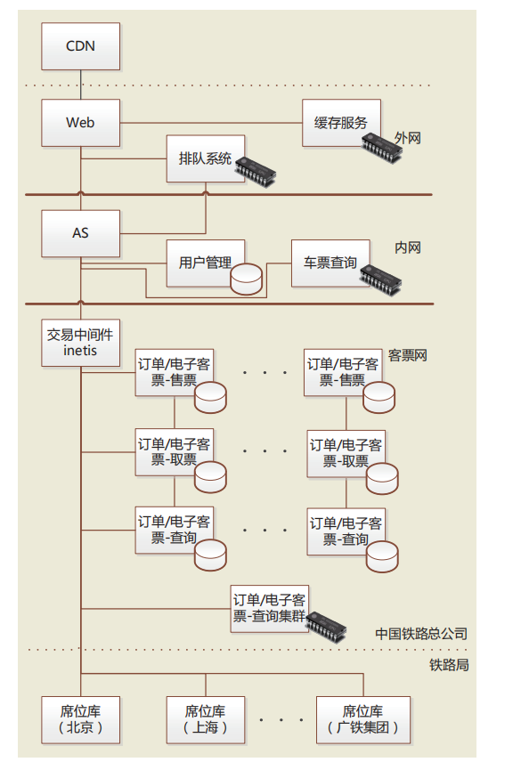

具体内容包括

#### （1）全面使用缓存

使用内存计算 NoSQL 数据库取代传统数据库，大幅提升车票并发查询能力，车票查询的 `TPS/QPS（Transaction/Query per Second）`由不足 1000 次 /s 提升至超过 20000 次 /s，
`RT（Response Time）`由原来的 1 s 缩减至 10 ms，使用户可以快速 获取到车次及余票情况。

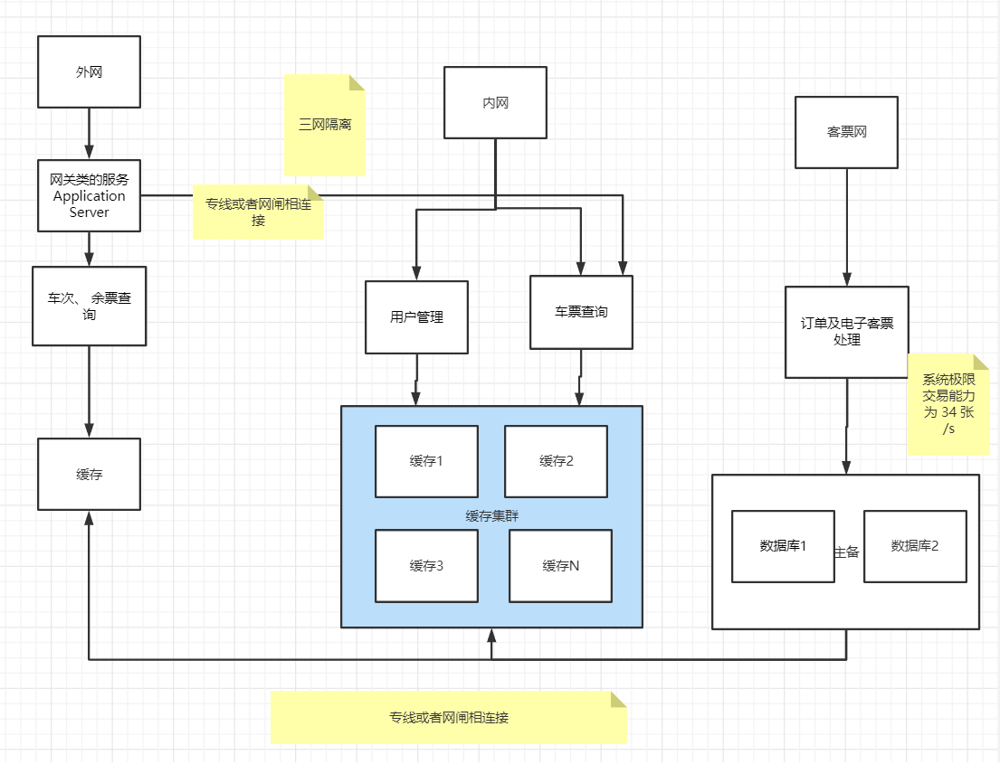

#### （2）队列削峰

构建交易处理排队系统，系统先通过队列 接收用户的下单请求，再根据后端处理能力异步地 处理队列中的下单请求。

队列的下单请求接收能力超过 10 万笔 / 秒，用户可以在售票高峰期迅速完成下单操作，等候系统依次处理，等候过程中可以查询排队状态（等候处理的时间）。

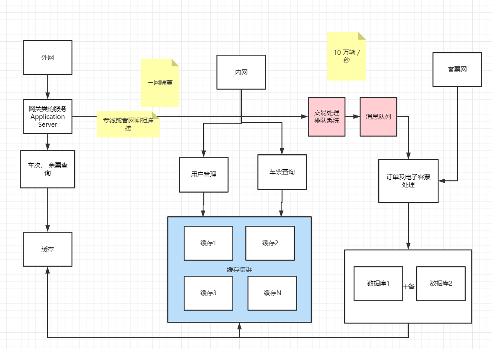

随后的下单操作（订票请·求）直接由排队系统压入队列处理，不同的车次 / 日期进入不同的队列， 订票请求不再直接面对内网核心交易系统。

具体实现时，考虑到车票查询结果有缓存延时，在订票请求进入队列前，还将实时查询车次余票，确有余票且当前排队人数不超过余票数量时才最终允许订票请求进入队列。

排队系统收到请求后，采用动态流量控制策略，即根据位于客票网各个铁路局客票中心的席位处理以及订单 / 电子客票集群处理 的响应时间，向 AS 提交用户的订票请求，
处理响应时间放慢，则提交速度放慢，反之则提高订票请求的提交速度。

#### （3）分库分表

对订单 / 电子客票进行分节点分库分表改造， 将原有的 1 个节点 1 个库 1 张表物理拆分为 3 个节点 30 个库 30 张表，线上相关操作按用户名 `HASH` 的方式被分散到各个节点和库表中，
有效提升了核心交易的处理能力并具备继续横向扩充能力，使用户在队列中的订票请求可以得到更快的响应和处理。

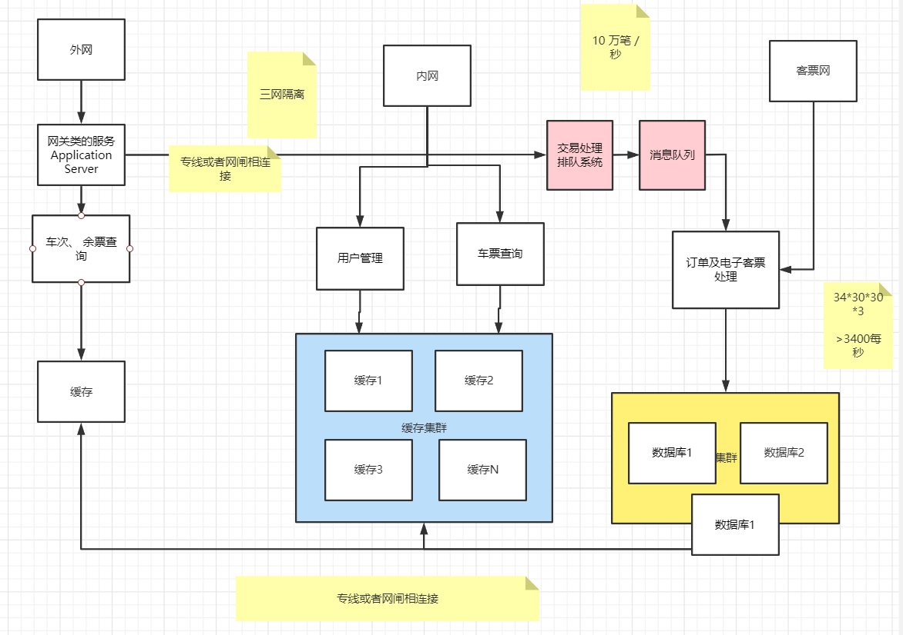

#### （4）读写分离

对订单 / 电子客票生成和查询进行了读写分离：

使用内存计算 NoSQL 数据库集中存 储订单 / 电子客票，提供以 `Key-Value` 为主的查询服 务，订单查询的 `TPS` 由 200 次 /s 左右提升至 5 000 次 /s 以上，大幅提升了订单 / 电子客票的查询效率。

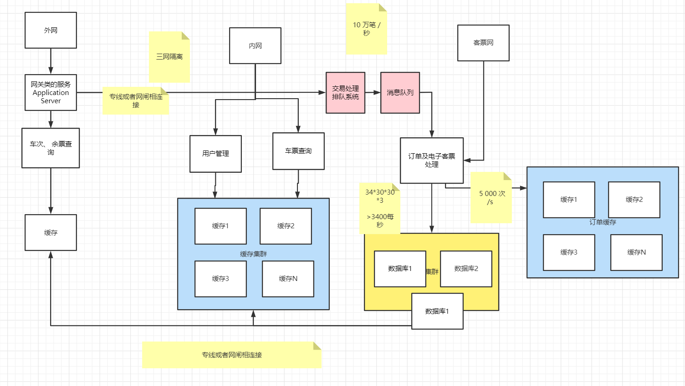

读写分离，避免了高并发、低延时要求的查询操作影响交易处理 ；

#### （5）架构解耦 读写隔离

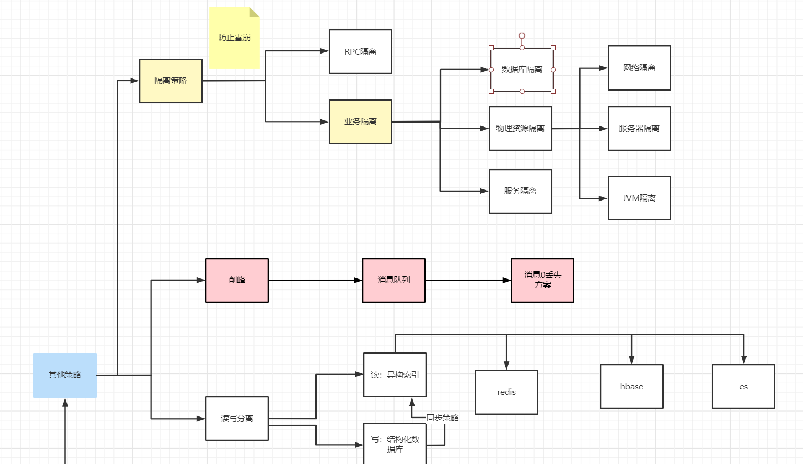

对订票、取票操作进行了业务隔离，由不同的业务节点（售票节点和取票节点）承载网上售票和线下取票业务 ；

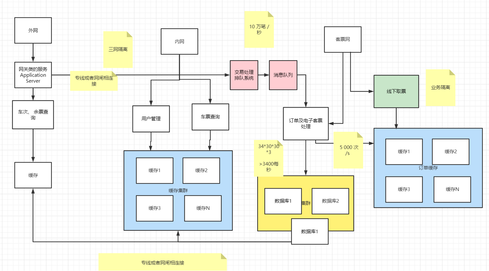

### 系统架构优化后的效果

优化架构后的系统在上线前压力的测试中，极限交易能力为 300 张 /s，可 以满足日售票量 500 万的业务需求。

2013 年春运，优化架构后的 12306 网站最高日 售票量达到 364 万，占全路售票量的 40%，售票量 为 2012 年春运最高峰（119 万）的 3 倍多

## 第三代架构：异地双活+公私结合

2013 年十一黄金周，12306 互联网售票量达到 了 460 万（到达系统瓶颈），再次接近系统处理的上限，且高峰期外网入口带宽紧张，已不能满足互联网售票量进一步 提升的需要。
此外，作为铁路售票的主要渠道，互联网售票系统单中心运行模式已不能满足业务安全性和可靠性的需求。

### 系统架构优化

为此，自 2013 年底起启动了 12306 网站的第 2 轮架构优化，优化目标旨在提高系统的安全可靠性，以及在高峰期具备处理容量的弹性扩充能力，具体内容包括:

**（1）加缓存**：将用户登录及常用联系人查询等业务迁移至内存数据库中，提高了相关业务的处理性能和可靠性。

**（2）IDC双活**：构建中国铁道科学研究院第 2 生产中心，与既有的中国铁路总公司第 1 生产中心间实现双活，提升网站的安全性和可靠性，并将订单 / 电子客票集群的处理能力提高 1 倍。

**（3）公私结合**：在公有云上部署车票查询服务，通过策略配置可随时将车票查询流量分流至公用云，以缓解在售票高峰期网站的处理资源和带宽压力。

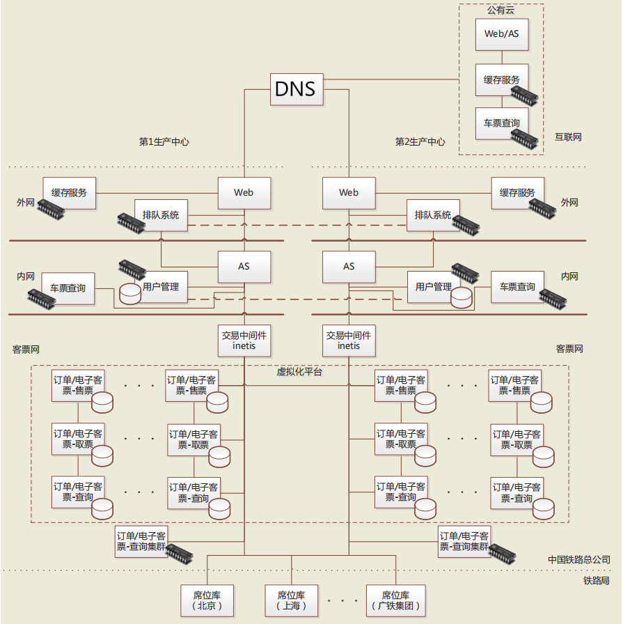

在双活架构的建设过程中，我们将订单 / 电子客 票集群完全迁移至 X86 虚拟化平台，并扩充至 10 组 节点，100 个库，100 张表。

上线前的压力测试验证了系统可以满足 1 000 万张 / 天的设计售票能力，在 2015 年春运高峰时段，实际售票速度超过了 1 000 张 /s（约 合 360 万张 /h）。

第 1 生产中心、第 2 生产中心间订 单 / 电子客票集群具备热切换能力，显著提高了系统 的故障隔离能力和系统的安全及可靠性。

公有云在 2015 年春运期间最高分流了 75% 的查询请求，网站 对外车票查询服务能力增加了 3 倍。

12306 网站在 2015 年春运高峰日处理了超过 180 亿 次车票查询服务，平均 TPS 超过 30 万次 /s。

## 参考文献

