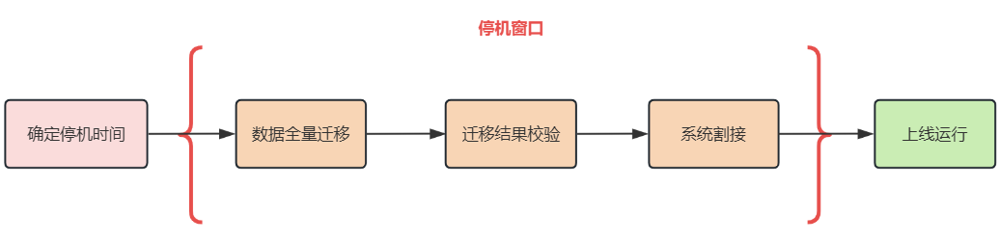
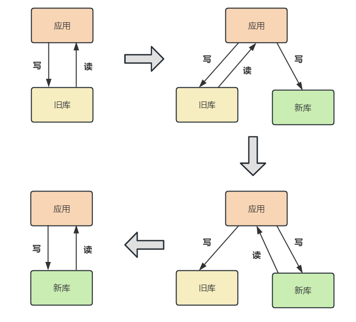
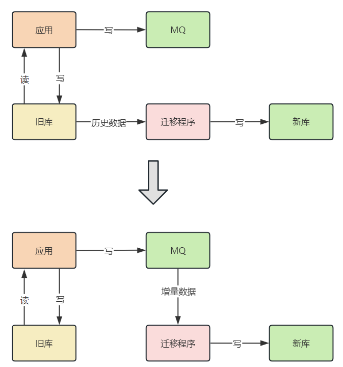

## 数据迁移目标

在一次数据迁移过程中，应该尽可能地去实现以下几个目标：

* **迁移应该是在线的** : 即迁移的同时还会有数据的写入;
* **数据应该是完整的** : 即迁移的数据正确无遗漏;
* **过程中应该可以回滚的** : 这样一旦迁移的过程中出现问题，可以立刻回滚到源库不会对系统的可用性造成影响;

无论同构还是异构数据库的迁移，下面解决方案都适用，只是在内部中需要对数据进行`清洗`、`去重`等处理：

## 解决方案 

### 停机迁移方案

**优点:**

此方案的优点是`方便快捷`、`操作简单`、`项目步骤少`、`易于规划与管理`。针对数据量较小或停机窗口时间充裕，可以在停机窗口内完成完整的准备、源库离线、数据库迁移、目标库上线、应用割接、UAT等操作，
并留有足够时间进行应用和数据库回切等风险保障手段的场景。

绝大部分非核心应用、中小规模企业应用、部门级应用等，都属于此方案的适用场景。

**缺点:**

对于数据量大和停机窗口时间紧凑的项目来说，这种方案很有可能会影响到业务的正常运行。

**疑问:**

如果通过`MySQL主从同步`方式或者`mysqldump工具`导出方式，迁移来说不是很快吗？

当然，在同构的、单库迁移单库的情况下，使用`MySQL主从同步`方式或者`mysqldump工具`导出方式会非常便捷迅速。

如果是异构的、单库迁移多库多表的情况就需要使用其他工具。

### 双写方案-同构

1. 将新的库配置为源库的`从库`，用来同步数据；

2. 同时，我们需要改造业务代码，在数据写入的时候，不仅要写入旧库，也要写入新库。

3. 然后，我们就可以开始校验数据了。由于数据库中数据量很大，做全量的数据校验不太现实。你可以抽取部分数据，具体数据量依据总体数据量而定，只要保证这些数据是一致的就可以。

4. 如果一切顺利，我们就可以将读流量切换到新库了。

   由于担心一次切换全量读流量可能会对系统产生未知的影响，所以这里 **最好采用灰度的方式来切换，** 比如开始切换 10% 的流量，如果没有问题再切换到 50% 的流量，最后再切换到 100%。

5. 由于有双写的存在，所以在切换的过程中出现任何的问题，都可以将读写流量随时切换到旧库去，保障系统的性能。

6. 在观察了几天发现数据的迁移没有问题之后，就可以将数据库的双写改造成只写新库，数据的迁移也就完成了。

**优点:**

迁移的过程可以随时回滚，将迁移的风险降到了最低。

**缺点:**

时间周期比较长，应用有改造的成本。

### 双写方案-异构

由于无法做到像从库一样去同步数据，所以只能借助第三方迁移工具来进行数据迁移。

