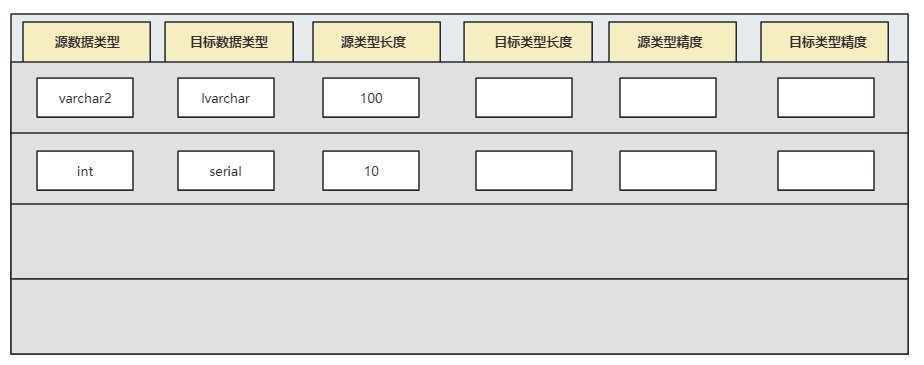
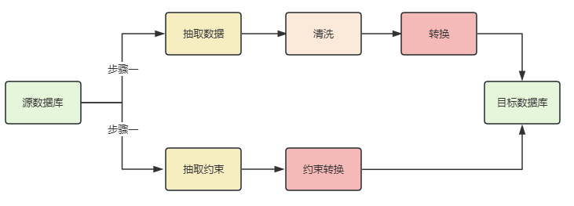

## 迁移对象

也叫元数据迁移。这部分涉及内容很多，也是最为复杂的部分。常见包括以下一些方面：

### ①字段类型

如果是异构系统迁移，需要建立新旧系统的字段映射关系。对于无法直接映射的部分，要考虑如何转化实现。特别需要注意的是精度问题，不同数据库产品的相同类型字段，其精度有可能有差异。此外，还有诸如符号位等问题。可以提前做一个映射表，既方便查看，也方便研发人员对照。
这部分也可利用一些工具辅助完成。

可以通过字段映射配置表进行规范映射关系和迁移精度的控制,通过XML JSON YML甚至TXT都可以,只要能明确规定字段类型间的映射关系:

### ②约束字段

作为常见的五大类约束（`PK`、`FK`、`UK`、`NULL`、`CHECK`），是否在新平台全部原样支持。此外有些平台原生就不完全支持，此时要考虑好解决对策。此外，如果应用使用了业务主键，也要考虑迁移后是否有影响。

例如:

* 对于`PK`和`UK`的迁移要特别注意,异构数据库之间往往对此的定义不同
  1. 例如在MySQL和Oracle可以对同一个字段同时设置`PK`和`UK`, But, GBase8s中就不可以(一个字段只允许一种索引,这是为了从根本上节约存储空间)

* 在MySQL中可以对一个字段使用`NOT NULL DEFAULT NULL`(也不知道为啥这样写), 在GBase8s中就不可以

对于这部分的迁移, 可以先进行迁移数据, 然后在迁移约束, 这样的速度会快一些

### ③特殊字段

在源或目标端，有一些特殊字段需要在对象迁移阶段给予关注。例如自增类型、分布键、分区键等。这些需要特殊考虑，往往需要人工指定。

* 在各个数据库厂商对与数据库自增类型、分布键、分区键的定义大不相同, 这里是转换的重灾区, 往往通过迁移工具实现自定义SQL转换的功能

### ④字符集问题

为避免出现导入后乱码等问题，需要在这个阶段就考虑。特别是如果目标端的字符集只能做到源端的子集的话，尤其需要注意。

* 最好在数据库层面就统一字符集, 你好, 我好, 大家好

### ⑤其他类型

其他诸如`临时表`、`虚拟列`、`序列`、`视图`、`存储过程`、`函数`、`触发器`、`索引`、`同义词`等。这些在源端与目标端往往在实现上存在较大差异，主要注意甄别并解决。这也是对象迁移阶段，工作量最大的部分。如部分确实无法对应，可考虑在应用端实现类似的逻辑。

* 这里是需要处理最多的部分, 像之前说过的`PK`和`UK`的问题, 索引可以和他们归为一类, 在同一个过程中迁移
* 函数、存储过程几乎无法做到百分百自动迁移, 除非通过转换语法识别后自定义转换, 例如通过 `Antlr4` 进行无法识别后转换。但是工作量太大, 而且需要开发人员对源数据库和目标数据库的存储过程绝对熟悉才能够胜任(之前有写过`Oracle -> GBase8s`的转换, 有空可以分享一波)
* 视图的迁移过程中, 会存在着依赖问题。有些数据库不会在视图创建的时候去检测依赖, 很可惜GBase8s会在创建时进行依赖的检查(不止视图,所有的对象都会)。我的解决办法是通过构建视图依赖树, 在迁移视图完成后, 遍历一下树即可, 接下来会讲