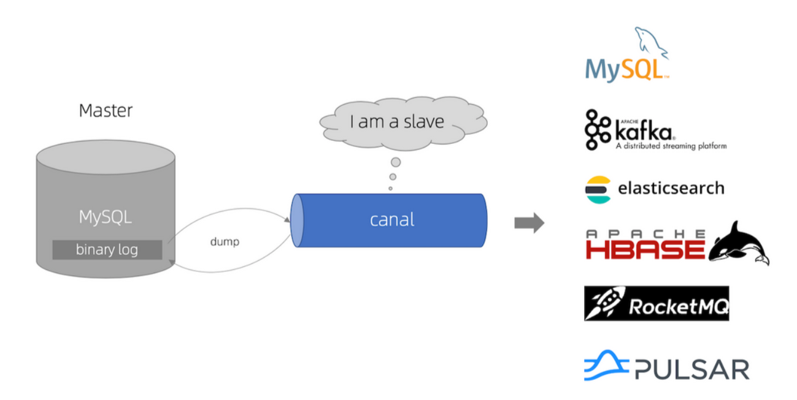
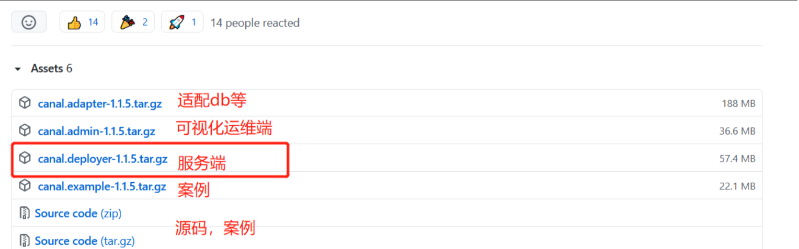
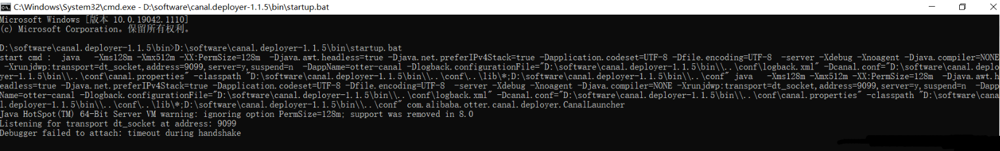
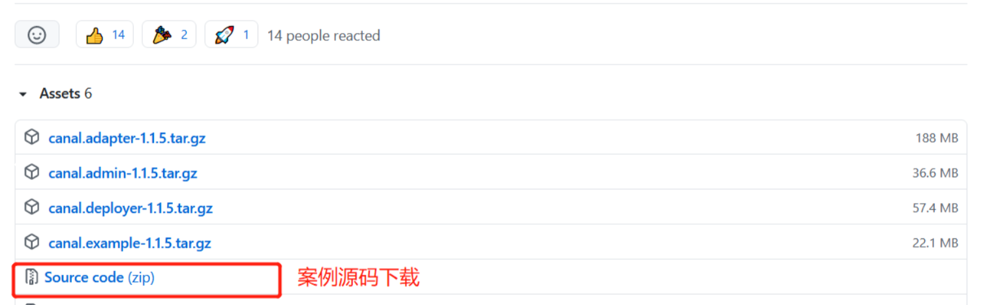
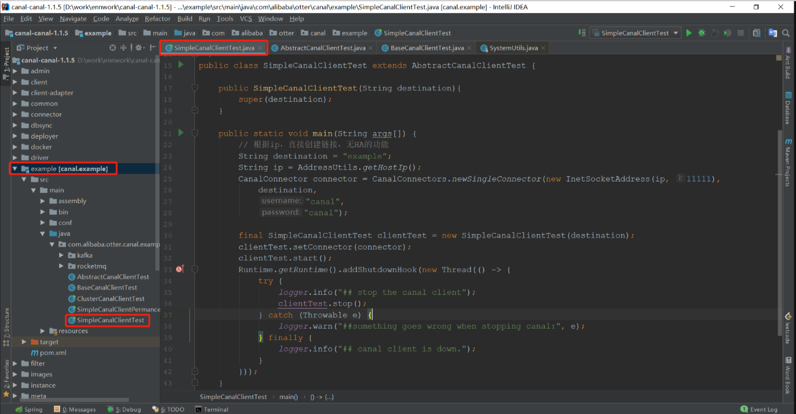
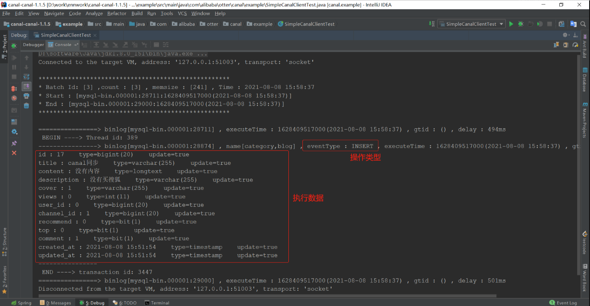

## 1. Canal概述

### 1.1 Canal简介

`Canal [kə’næl]`，译意为水道/管道/沟渠，主要用途是基于 MySQL 数据库增量日志解析，提供增量数据订阅和消费。

早期阿里巴巴因为杭州和美国双机房部署，存在跨机房同步的业务需求，实现方式主要是基于业务 `trigger` 获取增量变更。从 2010 年开始，业务逐步尝试数据库日志解析获取增量变更进行同步，
由此衍生出了大量的数据库增量订阅和消费业务。

基于日志增量订阅和消费的业务包括:

* 数据库镜像
* 数据库实时备份
* 索引构建和实时维护(拆分异构索引、倒排索引等)
* 业务 cache 刷新
* 带业务逻辑的增量数据处理

**[Canal](https://github.com/alibaba/Canal)要做的就是基于binlog实现增量而不是全量的数据同步。**

### 1.2 技术选型

基于`binlog`实现数据同步的方案有两种：
* **mysql-binlog-connector**：是通过引入依赖jar包实现，需要自行实现解析，但是相对轻量。
* **Canal**：是数据同步中间件，需要单独部署维护，功能强大，支持数据库及MQ的同步，维护成本高。

根据实际业务场景，按需索取，业务量小，业务简单，轻量可以通过`mysql-binlog-connector`，业务量大，逻辑复杂，有专门的运维团队，可以考虑`Canal`，比较经过阿里高并发验证，相对稳定。

### 1.3 原理分析

#### 1.3.1 MySQL主备复制原理


1. `MySQL master` 将数据变更写入二进制日志( `binary log`, 其中记录叫做二进制日志事件`binary log events`，可以通过 `show binlog events` 进行查看)
2. `MySQL slave` 将 `master` 的 `binary log events` 拷贝到它的中继日志(`relay log`)
3. `MySQL slave` 重放 `relay log` 中事件，将数据变更反映它自己的数据

#### 1.3.2 Canal原理

1. `Canal` 模拟 `MySQL slave` 的交互协议，伪装自己为 `MySQL slave` ，向 `MySQL master` 发送 `dump` 协议
2. `MySQL master` 收到 `dump` 请求，开始推送 `binary log` 给 `slave` (即 `Canal` )
3. `Canal` 解析 `binary log` 对象(原始为 `byte` 流)。



## 2. Canal安装配置

### 2.1 mysql环境准备

#### 1.mysql版本

当前的 Canal 支持源端 MySQL 版本包括 5.1.x , 5.5.x , 5.6.x , 5.7.x , 8.0.x。

### 2.2 mysql开启binlog


#### 1. 开启binlog

修改mysql配置文件`my.ini`。添加下配置：

* `log_bin=mysql-bin`
* `binlog-format=Row`


**注意：**

1. 该文件默认不允许修改，需要右键`“管理员取得所有权”`之后才能保存修改。

2. 切记不要修改错配置文件。需要注意的是图中的`my.ini`位于：`C:\ProgramData\MySQL\MySQL Server 5.7`，而不是位于：`C:\Program Files\MySQL\MySQL Server 5.7`。


#### 2. 重启mysql服务

直接找到服务重启即可

我的电脑->（右键）管理->服务与应用程序->服务->MYSQL->开启（停止、重启动）


**方式：**

```shell
net stop mysql
net start mysql
```


#### 3.binlog文件路径

若指定为绝对路径，则为指定路径：`log_bin=C:\mysql-binlog\mysql-bin`

若不指定绝对路径则默认当前目录下`Data`文件夹下：`log_bin=mysql-bin`

`binlog`文件：`mysql-bin.000001`

### 2.3 Canal下载

Canal下载地址：https://github.com/alibaba/Canal/releases



* **[Canal-admin](https://github.com/alibaba/Canal/wiki/Canal-Admin-Guide)**: 设计上是为Canal提供整体配置管理、节点运维等面向运维的功能，提供相对友好的WebUI操作界面，方便更多用户快速和安全的操作。

* **[Canal-adapter](https://github.com/alibaba/Canal/wiki/ClientAdapter)**: 增加客户端数据落地的适配及启动功能(支持HBase等)。

* **[Canal-deployer](https://github.com/alibaba/Canal/wiki/QuickStart)**: 这个就相当于Canal的服务端，启动它才可以在客户端接收数据库变更信息。

* **[ClientExample](https://github.com/alibaba/Canal/wiki/ClientExample)**: Java客户端案例

### 2.4 Canal配置启动

打开配置文件`conf/example/instance.properties`，配置数据库连接等信息如下：

```text
#################################################
## mysql serverId , v1.0.26+ will autoGen
# canal.instance.mysql.slaveId=0

# enable gtid use true/false
canal.instance.gtidon=false

# position info
canal.instance.master.address=127.0.0.1:3306
canal.instance.master.journal.name=
canal.instance.master.position=
canal.instance.master.timestamp=
canal.instance.master.gtid=

# rds oss binlog
canal.instance.rds.accesskey=
canal.instance.rds.secretkey=
canal.instance.rds.instanceId=

# table meta tsdb info
canal.instance.tsdb.enable=true
#canal.instance.tsdb.url=jdbc:mysql://127.0.0.1:3306/canal_tsdb
#canal.instance.tsdb.dbUsername=canal
#canal.instance.tsdb.dbPassword=canal

#canal.instance.standby.address =
#canal.instance.standby.journal.name =
#canal.instance.standby.position =
#canal.instance.standby.timestamp =
#canal.instance.standby.gtid=

# username/password
# 在MySQL服务器授权的账号密码字符集
canal.instance.dbUsername=root
canal.instance.dbPassword=123456
canal.instance.connectionCharset = UTF-8
# enable druid Decrypt database password
canal.instance.enableDruid=false
#canal.instance.pwdPublicKey=MFwwDQYJKoZIhvcNAQEBBQADSwAwSAJBALK4BUxdDltRRE5/zXpVEVPUgunvscYFtEip3pmLlhrWpacX7y7GCMo2/JM6LeHmiiNdH1FWgGCpUfircSwlWKUCAwEAAQ==

# table regex.*\\..*表示监听所有表 也可以写具体的表名，用，隔开
canal.instance.filter.regex=.*\\..*
# table black regex
# mysql 数据解析表的黑名单，多个表用，隔开
canal.instance.filter.black.regex=mysql\\.slave_.*
# table field filter(format: schema1.tableName1:field1/field2,schema2.tableName2:field1/field2)
#canal.instance.filter.field=test1.t_product:id/subject/keywords,test2.t_company:id/name/contact/ch
# table field black filter(format: schema1.tableName1:field1/field2,schema2.tableName2:field1/field2)
#canal.instance.filter.black.field=test1.t_product:subject/product_image,test2.t_company:id/name/contact/ch

# mq config
canal.mq.topic=example
# dynamic topic route by schema or table regex
#canal.mq.dynamicTopic=mytest1.user,mytest2\\..*,.*\\..*
canal.mq.partition=0
# hash partition config
#canal.mq.partitionsNum=3
#canal.mq.partitionHash=test.table:id^name,.*\\..*
#canal.mq.dynamicTopicPartitionNum=test.*:4,mycanal:6
#################################################
```

启动`canal.deployer-1.1.5\bin`路径下：`startup.bat`:



## 3. 实现验证

### 3.1 案例编码

案例源码下载：https://github.com/alibaba/canal/releases



maven工程，目录结构如下：



### 3.2 实现验证

启动项目，操作数据库，打印日志如下，与`Java监听mysql的binlog详解`(`mysql-binlog-connector`)特别相似，两种方式各有利弊。

