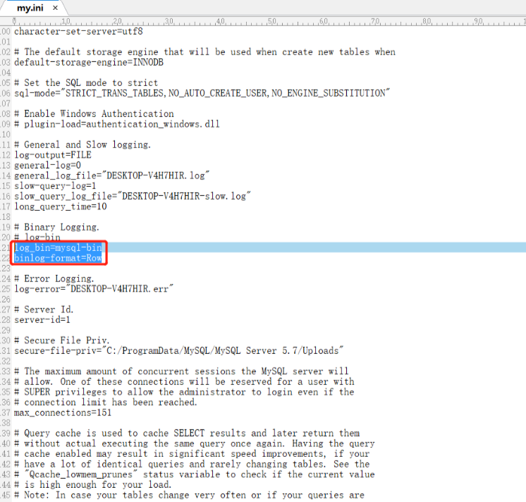
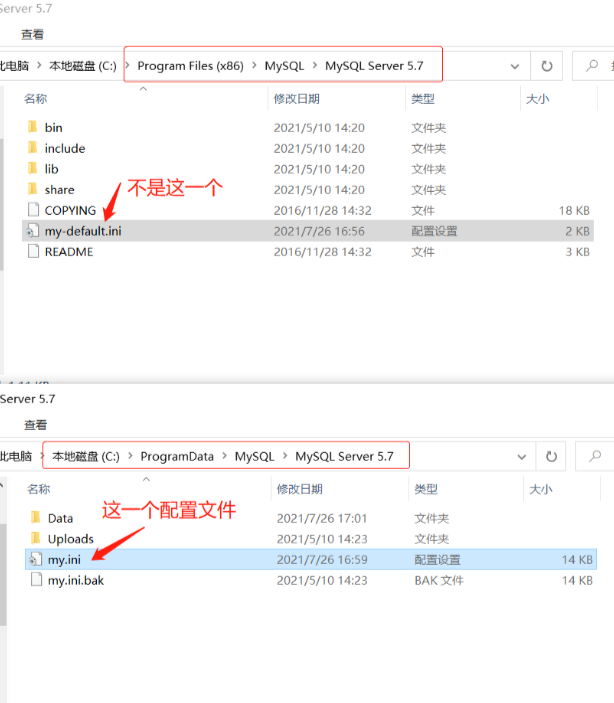
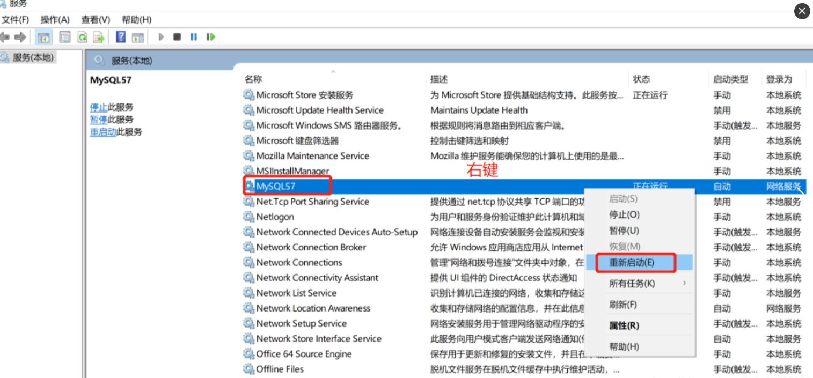
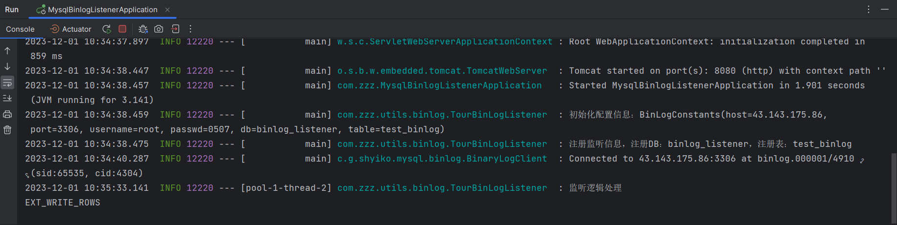

## 1. 需求概述

业务开发中经常需要根据一些数据变更实现相对应的操作。
例如，一些用户注销自己的账户，系统可以给用户自动发短信确认，这时有两种解决方案，一种是耦合到业务系统中，当用户执行注销操作的时候，执行发短信的操作，既是是通过MQ也是要耦合业务代码的，
第二种方案基于数据库层面的操作，通过监听`binlog`实现异步操作，这样就可以与业务系统解耦。

本篇主要介绍基于`mysql-binlog-connector`实现对数据库的监听，并集成springboot的方案。

## 2. 技术选型

基于`binlog`实现数据同步的方案有两种：

* **mysql-binlog-connector**: 是通过引入依赖jar包实现，需要自行实现解析，但是相对轻量。
* **Canal**: 是数据同步中间件，需要单独部署维护，功能强大，支持数据库及MQ的同步，维护成本高。

根据实际业务场景，按需索取，业务量小，业务简单，轻量可以通过`mysql-binlog-connector`，业务量大，逻辑复杂，有专门的运维团队，可以考虑`Canal`，比较经过阿里高并发验证，相对稳定。

## 3. 方案设计

1. 支持对不同数据库，不同表的配置监听。
2. 封装细节数据库，对外提供统一监听。
3. 讲结果集封装位方便操作数据结构。
4. 讲监听信息统一放入阻塞队列。
5. 实现多线程消费。

## 4.环境准备

### 4.1 查看是否开启binlog

```shell
1.正常开启状态
mysql> show variables like 'log_bin';
+---------------+-------+
| Variable_name | Value |
+---------------+-------+
| log_bin       | ON    |
+---------------+-------+
1 row in set (0.02 sec)
mysql> show binary logs;
+------------------+-----------+
| Log_name         | File_size |
+------------------+-----------+
| mysql-bin.000001 |       154 |
+------------------+-----------+
1 row in set (0.09 sec)

2.权限不足情况
mysql> show binary logs;
1227 - Access denied; you need (at least one of) the SUPER, REPLICATION CLIENT privilege(s) for this operation

3.未开启状态(默认情况下是不开启的)
mysql> show binary logs;
ERROR 1381 - You are not using binary logging
```

### 4.2 mysql开启binlog

#### 1. 开启binlog

修改mysql配置文件`my.ini`。添加下配置：

* `log_bin=mysql-bin`
* `binlog-format=Row`



**注意：**

1. 该文件默认不允许修改，需要右键`“管理员取得所有权”`之后才能保存修改。

2. 切记不要修改错配置文件。需要注意的是图中的`my.ini`位于：`C:\ProgramData\MySQL\MySQL Server 5.7`，而不是位于：`C:\Program Files\MySQL\MySQL Server 5.7`。



#### 2. 重启mysql服务

直接找到服务重启即可

我的电脑->（右键）管理->服务与应用程序->服务->MYSQL->开启（停止、重启动）



**方式：**

```shell
net stop mysql
net start mysql
```


#### 3.binlog文件路径

若指定为绝对路径，则为指定路径：`log_bin=C:\mysql-binlog\mysql-bin`

若不指定绝对路径则默认当前目录下`Data`文件夹下：`log_bin=mysql-bin`

`binlog`文件：`mysql-bin.000001`

## 5.代码实现

### 5.1 创建springboot项目

createProject->Spring Initializer

### 5.2 引入依赖

```xml
<?xml version="1.0" encoding="UTF-8"?>
<project xmlns="http://maven.apache.org/POM/4.0.0" xmlns:xsi="http://www.w3.org/2001/XMLSchema-instance"
         xsi:schemaLocation="http://maven.apache.org/POM/4.0.0 https://maven.apache.org/xsd/maven-4.0.0.xsd">
    <modelVersion>4.0.0</modelVersion>
    <parent>
        <groupId>org.springframework.boot</groupId>
        <artifactId>spring-boot-starter-parent</artifactId>
        <version>2.5.0</version>
        <relativePath/> <!-- lookup parent from repository -->
    </parent>
    <groupId>com.zrj</groupId>
    <artifactId>binlog</artifactId>
    <version>0.0.1-SNAPSHOT</version>
    <name>binlog</name>
    <description>Demo project for Spring Boot</description>
    <properties>
        <java.version>1.8</java.version>
    </properties>
    <dependencies>
        <dependency>
            <groupId>org.springframework.boot</groupId>
            <artifactId>spring-boot-starter-jdbc</artifactId>
        </dependency>
        <dependency>
            <groupId>org.springframework.boot</groupId>
            <artifactId>spring-boot-starter-web</artifactId>
        </dependency>
        <dependency>
            <groupId>org.mybatis.spring.boot</groupId>
            <artifactId>mybatis-spring-boot-starter</artifactId>
            <version>2.1.4</version>
        </dependency>
        <dependency>
            <groupId>mysql</groupId>
            <artifactId>mysql-connector-java</artifactId>
            <scope>runtime</scope>
        </dependency>
        <dependency>
            <groupId>org.springframework.boot</groupId>
            <artifactId>spring-boot-starter-test</artifactId>
            <scope>test</scope>
        </dependency>
        <dependency>
            <groupId>org.projectlombok</groupId>
            <artifactId>lombok</artifactId>
            <optional>true</optional>
        </dependency>
        <dependency>
            <groupId>cn.hutool</groupId>
            <artifactId>hutool-all</artifactId>
            <version>5.5.4</version>
            <scope>compile</scope>
        </dependency>

        <!-- https://mvnrepository.com/artifact/args4j/args4j -->
        <dependency>
            <groupId>args4j</groupId>
            <artifactId>args4j</artifactId>
            <version>2.33</version>
        </dependency>

        <!-- https://mvnrepository.com/artifact/com.google.guava/guava -->
        <dependency>
            <groupId>com.google.guava</groupId>
            <artifactId>guava</artifactId>
            <version>28.1-jre</version>
        </dependency>

        <!-- https://mvnrepository.com/artifact/org.apache.commons/commons-lang3 -->
        <dependency>
            <groupId>org.apache.commons</groupId>
            <artifactId>commons-lang3</artifactId>
            <version>3.9</version>
        </dependency>

        <!-- https://mvnrepository.com/artifact/com.github.shyiko/mysql-binlog-connector-java -->
        <dependency>
            <groupId>com.github.shyiko</groupId>
            <artifactId>mysql-binlog-connector-java</artifactId>
            <version>0.17.0</version>
        </dependency>

        <!-- https://mvnrepository.com/artifact/com.google.code.gson/gson -->
        <dependency>
            <groupId>com.google.code.gson</groupId>
            <artifactId>gson</artifactId>
            <version>2.8.5</version>
        </dependency>
    </dependencies>

    <build>
        <plugins>
            <plugin>
                <groupId>org.springframework.boot</groupId>
                <artifactId>spring-boot-maven-plugin</artifactId>
                <configuration>
                    <excludes>
                        <exclude>
                            <groupId>org.projectlombok</groupId>
                            <artifactId>lombok</artifactId>
                        </exclude>
                    </excludes>
                </configuration>
            </plugin>
        </plugins>
    </build>

</project
```

### 5.3 监听实现

#### 1. 配置文件

:::code-group
```yaml [application.yml]
spring:
  datasource:
    username: root
    password: root
    url: jdbc:mysql://43.143.175.86:3306/binlog_listener?useUnicode=true&characterEncoding=utf-8&useSSL=true&serverTimezone=UTC
    driver-class-name: com.mysql.jdbc.Driver

    hikari:
      pool-name: Retail_HikariCP #连接池名称
      minimum-idle: 10 #最小空闲连接数量
      idle-timeout: 120000 #空闲连接存活最大时间，默认600000（10分钟）
      maximum-pool-size: 20 #连接池最大连接数，默认是10
      auto-commit: true  #此属性控制从池返回的连接的默认自动提交行为,默认值：true
      max-lifetime: 1800000 #此属性控制池中连接的最长生命周期，值0表示无限生命周期，默认1800000即30分钟
      connection-timeout: 30000 #数据库连接超时时间,默认30秒，即30000
      connection-test-query: SELECT 1

mybatis:
  mapper-locations: classpath:mapper/*Mapper.xml
  type-aliases-package: com.zzz.utils

#showSql
logging:
  level:
    com:
      example:
        mapper : debug

# binlog listener
binlog:
  columns: # 订阅binlog数据库连接信息，ip，端口，用户密码（用户必须要有权限）
    host: 43.143.175.86
    port: 3306
    username: root
    passwd: root
  db: binlog_listener # 监听数据库
  table: test_binlog
```
:::

#### 2. 实体类

:::code-group
```java [BinLogConstants.Java]
/**
 * @author: Zzz
 * @date: 2023/10/26 15:17
 * @description: 配置监听信息
 */
@Data
@Component
public class BinLogConstants {
    @Value("${binlog.datasource.host}")
    private String host;

    @Value("${binlog.datasource.port}")
    private int port;

    @Value("${binlog.datasource.username}")
    private String username;

    @Value("${binlog.datasource.passwd}")
    private String passwd;

    @Value("${binlog.db}")
    private String db;

    @Value("${binlog.table}")
    private String table;

    public static final int CONSUMER_THREADS = 5;

    public static final long QUEUE_SLEEP = 1000;
}
```

```java [Colum.Java]
/**
 * @author: Zzz
 * @date: 2023/10/26 15:20
 * @description: 字段属性对象
 */
@Data
public class Colum {

    public int inx;
    public String colName; // 列名
    public String dataType; // 类型
    public String schema; // 数据库
    public String table; // 表
    public Colum(String schema, String table, int idx, String colName, String dataType) {
        this.schema = schema;
        this.table = table;
        this.colName = colName;
        this.dataType = dataType;
        this.inx = idx;
    }
}
```

```java [Conf.Java]
/**
 * @author: Zzz
 * @date: 2023/10/26 15:20
 * @description: 数据库配置
 */
@Data
@AllArgsConstructor
public class Conf {
    private String host;
    private int port;
    private String username;
    private String passwd;
}
```

```java [BinLogItem.Java]
/**
 * @author: Zzz
 * @date: 2023/10/26 15:28
 * @description: binlog对象
 */
@Data
public class BinLogItem implements Serializable {

    private static final long serialVersionUID = 5503152746318421290L;

    private String dbTable;
    private EventType eventType;
    private Long timestamp = null;
    private Long serverId = null;
    // 存储字段-之前的值之后的值
    private Map<String, Serializable> before = null;
    private Map<String, Serializable> after = null;
    // 存储字段--类型
    private Map<String, Colum> colums = null;

    /**
     * 新增或者删除操作数据格式化
     */
    public static BinLogItem itemFromInsertOrDeleted(Serializable[] row, Map<String, Colum> columMap, EventType eventType) {
        if (null == row || null == columMap) {
            return null;
        }
        if (row.length != columMap.size()) {
            return null;
        }
        // 初始化Item
        BinLogItem item = new BinLogItem();
        item.eventType = eventType;
        item.colums = columMap;
        item.before = Maps.newHashMap();
        item.after = Maps.newHashMap();

        Map<String, Serializable> beOrAf = Maps.newHashMap();

        columMap.entrySet().forEach(entry -> {
            String key = entry.getKey();
            Colum colum = entry.getValue();
            beOrAf.put(key, row[colum.inx]);
        });

        // 写操作放after，删操作放before
        if (isWrite(eventType)) {
            item.after = beOrAf;
        }
        if (isDelete(eventType)) {
            item.before = beOrAf;
        }

        return item;
    }

    /**
     * 更新操作数据格式化
     */
    public static BinLogItem itemFromUpdate(Map.Entry<Serializable[], Serializable[]> mapEntry, Map<String, Colum> columMap, EventType eventType) {
        if (null == mapEntry || null == columMap) {
            return null;
        }
        // 初始化Item
        BinLogItem item = new BinLogItem();
        item.eventType = eventType;
        item.colums = columMap;
        item.before = Maps.newHashMap();
        item.after = Maps.newHashMap();

        Map<String, Serializable> be = Maps.newHashMap();
        Map<String, Serializable> af = Maps.newHashMap();

        columMap.entrySet().forEach(entry -> {
            String key = entry.getKey();
            Colum colum = entry.getValue();
            be.put(key, mapEntry.getKey()[colum.inx]);

            af.put(key, mapEntry.getValue()[colum.inx]);
        });
        item.before = be;
        item.after = af;
        return item;
    }
    
}
```
:::

#### 3. 工具类

:::code-group
```java [BinLogUtils.Java]
/**
 * @author: Zzz
 * @date: 2023/10/26 15:42
 * @description: 监听工具
 */
@Slf4j
@Component
public class BinLogUtils {

    private static BinLogUtils binLogUtils;

//    @Resource
//    private SearchStoreLogoExtMapper searchStoreLogoExtMapper;

    @PostConstruct
    public void init() {
        binLogUtils = this;
//        binLogUtils.searchStoreLogoExtMapper = this.searchStoreLogoExtMapper;
    }

    /**
     * 拼接dbTable
     */
    public static String getdbTable(String db, String table) {
        return db + "-" + table;
    }

    /**
     * 获取columns集合
     */
    public static Map<String, Colum> getColMap(Conf conf, String db, String table) throws ClassNotFoundException {
        try {
            Class.forName("com.mysql.cj.jdbc.Driver");
            // 保存当前注册的表的colum信息
            Connection connection = DriverManager.getConnection("jdbc:mysql://" + conf.getHost() + ":" + conf.getPort(), conf.getUsername(), conf.getPasswd());
            // 执行sql
            String preSql = "SELECT TABLE_SCHEMA, TABLE_NAME, COLUMN_NAME, DATA_TYPE, ORDINAL_POSITION FROM INFORMATION_SCHEMA.COLUMNS WHERE TABLE_SCHEMA = ? and TABLE_NAME = ?";
            PreparedStatement ps = connection.prepareStatement(preSql);
            ps.setString(1, db);
            ps.setString(2, table);
            ResultSet rs = ps.executeQuery();
            Map<String, Colum> map = new HashMap<>(rs.getRow());
            while (rs.next()) {
                String schema = rs.getString("TABLE_SCHEMA");
                String tableName = rs.getString("TABLE_NAME");
                String column = rs.getString("COLUMN_NAME");
                int idx = rs.getInt("ORDINAL_POSITION");
                String dataType = rs.getString("DATA_TYPE");
                if (column != null && idx >= 1) {
                    map.put(column, new Colum(schema, tableName, idx - 1, column, dataType)); // sql的位置从1开始
                }
            }
            ps.close();
            rs.close();
            return map;
        } catch (SQLException e) {
            log.error("load db conf error, db_table={}:{} ", db, table, e);
        }
        return null;
    }

    /**
     * 根据table获取code
     *
     * @param table
     * @return java.lang.Integer
     */
    public static Integer getCodeByTable(String table) {
        if (StrUtil.isEmpty(table)) {
            return null;
        }
        return 1;
    }

    public static String getMsgByTab(String table) {
        if (StrUtil.isEmpty(table)) {
            return null;
        }
        return table;
    }

    /**
     * 根据DBTable获取table
     *
     * @param dbTable
     * @return java.lang.String
     */
    public static String getTable(String dbTable) {
        if (StrUtil.isEmpty(dbTable)) {
            return "";
        }
        String[] split = dbTable.split("-");
        if (split.length == 2) {
            return split[1];
        }
        return "";
    }

    /**
     * 将逗号拼接字符串转List
     *
     * @param str
     * @return
     */
    public static List<String> getListByStr(String str) {
        if (StrUtil.isEmpty(str)) {
            return Lists.newArrayList();
        }

        return Arrays.asList(str.split(","));
    }

    /**
     * 根据操作类型获取对应集合
     *
     * @param binLogItem
     * @return
     */
    public static Map<String, Serializable> getOptMap(BinLogItem binLogItem) {
        // 获取操作类型
        EventType eventType = binLogItem.getEventType();
        if (isWrite(eventType) || isUpdate(eventType)) {
            return binLogItem.getAfter();
        }
        if (isDelete(eventType)) {
            return binLogItem.getBefore();
        }
        return null;
    }

    /**
     * 获取操作类型
     *
     * @param binLogItem
     * @return
     */
    public static Integer getOptType(BinLogItem binLogItem) {
        // 获取操作类型
        EventType eventType = binLogItem.getEventType();
        if (isWrite(eventType)) {
            return 1;
        }
        if (isUpdate(eventType)) {
            return 2;
        }
        if (isDelete(eventType)) {
            return 3;
        }
        return null;
    }


    /**
     * 根据storeId获取imgUrl
     */
    public static String getImgUrl(Long storeId) {

        if (storeId == null) {
            return "";
        }
        //获取url
//        SearchStoreLogo searchStoreLogo = new SearchStoreLogo();
//        searchStoreLogo.setStoreId(storeId);
//        List<SearchStoreLogo> searchStoreLogos = binLogUtils.searchStoreLogoExtMapper.selectList(searchStoreLogo);
//        if (CollectionUtil.isNotEmpty(searchStoreLogos)) {
//            SearchStoreLogo storeLogo = searchStoreLogos.get(0);
//            if (storeLogo != null) {
//                return storeLogo.getStoreLogo();
//            }
//        }
        return "";
    }

    /**
     * 格式化date
     *
     * @param date
     * @return java.util.Date
     */
    public static Date getDateFormat(Date date) {
        if (date == null) {
            return null;
        }
        String dateFormat = "yyyy-MM-dd HH:mm:ss";
        String strDate = DateUtil.format(date, dateFormat);
        if (StrUtil.isEmpty(strDate)) {
            return null;
        }

        Date formatDate = DateUtil.parse(strDate, dateFormat);
        return formatDate;
    }

}
```
:::

#### 4. 监听类

:::code-group
```java [BinLogListener.Java]
/**
 * @author: Zzz
 * @date: 2023/10/26 15:46
 * @description: BinLogListener监听器
 */
@FunctionalInterface
public interface BinLogListener {

    void onEvent(BinLogItem item);

}
```

```java [MysqlBinLogListener.Java]
/**
 * @author: Zzz
 * @date: 2023/10/26 15:47
 * @description: 数据库监听器
 */
public class MysqlBinLogListener implements BinaryLogClient.EventListener {

    @Option(name = "-binlog-consume_threads", usage = "the thread num of consumer")
    private int consumerThreads = BinLogConstants.CONSUMER_THREADS;

    private BinaryLogClient parseClient;

    private BlockingQueue<BinLogItem> queue;
    private final ExecutorService consumer;

    // 存放每张数据表对应的listener
    private Multimap<String, BinLogListener> listeners;

    private Conf conf;
    private Map<String, Map<String, Colum>> dbTableCols;
    private String dbTable;

    /**
     * 监听器初始化
     *
     * @param conf
     */
    public MysqlBinLogListener(Conf conf) {
        BinaryLogClient client = new BinaryLogClient(conf.getHost(), conf.getPort(), conf.getUsername(), conf.getPasswd());
        EventDeserializer eventDeserializer = new EventDeserializer();
        //eventDeserializer.setCompatibilityMode(//序列化
        //        EventDeserializer.CompatibilityMode.DATE_AND_TIME_AS_LONG,
        //        EventDeserializer.CompatibilityMode.CHAR_AND_BINARY_AS_BYTE_ARRAY
        //);
        client.setEventDeserializer(eventDeserializer);
        this.parseClient = client;
        this.queue = new ArrayBlockingQueue<>(1024);
        this.conf = conf;
        this.listeners = ArrayListMultimap.create();
        this.dbTableCols = new ConcurrentHashMap<>();
        this.consumer = Executors.newFixedThreadPool(consumerThreads);
    }

    /**
     * 监听处理
     *
     * @param event
     */
    @Override
    public void onEvent(Event event) {
        EventType eventType = event.getHeader().getEventType();

        if (eventType == EventType.TABLE_MAP) {
            TableMapEventData tableData = event.getData();
            String db = tableData.getDatabase();
            String table = tableData.getTable();
            dbTable = getdbTable(db, table);
        }

        // 只处理添加删除更新三种操作
        if (isWrite(eventType) || isUpdate(eventType) || isDelete(eventType)) {
            if (isWrite(eventType)) {
                WriteRowsEventData data = event.getData();
                for (Serializable[] row : data.getRows()) {
                    if (dbTableCols.containsKey(dbTable)) {
                        BinLogItem item = BinLogItem.itemFromInsertOrDeleted(row, dbTableCols.get(dbTable), eventType);
                        item.setDbTable(dbTable);
                        queue.add(item);
                    }
                }
            }
            if (isUpdate(eventType)) {
                UpdateRowsEventData data = event.getData();
                for (Map.Entry<Serializable[], Serializable[]> row : data.getRows()) {
                    if (dbTableCols.containsKey(dbTable)) {
                        BinLogItem item = BinLogItem.itemFromUpdate(row, dbTableCols.get(dbTable), eventType);
                        item.setDbTable(dbTable);
                        queue.add(item);
                    }
                }

            }
            if (isDelete(eventType)) {
                DeleteRowsEventData data = event.getData();
                for (Serializable[] row : data.getRows()) {
                    if (dbTableCols.containsKey(dbTable)) {
                        BinLogItem item = BinLogItem.itemFromInsertOrDeleted(row, dbTableCols.get(dbTable), eventType);
                        item.setDbTable(dbTable);
                        queue.add(item);
                    }
                }
            }
        }
    }

    /**
     * 注册监听
     *
     * @param db       数据库
     * @param table    操作表
     * @param listener 监听器
     * @throws Exception
     */
    public void regListener(String db, String table, BinLogListener listener) throws Exception {
        String dbTable = getdbTable(db, table);
        // 获取字段集合
        Map<String, Colum> cols = getColMap(conf, db, table);
        // 保存字段信息
        dbTableCols.put(dbTable, cols);
        // 保存当前注册的listener
        listeners.put(dbTable, listener);
    }

    /**
     * 开启多线程消费
     *
     * @throws IOException
     */
    public void parse() throws IOException {
        parseClient.registerEventListener(this);

        for (int i = 0; i < consumerThreads; i++) {
            consumer.submit(() -> {
                while (true) {
                    if (queue.size() > 0) {
                        try {
                            BinLogItem item = queue.take();
                            String dbtable = item.getDbTable();
                            listeners.get(dbtable).forEach(binLogListener -> binLogListener.onEvent(item));
                        } catch (InterruptedException e) {
                            e.printStackTrace();
                        }
                    }
                    Thread.sleep(BinLogConstants.QUEUE_SLEEP);
                }
            });
        }
        parseClient.connect();
    }
}
```

```java [TourBinLogListener.Java]
/**
 * @author: Zzz
 * @date: 2023/10/26 15:49
 * @description: 乐游监听器
 * SpringBoot启动成功后的执行业务线程操作
 * CommandLineRunner去实现此操作
 * 在有多个可被执行的业务时，通过使用 @Order 注解，设置各个线程的启动顺序（value值由小到大表示启动顺序）。
 * 多个实现CommandLineRunner接口的类必须要设置启动顺序，不让程序启动会报错！
 */
@Slf4j
@Component
@Order(value = 1)
public class TourBinLogListener implements CommandLineRunner {

    @Resource
    private BinLogConstants binLogConstants;

    @Override
    public void run(String... args) throws Exception {
        log.info("初始化配置信息：" + binLogConstants.toString());

        // 初始化配置信息
        Conf conf = new Conf(binLogConstants.getHost(), binLogConstants.getPort(), binLogConstants.getUsername(), binLogConstants.getPasswd());

        // 初始化监听器
        MysqlBinLogListener mysqlBinLogListener = new MysqlBinLogListener(conf);

        // 获取table集合
        List<String> tableList = BinLogUtils.getListByStr(binLogConstants.getTable());
        if (CollectionUtil.isEmpty(tableList)) {
            return;
        }
        // 注册监听
        tableList.forEach(table -> {
            log.info("注册监听信息，注册DB：" + binLogConstants.getDb() + "，注册表：" + table);
            try {
                mysqlBinLogListener.regListener(binLogConstants.getDb(), table, item -> {
                    log.info("监听逻辑处理");
                    // 获取监听数据
                    EventType eventType = item.getEventType();
                    System.out.println(eventType);

                });
            } catch (Exception e) {
                log.error("BinLog监听异常：" + e);
            }
        });
        // 多线程消费
        mysqlBinLogListener.parse();
    }
}
```
:::

## 6.实现验证

启动应用，操作数据库。

