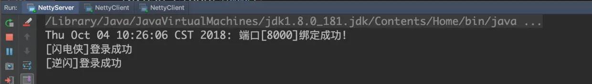
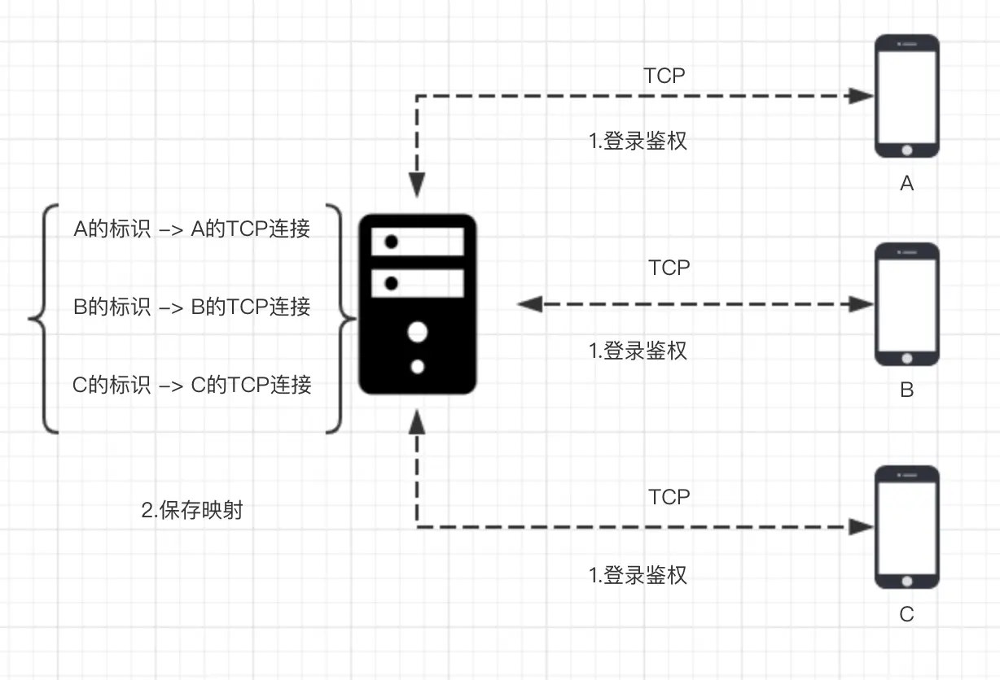

# 1. 最终效果

* 服务端



服务端启动之后，两个客户端陆续登录

* 客户端 1


* 客户端 2


1. 客户端启动之后，我们在控制台输入用户名，服务端随机分配一个 `userId` 给客户端，这里我们省去了通过账号密码注册的过程，`userId` 就在服务端随机生成了，生产环境中可能会持久化在数据库，然后每次通过账号密码去“捞”。

2. 当有两个客户端登录成功之后，在控制台输入`userId + 空格 + 消息`，这里的 `userId` 是消息接收方的标识， 消息接收方的控制台接着就会显示另外一个客户端发来的消息。

一对一单聊的本质其实就这么简单，稍加改动其实就可以用在生产环境下，下面，我们就来一起学习一下如何实现控制台一对一单聊

# 2. 一对一单聊原理

一对一单聊的原理我们在 `仿微信 IM 系统简介` 已经学习过，我们再来重温一下:



1. 如上图，`A` 要和 `B` 聊天，首先 `A` 和 `B` 需要与服务器建立连接，然后进行一次登录流程，服务端保存`用户标识`和 `TCP` 连接的映射关系。

2. `A` 发消息给 `B`，首先需要将带有 `B` 标识的消息数据包发送到服务器，然后服务器从消息数据包中拿到 `B` 的标识，找到对应的 `B` 的连接，将消息发送给 `B`。

原理掌握之后，接下来我们就来逐个实现这里面的逻辑

# 3. 一对一单聊实现

## 3.1 用户登录状态与 channel 的绑定

我们先来看一下，服务端在单聊实现中是如何处理登录消息的

:::code-group
```java [LoginRequestHandler.java]
// 我们略去了非关键部分的代码，详细可以本地更新下代码，切换到本小节名称对应的 git 分支
protected void channelRead0(ChannelHandlerContext ctx, LoginRequestPacket loginRequestPacket) {
    LoginResponsePacket loginResponsePacket = xxx;
    String userId = randomUserId();
    loginResponsePacket.setUserId(userId);
    SessionUtil.bindSession(new Session(userId, loginRequestPacket.getUserName()), ctx.channel());

    // 登录响应
    ctx.channel().writeAndFlush(loginResponsePacket);
}

// 用户断线之后取消绑定
public void channelInactive(ChannelHandlerContext ctx) {
    SessionUtil.unBindSession(ctx.channel());
}
```
:::

登录成功之后，服务端创建一个 `Session` 对象，这个对象表示用户当前的会话信息，在我们这个应用程序里面，`Session` 只有两个字段:


