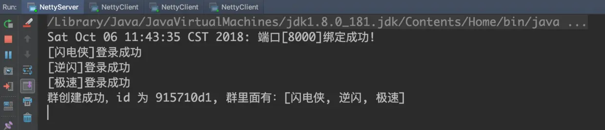
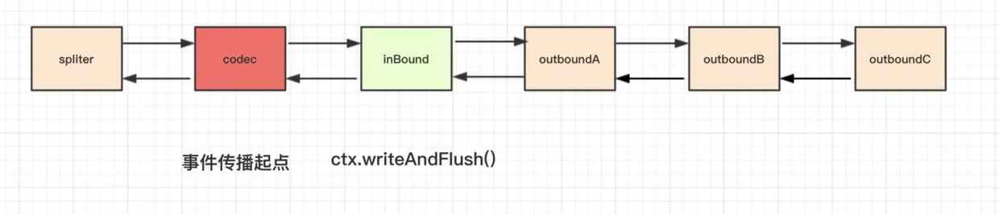
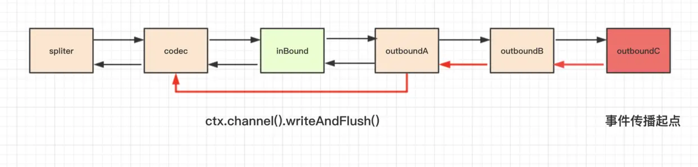

# 1. 群聊消息最终效果

* 服务端



闪电侠，逆闪，极速先后登录，然后闪电侠拉逆闪，极速和自己加入群聊，下面，我们来看一下各位客户端的控制台界面

* 客户端 - 闪电侠


闪电侠第一个输入 `sendToGroup` 发送群消息。

* 客户端 - 逆闪


逆闪第二个输入 `sendToGroup` 发送群消息，在前面已经收到了闪电侠的消息。

* 客户端 - 极速


逆闪最后一个输入 `sendToGroup` 发送消息，在前面已经收到了闪电侠和逆闪的消息。

1. 在闪电侠的控制台，输入 `sendToGroup` 指令之后，再输入 `groupId + 空格 + 消息内容`，发送消息给群里各位用户，随后，群组里的所有用户的控制台都显示了群消息。

2. 随后，陆续在逆闪和极速的控制台做做相同的操作，群组里的所有用户的控制台陆续展示了群消息。

这个实现过程和我们前面的套路一样，下面我们仅关注核心实现部分。

# 2. 群聊消息的收发的实现

核心实现部分其实就是服务端处理群消息的 `handler - GroupMessageRequestHandler`:

:::code-group
```java [GroupMessageRequestHandler.java]
public class GroupMessageRequestHandler extends SimpleChannelInboundHandler<GroupMessageRequestPacket> {
    @Override
    protected void channelRead0(ChannelHandlerContext ctx, GroupMessageRequestPacket requestPacket) {
        // 1.拿到 groupId 构造群聊消息的响应
        String groupId = requestPacket.getToGroupId();
        GroupMessageResponsePacket responsePacket = new GroupMessageResponsePacket();
        responsePacket.setFromGroupId(groupId);
        responsePacket.setMessage(requestPacket.getMessage());
        responsePacket.setFromUser(SessionUtil.getSession(ctx.channel()));


        // 2. 拿到群聊对应的 channelGroup，写到每个客户端
        ChannelGroup channelGroup = SessionUtil.getChannelGroup(groupId);
        channelGroup.writeAndFlush(responsePacket);
    }
}
```
:::

1. 首先，通过 `groupId` 构造群聊响应 `GroupMessageResponsePacket`，然后再把发送群聊的用户信息填入，这里的用户信息我们就直接复用与 `channel` 绑定的 `session了`。

2. 然后，我们拿到对应群组的 `ChannelGroup`，通过 `writeAndFlush()` 写到客户端。

## 3. 共享 handler

在使用 `Netty` 完成了一个 `IM` 系统的核心功能之后，我们再来仔细看一下服务端:

:::code-group
```java [NettyServer.java]
serverBootstrap.childHandler(new ChannelInitializer<NioSocketChannel>() {
    protected void initChannel(NioSocketChannel ch) {
        ch.pipeline().addLast(new Spliter());
        ch.pipeline().addLast(new PacketDecoder());
        ch.pipeline().addLast(new LoginRequestHandler());
        ch.pipeline().addLast(new AuthHandler());
        ch.pipeline().addLast(new MessageRequestHandler());
        ch.pipeline().addLast(new CreateGroupRequestHandler());
        ch.pipeline().addLast(new JoinGroupRequestHandler());
        ch.pipeline().addLast(new QuitGroupRequestHandler());
        ch.pipeline().addLast(new ListGroupMembersRequestHandler());
        ch.pipeline().addLast(new GroupMessageRequestHandler());
        ch.pipeline().addLast(new LogoutRequestHandler());
        ch.pipeline().addLast(new PacketEncoder());
    }
});
```
:::

1. 我们看到，服务端的 `pipeline` 链里面已经有 `12` 个 `handler`，其中，与指令相关的 `handler` 有 `9` 个。

2. `Netty` 在这里的逻辑是：每次有新连接到来的时候，都会调用 `ChannelInitializer` 的 `initChannel()` 方法，然后这里 `9` 个指令相关的 handler 都会被 `new` 一次。

3. 我们可以看到，其实这里的每一个指令 `handler`，他们内部都是没有成员变量的，也就是说是无状态的，我们完全可以使用单例模式，即调用 `pipeline().addLast()` 方法的时候，都直接使用单例，不需要每次都 `new`，提高效率，也避免了创建很多小的对象。

比如，我们拿 `LoginRequestHandler` 举例，来看一下如何改造:

:::code-group
```java [LoginRequestHandler.java]
// 1. 加上注解标识，表明该 handler 是可以多个 channel 共享的
@ChannelHandler.Sharable
public class LoginRequestHandler extends SimpleChannelInboundHandler<LoginRequestPacket> {

    // 2. 构造单例
    public static final LoginRequestHandler INSTANCE = new LoginRequestHandler();

    protected LoginRequestHandler() {
    }

}
```
:::

1. 首先，非常重要的一点，如果一个 `handler` 要被多个 `channel` 进行共享，必须要加上 `@ChannelHandler.Sharable` 显示地告诉 `Netty`，这个 `handler` 是支持多个 `channel` 共享的，否则会报错，读者可以自行尝试一下。

2. 然后，我们仿照 `Netty` 源码里面单例模式的写法，构造一个单例模式的类。

接着，我们在服务端的代理里面就可以这么写:

:::code-group
```java [NettyServer.java]
serverBootstrap.childHandler(new ChannelInitializer<NioSocketChannel>() {
    protected void initChannel(NioSocketChannel ch) {
        // ...单例模式，多个 channel 共享同一个 handler
        ch.pipeline().addLast(LoginRequestHandler.INSTANCE);
        // ...
    }
});
```
:::

这样的话，每来一次新的连接，添加 `handler` 的时候就不需要每次都 `new` 了，剩下的 `8` 个 指令，读者可以自行尝试改造一下。

# 4. 压缩 handler - 合并编解码器

当我们改造完了之后，我们再来看一下服务端代码:

:::code-group
```java [NettyServer.java]
serverBootstrap.childHandler(new ChannelInitializer<NioSocketChannel>() {
    protected void initChannel(NioSocketChannel ch) {
        ch.pipeline().addLast(new Spliter());
        ch.pipeline().addLast(new PacketDecoder());
        ch.pipeline().addLast(LoginRequestHandler.INSTANCE);
        ch.pipeline().addLast(AuthHandler.INSTANCE);
        ch.pipeline().addLast(MessageRequestHandler.INSTANCE);
        ch.pipeline().addLast(CreateGroupRequestHandler.INSTANCE);
        ch.pipeline().addLast(JoinGroupRequestHandler.INSTANCE);
        ch.pipeline().addLast(QuitGroupRequestHandler.INSTANCE);
        ch.pipeline().addLast(ListGroupMembersRequestHandler.INSTANCE);
        ch.pipeline().addLast(GroupMessageRequestHandler.INSTANCE);
        ch.pipeline().addLast(LogoutRequestHandler.INSTANCE);
        ch.pipeline().addLast(new PacketEncoder());
    }
});
```
:::

`pipeline` 中第一个 `handler - Spliter`，我们是无法动它的，因为他内部实现是与每个 `channel` 有关，每个 `Spliter` 需要维持每个 `channel` 当前读到的数据，也就是说他是有状态的。 
而 PacketDecoder 与 `PacketEncoder` 我们是可以继续改造的，`Netty` 内部提供了一个类，叫做 `MessageToMessageCodec`，使用它可以让我们的编解码操作放到一个类里面去实现，
首先我们定义一个 `PacketCodecHandler`:

:::code-group
```java [PacketCodecHandler.java]
@ChannelHandler.Sharable
public class PacketCodecHandler extends MessageToMessageCodec<ByteBuf, Packet> {
    public static final PacketCodecHandler INSTANCE = new PacketCodecHandler();

    private PacketCodecHandler() {

    }

    @Override
    protected void decode(ChannelHandlerContext ctx, ByteBuf byteBuf, List<Object> out) {
        out.add(PacketCodec.INSTANCE.decode(byteBuf));
    }

    @Override
    protected void encode(ChannelHandlerContext ctx, Packet packet, List<Object> out) {
        ByteBuf byteBuf = ctx.channel().alloc().ioBuffer();
        PacketCodec.INSTANCE.encode(byteBuf, packet);
        out.add(byteBuf);
    }
}
```
:::

1. 首先，这里 `PacketCodecHandler`，他是一个无状态的 `handler`，因此，同样可以使用单例模式来实现。

2. 我们看到，我们需要实现 `decode()` 和 `encode()` 方法，`decode` 是将二进制数据 `ByteBuf` 转换为 `java` 对象 `Packet`，而 `encode` 操作是一个相反的过程，
在 `encode()` 方法里面，我们调用了 `channel` 的 内存分配器手工分配了 `ByteBuf`。

接着，`PacketDecoder` 和 `PacketEncoder都可以删掉`，我们的 `server` 端代码就成了如下的样子:

```java
serverBootstrap
        .childHandler(new ChannelInitializer<NioSocketChannel>() {
            protected void initChannel(NioSocketChannel ch) {
                ch.pipeline().addLast(new Spliter());
                ch.pipeline().addLast(PacketCodecHandler.INSTANCE);
                ch.pipeline().addLast(LoginRequestHandler.INSTANCE);
                ch.pipeline().addLast(AuthHandler.INSTANCE);
                ch.pipeline().addLast(MessageRequestHandler.INSTANCE);
                ch.pipeline().addLast(CreateGroupRequestHandler.INSTANCE);
                ch.pipeline().addLast(JoinGroupRequestHandler.INSTANCE);
                ch.pipeline().addLast(QuitGroupRequestHandler.INSTANCE);
                ch.pipeline().addLast(ListGroupMembersRequestHandler.INSTANCE);
                ch.pipeline().addLast(GroupMessageRequestHandler.INSTANCE);
                ch.pipeline().addLast(LogoutRequestHandler.INSTANCE);
            }
        });
```

可以看到，除了拆包器，所有的 `handler` 都写成了单例，当然，如果你的 `handler` 里有与 `channel` 相关成员变量，那就不要写成单例的，不过，
其实所有的状态都可以绑定在 `channel` 的属性上，依然是可以改造成单例模式。

这里，我提一个问题，为什么 `PacketCodecHandler` 这个 `handler` 可以直接移到前面去，原来的 `PacketEncoder` 不是在最后吗？读者可以结合前面 `handler` 与 `pipeline` 相关的小节思考一下。

如果我们再仔细观察我们的服务端代码，发现，我们的 `pipeline` 链中，绝大部分都是与指令相关的 `handler`，我们把这些 `handler` 编排在一起，是为了逻辑简洁，
但是随着指令相关的 `handler` 越来越多，`handler` 链越来越长，在事件传播过程中性能损耗会被逐渐放大，因为解码器解出来的每个 `Packet` 对象都要在每个 `handler` 上经过一遍，
我们接下来来看一下如何缩短这个事件传播的路径。

# 5. 缩短事件传播路径

## 5.1 压缩 handler - 合并平行 handler

对我们这个应用程序来说，每次 `decode` 出来一个指令对象之后，其实只会在一个指令 `handler` 上进行处理，因此，我们其实可以把这么多的指令 `handler` 压缩为一个 `handler`，我们来看一下如何实现

我们定义一个 `IMHandler`，实现如下：

:::code-group
```java [IMHandler.java]
@ChannelHandler.Sharable
public class IMHandler extends SimpleChannelInboundHandler<Packet> {
    public static final IMHandler INSTANCE = new IMHandler();

    private Map<Byte, SimpleChannelInboundHandler<? extends Packet>> handlerMap;

    private IMHandler() {
        handlerMap = new HashMap<>();

        handlerMap.put(MESSAGE_REQUEST, MessageRequestHandler.INSTANCE);
        handlerMap.put(CREATE_GROUP_REQUEST, CreateGroupRequestHandler.INSTANCE);
        handlerMap.put(JOIN_GROUP_REQUEST, JoinGroupRequestHandler.INSTANCE);
        handlerMap.put(QUIT_GROUP_REQUEST, QuitGroupRequestHandler.INSTANCE);
        handlerMap.put(LIST_GROUP_MEMBERS_REQUEST, ListGroupMembersRequestHandler.INSTANCE);
        handlerMap.put(GROUP_MESSAGE_REQUEST, GroupMessageRequestHandler.INSTANCE);
        handlerMap.put(LOGOUT_REQUEST, LogoutRequestHandler.INSTANCE);
    }

    @Override
    protected void channelRead0(ChannelHandlerContext ctx, Packet packet) throws Exception {
        handlerMap.get(packet.getCommand()).channelRead(ctx, packet);
    }
}
```
:::

1. 首先，`IMHandler` 是无状态的，依然是可以写成一个单例模式的类。

2. 我们定义一个 `map`，存放指令到各个指令处理器的映射。

3. 每次回调到 `IMHandler` 的 `channelRead0()` 方法的时候，我们通过指令找到具体的 `handler`，然后调用指令 `handler` 的 `channelRead`，他内部会做指令类型转换，
最终调用到每个指令 `handler` 的 `channelRead0()` 方法。

接下来，我们来看一下，如此压缩之后，我们的服务端代码:

:::code-group
```java [NettyServer.java]
serverBootstrap.childHandler(new ChannelInitializer<NioSocketChannel>() {
    protected void initChannel(NioSocketChannel ch) {
        ch.pipeline().addLast(new Spliter());
        ch.pipeline().addLast(PacketCodecHandler.INSTANCE);
        ch.pipeline().addLast(LoginRequestHandler.INSTANCE);
        ch.pipeline().addLast(AuthHandler.INSTANCE);
        ch.pipeline().addLast(IMHandler.INSTANCE);
    }
});
```
:::

可以看到，现在，我们服务端的代码已经变得很清爽了，所有的平行指令处理 `handler`，我们都压缩到了一个 `IMHandler`，并且 `IMHandler` 和指令 `handler` 均为单例模式，在单机十几万甚至几十万的连接情况下，性能能得到一定程度的提升，创建的对象也大大减少了。

当然，如果你对性能要求没这么高，大可不必搞得这么复杂，还是按照我们前面小节的方式来实现即可，比如，我们的客户端多数情况下是单连接的，其实并不需要搞得如此复杂，还是保持原样即可。

## 5.2 更改事件传播源

另外，关于缩短事件传播路径，除了压缩 `handler`，还有一个就是，如果你的 `outBound` 类型的 `handler` 较多，在写数据的时候能用 `ctx.writeAndFlush()` 就用这个方法。

* `ctx.writeAndFlush()` 事件传播路径

`ctx.writeAndFlush()` 是从 `pipeline` 链中的当前节点开始往前找到第一个 `outBound` 类型的 `handler` 把对象往前进行传播，如果这个对象确认不需要经过其他 `outBound` 类型的 `handler` 处理，就使用这个方法。



如上图，在某个 `inBound` 类型的 `handler` 处理完逻辑之后，调用 `ctx.writeAndFlush()` 可以直接一口气把对象送到 `codec` 中编码，然后写出去。

* `ctx.channel().writeAndFlush()` 事件传播路径

`ctx.channel().writeAndFlush()` 是从 `pipeline` 链中的最后一个 `outBound` 类型的 `handler` 开始，把对象往前进行传播，如果你确认当前创建的对象需要经过后面的 `outBound` 类型的 `handler`，那么就调用此方法。



如上图，在某个 `inBound` 类型的 `handler` 处理完逻辑之后，调用 `ctx.channel().writeAndFlush()`，对象会从最后一个 `outBound` 类型的 `handler` 开始，逐个往前进行传播，路径是要比 `ctx.writeAndFlush()` 要长的。

由此可见，在我们的应用程序中，当我们没有改造编解码之前，我们必须调用 `ctx.channel().writeAndFlush()`, 而经过改造之后，我们的编码器（既属于 `inBound`, 又属于 `outBound` 类型的 `handler`）已处于 `pipeline` 的最前面，因此，可以大胆使用 `ctx.writeAndFlush()`。

# 6. 减少阻塞主线程的操作

这部分内容可能会引起部分读者不适，如果不能理解，记住结论即可。

通常我们的应用程序会涉及到数据库或者网络，比如以下这个例子:

```java
protected void channelRead0(ChannelHandlerContext ctx, T packet) {
    // 1. balabala 一些逻辑
    // 2. 数据库或者网络等一些耗时的操作
    // 3. writeAndFlush()
    // 4. balabala 其他的逻辑
}
```

我们看到，在 `channelRead0()` 这个方法里面，第二个过程中，我们有一些耗时的操作，这个时候，我们万万不能将这个操作直接就在这个方法中处理了，为什么？

默认情况下，`Netty` 在启动的时候会开启 `2` 倍的 `cpu` 核数个 `NIO` 线程，而通常情况下我们单机会有几万或者十几万的连接，因此，一条 `NIO` 线程会管理着几千或几万个连接，在传播事件的过程中，单条 `NIO` 线程的处理逻辑可以抽象成以下一个步骤，我们就拿 `channelRead0()` 举例

